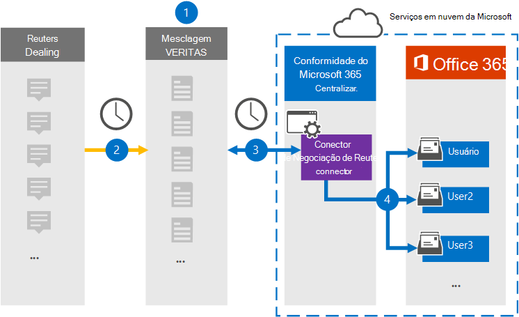

# Configurar um conector para arquivar dados de negociação do ReutersSet up a connector to archive Reuters Dealing data

Use um conector veritas no centro de conformidade do Microsoft 365 para importar e arquivar dados da plataforma Reuters Dealing para caixas de correio de usuário em sua organização do Microsoft 365.Use a Veritas connector in the Microsoft 365 compliance center to import and archive data from the Reuters Dealing platform to user mailboxes in your Microsoft 365 organization. A Veritas fornece um conector de Negociação do [Reuters](https://globanet.com/reuters-dealing/) configurado para capturar itens da fonte de dados de terceiros (regularmente) e, em seguida, importar esses itens para o Microsoft 365.Veritas provides you with a [Reuters Dealing](https://globanet.com/reuters-dealing/) connector that's configured to capture items from the third-party data source (on a regular basis) and then import those items to Microsoft 365. O conector converte a negociação de comunicações da conta Reuters Dealing em um formato de mensagem de email e importa esses itens para a caixa de correio do usuário no Microsoft 365.The connector converts Dealing communications from the Reuters Dealing account to an email message format and then imports those items to the user's mailbox in Microsoft 365.

Após a Reuters Lidar com dados é armazenado em caixas de correio de usuário, você pode aplicar recursos de conformidade do Microsoft 365, como Retenção de Litígio, Descoberta Eletrônico, políticas de retenção e rótulos de retenção e conformidade de comunicação.After Reuters Dealing data is stored in user mailboxes, you can apply Microsoft 365 compliance features such as Litigation Hold, eDiscovery, retention policies and retention labels, and communication compliance. Usar um conector de Negociação de Reuters para importar e arquivar dados no Microsoft 365 pode ajudar sua organização a manter-se em conformidade com políticas governamentais e regulatórias.Using a Reuters Dealing connector to import and archive data in Microsoft 365 can help your organization stay compliant with government and regulatory policies.

## Visão geral do arquivamento reuters lidando com dadosOverview of archiving Reuters Dealing data

A visão geral a seguir explica o processo de uso de um conector para arquivar os dados da Reuters Dealing no Microsoft 365.The following overview explains the process of using a connector to archive the Reuters Dealing data in Microsoft 365.

1. Sua organização trabalha com a Reuters Dealing para configurar e configurar um site de Negociação da Reuters.Your organization works with Reuters Dealing to set up and configure a Reuters Dealing site.

2. Uma vez a cada 24 horas, os itens de negociação da Reuters são copiados para o site Veritas Merge1.Once every 24 hours, Reuters Dealing items are copied to the Veritas Merge1 site. O conector também converte os itens em um formato de mensagem de email.The connector also converts the items to an email message format.

3. O conector de Negociação de Reuters que você cria no centro de conformidade do Microsoft 365 conecta-se ao site Veritas Merge1 todos os dias e transfere o conteúdo para um local seguro de Armazenamento do Azure na nuvem da Microsoft.The Reuters Dealing connector that you create in the Microsoft 365 compliance center connects to the Veritas Merge1 site every day and transfers the content to a secure Azure Storage location in the Microsoft cloud.

4. O conector importa itens para as caixas de correio de usuários específicos usando o valor da propriedade *Email* do mapeamento automático do usuário, conforme descrito [na Etapa 3](#step-3-map-users-and-complete-the-connector-setup).The connector imports items to the mailboxes of specific users by using the value of the *Email* property of the automatic user mapping as described in [Step 3](#step-3-map-users-and-complete-the-connector-setup). Uma subpasta na pasta Caixa de Entrada chamada **Reuters Dealing** é criada nas caixas de correio do usuário e os itens são importados para essa pasta.A subfolder in the Inbox folder named **Reuters Dealing** is created in the user mailboxes, and the items are imported to that folder. O conector determina para qual caixa de correio importar itens usando o valor da *propriedade Email.*The connector determines which mailbox to import items to by using the value of the *Email* property. Cada item de Negociação de Reuters contém essa propriedade, que é preenchida com o endereço de email de cada participante do item.Every Reuters Dealing item contains this property, which is populated with the email address of every participant of the item.

## Antes de começarBefore you begin

- Crie uma conta Veritas Merge1 para conectores da Microsoft.Create a Veritas Merge1 account for Microsoft connectors. Para criar uma conta, entre em contato com [o Suporte ao Cliente veritas.](https://globanet.com/contact-us)To create an account, contact [Veritas Customer Support](https://globanet.com/contact-us). Você precisa entrar nessa conta ao criar o conector na Etapa 1.You need to sign into this account when you create the connector in Step 1.

- O usuário que cria o conector de Negociação de Reuters na Etapa 1 (e o conclui na Etapa 3) deve ser atribuído à função De importação de importação de caixa de correio no Exchange Online.The user who creates the Reuters Dealing connector in Step 1 (and completes it in Step 3) must be assigned to the Mailbox Import Export role in Exchange Online. Essa função é necessária para adicionar conectores na página **Conectores de** dados no centro de conformidade do Microsoft 365.This role is required to add connectors on the **Data connectors** page in the Microsoft 365 compliance center. Por padrão, essa função não é atribuída a nenhum grupo de funções no Exchange Online.By default, this role is not assigned to any role group in Exchange Online. Você pode adicionar a função Exportar Importação de Caixa de Correio ao grupo de função Gerenciamento da Organização no Exchange Online.You can add the Mailbox Import Export role to the Organization Management role group in Exchange Online. Ou você pode criar um grupo de funções, atribuir a função Exportar Importação de Caixa de Correio e adicionar os usuários apropriados como membros.Or you can create a role group, assign the Mailbox Import Export role, and then add the appropriate users as members. Para obter mais informações, consulte as seções Criar grupos de [função](/Exchange/permissions-exo/role-groups#create-role-groups) ou [Modificar](/Exchange/permissions-exo/role-groups#modify-role-groups) grupos de função no artigo "Gerenciar grupos de função no Exchange Online".For more information, see the [Create role groups](/Exchange/permissions-exo/role-groups#create-role-groups) or [Modify role groups](/Exchange/permissions-exo/role-groups#modify-role-groups) sections in the article “Manage role groups in Exchange Online”.

## Etapa 1: Configurar o conector de negociação do ReutersStep 1: Set up the Reuters Dealing connector

A primeira etapa é acessar a página **Conectores** de Dados no Microsoft 365 e criar um conector para reuters lidando com dados.The first step is to access to the **Data Connectors** page in the Microsoft 365 and create a connector for Reuters Dealing data.

1. Vá para [https://compliance.microsoft.com](https://compliance.microsoft.com/) e clique em **Conectores de dados**  >  **Reuters Lidando**.Go to [https://compliance.microsoft.com](https://compliance.microsoft.com/) and then click **Data connectors** > **Reuters Dealing**.

2. Na página **Reuters Dealing product** description, clique em **Adicionar conector**.On the **Reuters Dealing** product description page, click **Add connector**.

3. Na página **Termos de serviço,** clique em **Aceitar**.On the **Terms of service** page, click **Accept**.

4. Insira um nome exclusivo que identifique o conector e clique em **Próximo**.Enter a unique name that identifies the connector, and then click **Next**.

5. Entre em sua conta Merge1 para configurar o conector.Sign to your Merge1 account to configure the connector.

## Etapa 2: Configurar o conector de Negociação de Reuters no site mesclar Veritas1Step 2: Configure the Reuters Dealing connector on the Veritas Merge1 site

A segunda etapa é configurar o conector de Negociação do Reuters em Veritas, o site Merge1.The second step is to configure the Reuters Dealing connector on Veritas the Merge1 site. Para obter informações sobre como configurar o conector de negociação do Reuters, consulte [Merge1 Third-Party Connectors User Guide](https://docs.ms.merge1.globanetportal.com/Merge1%20Third-Party%20Connectors%20Reuters%20Dealing%20User%20Guide%20.pdf).For information about configuring the Reuters Dealing connector, see [Merge1 Third-Party Connectors User Guide](https://docs.ms.merge1.globanetportal.com/Merge1%20Third-Party%20Connectors%20Reuters%20Dealing%20User%20Guide%20.pdf).

Depois de clicar em Salvar &  **Concluir**, a página de mapeamento do usuário no assistente de conector no centro de conformidade do Microsoft 365 será exibida.After you click **Save & Finish**, the **User mapping** page in the connector wizard in the Microsoft 365 compliance center is displayed.

## Etapa 3: mapear usuários e concluir a configuração do conectorStep 3: Map users and complete the connector setup

Para mapear usuários e concluir a configuração do conector no centro de conformidade do Microsoft 365, siga estas etapas:To map users and complete the connector setup in the Microsoft 365 compliance center, follow these steps:

1. Na página Mapear Reuters Lidando com usuários do **Microsoft 365,** habilita o mapeamento automático do usuário.On the **Map Reuters Dealing users to Microsoft 365 users** page, enable automatic user mapping.

   Reuters Os itens de negociação incluem uma propriedade chamada *Email*, que contém endereços de email para usuários em sua organização.Reuters Dealing items include a property called *Email*, which contains email addresses for users in your organization. Se o conector puder associar esse endereço a um usuário do Microsoft 365, os itens serão importados para a caixa de correio desse usuário.If the connector can associate this address with a Microsoft 365 user, the items are imported to that user’s mailbox.

2. Clique **em Avançar,** revise suas configurações e vá até a página **Conectores** de dados para ver o andamento do processo de importação do novo conector.Click **Next**, review your settings, and go to the **Data connectors** page to see the progress of the import process for the new connector.

## Etapa 4: Monitorar o conector de negociação do ReutersStep 4: Monitor the Reuters Dealing connector

Depois de criar o conector de Negociação de Reuters, você poderá exibir o status do conector no centro de conformidade do Microsoft 365.After you create the Reuters Dealing connector, you can view the connector status in the Microsoft 365 compliance center.

1. Vá para [https://compliance.microsoft.com](https://compliance.microsoft.com/) e clique **em Conectores de dados** na nav esquerda.Go to [https://compliance.microsoft.com](https://compliance.microsoft.com/) and click **Data connectors** in the left nav.

2. Clique na **guia Conectores** e selecione o conector de Negociação de **Reuters** para exibir a página de sobrevoo, que contém as propriedades e informações sobre o conector.Click the **Connectors** tab and then select the **Reuters Dealing** connector to display the flyout page, which contains the properties and information about the connector.

3. Em **Status do conector com origem**, clique no link Baixar **log** para abrir (ou salvar) o log de status do conector.Under **Connector status with source**, click the **Download log** link to open (or save) the status log for the connector. Esse log contém dados que foram importados para a nuvem da Microsoft.This log contains data that has been imported to the Microsoft cloud.

## Problemas conhecidosKnown issues

- Neste momento, não há suporte para importação de anexos ou itens maiores que 10 MB.At this time, we don't support importing attachments or items that are larger than 10 MB. O suporte para itens maiores estará disponível posteriormente.Support for larger items will be available at a later date.