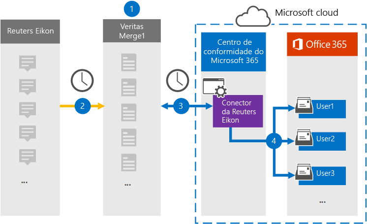

# Configurar um conector para arquivar dados do Reuters EikonSet up a connector to archive Reuters Eikon data

Use um conector Globalnet no centro de conformidade do Microsoft 365 para importar e arquivar dados da plataforma Reuters Eikon para caixas de correio de usuário em sua organização do Microsoft 365.Use a Globanet connector in the Microsoft 365 compliance center to import and archive data from the Reuters Eikon platform to user mailboxes in your Microsoft 365 organization. A Globalnet fornece um conector [Eikon reuters](https://globanet.com/eikon/) configurado para capturar itens da fonte de dados de terceiros (regularmente) e importar esses itens para o Microsoft 365.Globanet provides a [Reuters Eikon](https://globanet.com/eikon/) connector that is configured to capture items from the third-party data source (on a regular basis) and import those items to Microsoft 365. O conector converte o conteúdo como mensagens de pessoa para pessoa, chats de grupo, anexos e avisos de isenção de responsabilidade de uma conta do Reuters Eikon de um usuário em um formato de mensagem de email e importa esses itens para a caixa de correio do usuário no Microsoft 365.The connector converts the content such as person-to-person messages, group chats, attachments, and disclaimers from a user's Reuters Eikon account to an email message format and then imports those items to the user's mailbox in Microsoft 365.

Depois que os dados eikon da Reuters são armazenados em caixas de correio de usuário, você pode aplicar recursos de conformidade do Microsoft 365, como Retenção de Litígio, Descoberta Eletrônico, políticas de retenção e rótulos de retenção e conformidade de comunicação.After Reuters Eikon data is stored in user mailboxes, you can apply Microsoft 365 compliance features such as Litigation Hold, eDiscovery, retention policies and retention labels, and communication compliance. Usar um conector Eikon da Reuters para importar e arquivar dados no Microsoft 365 pode ajudar sua organização a se manter em conformidade com políticas governamentais e regulatórias.Using a Reuters Eikon connector to import and archive data in Microsoft 365 can help your organization stay compliant with government and regulatory policies.

## Visão geral dos dados eikon do Reuters de arquivamentoOverview of archiving Reuters Eikon data

A visão geral a seguir explica o processo de uso de um conector para arquivar dados do Reuters Eikon no Microsoft 365.The following overview explains the process of using a connector to archive Reuters Eikon data in Microsoft 365.

1. Sua organização trabalha com o Eikon da Reuters para configurar e configurar um site do Eikon do Reuters.Your organization works with Reuters Eikon to set up and configure a Reuters Eikon site.

2. Uma vez a cada 24 horas, os itens Eikon do Reuters são copiados para o site Globalnet Merge1.Once every 24 hours, Reuters Eikon items are copied to the Globanet Merge1 site. O conector também converte itens Reuters Eikon em um formato de mensagem de email.The connector also converts Reuters Eikon items to an email message format.

3. O conector Eikon da Reuters que você cria no centro de conformidade do Microsoft 365 conecta-se ao site Globalnet Merge1 todos os dias e transfere o conteúdo para um local seguro de Armazenamento do Azure na nuvem da Microsoft.The Reuters Eikon connector that you create in the Microsoft 365 compliance center connects to the Globanet Merge1 site every day and transfers the content to a secure Azure Storage location in the Microsoft cloud.

4. O conector importa itens para as caixas de correio de usuários específicos usando o valor da propriedade *Email* do mapeamento automático do usuário, conforme descrito [na Etapa 3](#step-3-map-users-and-complete-the-connector-setup).The connector imports items to the mailboxes of specific users by using the value of the *Email* property of the automatic user mapping as described in [Step 3](#step-3-map-users-and-complete-the-connector-setup). Uma subpasta na pasta Caixa de Entrada chamada **Reuters Eikon** é criada nas caixas de correio do usuário e os itens são importados para essa pasta.A subfolder in the Inbox folder named **Reuters Eikon** is created in the user mailboxes, and the items are imported to that folder. O conector determina para qual caixa de correio importar itens usando o valor da *propriedade Email.*The connector determines which mailbox to import items to by using the value of the *Email* property. Cada item Eikon reuters contém essa propriedade, que é preenchida com o endereço de email de cada participante do item.Every Reuters Eikon item contains this property, which is populated with the email address of every participant of the item.

## Antes de começarBefore you begin

- Crie uma conta Globalnet Merge1 para conectores da Microsoft.Create a Globanet Merge1 account for Microsoft connectors. Para criar uma conta, contate [Globalnet Customer Support](https://globanet.com/ms-connectors-contact).To create an account, contact [Globanet Customer Support](https://globanet.com/ms-connectors-contact). Você entrará nessa conta quando criar o conector na Etapa 1.You will sign into this account when you create the connector in Step 1.

- O usuário que cria o conector Eikon do Reuters na Etapa 1 (e o conclui na Etapa 3) deve ser atribuído à função De importação de importação de caixa de correio no Exchange Online.The user who creates the Reuters Eikon connector in Step 1 (and completes it in Step 3) must be assigned to the Mailbox Import Export role in Exchange Online. Essa função é necessária para adicionar conectores na página **Conectores de** dados no centro de conformidade do Microsoft 365.This role is required to add connectors on the **Data connectors** page in the Microsoft 365 compliance center. Por padrão, essa função não é atribuída a um grupo de funções no Exchange Online.By default, this role is not assigned to a role group in Exchange Online. Você pode adicionar a função Exportar Importação de Caixa de Correio ao grupo de função Gerenciamento da Organização no Exchange Online.You can add the Mailbox Import Export role to the Organization Management role group in Exchange Online. Ou você pode criar um grupo de funções, atribuir a função Exportar Importação de Caixa de Correio e adicionar os usuários apropriados como membros.Or you can create a role group, assign the Mailbox Import Export role, and then add the appropriate users as members. Para obter mais informações, consulte as seções Criar grupos de [função](/Exchange/permissions-exo/role-groups#create-role-groups) ou [Modificar](/Exchange/permissions-exo/role-groups#modify-role-groups) grupos de função no artigo "Gerenciar grupos de função no Exchange Online".For more information, see the [Create role groups](/Exchange/permissions-exo/role-groups#create-role-groups) or [Modify role groups](/Exchange/permissions-exo/role-groups#modify-role-groups) sections in the article "Manage role groups in Exchange Online".

## Etapa 1: Configurar o conector Reuters EikonStep 1: Set up the Reuters Eikon connector

A primeira etapa é acessar a página **Conectores** de Dados no centro de conformidade do Microsoft 365 e criar um conector para dados eikon do Reuters.The first step is to access to the **Data Connectors** page in the Microsoft 365 compliance center and create a connector for Reuters Eikon data.

1. Vá para [https://compliance.microsoft.com](https://compliance.microsoft.com/) e clique em **Conectores de dados**  >  **Reuters Eikon**.Go to [https://compliance.microsoft.com](https://compliance.microsoft.com/) and then click **Data connectors** > **Reuters Eikon**.

2. Na página **Descrição do produto Eikon da Reuters,** clique **em Adicionar conector**.On the **Reuters Eikon** product description page, click **Add connector**.

3. Na página **Termos de serviço,** clique em **Aceitar**.On the **Terms of service** page, click **Accept**.

4. Insira um nome exclusivo que identifique o conector e clique em **Próximo**.Enter a unique name that identifies the connector, and then click **Next**.

5. Entre na sua conta Merge1 para configurar o conector.Sign in to your Merge1 account to configure the connector.

## Etapa 2: Configurar o conector Eikon reuters no site Globalnet Merge1Step 2: Configure the Reuters Eikon connector on the Globanet Merge1 site

A segunda etapa é configurar o conector Eikon reuters no site Merge1.The second step is to configure the Reuters Eikon connector on the Merge1 site. Para obter informações sobre como configurar o conector Eikon do Reuters no site Globalnet Merge1, consulte [Merge1 Third-Party Connectors User Guide](https://docs.ms.merge1.globanetportal.com/Merge1%20Third-Party%20Connectors%20Reuters%20Eikon%20User%20Guide%20.pdf).For information about how to configure the Reuters Eikon connector on the Globanet Merge1 site, see [Merge1 Third-Party Connectors User Guide](https://docs.ms.merge1.globanetportal.com/Merge1%20Third-Party%20Connectors%20Reuters%20Eikon%20User%20Guide%20.pdf).

Depois de clicar em Salvar &  **Concluir**, a página de mapeamento do usuário no assistente de conector no centro de conformidade do Microsoft 365 será exibida.After you click **Save & Finish**, the **User mapping** page in the connector wizard in the Microsoft 365 compliance center is displayed.

## Etapa 3: mapear usuários e concluir a configuração do conectorStep 3: Map users and complete the connector setup

Para mapear usuários e concluir a configuração do conector no centro de conformidade do Microsoft 365, siga estas etapas:To map users and complete the connector setup in the Microsoft 365 compliance center, follow these steps:

1. Na página **Mapear usuários externos para usuários do Microsoft 365,** habilita o mapeamento automático do usuário.On the **Map external users to Microsoft 365 users** page, enable automatic user mapping. Os itens Eikon da Reuters incluem uma propriedade chamada *Email*, que contém endereços de email para usuários em sua organização.The Reuters Eikon items include a property called *Email*, which contains email addresses for users in your organization. Se o conector puder associar esse endereço a um usuário do Microsoft 365, os itens serão importados para a caixa de correio desse usuário.If the connector can associate this address with a Microsoft 365 user, the items are imported to that user’s mailbox.

2. Clique **em Avançar**, revise suas configurações e vá para a página Conectores de dados para ver o andamento do processo de importação do novo conector. Click **Next**, review your settings, and then go to the **Data connectors** page to see the progress of the import process for the new connector.

## Etapa 4: Monitorar o conector Eikon da ReutersStep 4: Monitor the Reuters Eikon connector

Depois de criar o conector Eikon da Reuters, você poderá exibir o status do conector no centro de conformidade do Microsoft 365.After you create the Reuters Eikon connector, you can view the connector status in the Microsoft 365 compliance center.

1. Vá para [https://compliance.microsoft.com](https://compliance.microsoft.com) e clique **em Conectores de dados** na nav esquerda.Go to [https://compliance.microsoft.com](https://compliance.microsoft.com) and click **Data connectors** in the left nav.

2. Clique na **guia Conectores** e selecione o **conector Reuters Eikon** para exibir a página de sobrevoo.Click the **Connectors** tab and then select the **Reuters Eikon** connector to display the flyout page. Esta página contém as propriedades e informações sobre o conector.This page contains the properties and information about the connector.

3. Em **Status do conector com origem**, clique no link Baixar **log** para abrir (ou salvar) o log de status do conector.Under **Connector status with source**, click the **Download log** link to open (or save) the status log for the connector. Esse log contém informações sobre os dados que foram importados para a nuvem da Microsoft.This log contains information about the data that has been imported to the Microsoft cloud.

## Problemas conhecidosKnown issues

- Neste momento, não há suporte para importação de anexos ou itens maiores que 10 MB.At this time, we don't support importing attachments or items that are larger than 10 MB. O suporte para itens maiores estará disponível posteriormente.Support for larger items will be available at a later date.