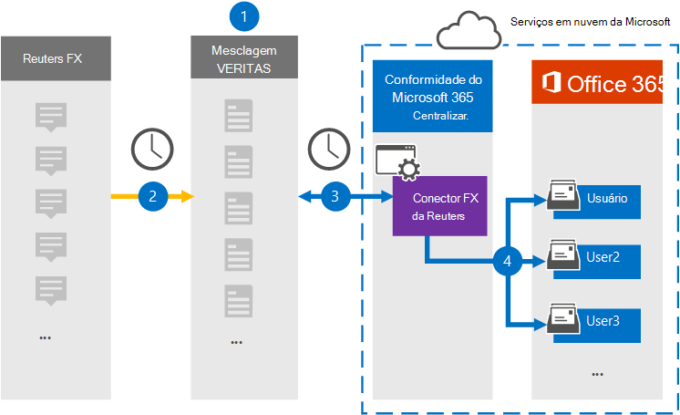

# Configurar um conector para arquivar dados FX do Reuters

Use um conector Globalnet no centro de conformidade do Microsoft 365 para importar e arquivar dados da plataforma FX do Reuters para caixas de correio de usuário em sua organização do Microsoft 365. A Globalnet fornece um conector FX do [Reuters](https://globanet.com/reuters-fx/) configurado para capturar itens da fonte de dados de terceiros (regularmente) e depois importar esses itens para o Microsoft 365. O conector converte as moedas e as taxas FX da conta FX da Reuters para um formato de mensagem de email e importa esses itens para a caixa de correio do usuário no Microsoft 365.

Depois que os dados FX da Reuters são armazenados em caixas de correio de usuário, você pode aplicar recursos de conformidade do Microsoft 365, como Retenção de Litígio, Descoberta Eletrônico, políticas de retenção e rótulos de retenção e conformidade de comunicação. Usar um conector FX da Reuters para importar e arquivar dados no Microsoft 365 pode ajudar sua organização a manter a conformidade com políticas governamentais e regulatórias.

## Visão geral dos dados FX do Reuters de arquivamento

A visão geral a seguir explica o processo de uso de um conector para arquivar dados FX do Reuters no Microsoft 365.

1. Sua organização trabalha com o Reuters FX para configurar e configurar um site FX da Reuters.

2. Uma vez a cada 24 horas, os itens FX do Reuters são copiados para o site Globalnet Merge1. O conector também converte os itens em um formato de mensagem de email.

3. O conector FX da Reuters que você cria no centro de conformidade do Microsoft 365, conecta-se ao site Globalnet Merge1 todos os dias e transfere o conteúdo para um local seguro de Armazenamento do Azure na nuvem da Microsoft.

4. O conector importa os itens para as caixas de correio de usuários específicos usando o valor da propriedade *Email* do mapeamento automático do usuário, conforme descrito [na Etapa 3](#step-3-map-users-and-complete-the-connector-setup). Uma subpasta na pasta Caixa de Entrada chamada **Reuters FX** é criada nas caixas de correio do usuário e os itens são importados para essa pasta. O conector determina para qual caixa de correio importar itens usando o valor da *propriedade Email.* Cada item FX da Reuters contém essa propriedade, que é preenchida com o endereço de email de cada participante do item.

## Antes de começar

- Crie uma conta Globalnet Merge1 para conectores da Microsoft. Para criar uma conta, contate [Globalnet Customer Support](https://globanet.com/contact-us). Você precisa entrar nessa conta ao criar o conector na Etapa 1.

- O usuário que cria o conector FX do Reuters na Etapa 1 (e o conclui na Etapa 3) deve ser atribuído à função De importação de importação de caixa de correio no Exchange Online. Essa função é necessária para adicionar conectores na página **Conectores de** dados no centro de conformidade do Microsoft 365. Por padrão, essa função não é atribuída a nenhum grupo de funções no Exchange Online. Você pode adicionar a função Exportar Importação de Caixa de Correio ao grupo de função Gerenciamento da Organização no Exchange Online. Ou você pode criar um grupo de funções, atribuir a função Exportar Importação de Caixa de Correio e adicionar os usuários apropriados como membros. Para obter mais informações, consulte as seções Criar grupos de [função](/Exchange/permissions-exo/role-groups#create-role-groups) ou [Modificar](/Exchange/permissions-exo/role-groups#modify-role-groups) grupos de função no artigo "Gerenciar grupos de função no Exchange Online".

## Etapa 1: Configurar o conector FX do Reuters

A primeira etapa é acessar a página **Conectores** de Dados no Microsoft 365 e criar um conector para dados FX do Reuters.

1. Vá para [https://compliance.microsoft.com](https://compliance.microsoft.com/) e clique em **Conectores de dados**  >  **Reuters FX**.

2. Na página **Descrição do produto FX da Reuters,** clique **em Adicionar conector**.

3. Na página **Termos de serviço,** clique em **Aceitar**.

4. Insira um nome exclusivo que identifique o conector e clique em **Próximo**.

5. Entre em sua conta Merge1 para configurar o conector.

## Etapa 2: Configurar o conector FX do Reuters no site Globalnet Merge1

A segunda etapa é configurar o conector FX do Reuters no site Globalnet Merge1. Para obter informações sobre como configurar o conector FX do Reuters, consulte [Merge1 Third-Party Connectors User Guide](https://docs.ms.merge1.globanetportal.com/Merge1%20Third-Party%20Connectors%20Reuters%20FX%20User%20Guide%20.pdf).

Depois de clicar em Salvar &  **Concluir**, a página de mapeamento do usuário no assistente de conector no centro de conformidade do Microsoft 365 será exibida.

## Etapa 3: mapear usuários e concluir a configuração do conector

Para mapear usuários e concluir a configuração do conector no centro de conformidade do Microsoft 365, siga as etapas abaixo:

1. Na página **Mapear usuários FX do Reuters para usuários do Microsoft 365,** habilita o mapeamento automático do usuário.

   Os itens FX da Reuters incluem uma propriedade chamada *Email*, que contém endereços de email para usuários em sua organização. Se o conector puder associar esse endereço a um usuário do Microsoft 365, os itens serão importados para a caixa de correio desse usuário.

2. Clique **em Avançar,** revise suas configurações e vá até a página **Conectores** de dados para ver o andamento do processo de importação do novo conector.

## Etapa 4: Monitorar o conector FX do Reuters

Depois de criar o conector FX do Reuters, você poderá exibir o status do conector no centro de conformidade do Microsoft 365.

1. Vá para <https://compliance.microsoft.com/> e clique **em Conectores de dados** na nav esquerda.

2. Clique na **guia Conectores** e selecione o conector **FX do Reuters** para exibir a página de sobrevoo, que contém as propriedades e informações sobre o conector.

3. Em **Status do conector com origem**, clique no link Baixar **log** para abrir (ou salvar) o log de status do conector. Esse log contém dados que foram importados para a nuvem da Microsoft.

## Problemas conhecidos

- Neste momento, não há suporte para importação de anexos ou itens maiores que 10 MB. O suporte para itens maiores estará disponível posteriormente.