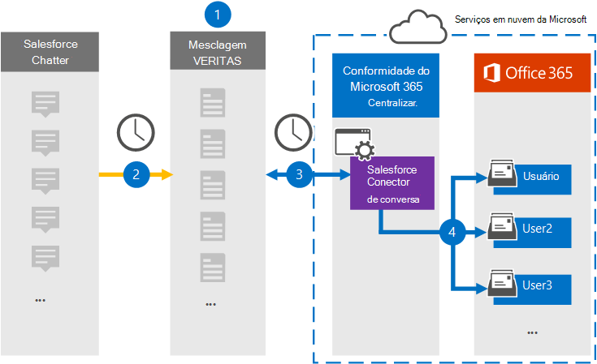

# Configurar um conector para arquivar dados de Salesforce informativos

Use um conector Globanet no centro de conformidade da Microsoft 365 para importar e arquivar dados da plataforma do Salesforce para caixas de correio do usuário na sua organização do Microsoft 365. O Globanet fornece um conector do [Salesforce](http://globanet.com/chatter/) que captura itens da fonte de dados de terceiros e importa esses itens para o Microsoft 365. O conector converte o conteúdo como chats, anexos e postagens do Salesforce informativos em um formato de mensagem de email e, em seguida, importa esses itens para a caixa de correio do usuário no Microsoft 365.

Depois que os dados do Salesforce informativos são armazenados nas caixas de correio do usuário, você pode aplicar recursos de conformidade do Microsoft 365, como retenção de litígio, eDiscovery, políticas de retenção e rótulos de retenção. O uso de um conector do Salesforce para importar e arquivar dados no Microsoft 365 pode ajudar sua organização a se manter em conformidade com as políticas governamentais e normativas.

## Visão geral do arquivamento de dados de Salesforce

A visão geral a seguir explica o processo de usar um conector para arquivar os dados do Salesforce inmostrados no Microsoft 365.

1. Sua organização trabalha com a Salesforce informativa para configurar e configurar um site do Salesforce informativo.

2. Uma vez a cada 24 horas, os itens do Salesforce doitem são copiados para o site do Globanet Merge1. O conector também é Items Salesforce informativos a um formato de mensagem de email.

3. O conector do Salesforce informativo que você cria no centro de conformidade da Microsoft 365, conecta-se ao site do Globanet Merge1 todos os dias e transfere o conteúdo da equipe para um local seguro de armazenamento do Azure na nuvem da Microsoft.

4. O conector importa os itens convertidos para as caixas de correio de usuários específicos usando o valor da propriedade *email* do mapeamento de usuário automático, conforme descrito na [etapa 3](#step-3-map-users-and-complete-the-connector-setup). Uma subpasta na pasta caixa de entrada chamada **Salesforce** , é criada nas caixas de correio do usuário, e os itens são importados para essa pasta. O conector determina qual caixa de correio para a qual importar itens usando o valor da propriedade *email* . Cada item de ineletrônico contém essa propriedade, que é preenchida com o endereço de email de cada participante do item.

## Antes de começar

- Crie uma conta do Merge1 para conectores da Microsoft. Para criar uma conta, entre em contato com o [suporte ao cliente Globanet](https://globanet.com/contact-us/). Você precisa entrar nessa conta ao criar o conector na etapa 1.

- Criar um aplicativo Salesforce e adquirir um token em [https://salesforce.com](https://salesforce.com) . Você precisará fazer logon na conta do Salesforce como administrador e obter um token pessoal do usuário para importar dados. Além disso, os gatilhos precisam ser publicados no site do, para capturar atualizações, exclusões e edições. Esses disparadores criarão uma postagem em um canal, e o Merge1 coletará as informações do canal. Para obter instruções passo a passo sobre como criar o aplicativo e adquirir o token, consulte Merge1 do [usuário de conectores de terceiros](https://docs.ms.merge1.globanetportal.com/Merge1%20Third-Party%20Connectors%20SalesForce%20Chatter%20User%20Guide%20.pdf).

- O usuário que cria o conector do Salesforce na etapa 1 (e conclui-lo na etapa 3) deve ser atribuído à função de exportação de importação de caixa de correio no Exchange Online. Essa função é necessária para adicionar conectores na página **conectores de dados** no centro de conformidade da Microsoft 365. Por padrão, essa função não é atribuída a nenhum grupo de função no Exchange Online. Você pode adicionar a função de exportação de importação de caixa de correio ao grupo de funções Gerenciamento da organização no Exchange Online. Ou você pode criar um grupo de função, atribua a função de exportação de importação de caixa de correio e, em seguida, adicione os usuários apropriados como membros. Para obter mais informações, consulte as seções [criar grupos de função](https://docs.microsoft.com/Exchange/permissions-exo/role-groups#create-role-groups) ou [modificar grupos de função](https://docs.microsoft.com/Exchange/permissions-exo/role-groups#modify-role-groups) no artigo "gerenciar grupos de função no Exchange Online".

## Etapa 1: configurar o conector do Salesforce

A primeira etapa é acessar a página **conectores de dados** no centro de conformidade da Microsoft 365 e criar um conector para dados de.

1. Vá para [https://compliance.microsoft.com](https://compliance.microsoft.com/) e clique em **conectores de dados** da  >  **equipe de vendas**.

2. Na página descrição do produto do **Salesforce** , clique em **Adicionar conector**.

3. Na página **termos de serviço** , clique em **aceitar**.

4. Insira um nome exclusivo que identifique o conector e clique em **Avançar**.

5. Entre em sua conta do Merge1 para configurar o conector.

## Etapa 2: configurar a Salesforce inGlobanet no site do Merge1

A segunda etapa é configurar o conector de inGlobanet da Salesforce no site do Merge1. Para obter informações sobre como configurar o conector do Salesforce, confira [Merge1 conectores de terceiros do usuário](https://docs.ms.merge1.globanetportal.com/Merge1%20Third-Party%20Connectors%20SalesForce%20Chatter%20User%20Guide%20.pdf).

Depois de clicar em **salvar & concluir,** a página **mapeamento de usuário** no assistente de conector no centro de conformidade da Microsoft 365 é exibida.

## Etapa 3: mapear usuários e concluir a configuração do conector

Para mapear usuários e concluir a configuração do conector no centro de conformidade do Microsoft 365, siga estas etapas:

1. Na página **mapear usuários da equipe de vendas do Salesforce para usuários do Microsoft 365** , habilite o mapeamento automático do usuário. Os itens do Salesforce incluem uma propriedade chamada *email*, que contém endereços de email para usuários em sua organização. Se o conector puder associar esse endereço a um usuário do Microsoft 365, os itens serão importados para a caixa de correio desse usuário.

2. clique em **Avançar**, revise suas configurações e vá para a página **conectores de dados** para ver o andamento do processo de importação para o novo conector.

## Etapa 4: monitorar o conector do Salesforce

Depois de criar o conector do Salesforce, você pode exibir o status do conector no centro de conformidade do Microsoft 365.

1. Vá para [https://compliance.microsoft.com](https://compliance.microsoft.com/) e clique em **conectores de dados** no painel de navegação esquerdo.

2. Clique na guia **conectores** e, em seguida, clique no conector do **Salesforce** , para exibir a página do menu suspenso, que contém as propriedades e informações sobre o conector.

3. Em **status do conector com origem**, clique no link **baixar log** para abrir (ou salvar) o log de status do conector. Esse log contém dados que foram importados para a nuvem da Microsoft.

## Problemas conhecidos

- No momento, não há suporte para importar anexos ou itens com mais de 10 MB. O suporte para itens maiores estará disponível em uma data posterior.
