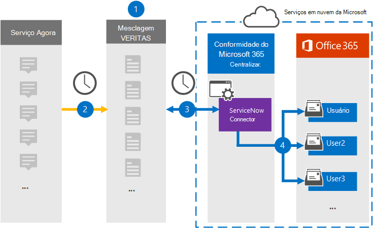

# Configurar um conector para arquivar dados serviceNowSet up a connector to archive ServiceNow data

Use um conector Veritas no centro de conformidade Microsoft 365 para importar e arquivar dados da plataforma ServiceNow para caixas de correio de usuário em sua Microsoft 365 organização.Use a Veritas connector in the Microsoft 365 compliance center to import and archive data from the ServiceNow platform to user mailboxes in your Microsoft 365 organization. A Veritas fornece um [conector ServiceNow](https://globanet.com/servicenow/) que captura itens da fonte de dados de terceiros e importa esses itens para Microsoft 365.Veritas provides a [ServiceNow](https://globanet.com/servicenow/) connector that captures items from the third-party data source and import those items to Microsoft 365. O conector converte o conteúdo, como mensagens ao vivo, anexos e postagens do ServiceNow em um formato de mensagem de email e importa esses itens para caixas de correio de usuário em Microsoft 365.The connector converts the content such as live messages, attachments, and posts from ServiceNow to an email message format and then imports those items to user mailboxes in Microsoft 365.

Depois que os dados serviceNow são armazenados em caixas de correio de usuário, você pode aplicar Microsoft 365 de conformidade, como Retenção de Litígio, Descoberta Eletrônico, políticas de retenção e rótulos de retenção.After ServiceNow data is stored in user mailboxes, you can apply Microsoft 365 compliance features such as Litigation Hold, eDiscovery, retention policies, and retention labels. O uso de um conector ServiceNow para importar e arquivar dados em Microsoft 365 pode ajudar sua organização a permanecer em conformidade com políticas governamentais e regulatórias.Using a ServiceNow connector to import and archive data in Microsoft 365 can help your organization stay compliant with government and regulatory policies.

## Visão geral dos dados servicenow de arquivamentoOverview of archiving ServiceNow data

A visão geral a seguir explica o processo de uso de um conector para arquivar os dados serviceNow em Microsoft 365.The following overview explains the process of using a connector to archive the ServiceNow data in Microsoft 365.

1. Sua organização trabalha com ServiceNow para configurar e configurar um site ServiceNow.Your organization works with ServiceNow to set up and configure a ServiceNow site.

2. Uma vez a cada 24 horas, os itens ServiceNow são copiados para o site Veritas Merge1.Once every 24 hours, ServiceNow items are copied to the Veritas Merge1 site. O conector também converte itens ServiceNow em um formato de mensagem de email.The connector also converts ServiceNow items to an email message format.

3. O conector ServiceNow criado no centro de conformidade do Microsoft 365 conecta-se ao site Veritas Merge1 todos os dias e transfere o conteúdo serviceNow para um local seguro do Azure Armazenamento na nuvem da Microsoft.The ServiceNow connector that you create in the Microsoft 365 compliance center connects to the Veritas Merge1 site every day and transfers the ServiceNow content to a secure Azure Storage location in the Microsoft cloud.

4. O conector importa os itens convertidos para as caixas de correio de usuários específicos usando o valor da propriedade *Email* do mapeamento automático do usuário, conforme descrito [na Etapa 3](#step-3-map-users-and-complete-the-connector-setup).The connector imports the converted items to the mailboxes of specific users using the value of the *Email* property of the automatic user mapping as described in [Step 3](#step-3-map-users-and-complete-the-connector-setup). Uma subpasta na pasta Caixa de Entrada chamada **ServiceNow** é criada nas caixas de correio do usuário e os itens são importados para essa pasta.A subfolder in the Inbox folder named **ServiceNow** is created in the user mailboxes, and items are imported to that folder. O conector determina para qual caixa de correio importar itens usando o valor da *propriedade Email.*The connector determines which mailbox to import items to by using the value of the *Email* property. Cada item ServiceNow contém essa propriedade, que é preenchida com o endereço de email de cada participante do item.Every ServiceNow item contains this property, which is populated with the email address of every participant of the item.

## Antes de começarBefore you begin

- Crie uma conta Merge1 para conectores da Microsoft.Create a Merge1 account for Microsoft connectors. Para criar uma conta, entre em contato com [o Suporte ao Cliente veritas.](https://www.veritas.com/content/support/)To create an account, contact [Veritas Customer Support](https://www.veritas.com/content/support/). Você precisa entrar nessa conta ao criar o conector na Etapa 1.You need to sign into this account when you create the connector in Step 1.

- Crie um aplicativo ServiceNow para buscar dados da sua conta ServiceNow.Create a ServiceNow application to fetch data from your ServiceNow account. Para obter instruções passo a passo sobre como criar o aplicativo, consulte [Merge1 Third-Party Connectors User Guide](https://docs.ms.merge1.globanetportal.com/Merge1%20Third-Party%20Connectors%20ServiceNow%20User%20Guide%20.pdf).For step-by step instructions about creating the application, see [Merge1 Third-Party Connectors User Guide](https://docs.ms.merge1.globanetportal.com/Merge1%20Third-Party%20Connectors%20ServiceNow%20User%20Guide%20.pdf).

- O usuário que cria o conector ServiceNow na Etapa 1 (e o conclui na Etapa 3) deve ser atribuído à função de Exportação de Importação de Caixa de Correio no Exchange Online.The user who creates the ServiceNow connector in Step 1 (and completes it in Step 3) must be assigned to the Mailbox Import Export role in Exchange Online. Essa função é necessária para adicionar conectores na página **Conectores** de dados no Microsoft 365 de conformidade.This role is required to add connectors on the **Data connectors** page in the Microsoft 365 compliance center. Por padrão, essa função não é atribuída a nenhum grupo de funções no Exchange Online.By default, this role isn't assigned to any role group in Exchange Online. Você pode adicionar a função Exportar Importação de Importação de Caixa de Correio ao grupo de função Gerenciamento da Organização Exchange Online.You can add the Mailbox Import Export role to the Organization Management role group in Exchange Online. Ou você pode criar um grupo de funções, atribuir a função Exportar Importação de Caixa de Correio e adicionar os usuários apropriados como membros.Or you can create a role group, assign the Mailbox Import Export role, and then add the appropriate users as members. Para obter mais informações, consulte as seções Criar grupos de [função](/Exchange/permissions-exo/role-groups#create-role-groups) ou [Modificar](/Exchange/permissions-exo/role-groups#modify-role-groups) grupos de função no artigo "Gerenciar grupos de funções em Exchange Online".For more information, see the [Create role groups](/Exchange/permissions-exo/role-groups#create-role-groups) or [Modify role groups](/Exchange/permissions-exo/role-groups#modify-role-groups) sections in the article "Manage role groups in Exchange Online".

## Etapa 1: Configurar o conector ServiceNowStep 1: Set up the ServiceNow connector

A primeira etapa é acessar a página **Conectores** de Dados no centro de conformidade Microsoft 365 e criar um conector para dados serviceNow.The first step is to access to the **Data Connectors** page in the Microsoft 365 compliance center and create a connector for ServiceNow data.

1. Vá para [https://compliance.microsoft.com](https://compliance.microsoft.com/) e clique em **Conectores de dados**  >  **ServiceNow**.Go to [https://compliance.microsoft.com](https://compliance.microsoft.com/) and then click **Data connectors** > **ServiceNow**.

2. Na página Descrição do produto **ServiceNow,** clique em **Adicionar conector**.On the **ServiceNow** product description page, click **Add connector**.

3. Na página **Termos de serviço,** clique em **Aceitar**.On the **Terms of service** page, click **Accept**.

4. Insira um nome exclusivo que identifique o conector e clique em **Próximo**.Enter a unique name that identifies the connector, and then click **Next**.

5. Entre na sua conta Merge1 para configurar o conector.Sign in to your Merge1 account to configure the connector.

## Etapa 2: Configurar o ServiceNow no site Veritas Merge1Step 2: Configure the ServiceNow on the Veritas Merge1 site

A segunda etapa é configurar o conector ServiceNow no site Veritas Merge1.The second step is to configure the ServiceNow connector on the Veritas Merge1 site. Para obter informações sobre como configurar o conector ServiceNow, consulte [Merge1 Third-Party Connectors User Guide](https://docs.ms.merge1.globanetportal.com/Merge1%20Third-Party%20Connectors%20ServiceNow%20User%20Guide%20.pdf).For information about how to configure the ServiceNow connector, see [Merge1 Third-Party Connectors User Guide](https://docs.ms.merge1.globanetportal.com/Merge1%20Third-Party%20Connectors%20ServiceNow%20User%20Guide%20.pdf).

Depois de clicar em Salvar &  **Concluir,** a página de mapeamento do usuário no assistente de conector no Microsoft 365 de conformidade será exibida.After you click **Save & Finish,** the **User mapping** page in the connector wizard in the Microsoft 365 compliance center is displayed.

## Etapa 3: mapear usuários e concluir a configuração do conectorStep 3: Map users and complete the connector setup

Para mapear usuários e concluir a instalação do conector no centro de conformidade Microsoft 365, siga estas etapas:To map users and complete the connector setup in the Microsoft 365 compliance center, follow these steps:

1. Na página **Mapear usuários serviceNow para Microsoft 365 usuários,** habilita o mapeamento automático do usuário.On the **Map ServiceNow users to Microsoft 365 users** page, enable automatic user mapping. Os itens ServiceNow incluem uma propriedade chamada *Email*, que contém endereços de email para usuários em sua organização.The ServiceNow items include a property called *Email*, which contains email addresses for users in your organization. Se o conector puder associar esse endereço a um Microsoft 365 usuário, os itens serão importados para a caixa de correio desse usuário.If the connector can associate this address with a Microsoft 365 user, the items are imported to that user's mailbox.

2. Clique **em Avançar**, revise suas configurações e vá para a página Conectores de dados para ver o andamento do processo de importação do novo conector. Click **Next**, review your settings, and then go to the **Data connectors** page to see the progress of the import process for the new connector.

## Etapa 4: Monitorar o conector ServiceNowStep 4: Monitor the ServiceNow connector

Depois de criar o conector ServiceNow, você poderá exibir o status do conector no Microsoft 365 de conformidade.After you create the ServiceNow connector, you can view the connector status in the Microsoft 365 compliance center.

1. Vá para [https://compliance.microsoft.com](https://compliance.microsoft.com/) e clique **em Conectores de dados** na nav esquerda.Go to [https://compliance.microsoft.com](https://compliance.microsoft.com/) and click **Data connectors** in the left nav.

2. Clique na **guia Conectores** e selecione o conector **ServiceNow** para exibir a página de sobrevoo, que contém as propriedades e informações sobre o conector.Click the **Connectors** tab and then select the **ServiceNow** connector to display the flyout page, which contains the properties and information about the connector.

3. Em **Status do conector com origem**, clique no link Baixar **log** para abrir (ou salvar) o log de status do conector.Under **Connector status with source**, click the **Download log** link to open (or save) the status log for the connector. Esse log contém dados que foram importados para a nuvem da Microsoft.This log contains data that has been imported to the Microsoft cloud.

## Problemas conhecidosKnown issues

- Neste momento, não há suporte para importação de anexos ou itens maiores que 10 MB.At this time, we don't support importing attachments or items that are larger than 10 MB. O suporte para itens maiores estará disponível posteriormente.Support for larger items will be available at a later date.