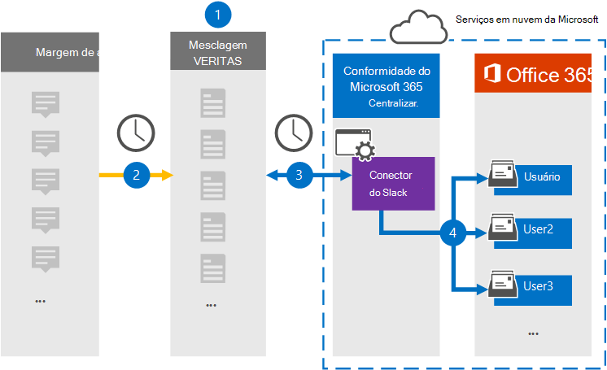

# Configurar um conector para arquivar dados de descoberta eletrônica de margem de atraso

Use um conector Globanet no centro de conformidade da Microsoft 365 para importar e arquivar dados de terceiros de mídia social, mensagens instantâneas e plataformas de colaboração de documentos para caixas de correio em sua organização do Microsoft 365. Globanet fornece um conector de [margem de atraso](https://globanet.com/slack/) que é configurado para capturar itens da fonte de dados de terceiros (regularmente) e importá-los para o Microsoft 365. A margem de atraso extrai mensagens e arquivos da API de margem de atraso e os converte em um formato de mensagem de email e importa o item para as caixas de correio do usuário.

Após margem de atraso os dados de descoberta eletrônica são armazenados nas caixas de correio do usuário, você pode aplicar recursos de conformidade do Microsoft 365, como retenção de litígio, descoberta eletrônica, políticas de retenção e rótulos de retenção e conformidade de comunicação. O uso de um conector de margem de atraso para importar e arquivar dados no Microsoft 365 pode ajudar sua organização a se manter em conformidade com as políticas governamentais e regulamentares.

## Visão geral do arquivamento margem de atraso de dados de eDiscovery

A visão geral a seguir explica o processo de usar um conector para arquivar as informações de margem de atraso no Microsoft 365.

1. Sua organização trabalha com a margem de atraso para configurar e configurar um site de margem de atraso.

2. Uma vez a cada 24 horas, as mensagens de chat da margem de atraso são copiadas para o site do Globanet Merge1. O conector também converte o conteúdo de uma mensagem de chat em um formato de mensagem de email.

3. O conector de descoberta eletrônica de margem de atraso que você cria no centro de conformidade da Microsoft 365, conecta-se ao site do Globanet Merge1 todos os dias e transfere as mensagens de chat para um local seguro de armazenamento do Azure na nuvem da Microsoft.

4. O conector importa os itens de mensagem de chat convertidos para as caixas de correio de usuários específicos usando o valor da propriedade *email* e o mapeamento de usuário automático, conforme descrito na etapa 3. Uma nova subpasta na pasta caixa de entrada chamada **margem de atraso** é criada nas caixas de correio do usuário e os itens da mensagem de chat são importados para essa pasta. O conector determina qual caixa de correio para a qual importar itens usando o valor da propriedade *email* . Cada mensagem de chat contém essa propriedade, que é preenchida com o endereço de email de cada participante da mensagem de chat.

## Antes de começar

- Crie uma conta do Merge1 do Globanet para conectores da Microsoft. Para criar uma conta, entre em contato com o [suporte ao cliente Globanet](https://globanet.com/ms-connectors-contact). Você entrará nesta conta quando criar o conector na etapa 1.

- Obtenha o nome de usuário e a senha para a conta de margem de atraso da sua organização. Você precisará entrar nessa conta na etapa 2 ao configurar a margem de atraso.

- O usuário que cria o conector de descoberta eletrônica de margem de atraso na etapa 1 (e conclui-lo na etapa 3) deve ser atribuído à função de exportação de importação de caixa de correio no Exchange Online. Essa função é necessária para adicionar conectores na página **conectores de dados** no centro de conformidade da Microsoft 365. Por padrão, essa função não é atribuída a um grupo de função no Exchange Online. Você pode adicionar a função de exportação de importação de caixa de correio ao grupo de funções Gerenciamento da organização no Exchange Online. Ou você pode criar um grupo de função, atribua a função de exportação de importação de caixa de correio e, em seguida, adicione os usuários apropriados como membros. Para obter mais informações, consulte as seções [criar grupos de função](https://docs.microsoft.com/Exchange/permissions-exo/role-groups#create-role-groups) ou [modificar grupos de função](https://docs.microsoft.com/Exchange/permissions-exo/role-groups#modify-role-groups) no artigo "gerenciar grupos de função no Exchange Online".

## Etapa 1: configurar o conector de descoberta eletrônica de atraso

A primeira etapa é acessar a página **conectores de dados** no centro de conformidade da Microsoft 365 e criar um conector para dados de margem de atraso.

1. Vá para [https://compliance.microsoft.com](https://compliance.microsoft.com/) e clique em **conectores de dados**  >  **margem de atraso da descoberta eletrônica** .

2. Na página margem de atraso do produto de **descoberta eletrônica** , clique em **Adicionar conector** .

3. Na página **termos de serviço** , clique em **aceitar** .

4. Insira um nome exclusivo que identifique o conector e clique em **Avançar** .

5. Entre em sua conta do Merge1 para configurar o conector.

## Etapa 2: configurar o eDiscovery da margem de atraso

A segunda etapa é configurar o conector de descoberta eletrônica de margem de atraso no site do Merge1. Para obter mais informações sobre como configurar o conector de descoberta eletrônica de margem de atraso no site do Globanet Merge1, consulte [Merge1 de terceiros conectores do usuário](https://docs.ms.merge1.globanetportal.com/Merge1%20Third-Party%20Connectors%20Slack%20eDiscovery%20User%20Guide.pdf).

Depois de clicar em **salvar & concluir** , a página **mapeamento de usuário** no assistente de conector no centro de conformidade da Microsoft 365 é exibida.

## Etapa 3: mapear usuários e concluir a configuração do conector

1. Na página **mapear usuários externos para usuários do Microsoft 365** , habilite o mapeamento automático do usuário.

   Margem de atraso os itens de descoberta eletrônica incluem uma propriedade chamada *email* , que contém endereços de email para usuários em sua organização. Se o conector puder associar esse endereço a um usuário do Microsoft 365, os itens serão importados para a caixa de correio desse usuário.

2. Na página **consentimento do administrador** , clique em **fornecer consentimento** . Você será redirecionado para o site da Microsoft. Clique em **aceitar** para fornecer o consentimento.

   Sua organização deve dar o consentimento para permitir que o serviço de importação do Office 365 acesse dados de caixa de correio em sua organização. Para fornecer o consentimento do administrador, você deve estar conectado com as credenciais de um administrador global do Microsoft 365 e aceitar a solicitação de consentimento. Se você não estiver conectado como um administrador global, poderá ir para [esta página](https://login.microsoftonline.com/common/oauth2/authorize?client_id=570d0bec-d001-4c4e-985e-3ab17fdc3073&response_type=code&redirect_uri=https://portal.azure.com/&nonce=1234&prompt=admin_consent) e entrar usando as credenciais de administrador global para aceitar a solicitação.

3. Clique em **Avançar** , revise suas configurações e vá para a página **conectores de dados** para ver o andamento do processo de importação para o novo conector.

## Etapa 4: monitorar o conector de eDiscovery da margem de atraso

Depois de criar o conector de descoberta eletrônica de margem de atraso, você pode visualizar o status do conector no centro de conformidade da Microsoft 365.

1. Vá para [https://compliance.microsoft.com](https://compliance.microsoft.com) e clique em **conectores de dados** no painel de navegação esquerdo.

2. Clique na guia **conectores** e selecione o conector de **descoberta eletrônica de margem de atraso** para exibir a página de submenu. Esta página contém as propriedades e as informações sobre o conector.

3. Em **status do conector com origem** , clique no link **baixar log** para abrir (ou salvar) o log de status do conector. Esse log contém informações sobre os dados que foram importados para a nuvem da Microsoft.

## Problemas conhecidos

- No momento, não há suporte para importar anexos ou itens com mais de 10 MB. O suporte para itens maiores estará disponível em uma data posterior.
