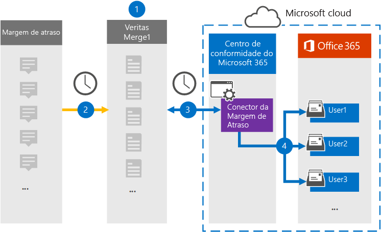

# Configurar um conector para arquivar dados de descoberta eletrônica de margem de atrasoSet up a connector to archive Slack eDiscovery data

Use um conector Globanet no centro de conformidade da Microsoft 365 para importar e arquivar dados de terceiros de mídia social, mensagens instantâneas e plataformas de colaboração de documentos para caixas de correio em sua organização do Microsoft 365.Use a Globanet connector in the Microsoft 365 compliance center to import and archive third-party data from social media, instant messaging, and document collaboration platforms to mailboxes in your Microsoft 365 organization. Globanet fornece um conector de [margem de atraso](https://globanet.com/slack/) que é configurado para capturar itens da fonte de dados de terceiros (regularmente) e importá-los para o Microsoft 365.Globanet provides a [Slack](https://globanet.com/slack/) connector that's configured to capture items from the third-party data source (on a regular basis) and then import those items to Microsoft 365. A margem de atraso extrai mensagens e arquivos da API de margem de atraso e os converte em um formato de mensagem de email e importa o item para as caixas de correio do usuário.Slack pulls messages and files from the Slack API and converts them to an email message format and then imports the item to user mailboxes.

Após margem de atraso os dados de descoberta eletrônica são armazenados nas caixas de correio do usuário, você pode aplicar recursos de conformidade do Microsoft 365, como retenção de litígio, descoberta eletrônica, políticas de retenção e rótulos de retenção e conformidade de comunicação.After Slack eDiscovery data is stored in user mailboxes, you can apply Microsoft 365 compliance features such as Litigation Hold, eDiscovery, retention policies and retention labels, and communication compliance. O uso de um conector de margem de atraso para importar e arquivar dados no Microsoft 365 pode ajudar sua organização a se manter em conformidade com as políticas governamentais e regulamentares.Using a Slack connector to import and archive data in Microsoft 365 can help your organization stay compliant with government and regulatory policies.

## Visão geral do arquivamento margem de atraso de dados de eDiscoveryOverview of archiving Slack eDiscovery data

A visão geral a seguir explica o processo de usar um conector para arquivar as informações de margem de atraso no Microsoft 365.The following overview explains the process of using a connector to archive the Slack information in Microsoft 365.

1. Sua organização trabalha com a margem de atraso para configurar e configurar um site de margem de atraso.Your organization works with Slack to set up and configure a Slack site.

2. Uma vez a cada 24 horas, as mensagens de chat da margem de atraso são copiadas para o site do Globanet Merge1.Once every 24 hours, chat messages from Slack eDiscovery are copied to the Globanet Merge1 site. O conector também converte o conteúdo de uma mensagem de chat em um formato de mensagem de email.The connector also converts the content of a chat message to an email message format.

3. O conector de descoberta eletrônica de margem de atraso que você cria no centro de conformidade da Microsoft 365, conecta-se ao site do Globanet Merge1 todos os dias e transfere as mensagens de chat para um local seguro de armazenamento do Azure na nuvem da Microsoft.The Slack eDiscovery connector that you create in the Microsoft 365 compliance center, connects to the Globanet Merge1 site every day and transfers the chat messages to a secure Azure Storage location in the Microsoft cloud.

4. O conector importa os itens de mensagem de chat convertidos para as caixas de correio de usuários específicos usando o valor da propriedade *email* e o mapeamento de usuário automático, conforme descrito na etapa 3.The connector imports the converted chat message items to the mailboxes of specific users using the value of the *Email* property and automatic user mapping, as described in Step 3. Uma nova subpasta na pasta caixa de entrada chamada **margem de atraso** é criada nas caixas de correio do usuário e os itens da mensagem de chat são importados para essa pasta.A new subfolder in the Inbox folder named **Slack eDiscovery** is created in the user mailboxes, and the chat message items are imported to that folder. O conector determina qual caixa de correio para a qual importar itens usando o valor da propriedade *email* .The connector determines which mailbox to import items to by using the value of the *Email* property. Cada mensagem de chat contém essa propriedade, que é preenchida com o endereço de email de cada participante da mensagem de chat.Every chat message contains this property, which is populated with the email address of every participant of the chat message.

## Antes de começarBefore you begin

- Crie uma conta do Merge1 do Globanet para conectores da Microsoft.Create a Globanet Merge1 account for Microsoft connectors. Para criar uma conta, entre em contato com o [suporte ao cliente Globanet](https://globanet.com/ms-connectors-contact).To create an account, contact [Globanet Customer Support](https://globanet.com/ms-connectors-contact). Você entrará nesta conta quando criar o conector na etapa 1.You will sign into this account when you create the connector in Step 1.

- Obtenha o nome de usuário e a senha para a conta de margem de atraso da sua organização.Obtain the username and password for your organization's Slack enterprise account. Você precisará entrar nessa conta na etapa 2 ao configurar a margem de atraso.You'll need to sign into this account in Step 2 when you configure Slack.

- O usuário que cria o conector de descoberta eletrônica de margem de atraso na etapa 1 (e conclui-lo na etapa 3) deve ser atribuído à função de exportação de importação de caixa de correio no Exchange Online.The user who creates the Slack eDiscovery connector in Step 1 (and completes it in Step 3) must be assigned to the Mailbox Import Export role in Exchange Online. Essa função é necessária para adicionar conectores na página **conectores de dados** no centro de conformidade da Microsoft 365.This role is required to add connectors on the **Data connectors** page in the Microsoft 365 compliance center. Por padrão, essa função não é atribuída a um grupo de função no Exchange Online.By default, this role is not assigned to a role group in Exchange Online. Você pode adicionar a função de exportação de importação de caixa de correio ao grupo de funções Gerenciamento da organização no Exchange Online.You can add the Mailbox Import Export role to the Organization Management role group in Exchange Online. Ou você pode criar um grupo de função, atribua a função de exportação de importação de caixa de correio e, em seguida, adicione os usuários apropriados como membros.Or you can create a role group, assign the Mailbox Import Export role, and then add the appropriate users as members. Para obter mais informações, consulte as seções [criar grupos de função](https://docs.microsoft.com/Exchange/permissions-exo/role-groups#create-role-groups) ou [modificar grupos de função](https://docs.microsoft.com/Exchange/permissions-exo/role-groups#modify-role-groups) no artigo "gerenciar grupos de função no Exchange Online".For more information, see the [Create role groups](https://docs.microsoft.com/Exchange/permissions-exo/role-groups#create-role-groups) or [Modify role groups](https://docs.microsoft.com/Exchange/permissions-exo/role-groups#modify-role-groups) sections in the article "Manage role groups in Exchange Online".

## Etapa 1: configurar o conector de descoberta eletrônica de atrasoStep 1: Set up the Slack eDiscovery connector

A primeira etapa é acessar a página **conectores de dados** no centro de conformidade da Microsoft 365 e criar um conector para dados de margem de atraso.The first step is to access to the **Data Connectors** page in the Microsoft 365 compliance center and create a connector for Slack data.

1. Vá para [https://compliance.microsoft.com](https://compliance.microsoft.com/) e clique em **conectores de dados**  >  **margem de atraso da descoberta eletrônica**.Go to [https://compliance.microsoft.com](https://compliance.microsoft.com/) and then click **Data connectors** > **Slack eDiscovery**.

2. Na página margem de atraso do produto de **descoberta eletrônica** , clique em **Adicionar conector**.On the **Slack eDiscovery** product description page, click **Add connector**.

3. Na página **termos de serviço** , clique em **aceitar**.On the **Terms of service** page, click **Accept**.

4. Insira um nome exclusivo que identifique o conector e clique em **Avançar**.Enter a unique name that identifies the connector, and then click **Next**.

5. Entre em sua conta do Merge1 para configurar o conector.Sign in to your Merge1 account to configure the connector.

## Etapa 2: configurar o eDiscovery da margem de atrasoStep 2: Configure Slack eDiscovery

A segunda etapa é configurar o conector de descoberta eletrônica de margem de atraso no site do Merge1.The second step is to configure the Slack eDiscovery connector on the Merge1 site. Para obter mais informações sobre como configurar o conector de descoberta eletrônica de margem de atraso no site do Globanet Merge1, consulte [Merge1 de terceiros conectores do usuário](https://docs.ms.merge1.globanetportal.com/Merge1%20Third-Party%20Connectors%20Slack%20eDiscovery%20User%20Guide.pdf).For more information about how to configure the Slack eDiscovery connector on the Globanet Merge1 site, see [Merge1 Third-Party Connectors User Guide](https://docs.ms.merge1.globanetportal.com/Merge1%20Third-Party%20Connectors%20Slack%20eDiscovery%20User%20Guide.pdf).

Depois de clicar em **salvar & concluir**, a página **mapeamento de usuário** no assistente de conector no centro de conformidade da Microsoft 365 é exibida.After you click **Save & Finish**, the **User mapping** page in the connector wizard in the Microsoft 365 compliance center is displayed.

## Etapa 3: mapear usuários e concluir a configuração do conectorStep 3: Map users and complete the connector setup

1. Na página **mapear usuários externos para usuários do Microsoft 365** , habilite o mapeamento automático do usuário.On the **Map external users to Microsoft 365 users** page, enable automatic user mapping.

   Margem de atraso os itens de descoberta eletrônica incluem uma propriedade chamada *email*, que contém endereços de email para usuários em sua organização.Slack eDiscovery items include a property called *Email*, which contains email addresses for users in your organization. Se o conector puder associar esse endereço a um usuário do Microsoft 365, os itens serão importados para a caixa de correio desse usuário.If the connector can associate this address with a Microsoft 365 user, the items are imported to that user's mailbox.

2. Clique em **Avançar**, revise suas configurações e vá para a página **conectores de dados** para ver o andamento do processo de importação para o novo conector.Click **Next**, review your settings, and go to the **Data connectors** page to see the progress of the import process for the new connector.

## Etapa 4: monitorar o conector de eDiscovery da margem de atrasoStep 4: Monitor the Slack eDiscovery connector

Depois de criar o conector de descoberta eletrônica de margem de atraso, você pode visualizar o status do conector no centro de conformidade da Microsoft 365.After you create the Slack eDiscovery connector, you can view the connector status in the Microsoft 365 compliance center.

1. Vá para [https://compliance.microsoft.com](https://compliance.microsoft.com) e clique em **conectores de dados** no painel de navegação esquerdo.Go to [https://compliance.microsoft.com](https://compliance.microsoft.com) and click **Data connectors** in the left nav.

2. Clique na guia **conectores** e selecione o conector de **descoberta eletrônica de margem de atraso** para exibir a página de submenu.Click the **Connectors** tab and then select the **Slack eDiscovery** connector to display the flyout page. Esta página contém as propriedades e as informações sobre o conector.This page contains the properties and information about the connector.

3. Em **status do conector com origem**, clique no link **baixar log** para abrir (ou salvar) o log de status do conector.Under **Connector status with source**, click the **Download log** link to open (or save) the status log for the connector. Esse log contém informações sobre os dados que foram importados para a nuvem da Microsoft.This log contains information about the data that has been imported to the Microsoft cloud.

## Problemas conhecidosKnown issues

- No momento, não há suporte para importar anexos ou itens com mais de 10 MB.At this time, we don't support importing attachments or items that are larger than 10 MB. O suporte para itens maiores estará disponível em uma data posterior.Support for larger items will be available at a later date.
