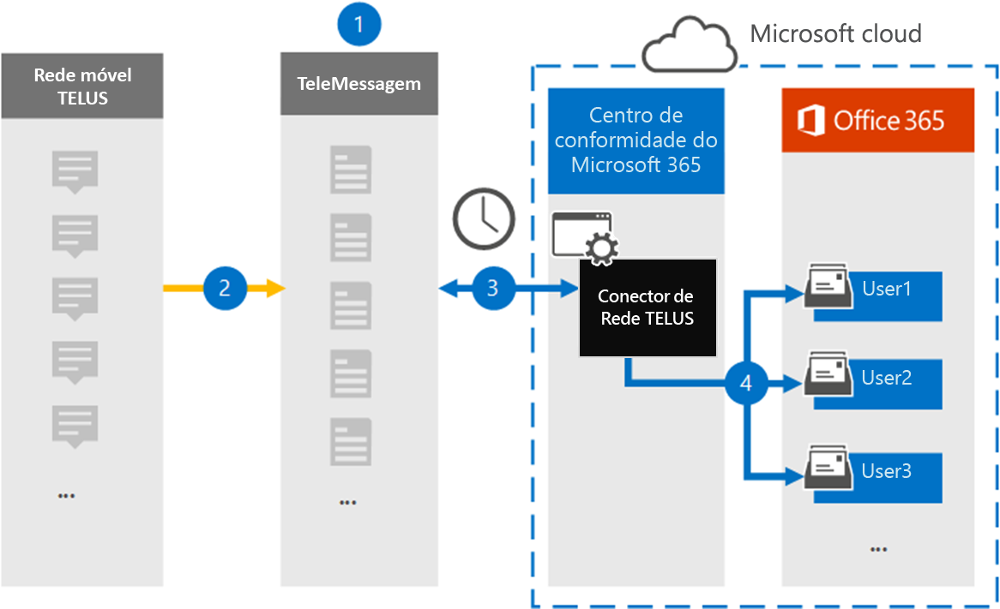

# Configurar um conector para arquivar dados de rede TELUS

Use o conector TeleMessage no centro de conformidade do Microsoft 365 para importar e arquivar dados sms da Rede TELUS da sua organização. Depois de configurar um conector, ele se conecta à Rede TELUS da sua organização uma vez por dia e importa dados SMS para caixas de correio no Microsoft 365.

Depois que as mensagens SMS são armazenadas nas caixas de correio do usuário, você pode aplicar recursos de conformidade do Microsoft 365, como Retenção de Litígio, Pesquisa de Conteúdo e políticas de retenção do Microsoft 365 aos dados da TELUS. Por exemplo, você pode pesquisar mensagens SMS TELUS usando a Pesquisa de Conteúdo ou associar a caixa de correio que contém os dados do TELUS a um custodiante em um caso de Descoberta Eletrônico Avançada. O uso de um conector de rede TELUS para importar e arquivar dados no Microsoft 365 pode ajudar sua organização a manter a conformidade com políticas governamentais e regulatórias.

## Visão geral dos dados de rede TELUS de arquivamento

A visão geral a seguir explica o processo de uso de um conector para arquivar dados de rede TELUS no Microsoft 365.

1. Sua organização trabalha com TeleMessage e TELUS para configurar um conector de Rede TELUS. Para obter mais informações, consulte [o Arquivador de Rede TELUS.](https://www.telemessage.com/office365-activation-for-telus-network-archiver/)

2. Uma vez a cada 24 horas, as mensagens SMS da Rede TELUS da sua organização são copiadas para o site TeleMessage.

3. O conector de Rede TELUS que você cria no centro de conformidade do Microsoft 365 conecta-se ao site da TeleMessage todos os dias e transfere as mensagens SMS das últimas 24 horas para um local seguro de Armazenamento do Azure no Microsoft Cloud. O conector também converte o conteúdo de mensagens SMS em um formato de mensagem de email.

4. O conector importa os itens de comunicação móvel para a caixa de correio de um usuário específico. Uma nova pasta chamada **TeLUS SMS Network Archiver** é criada na caixa de correio do usuário específico e os itens são importados para ela. O conector faz o mapeamento usando o valor da *propriedade de endereço de email do* usuário. Cada mensagem SMS contém essa propriedade, que é preenchida com o endereço de email de cada participante da mensagem SMS.

   Além do mapeamento automático de usuário usando o valor da propriedade de endereço de *Email* do Usuário, você também pode implementar o mapeamento personalizado carregando um arquivo de mapeamento CSV. Esse arquivo de mapeamento contém o número de telefone celular e o endereço de email do Microsoft 365 correspondente para usuários em sua organização. Se você habilitar o mapeamento automático de usuário e o mapeamento personalizado, para cada item TELUS, o conector primeiro analisa o arquivo de mapeamento personalizado. Se não encontrar um usuário válido do Microsoft 365 que corresponda ao número de telefone celular de um usuário, o conector usará os valores na propriedade de endereço de email do item que está tentando importar. Se o conector não encontrar um usuário válido do Microsoft 365 no arquivo de mapeamento personalizado ou na propriedade de endereço de email do item TELUS, o item não será importado.

## Antes de começar

Algumas das etapas de implementação necessárias para arquivar dados da Rede TELUS são externas ao Microsoft 365 e devem ser concluídas antes que você possa criar um conector no centro de conformidade.

- Order the [TELUS Network Archiver service from TeleMessage](https://www.telemessage.com/mobile-archiver/order-mobile-archiver-for-o365) and get a valid administration account for your organization. Você precisará entrar nessa conta ao criar o conector no centro de conformidade.

- Obtenha a conta da Rede TELUS e os detalhes do contato de cobrança para que você possa preencher os formulários de integração da TeleMessage e solicitar o serviço de arquivamento de mensagens do TELUS.

- Registre todos os usuários que exigem o arquivamento da Rede TELUS SMS na conta teleMessage. Ao registrar usuários, certifique-se de usar o mesmo endereço de email usado para a conta do Microsoft 365.

- Seus funcionários devem ter celulares de propriedade corporativa e de propriedade corporativa na rede móvel daTELUS. O arquivamento de mensagens no Microsoft 365 não está disponível para dispositivos de propriedade do funcionário ou BYOD (Traga seus próprios dispositivos).

- O usuário que cria um conector de Rede TELUS deve receber a função Importar Exportar Caixa de Correio no Exchange Online. Isso é necessário para adicionar conectores na página Conectores **de dados** no centro de conformidade do Microsoft 365. Por padrão, essa função não é atribuída a nenhum grupo de funções no Exchange Online. Você pode adicionar a função Importar Exportar Caixa de Correio ao grupo de função Gerenciamento da Organização no Exchange Online. Ou você pode criar um grupo de funções, atribuir a função Importar Exportar Caixa de Correio e adicionar os usuários apropriados como membros. Para obter mais informações, consulte  as [seções](https://docs.microsoft.com/Exchange/permissions-exo/role-groups#create-role-groups) Criar grupos de função ou Modificar grupos de função no artigo "Gerenciar grupos de função no Exchange Online".

## Criar um conector de rede TELUS

Depois de concluir os pré-requisitos descritos na seção anterior, você pode criar um conector de rede TELUS no centro de conformidade do Microsoft 365. O conector usa as informações que você fornece para se conectar ao site teleMessage e transferir mensagens SMS para as caixas de correio do usuário correspondentes no Microsoft 365.

1. Vá para [https://compliance.microsoft.com](https://compliance.microsoft.com/) e clique em **Conectores de dados rede**  >  **TELUS**.

2. Na página de descrição do produto da **Rede TELUS,** clique em **Adicionar conector**

3. Na página **Termos de serviço,** clique em **Aceitar**.

4. Na página **Login para TeleMessage,** em Etapa 3, insira as informações necessárias nas caixas a seguir e clique em **Próximo.**

   - **Nome de usuário:** Seu nome de usuário da TeleMessage.

   - **Senha:** Sua senha da TeleMessage.

5. Depois que o conector é criado, você pode fechar a janela pop-up e ir para a próxima página.

6. Na página **mapeamento de usuários,** habilita o mapeamento automático de usuário e clique em **Próximo.** Caso precise de mapeamento personalizado, carregue um arquivo CSV e clique em **Próximo.**

7. Revise suas configurações e clique em **Concluir** para criar o conector.

8. Vá até a guia Conectores na **página Conectores** de dados para ver o progresso do processo de importação do novo conector.

## Problemas conhecidos

- No momento, não há suporte para a importação de anexos ou itens maiores do que 10 MB. O suporte para itens maiores estará disponível posteriormente.
