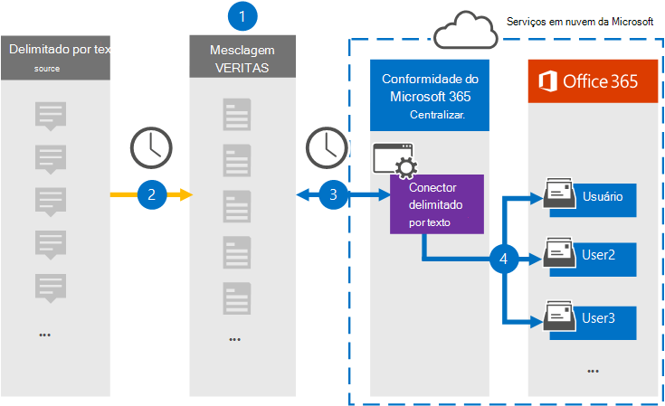

# Configurar um conector para arquivar dados delimitados por texto

Use um conector Globanet no centro de conformidade da Microsoft 365 para importar e arquivar dados delimitados por texto para caixas de correio de usuários na sua organização do Microsoft 365. O [Globanet](https://globanet.com/merge1/) fornece um conector delimitado por texto que é configurado para capturar itens de uma fonte de dados de terceiros (em uma base regular) e importá-los para o Microsoft 365. O conector converte o conteúdo da fonte de dados delimitada por texto em um formato de mensagem de email e, em seguida, importa esses itens para a caixa de correio do usuário no Microsoft 365.

Depois que os dados delimitados por texto são armazenados nas caixas de correio do usuário, você pode aplicar recursos de conformidade do Microsoft 365, como retenção de litígio, descoberta eletrônica, políticas de retenção e rótulos de retenção e conformidade de comunicação. O uso de um conector de reuniões de zoom para importar e arquivar dados no Microsoft 365 pode ajudar sua organização a se manter em conformidade com as políticas governamentais e regulamentares.

Após arquivar, as comunicações de origem delimitadas por texto podem ser mantidas, supervisionadas para fins de conformidade e recuperadas para o eDiscovery e o controle de informações internas.

## Visão geral do arquivamento da fonte delimitada por texto

A visão geral a seguir explica o processo de usar um conector para arquivar as informações de origem delimitadas por texto no Microsoft 365.

1. Sua organização trabalha com a fonte delimitada por texto para configurar e configurar um site delimitado por texto.

2. Uma vez a cada 24 horas, as mensagens de chat da fonte delimitada por texto são copiadas para o site do Globanet Merge1. O conector também converte o conteúdo em um formato de mensagem de email.

3. O conector de texto delimitado que você cria no centro de conformidade da Microsoft 365, conecta-se ao site do Globanet Merge1 todos os dias e transfere as mensagens para um local seguro de armazenamento do Azure na nuvem da Microsoft.

4. O conector importa os itens de mensagem convertidos para as caixas de correio de usuários específicos usando o valor da propriedade *email* do mapeamento de usuário automático, conforme descrito na etapa 3. Uma nova subpasta na pasta caixa de entrada denominada **texto delimitado** será criada nas caixas de correio do usuário e os itens de mensagem serão importados para essa pasta. O conector faz isso usando o valor da propriedade *email* . Cada mensagem contém essa propriedade, que é preenchida com o endereço de email de cada participante da mensagem.

## Antes de começar

- Crie uma conta do Merge1 do Globanet para conectores da Microsoft. Para fazer isso, entre em contato com o [suporte ao cliente Globanet](https://globanet.com/ms-connectors-contact). Você precisa entrar nessa conta ao criar o conector na etapa 1.

- O usuário que cria o conector delimitado por texto na etapa 1 (e conclui-lo na etapa 3) deve ser atribuído à função de exportação de importação de caixa de correio no Exchange Online. Essa função é necessária para adicionar conectores na página **conectores de dados** no centro de conformidade da Microsoft 365. Por padrão, essa função não é atribuída a nenhum grupo de função no Exchange Online. Você pode adicionar a função de exportação de importação de caixa de correio ao grupo de funções Gerenciamento da organização no Exchange Online. Ou você pode criar um grupo de função, atribua a função de exportação de importação de caixa de correio e, em seguida, adicione os usuários apropriados como membros. Para obter mais informações, consulte as seções [criar grupos de função](https://docs.microsoft.com/Exchange/permissions-exo/role-groups#create-role-groups) ou [modificar grupos de função](https://docs.microsoft.com/Exchange/permissions-exo/role-groups#modify-role-groups) no artigo "gerenciar grupos de função no Exchange Online".

## Etapa 1: configurar o conector delimitado por texto

A primeira etapa é acessar a página **conectores de dados** no centro de conformidade da Microsoft 365 e criar um conector para dados delimitados por texto.

1. Vá para [https://compliance.microsoft.com](https://compliance.microsoft.com/) e clique em **conectores**  >  **de dados delimitados por texto**.

2. Na página descrição do produto **delimitado por texto** , clique em **Adicionar conector**.

3. Na página **termos de serviço** , clique em **aceitar**.

4. Insira um nome exclusivo que identifique o conector e clique em **Avançar**.

5. Entre em sua conta do Merge1 para configurar o conector.

## Etapa 2: configurar o conector delimitado por texto no site do Globanet Merge1

A segunda etapa é configurar o conector delimitado por texto no site do Merge1. Para obter informações sobre como configurar o conector delimitado por texto no site do Globanet Merge1, consulte [Merge1 de terceiros conectores do usuário](https://docs.ms.merge1.globanetportal.com/Merge1%20Third-Party%20Connectors%20Text-Delimited%20User%20Guide%20.pdf).

Após clicar em **salvar & concluir**, você voltará para o centro de conformidade da Microsoft 365, para a página **mapeamento de usuário** do assistente de conector.

## Etapa 3: mapear usuários e concluir a configuração do conector

Para mapear usuários e concluir a configuração do conector no centro de conformidade do Microsoft 365, siga estas etapas:

1. Na página **mapear usuários externos para usuários do Microsoft 365** , habilite o mapeamento automático do usuário. Os itens de origem delimitados por texto incluem uma propriedade chamada *email*, que contém endereços de email para usuários em sua organização. Se o conector puder associar esse endereço a um usuário do Microsoft 365, os itens serão importados para a caixa de correio desse usuário.

2. Na página **consentimento do administrador** , clique no botão **fornecer consentimento** . Você será redirecionado para o site da Microsoft. Clique em **aceitar** para fornecer o consentimento.

   Sua organização deve dar o consentimento para permitir que o serviço de importação do Office 365 acesse dados de caixa de correio em sua organização. Para fornecer o consentimento do administrador, você deve estar conectado com as credenciais de um administrador global do Microsoft 365 e aceitar a solicitação de consentimento. Se você não estiver conectado como um administrador global, poderá ir para [esta página](https://login.microsoftonline.com/common/oauth2/authorize?client_id=570d0bec-d001-4c4e-985e-3ab17fdc3073&response_type=code&redirect_uri=https://portal.azure.com/&nonce=1234&prompt=admin_consent) e entrar usando as credenciais de administrador global para aceitar a solicitação.

3. Clique em **Avançar**, revise suas configurações e vá para a página **conectores de dados** para ver o andamento do processo de importação para o novo conector.

## Etapa 4: monitorar o conector delimitado por texto

Depois de criar o conector de texto delimitado, você pode visualizar o status do conector no centro de conformidade da Microsoft 365.

1. Vá para [https://compliance.microsoft.com](https://compliance.microsoft.com) e clique em **conectores de dados** no painel de navegação esquerdo.

2. Clique na guia **conectores** e selecione o conector **delimitado por texto** para exibir a página de submenu, que contém as propriedades e as informações sobre o conector.

3. Em **status do conector com origem**, clique no link **baixar log** para abrir (ou salvar) o log de status do conector. Esse log contém informações sobre os dados que foram importados para a nuvem da Microsoft.

## Problemas conhecidos

- No momento, não há suporte para importar anexos ou itens com mais de 10 MB. O suporte para itens maiores estará disponível em uma data posterior.
