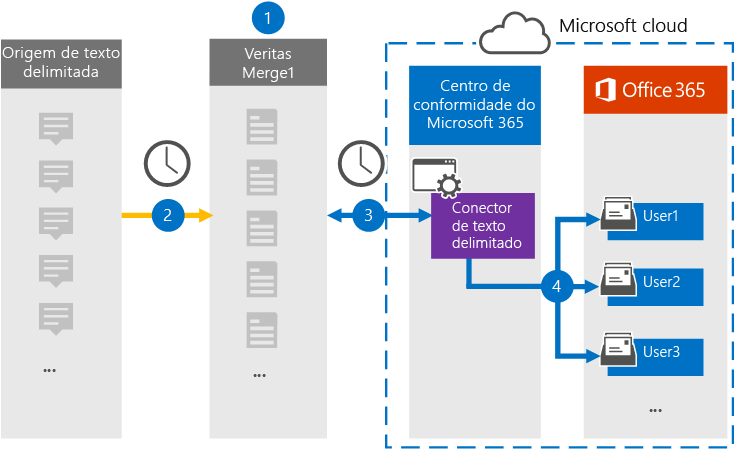

# Configurar um conector para arquivar dados delimitados por textoSet up a connector to archive text-delimited data

Use um conector Veritas no Microsoft 365 de conformidade para importar e arquivar dados delimitados por texto para caixas de correio de usuário em sua Microsoft 365 organização.Use a Veritas connector in the Microsoft 365 compliance center to import and archive text-delimited data to user mailboxes in your Microsoft 365 organization. A Veritas  fornece um conector delimitado por texto configurado para capturar itens de uma fonte de dados de terceiros (regularmente) e importar esses itens para Microsoft 365.Veritas provides a [text-delimited connector](https://globanet.com/text-delimited) that's configured to capture items from a third-party data source (on a regular basis) and import those items to Microsoft 365. O conector converte conteúdo da fonte de dados delimitada por texto para um formato de mensagem de email e importa esses itens para a caixa de correio do usuário em Microsoft 365.The connector converts content from the text-delimited data source to an email message format and then imports those items to the user's mailbox in Microsoft 365.

Depois que os dados delimitados por texto são armazenados em caixas de correio de usuário, você pode aplicar Microsoft 365 de conformidade, como retenção de litígio, descoberta e políticas de retenção e rótulos de retenção.After text-delimited data is stored in user mailboxes, you can apply Microsoft 365 compliance features such as Litigation Hold, eDiscovery, and retention policies and retention labels. Usar um conector de dados delimitado por texto para importar e arquivar dados no Microsoft 365 pode ajudar sua organização a manter a conformidade com políticas governamentais e regulatórias.Using a text-delimited data connector to import and archive data in Microsoft 365 can help your organization stay compliant with government and regulatory policies.

## Visão geral do arquivamento dos dados delimitados por textoOverview of archiving the text-delimited data

A visão geral a seguir explica o processo de uso de um conector para arquivar informações de origem delimitadas por texto em Microsoft 365.The following overview explains the process of using a connector to archive text-delimited source information in Microsoft 365.

1. Sua organização trabalha com a fonte delimitada por texto para configurar e configurar um site delimitado por texto.Your organization works with the text-delimited source to set up and configure a text-delimited site.

2. Uma vez a cada 24 horas, as mensagens de chat da fonte delimitada por texto são copiadas para o site Veritas Merge1.Once every 24 hours, chat messages from the text-delimited source are copied to the Veritas Merge1 site. O conector também converte o conteúdo em um formato de mensagem de email.The connector also converts the content to an email message format.

3. O conector delimitado por texto que você cria no centro de conformidade do Microsoft 365 conecta-se ao site Veritas Merge1 todos os dias e transfere as mensagens para um local seguro do Azure Armazenamento na nuvem da Microsoft.The text-delimited connector that you create in the Microsoft 365 compliance center connects to the Veritas Merge1 site every day and transfers the messages to a secure Azure Storage location in the Microsoft cloud.

4. O conector importa os itens de mensagem convertidos para as caixas de correio de usuários específicos usando o valor da propriedade *Email* do mapeamento automático do usuário, conforme descrito na Etapa 3.The connector imports the converted message items to the mailboxes of specific users using the value of the *Email* property of the automatic user mapping as described in Step 3. Uma nova subpasta na pasta Caixa de Entrada chamada **Text- Delimitada** é criada nas caixas de correio do usuário e os itens da mensagem são importados para essa pasta.A new subfolder in the Inbox folder named **Text- Delimited** is created in the user mailboxes, and the message items are imported to that folder. O conector determina para qual caixa de correio importar itens usando o valor da *propriedade Email.*The connector determines which mailbox to import items to by using the value of the *Email* property. Cada mensagem contém essa propriedade, que é preenchida com o endereço de email de cada participante.Every message contains this property, which is populated with the email address of every participant.

## Antes de começarBefore you begin

- Crie uma conta Veritas Merge1 para conectores da Microsoft.Create a Veritas Merge1 account for Microsoft connectors. Para criar essa conta, entre em contato com [o Suporte ao Cliente veritas.](https://globanet.com/ms-connectors-contact)To create this account, contact [Veritas Customer Support](https://globanet.com/ms-connectors-contact). Você entrará nessa conta quando criar o conector na Etapa 1.You will sign into this account when you create the connector in Step 1.

- O usuário que cria o conector delimitado por texto na Etapa 1 (e o conclui na Etapa 3) deve ser atribuído à função De exportação de importação de caixa de correio no Exchange Online.The user who creates the text-delimited connector in Step 1 (and completes it in Step 3) must be assigned to the Mailbox Import Export role in Exchange Online. Essa função é necessária para adicionar conectores na página **Conectores** de dados no Microsoft 365 de conformidade.This role is required to add connectors on the **Data connectors** page in the Microsoft 365 compliance center. Por padrão, essa função não é atribuída a um grupo de funções no Exchange Online.By default, this role is not assigned to a role group in Exchange Online. Você pode adicionar a função Exportar Importação de Importação de Caixa de Correio ao grupo de função Gerenciamento da Organização Exchange Online.You can add the Mailbox Import Export role to the Organization Management role group in Exchange Online. Ou você pode criar um grupo de funções, atribuir a função Exportar Importação de Caixa de Correio e adicionar os usuários apropriados como membros.Or you can create a role group, assign the Mailbox Import Export role, and then add the appropriate users as members. Para obter mais informações, consulte as seções Criar grupos de [função](/Exchange/permissions-exo/role-groups#create-role-groups) ou [Modificar](/Exchange/permissions-exo/role-groups#modify-role-groups) grupos de função no artigo "Gerenciar grupos de funções em Exchange Online".For more information, see the [Create role groups](/Exchange/permissions-exo/role-groups#create-role-groups) or [Modify role groups](/Exchange/permissions-exo/role-groups#modify-role-groups) sections in the article "Manage role groups in Exchange Online".

## Etapa 1: Configurar o conector delimitado por textoStep 1: Set up the text-delimited connector

A primeira etapa é acessar a página **Conectores** de Dados no centro de conformidade Microsoft 365 e criar um conector para dados delimitados por texto.The first step is to access to the **Data Connectors** page in the Microsoft 365 compliance center and create a connector for text-delimited data.

1. Vá para [https://compliance.microsoft.com](https://compliance.microsoft.com/) e clique em **Conectores de dados**  >  **Text-Delimited**.Go to [https://compliance.microsoft.com](https://compliance.microsoft.com/) and then click **Data connectors** > **Text-Delimited**.

2. Na página **de descrição do** produto delimitada por texto, clique em Adicionar **conector**.On the **text-delimited** product description page, click **Add connector**.

3. Na página **Termos de serviço,** clique em **Aceitar**.On the **Terms of service** page, click **Accept**.

4. Insira um nome exclusivo que identifique o conector e clique em **Próximo**.Enter a unique name that identifies the connector, and then click **Next**.

5. Entre na sua conta Merge1 para configurar o conector.Sign in to your Merge1 account to configure the connector.

## Etapa 2: Configurar o conector delimitado por texto no site Veritas Merge1Step 2: Configure the Text-delimited connector on the Veritas Merge1 site

A segunda etapa é configurar o conector delimitado por texto no site Merge1.The second step is to configure the text-delimited connector on the Merge1 site. Para obter informações sobre como configurar o conector delimitado por texto no site Mesclagem de Veritas1, consulte [Merge1 Third-Party Connectors User Guide](https://docs.ms.merge1.globanetportal.com/Merge1%20Third-Party%20Connectors%20text-delimited%20User%20Guide%20.pdf).For information about configuring  the text-delimited connector on the Veritas Merge1 site, see [Merge1 Third-Party Connectors User Guide](https://docs.ms.merge1.globanetportal.com/Merge1%20Third-Party%20Connectors%20text-delimited%20User%20Guide%20.pdf).

Depois de clicar em Salvar &  **Concluir**, a página de mapeamento do usuário no assistente de conector no Microsoft 365 de conformidade será exibida.After you click **Save & Finish**, the **User mapping** page in the connector wizard in the Microsoft 365 compliance center is displayed.

## Etapa 3: mapear usuários e concluir a configuração do conectorStep 3: Map users and complete the connector setup

Para mapear usuários e concluir a instalação do conector no centro de conformidade Microsoft 365, siga estas etapas:To map users and complete the connector setup in the Microsoft 365 compliance center, follow these steps:

1. Na página **Mapear usuários externos para Microsoft 365 usuários,** habilita o mapeamento automático do usuário.On the **Map external users to Microsoft 365 users** page, enable automatic user mapping. Os itens de origem Text- Delimitados incluem uma propriedade chamada *Email*, que contém endereços de email para usuários em sua organização.The Text- Delimited source items include a property called *Email*, which contains email addresses for users in your organization. Se o conector puder associar esse endereço a um Microsoft 365 usuário, os itens serão importados para a caixa de correio desse usuário.If the connector can associate this address with a Microsoft 365 user, the items are imported to that user’s mailbox.

2. Clique **em Avançar**, revise suas configurações e vá para a página Conectores de dados para ver o andamento do processo de importação do novo conector. Click **Next**, review your settings, and then go to the **Data connectors** page to see the progress of the import process for the new connector.

## Etapa 4: Monitorar o conector delimitado por textoStep 4: Monitor the text-delimited connector

Depois de criar o conector Delimitado por Texto, você poderá exibir o status do conector no centro de conformidade Microsoft 365 de texto.After you create the Text- Delimited connector, you can view the connector status in the Microsoft 365 compliance center.

1. Vá para [https://compliance.microsoft.com](https://compliance.microsoft.com) e clique **em Conectores de dados** na nav esquerda.Go to [https://compliance.microsoft.com](https://compliance.microsoft.com) and click **Data connectors** in the left nav.

2. Clique na **guia Conectores** e selecione o **conector Delimitado** de Texto para exibir a página de sub-texto.Click the **Connectors** tab and then select the **Text- Delimited** connector to display the flyout page. Esta página contém as propriedades e informações sobre o conector.This page contains the properties and information about the connector.

3. Em **Status do conector com origem**, clique no link Baixar **log** para abrir (ou salvar) o log de status do conector.Under **Connector status with source**, click the **Download log** link to open (or save) the status log for the connector. Esse log contém informações sobre os dados que foram importados para a nuvem da Microsoft.This log contains information about the data that has been imported to the Microsoft cloud.

## Problemas conhecidosKnown issues

- Neste momento, não há suporte para importação de anexos ou itens maiores que 10 MB.At this time, we don't support importing attachments or items that are larger than 10 MB. O suporte para itens maiores estará disponível posteriormente.Support for larger items will be available at a later date.