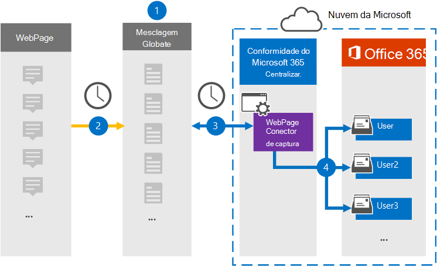

# Configurar um conector para arquivar dados de página da WebSet up a connector to archive webpage data

Use um conector Globalnet no centro de conformidade do Microsoft 365 para importar e arquivar dados de páginas da Web para caixas de correio de usuário em sua organização do Microsoft 365.Use a Globanet connector in the Microsoft 365 compliance center to import and archive data from webpages to user mailboxes in your Microsoft 365 organization. A Globalnet fornece um conector de Captura de Página da [Web](https://globanet.com/webpage-capture) que captura páginas da Web específicas (e quaisquer links nessas páginas) em um site específico ou em um domínio inteiro.Globanet provides a [Webpage Capture](https://globanet.com/webpage-capture) connector that captures specific webpages (and any links on those pages) in a specific website or an entire domain. O conector converte o conteúdo da página da Web em um formato de arquivo PDF, PNG ou personalizado e, em seguida, anexa os arquivos convertidos a uma mensagem de email e importa esses itens de email para caixas de correio de usuário no Microsoft 365.The connector converts the webpage content to a PDF, PNG, or custom file format and then attaches the converted files to an email message and then imports those email items to user mailboxes in Microsoft 365.

Depois que o conteúdo da página da Web for armazenado em caixas de correio de usuário, você poderá aplicar recursos de conformidade do Microsoft 365, como Retenção de Litígio, Descoberta Eletrônico e políticas de retenção e rótulos de retenção.After webpage content is stored in user mailboxes, you can apply Microsoft 365 compliance features such as Litigation Hold, eDiscovery, and retention policies and retention labels. Usar um conector de Captura de Página da Web para importar e arquivar dados no Microsoft 365 pode ajudar sua organização a permanecer em conformidade com políticas governamentais e regulatórias.Using a Webpage Capture connector to import and archive data in Microsoft 365 can help your organization stay compliant with government and regulatory policies.

## Visão geral dos dados de página da Web de arquivamentoOverview of archiving webpage data

A visão geral a seguir explica o processo de uso de um conector para arquivar o conteúdo da página da Web no Microsoft 365.The following overview explains the process of using a connector to archive webpage content in Microsoft 365.

1. Sua organização trabalha com a origem da página da Web para configurar e configurar um site de Captura de Página da Web.Your organization works with the webpage source to set up and configure a Webpage Capture site.

2. Uma vez a cada 24 horas, os itens de origem da página da Web são copiados para o site Globalnet Merge1.Once every 24 hours, the webpage sources items are copied to the Globanet Merge1 site. O conector também converte e anexa o conteúdo de uma página da Web a uma mensagem de email.The connector also converts and attaches the content of a webpage to an email message.

3. O conector de Captura de Página da Web que você cria no centro de conformidade do Microsoft 365, conecta-se ao site Globalnet Merge1 todos os dias e transfere os itens de página da Web para um local seguro de Armazenamento do Azure na nuvem da Microsoft.The Webpage Capture connector that you create in the Microsoft 365 compliance center, connects to the Globanet Merge1 site every day and transfers the webpage items to a secure Azure Storage location in the Microsoft cloud.

4. O conector importa os itens de página da Web convertidos para as caixas de correio de usuários específicos usando o valor da propriedade *Email* do mapeamento automático do usuário, conforme descrito na [Etapa 3](#step-3-map-users-and-complete-the-connector-setup).The connector imports the converted webpage items to the mailboxes of specific users by using the value of the *Email* property of the automatic user mapping as described in [Step 3](#step-3-map-users-and-complete-the-connector-setup). Uma subpasta na pasta Caixa de Entrada denominada Captura de Página da **Web** é criada nas caixas de correio do usuário e os itens de página da Web são importados para essa pasta.A subfolder in the Inbox folder named **Webpage Capture** is created in the user mailboxes, and the webpage items are imported to that folder. O conector faz isso usando o valor da *propriedade Email.*The connector does this by using the value of the *Email* property. Cada item de página da Web contém essa propriedade, que é preenchida com os endereços de email fornecidos quando você configura o conector de Captura de Página da Web [na Etapa 2](#step-2-configure-the-webpage-capture-connector-on-the-globanet-merge1-site).Every webpage item contains this property, which is populated with the email addresses provided when you configure the Webpage Capture connector in [Step 2](#step-2-configure-the-webpage-capture-connector-on-the-globanet-merge1-site).

## Antes de começarBefore you begin

- Crie uma conta Globalnet Merge1 para conectores da Microsoft.Create a Globanet Merge1 account for Microsoft connectors. Para criar essa conta, contate [Globalnet Customer Support](https://globanet.com/ms-connectors-contact/).To create this account, contact [Globanet Customer Support](https://globanet.com/ms-connectors-contact/). Você entrará nessa conta quando criar o conector na Etapa 1.You will sign into this account when you create the connector in Step 1.

- Você precisa trabalhar com o suporte globalnet para configurar um formato de arquivo personalizado para converter os itens de página da Web.You need to work with Globanet support to set up a custom file format to convert the webpage items to. Para obter mais informações, consulte o Guia do usuário Merge1 Third-Party Connectors emFor more information, see the Merge1 Third-Party Connectors User Guide in 

- O usuário que cria o conector de Captura de Página da Web na Etapa 1 (e o conclui na Etapa 3) deve ser atribuído à função De exportação de importação de caixa de correio no Exchange Online.The user who creates the Webpage Capture connector in Step 1 (and completes it in Step 3) must be assigned to the Mailbox Import Export role in Exchange Online. Essa função é necessária para adicionar conectores na página **Conectores de** dados no centro de conformidade do Microsoft 365.This role is required to add connectors on the **Data connectors** page in the Microsoft 365 compliance center. Por padrão, essa função não é atribuída a um grupo de funções no Exchange Online.By default, this role is not assigned to a role group in Exchange Online. Você pode adicionar a função Exportar Importação de Caixa de Correio ao grupo de função Gerenciamento da Organização no Exchange Online.You can add the Mailbox Import Export role to the Organization Management role group in Exchange Online. Ou você pode criar um grupo de funções, atribuir a função Exportar Importação de Caixa de Correio e adicionar os usuários apropriados como membros.Or you can create a role group, assign the Mailbox Import Export role, and then add the appropriate users as members. Para obter mais informações, consulte as seções Criar grupos de [função](/Exchange/permissions-exo/role-groups#create-role-groups) ou [Modificar](/Exchange/permissions-exo/role-groups#modify-role-groups) grupos de função no artigo "Gerenciar grupos de função no Exchange Online".For more information, see the [Create role groups](/Exchange/permissions-exo/role-groups#create-role-groups) or [Modify role groups](/Exchange/permissions-exo/role-groups#modify-role-groups) sections in the article "Manage role groups in Exchange Online".

## Etapa 1: Configurar o conector de Captura de Página da WebStep 1: Set up the Webpage Capture connector

A primeira etapa é acessar os **Conectores** de Dados e criar um conector para dados de origem da Página da Web.The first step is to access to the **Data Connectors** and create a connector for Web Page source data.

1. Vá para [https://compliance.microsoft.com](https://compliance.microsoft.com/) e clique em **Conectores de dados** Captura de página da  >  **Web**.Go to [https://compliance.microsoft.com](https://compliance.microsoft.com/) and then click **Data connectors** > **Webpage Capture**.

2. Na página **Captura da Página da Web** descrição do produto, clique em Adicionar **conector**.On the **Webpage Capture** product description page, click **Add connector**.

3. Na página **Termos de serviço,** clique em **Aceitar**.On the **Terms of service** page, click **Accept**.

4. Insira um nome exclusivo que identifique o conector e clique em **Próximo**.Enter a unique name that identifies the connector, and then click **Next**.

5. Entre na sua conta Merge1 para configurar o conector.Sign in to your Merge1 account to configure the connector.

## Etapa 2: Configurar o conector de Captura de Página da Web no site Globalnet Merge1Step 2: Configure the Webpage Capture connector on the Globanet Merge1 site

A segunda etapa é configurar o conector de Captura de Página da Web no site Globalnet Merge1.The second step is to configure the Webpage Capture connector on the Globanet Merge1 site. Para obter informações sobre como configurar o conector de Captura de Página da Web, consulte [Merge1 Third-Party Connectors User Guide](https://docs.ms.merge1.globanetportal.com/Merge1%20Third-Party%20Connectors%20Web%20Page%20Capture%20User%20Guide%20.pdf).For information about how to configure the Webpage Capture connector, see [Merge1 Third-Party Connectors User Guide](https://docs.ms.merge1.globanetportal.com/Merge1%20Third-Party%20Connectors%20Web%20Page%20Capture%20User%20Guide%20.pdf).

Depois de clicar em Salvar &  **Concluir**, a página de mapeamento do usuário no assistente de conector no centro de conformidade do Microsoft 365 será exibida.After you click **Save & Finish**, the **User mapping** page in the connector wizard in the Microsoft 365 compliance center is displayed.

## Etapa 3: mapear usuários e concluir a configuração do conectorStep 3: Map users and complete the connector setup

Para mapear usuários e concluir a configuração do conector no centro de conformidade do Microsoft 365, siga as etapas abaixo:To map users and complete the connector setup in the Microsoft 365 compliance center, follow the steps below:

1. Na página **Mapear Webpage Capturar usuários para usuários do Microsoft 365,** habilita o mapeamento automático do usuário.On the **Map Webpage Capture users to Microsoft 365 users** page, enable automatic user mapping. Os itens de Captura de Página da Web incluem uma propriedade chamada *Email*, que contém endereços de email para usuários em sua organização.The Webpage Capture items include a property called *Email*, which contains email addresses for users in your organization. Se o conector puder associar esse endereço a um usuário do Microsoft 365, os itens serão importados para a caixa de correio desse usuário.If the connector can associate this address with a Microsoft 365 user, the items are imported to that user's mailbox.

2. Clique **em Avançar,** revise suas configurações e vá até a página **Conectores** de dados para ver o andamento do processo de importação do novo conector.Click **Next**, review your settings, and go to the **Data connectors** page to see the progress of the import process for the new connector.

## Etapa 4: Monitorar o conector de Captura de Página da WebStep 4: Monitor the Webpage Capture connector

Depois de criar o conector de Captura de Página da Web, você poderá exibir o status do conector no centro de conformidade do Microsoft 365.After you create the Webpage Capture connector, you can view the connector status in the Microsoft 365 compliance center.

1. Vá para [https://compliance.microsoft.com](https://compliance.microsoft.com) e clique **em Conectores de dados** na nav esquerda.Go to [https://compliance.microsoft.com](https://compliance.microsoft.com) and click **Data connectors** in the left nav.

2. Clique na **guia Conectores** e selecione o conector de **Captura de Página** da Web para exibir a página de sobrevoo.Click the **Connectors** tab and then select the **Webpage Capture** connector to display the flyout page. Esta página contém as propriedades e informações sobre o conector.This page contains the properties and information about the connector.

3. Em **Status do conector com origem**, clique no link Baixar **log** para abrir (ou salvar) o log de status do conector.Under **Connector status with source**, click the **Download log** link to open (or save) the status log for the connector. Esse log contém dados que foram importados para a nuvem da Microsoft.This log contains data that has been imported to the Microsoft cloud.

## Problemas conhecidosKnown issues

- Neste momento, não há suporte para importação de anexos ou itens maiores que 10 MB.At this time, we don't support importing attachments or items that are larger than 10 MB. O suporte para itens maiores estará disponível posteriormente.Support for larger items will be available at a later date.