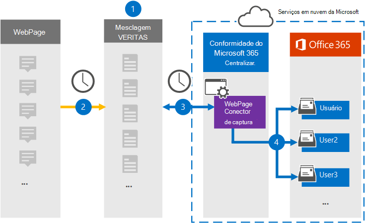

# Configurar um conector para arquivar dados da página da Web

Use um conector Globanet no centro de conformidade da Microsoft 365 para importar e arquivar dados de páginas da Web para caixas de correio do usuário na sua organização do Microsoft 365. O Globanet fornece um conector de [captura de página da Web](https://globanet.com/webpage-capture) que captura páginas da Web específicas (e quaisquer links nessas páginas) em um site específico ou em um domínio inteiro. O conector converte o conteúdo da página da Web em um formato de arquivo PDF, PNG ou personalizado e anexa os arquivos convertidos a uma mensagem de email e, em seguida, importa esses itens de email para caixas de correio do usuário no Microsoft 365.

Após o conteúdo da página da Web ser armazenado nas caixas de correio do usuário, você pode aplicar recursos de conformidade do Microsoft 365, como retenção de litígio, descoberta eletrônica e políticas de retenção e rótulos de retenção. O uso de um conector de captura de página da Web para importar e arquivar dados no Microsoft 365 pode ajudar sua organização a se manter em conformidade com as políticas governamentais e regulamentares.

## Visão geral do arquivamento de dados da página da Web

A visão geral a seguir explica o processo de usar um conector para arquivar o conteúdo da página da Web no Microsoft 365.

1. Sua organização trabalha com a fonte da página da Web para configurar e configurar um site de captura de página da Web.

2. Uma vez a cada 24 horas, os itens de fontes da página da Web são copiados para o site do Globanet Merge1. O conector também converte e anexa o conteúdo de uma página da Web a uma mensagem de email.

3. O conector de captura de página da Web que você cria no centro de conformidade da Microsoft 365, conecta-se ao site do Globanet Merge1 todos os dias e transfere os itens da página da Web para um local seguro de armazenamento do Azure na nuvem da Microsoft.

4. O conector importa os itens da página da Web convertidos para as caixas de correio de usuários específicos usando o valor da propriedade *email* do mapeamento de usuário automático, conforme descrito na [etapa 3](#step-3-map-users-and-complete-the-connector-setup). Uma subpasta na pasta caixa de entrada chamada **webpage Capture** é criada nas caixas de correio do usuário e os itens da página da Web são importados para essa pasta. O conector faz isso usando o valor da propriedade *email* . Cada item da página da Web contém essa propriedade, que é preenchida com os endereços de email fornecidos quando você configura o conector de captura da página da Web na [etapa 2](#step-2-configure-the-webpage-capture-connector-on-the-globanet-merge1-site).

## Antes de começar

- Crie uma conta do Merge1 do Globanet para conectores da Microsoft. Para criar essa conta, entre em contato com o [suporte ao cliente Globanet](https://globanet.com/ms-connectors-contact/). Você entrará nesta conta quando criar o conector na etapa 1.

- Você precisa trabalhar com o suporte do Globanet para configurar um formato de arquivo personalizado para converter os itens da página da Web. Para obter mais informações, consulte o guia do usuário do Merge1 conectores de terceiros no 

- O usuário que cria o conector de captura da página da Web na etapa 1 (e conclui-lo na etapa 3) deve ser atribuído à função de exportação de importação de caixa de correio no Exchange Online. Essa função é necessária para adicionar conectores na página **conectores de dados** no centro de conformidade da Microsoft 365. Por padrão, essa função não é atribuída a um grupo de função no Exchange Online. Você pode adicionar a função de exportação de importação de caixa de correio ao grupo de funções Gerenciamento da organização no Exchange Online. Ou você pode criar um grupo de função, atribua a função de exportação de importação de caixa de correio e, em seguida, adicione os usuários apropriados como membros. Para obter mais informações, consulte as seções [criar grupos de função](https://docs.microsoft.com/Exchange/permissions-exo/role-groups#create-role-groups) ou [modificar grupos de função](https://docs.microsoft.com/Exchange/permissions-exo/role-groups#modify-role-groups) no artigo "gerenciar grupos de função no Exchange Online".

## Etapa 1: configurar o conector de captura da página da Web

A primeira etapa é acessar os **conectores de dados** e criar um conector para dados de origem da página da Web.

1. Vá para [https://compliance.microsoft.com](https://compliance.microsoft.com/) e, em seguida, clique em  >  **captura da página** de conectores de dados.

2. Na página descrição do produto de **captura de página da Web** , clique em **Adicionar conector**.

3. Na página **termos de serviço** , clique em **aceitar**.

4. Insira um nome exclusivo que identifique o conector e clique em **Avançar**.

5. Entre em sua conta do Merge1 para configurar o conector.

## Etapa 2: configurar o conector de captura da página da Web no site do Globanet Merge1

A segunda etapa é configurar o conector de captura de página da Web no site do Globanet Merge1. Para obter informações sobre como configurar o conector de captura de página da Web, consulte [Merge1 do usuário de conectores de terceiros](https://docs.ms.merge1.globanetportal.com/Merge1%20Third-Party%20Connectors%20Web%20Page%20Capture%20User%20Guide%20.pdf).

Depois de clicar em **salvar & concluir**, a página **mapeamento de usuário** no assistente de conector no centro de conformidade da Microsoft 365 é exibida.

## Etapa 3: mapear usuários e concluir a configuração do conector

Para mapear usuários e concluir a configuração do conector no centro de conformidade do Microsoft 365, siga as etapas abaixo:

1. Na página **mapear usuários de captura de página da Web para usuários do Microsoft 365** , habilite o mapeamento de usuário automático. Os itens de captura da página da Web incluem uma propriedade chamada *email*, que contém endereços de email para usuários em sua organização. Se o conector puder associar esse endereço a um usuário do Microsoft 365, os itens serão importados para a caixa de correio desse usuário.

2. Clique em **Avançar**, revise suas configurações e vá para a página **conectores de dados** para ver o andamento do processo de importação para o novo conector.

## Etapa 4: monitorar o conector de captura da página da Web

Depois de criar o conector de captura de página da Web, você pode visualizar o status do conector no centro de conformidade da Microsoft 365.

1. Vá para [https://compliance.microsoft.com](https://compliance.microsoft.com) e clique em **conectores de dados** no painel de navegação esquerdo.

2. Clique na guia **conectores** e selecione o conector de **captura de página da Web** para exibir a página de menu. Esta página contém as propriedades e as informações sobre o conector.

3. Em **status do conector com origem**, clique no link **baixar log** para abrir (ou salvar) o log de status do conector. Esse log contém dados que foram importados para a nuvem da Microsoft.

## Problemas conhecidos

- No momento, não há suporte para importar anexos ou itens com mais de 10 MB. O suporte para itens maiores estará disponível em uma data posterior.
