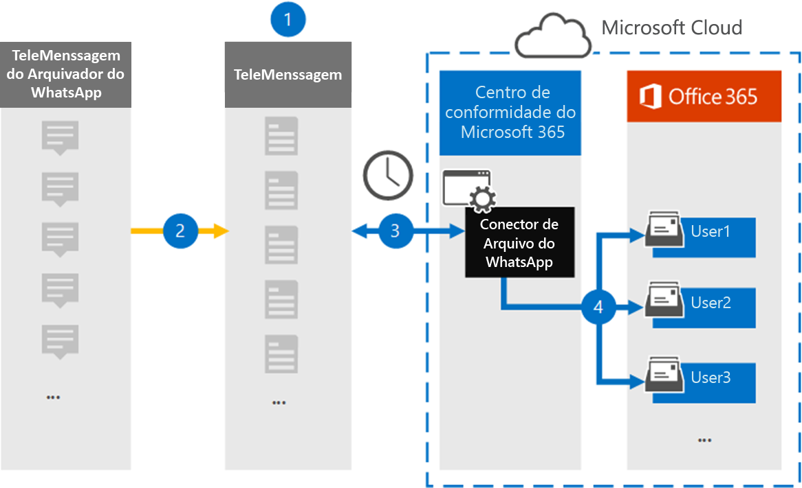

# Configurar um conector para arquivar dados de WhatsAppSet up a connector to archive WhatsApp data

Use o conector de Telemensagem no centro de conformidade da Microsoft 365 para importar e arquivar chamadas, chats, anexos, arquivos e mensagens excluídas do WhatsApp.Use the TeleMessage connector in the Microsoft 365 compliance center to import and archive WhatsApp calls, chats, attachments, files, and deleted messages. Depois de configurar e configurar um conector, ele se conecta à conta de Telemensagem de sua organização uma vez por dia e importa a comunicação móvel de funcionários usando o WhatsApp Phone Archiver ou telemessage WhatsApp Cloud Archiver para caixas de correio no Microsoft 365.After you set up and configure a connector, it connects to your organization's TeleMessage account once every day, and imports the mobile communication of employees using the TeleMessage WhatsApp Phone Archiver or TeleMessage WhatsApp Cloud Archiver to mailboxes in Microsoft 365.

Depois que os dados do WhatsApp são armazenados nas caixas de correio do usuário, você pode aplicar recursos de conformidade do Microsoft 365, como retenção de litígio, pesquisa de conteúdo e políticas de retenção do Microsoft 365 a dados do WhatsApp.After WhatsApp data is stored in user mailboxes, you can apply Microsoft 365 compliance features such as Litigation Hold, Content Search, and Microsoft 365 retention policies to WhatsApp data. Por exemplo, você pode pesquisar mensagens do WhatsApp usando a pesquisa de conteúdo ou associar a caixa de correio que contém as mensagens do WhatsApp a um funcionário em uma ocorrência de descoberta eletrônica avançada.For example, you can search WhatsApp messages using Content Search or associate the mailbox that contains WhatsApp messages with a custodian in an Advanced eDiscovery case. O uso de um conector WhatsApp para importar e arquivar dados no Microsoft 365 pode ajudar sua organização a se manter em conformidade com as políticas governamentais e regulamentares.Using a WhatsApp connector to import and archive data in Microsoft 365 can help your organization stay compliant with government and regulatory policies.

## Visão geral do arquivamento de dados do WhatsAppOverview of archiving WhatsApp data

A visão geral a seguir explica o processo de usar um conector para arquivar dados do WhatsApp no Microsoft 365.The following overview explains the process of using a connector to archive WhatsApp data in Microsoft 365.

1. Sua organização funciona com telemessage para configurar um conector do Archiver do WhatsApp.Your organization works with TeleMessage to set up a WhatsApp Archiver connector. Para obter mais informações, consulte [WhatsApp Archiver](https://www.telemessage.com/office365-activation-for-whatsapp-archiver).For more information, see [WhatsApp Archiver](https://www.telemessage.com/office365-activation-for-whatsapp-archiver).

2. Uma vez a cada 24 horas, os dados de WhatsApp da sua organização são copiados para o site de Telemensagem.Once every 24 hours, your organization’s WhatsApp data is copied to the TeleMessage site.

3. O conector WhatsApp que você cria no centro de conformidade da Microsoft 365 se conecta ao site de Telemensagem todos os dias e transfere os dados do WhatsApp das últimas 24 horas para um local seguro de armazenamento do Azure na nuvem da Microsoft.The WhatsApp connector that you create in the Microsoft 365 compliance center connects to the TeleMessage site every day and transfers WhatsApp data from the previous 24 hours to a secure Azure Storage location in the Microsoft Cloud. O conector também converte os dados de WhatsApp de conteúdo em um formato de mensagem de email.The connector also converts the content WhatsApp data to an email message format.

4. O conector importa dados de WhatsApp para a caixa de correio de um usuário específico.The connector imports WhatsApp data to the mailbox of a specific user. Uma nova pasta chamada **WhatsApp Archiver** é criada na caixa de correio do usuário específico e os itens são importados para ela.A new folder named **WhatsApp Archiver** is created in the specific user's mailbox and the items are imported to it. O conector faz esse mapeamento usando o valor da propriedade de *endereço de email do usuário* .The connector does this mapping by using the value of the *User’s Email address* property. Cada mensagem de WhatsApp contém essa propriedade, que é preenchida com o endereço de email de cada participante da mensagem.Every WhatsApp message contains this property, which is populated with the email address of every participant of the message.

   Além do mapeamento automático de usuários usando o valor da propriedade de *endereço de email do usuário* , você também pode implementar o mapeamento personalizado carregando um arquivo de mapeamento CSV.In addition to automatic user mapping using the value of the *User’s Email address* property, you can also implement custom mapping by uploading a CSV mapping file. Este arquivo de mapeamento contém o número de telefone celular e o endereço de email correspondente do Microsoft 365 para usuários em sua organização.This mapping file contains the mobile phone number and corresponding Microsoft 365 email address for users in your organization. Se você habilitar o mapeamento de usuário automático e o mapeamento personalizado, para cada item do WhatsApp, o conector examinará primeiro o arquivo de mapeamento personalizado.If you enable both automatic user mapping and custom mapping, for every WhatsApp item the connector first looks at custom mapping file. Se não encontrar um usuário válido do Microsoft 365 que corresponda ao número de telefone celular de um usuário, o conector usará os valores na propriedade de endereço de email do item que está tentando importar.If it doesn't find a valid Microsoft 365 user that corresponds to a user's mobile phone number, the connector will use the values in the email address property of the item it's trying to import. Se o conector não localizar um usuário válido do Microsoft 365 no arquivo de mapeamento personalizado ou na propriedade de endereço de email do item WhatsApp, o item não será importado.If the connector doesn't find a valid Microsoft 365 user in either the custom mapping file or in the email address property of the WhatsApp item, the item won't be imported.

## Antes de começarBefore you begin

Algumas das etapas de implementação necessárias para arquivar dados de comunicação do WhatsApp são externas para o Microsoft 365 e devem ser concluídas para que você possa criar o conector no centro de conformidade.Some of the implementation steps required to archive WhatsApp communication data are external to Microsoft 365 and must be completed before you can create the connector in the compliance center.

- Solicite o [serviço Archiver do WhatsApp da telemessage](https://www.telemessage.com/mobile-archiver/order-mobile-archiver-for-o365) e obtenha uma conta de administração válida para sua organização.Order the [WhatsApp Archiver service from TeleMessage](https://www.telemessage.com/mobile-archiver/order-mobile-archiver-for-o365) and get a valid administration account for your organization. Você precisará entrar nessa conta quando criar o conector no centro de conformidade.You'll need to sign into this account when you create the connector in the compliance center.

- Registre todos os usuários que exigem arquivamento do WhatsApp na conta de Telemensagem.Register all users that require WhatsApp archiving in the TeleMessage account. Ao registrar usuários, certifique-se de usar o mesmo endereço de email usado para a conta do Microsoft 365.When registering users, be sure to use the same email address that's used for their Microsoft 365 account.

- Instale o [aplicativo WhatsApp Phone Archiver de telefone](https://www.telemessage.com/mobile-archiver/whatsapp-phone-archiver-2/) para telefones celulares de seus funcionários e ative-o.Install the TeleMessage [WhatsApp Phone Archiver app](https://www.telemessage.com/mobile-archiver/whatsapp-phone-archiver-2/) on the mobile phones of your employees and activate it. Como alternativa, você pode instalar os aplicativos de negócios WhatsApp ou WhatsApp regulares nos telefones celulares de seus funcionários e ativar o WhatsApp Cloud Archiver Service examinando um código QR no site de Telemensagem.Alternatively, you can install the regular WhatsApp or WhatsApp Business apps on the mobile phones of your employees and activate the WhatsApp Cloud Archiver service by scanning a QR code on the TeleMessage website. Para obter mais informações, consulte [WhatsApp Cloud archiverr](https://www.telemessage.com/mobile-archiver/whatsapp-archiver/whatsapp-cloud-archiver/).For more information, see [WhatsApp Cloud Archiver](https://www.telemessage.com/mobile-archiver/whatsapp-archiver/whatsapp-cloud-archiver/).

- O usuário que cria um conector de rede Verizon deve ser atribuído à função de exportação de importação de caixa de correio no Exchange Online.The user who creates a Verizon Network connector must be assigned the Mailbox Import Export role in Exchange Online. Isso é necessário para adicionar conectores na página **conectores de dados** no centro de conformidade do Microsoft 365.This is required to add connectors in the **Data connectors** page in the Microsoft 365 compliance center. Por padrão, essa função não é atribuída a nenhum grupo de funções no Exchange Online.By default, this role isn't assigned to any role group in Exchange Online. Você pode adicionar a função de exportação de importação de caixa de correio ao grupo de funções Gerenciamento da organização no Exchange Online.You can add the Mailbox Import Export role to the Organization Management role group in Exchange Online. Ou você pode criar um grupo de função, atribua a função de exportação de importação de caixa de correio e, em seguida, adicione os usuários apropriados como membros.Or you can create a role group, assign the Mailbox Import Export role, and then add the appropriate users as members. Para obter mais informações, consulte as seções [criar grupos de função](https://docs.microsoft.com/Exchange/permissions-exo/role-groups#create-role-groups) ou [modificar grupos de função](https://docs.microsoft.com/Exchange/permissions-exo/role-groups#modify-role-groups) no artigo "gerenciar grupos de função no Exchange Online".For more information, see the [Create role groups](https://docs.microsoft.com/Exchange/permissions-exo/role-groups#create-role-groups) or [Modify role groups](https://docs.microsoft.com/Exchange/permissions-exo/role-groups#modify-role-groups) sections in the article "Manage role groups in Exchange Online".

## Criar um conector Archiver do WhatsAppCreate a WhatsApp Archiver connector

Depois de concluir os pré-requisitos descritos na seção anterior, você pode criar o conector WhatsApp no centro de conformidade do Microsoft 365.After you've completed the prerequisites described in the previous section, you can create the WhatsApp connector in the Microsoft 365 compliance center. O conector usa as informações que você fornece para se conectar ao site de Telemensagem e transferir os dados do WhatsApp para as caixas de correio de usuário correspondentes no Microsoft 365.The connector uses the information you provide to connect to the TeleMessage site and transfer the WhatsApp data to the corresponding user mailbox boxes in Microsoft 365.

1. Vá para [https://compliance.microsoft.com](https://compliance.microsoft.com/) e clique em **Data Connectors**  >  **WhatsApp Archiver**.Go to [https://compliance.microsoft.com](https://compliance.microsoft.com/) and then click **Data connectors** > **WhatsApp Archiver**.

2. Na página descrição do produto **WhatsApp Archiver** , clique em **Adicionar conector**On the **WhatsApp Archiver** product description page, click **Add connector**

3. Na página **termos de serviço** , clique em **aceitar**.On the **Terms of service** page, click **Accept**.

4. Na página **logon na Telemensagem** , em etapa 3, insira as informações necessárias nas caixas a seguir e clique em **Avançar**.On the **Login to TeleMessage** page, under Step 3, enter the required information in the following boxes and then click **Next**.

   - **Nome de usuário:** O nome de usuário de sua mensagem.**Username:** Your TeleMessage username.

   - **Senha:** Sua senha de Telemensagem.**Password:** Your TeleMessage password.

5. Depois que o conector é criado, você pode fechar a janela pop-up e ir para a próxima página.After the connector is created, you can close the pop-up window and go to the next page.

6. Na página **mapeamento de usuário** , habilite mapeamento automático de usuário e clique em **Avançar**.On the **User mapping** page, enable automatic user mapping and click **Next**. Caso você precise de mapeamento personalizado, carregue um arquivo CSV e clique em **Avançar**.In case you need custom mapping upload a CSV file, and click **Next**.

7. Revise suas configurações e clique em **concluir** para criar o conector.Review your settings, and then click **Finish** to create the connector.

8. Vá até a guia conectores na página **conectores de dados** para ver o andamento do processo de importação para o novo conector.Go to the Connectors tab in **Data connectors** page to see the progress of the import process for the new connector.

## Problemas conhecidosKnown issues

- No momento, não há suporte para importar anexos ou itens com mais de 10 MB.At this time, we don't support importing attachments or items that are larger than 10 MB. O suporte para itens maiores estará disponível em uma data posterior.Support for larger items will be available at a later date.
