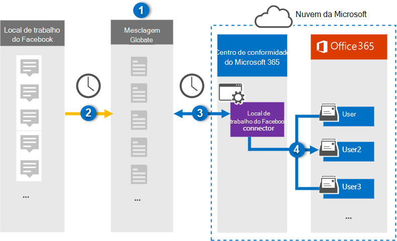

# Configurar um conector para arquivar o local de trabalho de dados do Facebook

Use um conector Globanet no centro de conformidade da Microsoft 365 para importar e arquivar dados do local de trabalho do Facebook para caixas de correio do usuário na sua organização do Microsoft 365. O Globanet fornece um [local de trabalho do conector do Facebook](https://globanet.com/workplace/) que é configurado para capturar itens da fonte de dados de terceiros (regularmente) e importar esses itens para o Microsoft 365. O conector converte o conteúdo como chats, anexos, postagens e vídeos do local de trabalho em um formato de mensagem de email e importa esses itens para caixas de correio do usuário no Microsoft 365.

Após os dados de área de trabalho serem armazenados nas caixas de correio do usuário, você pode aplicar recursos de conformidade do Microsoft 365, como retenção de litígio, descoberta eletrônica, políticas de retenção e rótulos de retenção e conformidade de comunicação. O uso do local de trabalho do conector do Facebook para importar e arquivar dados no Microsoft 365 pode ajudar sua organização a se manter em conformidade com as políticas governamentais e regulamentares.

## Visão geral do arquivamento de local de dados de Facebook

A visão geral a seguir explica o processo de usar um conector para arquivar dados do local de trabalho no Microsoft 365.

1. Sua organização trabalha com o local de trabalho do Facebook para configurar e configurar um site de área de trabalho.

2. Uma vez a cada 24 horas, os itens do local de trabalho são copiados para o site do Globanet Merge1. O conector também converte o conteúdo desses itens em um formato de mensagem de email.

3. O local de trabalho do conector do Facebook que você cria no centro de conformidade da Microsoft 365, conecta-se ao Globanet de Merge1 todos os dias e transfere os itens de área de trabalho para um local seguro de armazenamento do Azure na nuvem da Microsoft.

4. O conector importa os itens convertidos para as caixas de correio de usuários específicos usando o valor da propriedade *email* do mapeamento de usuário automático, conforme descrito na etapa 3. Uma subpasta na pasta caixa de entrada chamada **local de trabalho do Facebook** é criada e os itens de área de trabalho são importados para essa pasta. O conector faz isso usando o valor da propriedade *email* . Cada item de área de trabalho contém essa propriedade, que é preenchida com o endereço de email de cada chat ou participante de postagem.

## Antes de começar

- Crie uma conta do Merge1 do Globanet para conectores da Microsoft. Para fazer isso, entre em contato com o [suporte ao cliente Globanet](https://globanet.com/ms-connectors-contact). Você precisa entrar nessa conta ao criar o conector na etapa 1.

- Criar uma integração personalizada em https://my.workplace.com/work/admin/apps/ para recuperar dados do local de trabalho via APIs para fins de conformidade e descoberta eletrônica.

   Ao criar a integração, a plataforma de área de trabalho gera um conjunto de credenciais exclusivas usadas para gerar tokens que são usados para autenticação. Esses tokens são usados no local de trabalho do assistente de configuração do conector do Facebook na etapa 2. Para obter instruções passo a passo sobre como criar os aplicativos, consulte [Merge1 do usuário de conectores de terceiros](https://docs.ms.merge1.globanetportal.com/Merge1%20Third-Party%20Connectors%20Workplace%20from%20Facebook%20User%20Guide%20.pdf).

- O usuário que cria o local de trabalho do conector do Facebook na etapa 1 (e conclui-lo na etapa 3) deve ser atribuído à função de exportação de importação de caixa de correio no Exchange Online. Essa função é necessária para adicionar conectores na página **conectores de dados** no centro de conformidade da Microsoft 365. Por padrão, essa função não é atribuída a nenhum grupo de função no Exchange Online. Você pode adicionar a função de exportação de importação de caixa de correio ao grupo de funções Gerenciamento da organização no Exchange Online. Ou você pode criar um grupo de função, atribua a função de exportação de importação de caixa de correio e, em seguida, adicione os usuários apropriados como membros. Para obter mais informações, consulte as seções [criar grupos de função](https://docs.microsoft.com/Exchange/permissions-exo/role-groups#create-role-groups) ou [modificar grupos de função](https://docs.microsoft.com/Exchange/permissions-exo/role-groups#modify-role-groups) no artigo "gerenciar grupos de função no Exchange Online".

## Etapa 1: configurar o local de trabalho do conector do Facebook

A primeira etapa é acessar a página **conectores de dados** no centro de conformidade da Microsoft 365 e criar um conector para dados de área de trabalho.

1. Vá para [https://compliance.microsoft.com](https://compliance.microsoft.com/) e clique em local do **Data Connectors**  >  **no Facebook**.

2. Na página **local de descrição do produto do Facebook** , clique em **Adicionar conector**.

3. Na página **termos de serviço** , clique em **aceitar**.

4. Insira um nome exclusivo que identifique o conector e clique em **Avançar**.

5. Entre em sua conta do Merge1 para configurar o conector.

## Etapa 2: configurar o local de trabalho do Facebook Connector no site do Globanet Merge1

A segunda etapa é configurar o local de trabalho do conector do Facebook no site do Merge1. Para obter informações sobre como configurar o local de trabalho no Facebook Connector, consulte [Merge1 de terceiros](https://docs.ms.merge1.globanetportal.com/Merge1%20Third-Party%20Connectors%20Workplace%20from%20Facebook%20User%20Guide%20.pdf).

Após clicar em **salvar & concluir**, você será direcionado para o centro de conformidade da Microsoft 365, para a página **mapeamento de usuário** no assistente de conector.

## Etapa 3: mapear usuários e concluir a configuração do conector

Para mapear usuários e concluir a configuração do conector no centro de conformidade do Microsoft 365, siga estas etapas:

1. Na página **mapear usuários externos para usuários do Microsoft 365** , habilite o mapeamento automático do usuário. Os itens de área de trabalho incluem uma propriedade chamada *email* que contém endereços de email para usuários em sua organização. Se o conector puder associar esse endereço a um usuário do Microsoft 365, os itens serão importados para a caixa de correio desse usuário.

2. Na página **consentimento do administrador** , clique em **fornecer consentimento**. Você será redirecionado para o site da Microsoft. Clique em **aceitar** para fornecer o consentimento.
  
   Sua organização deve dar o consentimento para permitir que o serviço de importação do Office 365 acesse dados de caixa de correio em sua organização. Para fornecer o consentimento do administrador, você deve estar conectado com as credenciais de um administrador global do Microsoft 365 e aceitar a solicitação de consentimento. Se você não estiver conectado como um administrador global, poderá ir para [esta página](https://login.microsoftonline.com/common/oauth2/authorize?client_id=570d0bec-d001-4c4e-985e-3ab17fdc3073&response_type=code&redirect_uri=https://portal.azure.com/&nonce=1234&prompt=admin_consent) e entrar usando as credenciais de administrador global para aceitar a solicitação.

3. Clique em **Avançar**, revise suas configurações e vá para a página **conectores de dados** para ver o andamento do processo de importação para o novo conector.

## Etapa 4: monitorar o local de trabalho do conector do Facebook

Depois de criar o local de trabalho do conector do Facebook, você pode exibir o status do conector no centro de conformidade da Microsoft 365.

1. Vá para [https://compliance.microsoft.com](https://compliance.microsoft.com) e clique em **conectores de dados** no painel de navegação esquerdo.

2. Clique na guia **conectores** e selecione o **local de trabalho do eRoom** Connector para exibir a página de menu suspenso, que contém as propriedades e informações sobre o conector.

3. Em **status do conector com origem**, clique no link **baixar log** para abrir (ou salvar) o log de status do conector. Esse log contém informações sobre os dados que foram importados para a nuvem da Microsoft.

## Problemas conhecidos

- No momento, não há suporte para importar anexos ou itens com mais de 10 MB. O suporte para itens maiores estará disponível em uma data posterior.
