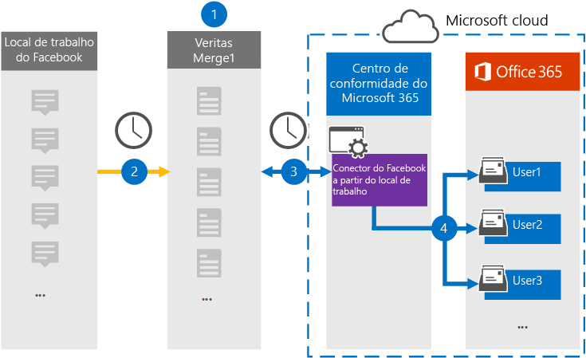

# Configurar um conector para arquivar o local de trabalho a partir de dados do FacebookSet up a connector to archive Workplace from Facebook data

Use um conector Veritas no centro de conformidade Microsoft 365 para importar e arquivar dados do Workplace do Facebook para as caixas de correio do usuário em sua Microsoft 365 organização.Use a Veritas connector in the Microsoft 365 compliance center to import and archive data from Workplace from Facebook to user mailboxes in your Microsoft 365 organization. A Veritas fornece um workplace do conector do [Facebook](https://globanet.com/workplace/) configurado para capturar itens da fonte de dados de terceiros (regularmente) e importar esses itens para Microsoft 365.Veritas provides a [Workplace from Facebook](https://globanet.com/workplace/) connector that is configured to capture items from the third-party data source (on a regular basis) and import those items to Microsoft 365. O conector converte o conteúdo como chats, anexos, postagens e vídeos do Workplace em um formato de mensagem de email e importa esses itens para caixas de correio de usuário em Microsoft 365.The connector converts the content such as chats, attachments, posts, and videos from Workplace to an email message format and then imports those items to user mailboxes in Microsoft 365.

Depois que os dados de local de trabalho são armazenados em caixas de correio de usuário, você pode aplicar Microsoft 365 de conformidade, como Retenção de Litígio, Descoberta Eletrônico, políticas de retenção e rótulos de retenção e conformidade de comunicação.After Workplace data is stored in user mailboxes, you can apply Microsoft 365 compliance features such as Litigation Hold, eDiscovery, retention policies and retention labels, and communication compliance. Usar o Workplace from Facebook connector to import and archive data in Microsoft 365 can help your organization stay compliance with government and regulatory policies.Using Workplace from Facebook connector to import and archive data in Microsoft 365 can help your organization stay compliant with government and regulatory policies.

## Visão geral do arquivamento do Local de Trabalho a partir de dados do FacebookOverview of archiving Workplace from Facebook data

A visão geral a seguir explica o processo de uso de um conector para arquivar dados de local de trabalho em Microsoft 365.The following overview explains the process of using a connector to archive Workplace data in Microsoft 365.

1. Sua organização trabalha com o Workplace a partir do Facebook para configurar e configurar um site do Workplace.Your organization works with Workplace from Facebook to set up and configure a Workplace site.

2. Uma vez a cada 24 horas, os itens do Workplace são copiados para o site Veritas Merge1.Once every 24 hours, items from Workplace are copied to the Veritas Merge1 site. O conector também converte o conteúdo desses itens em um formato de mensagem de email.The connector also converts the content of these items to an email message format.

3. O workplace from Facebook connector that you create in the Microsoft 365 compliance center, connects to the Veritas Merge1 every day, and transfers the Workplace items to a secure Azure Armazenamento location in the Microsoft cloud.The Workplace from Facebook connector that you create in the Microsoft 365 compliance center, connects to the Veritas Merge1 every day, and transfers the Workplace items to a secure Azure Storage location in the Microsoft cloud.

4. O conector importa os itens convertidos para as caixas de correio de usuários específicos usando o valor da propriedade *Email* do mapeamento automático do usuário, conforme descrito na Etapa 3.The connector imports the converted items to the mailboxes of specific users using the value of the *Email* property of the automatic user mapping as described in Step 3. Uma subpasta na pasta Caixa de Entrada chamada **Workplace from Facebook** é criada e os itens workplace são importados para essa pasta.A subfolder in the Inbox folder named **Workplace from Facebook** is created, and the Workplace items are imported to that folder. O conector faz isso usando o valor da *propriedade Email.*The connector does this by using the value of the *Email* property. Cada item workplace contém essa propriedade, que é preenchida com o endereço de email de cada participante de chat ou postagem.Every Workplace item contains this property, which is populated with the email address of every chat or post participant.

## Antes de começarBefore you begin

- Crie uma conta Veritas Merge1 para conectores da Microsoft.Create a Veritas Merge1 account for Microsoft connectors. Para criar essa conta, entre em contato com [o Suporte ao Cliente veritas.](https://globanet.com/ms-connectors-contact)To create this account, contact [Veritas Customer Support](https://globanet.com/ms-connectors-contact). Você entrará nessa conta quando criar o conector na Etapa 1.You will sign into this account when you create the connector in Step 1.

- Crie uma integração personalizada para recuperar dados do Workplace por meio de APIs para fins https://my.workplace.com/work/admin/apps/ de conformidade e Descoberta.Create a custom integration at https://my.workplace.com/work/admin/apps/ to retrieve data from Workplace via APIs for compliance and eDiscovery purposes.

   Ao criar a integração, a plataforma Workplace gera um conjunto de credenciais exclusivas usadas para gerar tokens usados para autenticação.When creating the integration, the Workplace platform generates a set of unique credentials used to generate tokens that are used for authentication. Esses tokens são usados no Assistente de configuração do Conector do Facebook no Workplace na Etapa 2.These tokens are used in the Workplace from Facebook connector configuration wizard in Step 2. Para obter instruções passo a passo sobre como criar os aplicativos, consulte [Merge1 Third-Party Connectors User Guide](https://docs.ms.merge1.globanetportal.com/Merge1%20Third-Party%20Connectors%20Workplace%20from%20Facebook%20User%20Guide%20.pdf).For step-by step instructions about how to create the applications, see [Merge1 Third-Party Connectors User Guide](https://docs.ms.merge1.globanetportal.com/Merge1%20Third-Party%20Connectors%20Workplace%20from%20Facebook%20User%20Guide%20.pdf).

- O usuário que cria o Workplace a partir do conector do Facebook na Etapa 1 (e o conclui na Etapa 3) deve ser atribuído à função de Exportação de Importação de Caixa de Correio no Exchange Online.The user who creates the Workplace from Facebook connector in Step 1 (and completes it in Step 3) must be assigned to the Mailbox Import Export role in Exchange Online. Essa função é necessária para adicionar conectores na página **Conectores** de dados no Microsoft 365 de conformidade.This role is required to add connectors on the **Data connectors** page in the Microsoft 365 compliance center. Por padrão, essa função não é atribuída a um grupo de funções no Exchange Online.By default, this role is not assigned to a role group in Exchange Online. Você pode adicionar a função Exportar Importação de Importação de Caixa de Correio ao grupo de função Gerenciamento da Organização Exchange Online.You can add the Mailbox Import Export role to the Organization Management role group in Exchange Online. Ou você pode criar um grupo de funções, atribuir a função Exportar Importação de Caixa de Correio e adicionar os usuários apropriados como membros.Or you can create a role group, assign the Mailbox Import Export role, and then add the appropriate users as members. Para obter mais informações, consulte as seções Criar grupos de [função](/Exchange/permissions-exo/role-groups#create-role-groups) ou [Modificar](/Exchange/permissions-exo/role-groups#modify-role-groups) grupos de função no artigo "Gerenciar grupos de funções em Exchange Online".For more information, see the [Create role groups](/Exchange/permissions-exo/role-groups#create-role-groups) or [Modify role groups](/Exchange/permissions-exo/role-groups#modify-role-groups) sections in the article "Manage role groups in Exchange Online".

## Etapa 1: Configurar o Local de Trabalho a partir do conector do FacebookStep 1: Set up the Workplace from Facebook connector

A primeira etapa é acessar a página **Conectores** de Dados no centro de conformidade Microsoft 365 e criar um conector para dados do local de trabalho.The first step is to access to the **Data Connectors** page in the Microsoft 365 compliance center and create a connector for Workplace data.

1. Vá até [https://compliance.microsoft.com](https://compliance.microsoft.com/) e clique em **Conectores de** dados  >  **Local de trabalho do Facebook**.Go to [https://compliance.microsoft.com](https://compliance.microsoft.com/) and then click **Data connectors** > **Workplace from Facebook**.

2. Na página **Local de Trabalho a partir da descrição** do produto do Facebook, clique em Adicionar **conector**.On the **Workplace from Facebook** product description page, click **Add connector**.

3. Na página **Termos de serviço,** clique em **Aceitar**.On the **Terms of service** page, click **Accept**.

4. Insira um nome exclusivo que identifique o conector e clique em **Próximo**.Enter a unique name that identifies the connector, and then click **Next**.

5. Entre na sua conta Merge1 para configurar o conector.Sign in to your Merge1 account to configure the connector.

## Etapa 2: Configurar o Local de Trabalho a partir do conector do Facebook no site Veritas Merge1Step 2: Configure the Workplace from Facebook connector on the Veritas Merge1 site

A segunda etapa é configurar o Workplace a partir do conector do Facebook no site Merge1.The second step is to configure the Workplace from Facebook connector on the Merge1 site. Para obter informações sobre como configurar o Workplace a partir do conector do Facebook, consulte [Merge1 Third-Party Connectors User Guide](https://docs.ms.merge1.globanetportal.com/Merge1%20Third-Party%20Connectors%20Workplace%20from%20Facebook%20User%20Guide%20.pdf).For information about how to configure the Workplace from Facebook connector, see [Merge1 Third-Party Connectors User Guide](https://docs.ms.merge1.globanetportal.com/Merge1%20Third-Party%20Connectors%20Workplace%20from%20Facebook%20User%20Guide%20.pdf).

Depois de clicar em Salvar &  **Concluir**, a página de mapeamento do usuário no assistente de conector no Microsoft 365 de conformidade será exibida.After you click **Save & Finish**, the **User mapping** page in the connector wizard in the Microsoft 365 compliance center is displayed.

## Etapa 3: mapear usuários e concluir a configuração do conectorStep 3: Map users and complete the connector setup

Para mapear usuários e concluir a instalação do conector no centro de conformidade Microsoft 365, siga estas etapas:To map users and complete the connector setup in the Microsoft 365 compliance center, follow these steps:

1. Na página **Mapear usuários externos para Microsoft 365 usuários,** habilita o mapeamento automático do usuário.On the **Map external users to Microsoft 365 users** page, enable automatic user mapping. Os itens workplace incluem uma propriedade chamada *Email* que contém endereços de email para usuários em sua organização.The Workplace items include a property called *Email* that contains email addresses for users in your organization. Se o conector puder associar esse endereço a um Microsoft 365 usuário, os itens serão importados para a caixa de correio desse usuário.If the connector can associate this address with a Microsoft 365 user, the items are imported to that user’s mailbox.

2. Clique **em Avançar**, revise suas configurações e vá para a página Conectores de dados para ver o andamento do processo de importação do novo conector. Click **Next**, review your settings, and then go to the **Data connectors** page to see the progress of the import process for the new connector.

## Etapa 4: Monitorar o Local de Trabalho a partir do conector do FacebookStep 4: Monitor the Workplace from Facebook connector

Depois de criar o Workplace a partir do conector do Facebook, você poderá exibir o status do conector no centro Microsoft 365 conformidade.After you create the Workplace from Facebook connector, you can view the connector status in the Microsoft 365 compliance center.

1. Vá para [https://compliance.microsoft.com](https://compliance.microsoft.com) e clique **em Conectores de dados** na nav esquerda.Go to [https://compliance.microsoft.com](https://compliance.microsoft.com) and click **Data connectors** in the left nav.

2. Clique na **guia Conectores** e selecione o local de trabalho no **conector do Facebook** para exibir a página de sobrevoo.Click the **Connectors** tab and then select the **Workplace from Facebook** connector to display the flyout page. Esta página contém as propriedades e informações sobre o conector.This page contains the properties and information about the connector.

3. Em **Status do conector com origem**, clique no link Baixar **log** para abrir (ou salvar) o log de status do conector.Under **Connector status with source**, click the **Download log** link to open (or save) the status log for the connector. Esse log contém informações sobre os dados que foram importados para a nuvem da Microsoft.This log contains information about the data that has been imported to the Microsoft cloud.

## Problemas conhecidosKnown issues

- Neste momento, não há suporte para importação de anexos ou itens maiores que 10 MB.At this time, we don't support importing attachments or items that are larger than 10 MB. O suporte para itens maiores estará disponível posteriormente.Support for larger items will be available at a later date.