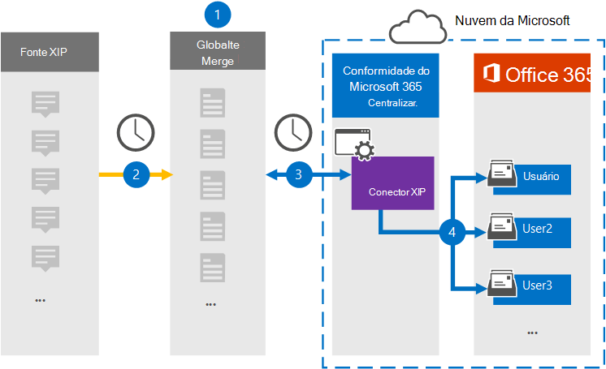

# Configurar um conector para arquivar dados de origem de XIP (visualização)Set up a connector to archive XIP source data (preview)

Use um conector Globanet no centro de conformidade da Microsoft 365 para importar e arquivar dados da plataforma de origem de XIP para caixas de correio do usuário na sua organização do Microsoft 365.Use a Globanet connector in the Microsoft 365 compliance center to import and archive data from the XIP source platform to user mailboxes in your Microsoft 365 organization. O Globanet fornece um conector [xip](https://globanet.com/xip/) que permite o uso de um arquivo xip para importar itens para o Microsoft 365.Globanet provides a [XIP](https://globanet.com/xip/) connector that allows using an XIP file to import items to Microsoft 365. Um arquivo XIP é semelhante a um arquivo ZIP, mas permite que uma assinatura digital seja usada.An XIP file is similar to a ZIP file, but allows for a digital signature to be used. A assinatura digital é verificada pela mesclagem 1 do Globanet antes de o arquivo de origem XIP ser extraído.The digital signature is verified by the Globanet Merge 1 before the XIP source file is extracted. O conector converte o conteúdo do arquivo de origem XIP em um formato de mensagem de email e, em seguida, importa esses itens para a caixa de correio do usuário no Microsoft 365.The connector converts the content from the XIP source file to an email message format and then imports those items to the user's mailbox in Microsoft 365.

Após os dados de origem de XIP serem armazenados nas caixas de correio do usuário, você pode aplicar recursos de conformidade do Microsoft 365, como retenção de litígio, descoberta eletrônica, políticas de retenção e rótulos de retenção e conformidade de comunicação.After XIP source data is stored in user mailboxes, you can apply Microsoft 365 compliance features such as Litigation Hold, eDiscovery, retention policies and retention labels, and communication compliance. O uso de um conector de XIP para importar e arquivar dados no Microsoft 365 pode ajudar sua organização a se manter em conformidade com as políticas governamentais e regulamentares.Using an XIP connector to import and archive data in Microsoft 365 can help your organization stay compliant with government and regulatory policies.

## Visão geral do arquivamento dos dados de origem de XIPOverview of archiving the XIP source data

A visão geral a seguir explica o processo de usar um conector para arquivar os dados de origem de XIP no Microsoft 365.The following overview explains the process of using a connector to archive the XIP source data in Microsoft 365.

1. Sua organização trabalha com a fonte XIP para configurar e configurar um site de XIP.Your organization works with the XIP source to set up and configure an XIP site.

2. Uma vez a cada 24 horas, os itens de origem de XIP são copiados para o site do Globanet Merge1.Once every 24 hours, XIP source items are copied to the Globanet Merge1 site. O conector também converte o conteúdo em um formato de mensagem de email.The connector also converts the content to an email message format.

3. O conector de XIP que você cria no centro de conformidade da Microsoft 365, conecta-se ao site do Globanet Merge1 todos os dias e transfere as mensagens para um local seguro de armazenamento do Azure na nuvem da Microsoft.The XIP connector that you create in the Microsoft 365 compliance center, connects to the Globanet Merge1 site every day and transfers the messages to a secure Azure Storage location in the Microsoft cloud.

4. O conector importa os itens de mensagem convertidos para as caixas de correio de usuários específicos usando o valor da propriedade *email* do mapeamento de usuário automático, conforme descrito na [etapa 3](#step-3-map-users-and-complete-the-connector-setup).The connector imports the converted message items to the mailboxes of specific users using the value of the *Email* property of the automatic user mapping as described in [Step 3](#step-3-map-users-and-complete-the-connector-setup). Uma subpasta na pasta caixa de entrada chamada **xip** é criada nas caixas de correio do usuário e os itens são importados para essa pasta.A subfolder in the Inbox folder named **XIP** is created in the user mailboxes, and the items are imported to that folder. O conector determina qual caixa de correio para a qual importar itens usando o valor da propriedade *email* .The connector determines which mailbox to import items to by using the value of the *Email* property. Cada item de origem contém essa propriedade, que é preenchida com o endereço de email de cada participante.Every source item contains this property, which is populated with the email address of every participant.

## Antes de começarBefore you begin

- Crie uma conta do Merge1 do Globanet para conectores da Microsoft.Create a Globanet Merge1 account for Microsoft connectors. Para criar uma conta, entre em contato com o [suporte ao cliente Globanet](https://globanet.com/contact-us/).To create an account, contact [Globanet Customer Support](https://globanet.com/contact-us/). Você precisa entrar nessa conta ao criar o conector na etapa 1.You need to sign into this account when you create the connector in Step 1.

- O usuário que cria o conector de XIP na etapa 1 (e conclui-lo na etapa 3) deve ser atribuído à função de exportação de importação de caixa de correio no Exchange Online.The user who creates the XIP connector in Step 1 (and completes it in Step 3) must be assigned to the Mailbox Import Export role in Exchange Online. Essa função é necessária para adicionar conectores na página conectores de dados no centro de conformidade da Microsoft 365.This role is required to add connectors on the Data connectors page in the Microsoft 365 compliance center. Por padrão, essa função não é atribuída a nenhum grupo de função no Exchange Online.By default, this role is not assigned to any role group in Exchange Online. Você pode adicionar a função de exportação de importação de caixa de correio ao grupo de funções Gerenciamento da organização no Exchange Online.You can add the Mailbox Import Export role to the Organization Management role group in Exchange Online. Ou você pode criar um grupo de função, atribua a função de exportação de importação de caixa de correio e, em seguida, adicione os usuários apropriados como membros.Or you can create a role group, assign the Mailbox Import Export role, and then add the appropriate users as members. Para obter mais informações, consulte as seções [criar grupos de função](https://docs.microsoft.com/Exchange/permissions-exo/role-groups#create-role-groups) ou [modificar grupos de função](https://docs.microsoft.com/Exchange/permissions-exo/role-groups#modify-role-groups) no artigo "gerenciar grupos de função no Exchange Online".For more information, see the [Create role groups](https://docs.microsoft.com/Exchange/permissions-exo/role-groups#create-role-groups) or [Modify role groups](https://docs.microsoft.com/Exchange/permissions-exo/role-groups#modify-role-groups) sections in the article "Manage role groups in Exchange Online".

## Etapa 1: configurar o conector de XIPStep 1: Set up the XIP connector

A primeira etapa é acessar a página **conectores de dados** no centro de conformidade do Microsoft365 e criar um conector para os dados de origem de xip.The first step is to access to the **Data Connectors** page in the Microsoft365 compliance center and create a connector for the XIP source data.

1. Vá para [https://compliance.microsoft.com](https://compliance.microsoft.com/) e clique em **conectores de dados** \> **xip**.Go to [https://compliance.microsoft.com](https://compliance.microsoft.com/) and then click **Data connectors** \> **XIP**.

2. Na página de descrição do produto **xip** , clique em **Adicionar novo conector**.On the **XIP** product description page, click **Add new connector**.

3. Na página **termos de serviço** , clique em **aceitar**.On the **Terms of service** page, click **Accept**.

4. Insira um nome exclusivo que identifique o conector e clique em **Avançar**.Enter a unique name that identifies the connector, and then click **Next**.

5. Entre em sua conta do Merge1 para configurar o conector.Sign in to your Merge1 account to configure the connector.

## Etapa 2: configurar o conector de XIP no site do Globanet Merge1Step 2: Configure the XIP connector on the Globanet Merge1 site

A segunda etapa é configurar o conector de XIP no site do Merge1.The second step is to configure the XIP connector on the Merge1 site. Para obter informações sobre como configurar o conector de XIP, consulte [Merge1 do usuário de conectores de terceiros](https://docs.ms.merge1.globanetportal.com/Merge1%20Third-Party%20Connectors%20XIP%20User%20Guide%20.pdf).For information about how to configure the XIP connector, see [Merge1 Third-Party Connectors User Guide](https://docs.ms.merge1.globanetportal.com/Merge1%20Third-Party%20Connectors%20XIP%20User%20Guide%20.pdf).

Depois de clicar em **salvar & concluir** , a página **mapeamento de usuário** no assistente de conector no centro de conformidade da Microsoft 365 é exibida.After you click **Save & Finish** , the **User mapping** page in the connector wizard in the Microsoft 365 compliance center is displayed.

## Etapa 3: mapear usuários e concluir a configuração do conectorStep 3: Map users and complete the connector setup

Para mapear usuários e concluir a configuração do conector, siga estas etapas:To map users and complete the connector setup, follow these steps:

1. Na página **mapear usuários de xip para usuários do Microsoft 365** , habilite o mapeamento automático do usuário.On the **Map XIP users to Microsoft 365 users** page, enable automatic user mapping. Os itens de origem de XIP incluem uma propriedade chamada *email* , que contém endereços de email para usuários em sua organização.The XIP source items include a property called *Email* , which contains email addresses for users in your organization. Se o conector puder associar esse endereço a um usuário do Microsoft 365, os itens serão importados para a caixa de correio desse usuário.If the connector can associate this address with a Microsoft 365 user, the items are imported to that user’s mailbox.

2. Na página **consentimento do administrador** , clique no botão **fornecer consentimento** .On the **Admin Consent** page, click the **Provide Consent** button. Você será redirecionado para o site da Microsoft.You will be redirected to the Microsoft site. Clique em **aceitar** para fornecer o consentimento.Click **Accept** to provide the consent.

   Sua organização deve dar o consentimento para permitir que o serviço de importação do Office 365 acesse dados de caixa de correio em sua organização.Your organization must consent to allow the Office 365 Import service to access mailbox data in your organization. Para fornecer o consentimento do administrador, você deve estar conectado com as credenciais de um administrador global do Microsoft 365 e aceitar a solicitação de consentimento.To provide admin consent, you must be signed in with the credentials of a Microsoft 365 global admin, and then accept the consent request. Se você não estiver conectado como um administrador global, poderá ir para [esta página](https://login.microsoftonline.com/common/oauth2/authorize?client_id=570d0bec-d001-4c4e-985e-3ab17fdc3073&response_type=code&redirect_uri=https://portal.azure.com/&nonce=1234&prompt=admin_consent) e entrar usando as credenciais de administrador global para aceitar a solicitação.If you aren't signed in as a global admin, you can go to [this page](https://login.microsoftonline.com/common/oauth2/authorize?client_id=570d0bec-d001-4c4e-985e-3ab17fdc3073&response_type=code&redirect_uri=https://portal.azure.com/&nonce=1234&prompt=admin_consent) and sign in using global admin credentials to accept the request.

3. Clique em **Avançar** , revise suas configurações e vá para a página **conectores de dados** para ver o andamento do processo de importação para o novo conector.Click **Next** , review your settings, and go to the **Data connectors** page to see the progress of the import process for the new connector.

## Etapa 4: monitorar o conector de XIPStep 4: Monitor the XIP connector

Depois de criar o conector de XIP, você pode visualizar o status do conector no centro de conformidade da Microsoft 365.After you create the XIP connector, you can view the connector status in the Microsoft 365 compliance center.

1. Vá para [https://compliance.microsoft.com](https://compliance.microsoft.com/) e clique em **conectores de dados** no painel de navegação esquerdo.Go to [https://compliance.microsoft.com](https://compliance.microsoft.com/) and click **Data connectors** in the left nav.

2. Clique na guia **conectores** e selecione o conector **xip** para exibir a página de submenu, que contém as propriedades e informações sobre o conector.Click the **Connectors** tab and then select the **XIP** connector to display the flyout page, which contains the properties and information about the connector.

3. Em **status do conector com origem** , clique no link **baixar log** para abrir (ou salvar) o log de status do conector.Under **Connector status with source** , click the **Download log** link to open (or save) the status log for the connector. Esse log contém dados que foram importados para a nuvem da Microsoft.This log contains data that has been imported to the Microsoft cloud.

## Problemas conhecidosKnown issues

- No momento, não há suporte para importar anexos ou itens com mais de 10 MB.At this time, we don't support importing attachments or items that are larger than 10 MB. O suporte para itens maiores estará disponível em uma data posterior.Support for larger items will be available at a later date.
