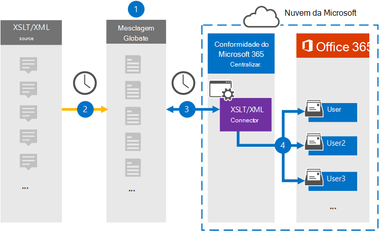

# Configurar um conector para arquivar dados XSLT/XMLSet up a connector to archive XSLT/XML data

Use um conector Globalnet no centro de conformidade do Microsoft 365 para importar e arquivar dados da fonte de página da Web para caixas de correio de usuário em sua organização do Microsoft 365.Use a Globanet connector in the Microsoft 365 compliance center to import and archive data from the Web page source to user mailboxes in your Microsoft 365 organization. A Globalnet fornece um [conector XSLT/XML](https://globanet.com/xslt-xml) que permite o desenvolvimento rápido de arquivos criados usando XSLT (Extensible Style sheet Language Transformations) para transformar arquivos XML em outros formatos de arquivo (como HTML ou texto) que podem ser importados para o Microsoft 365.Globanet provides you with an [XSLT/XML connector](https://globanet.com/xslt-xml) that allows the rapid development of files created by using XSLT (Extensible Style sheet Language Transformations) to transform XML files into other file formats (such as HTML or text) that can be imported to Microsoft 365. O conector converte o conteúdo de um item da fonte XSLT/XML para um formato de mensagem de email e importa o item convertido para caixas de correio do Microsoft 365.The connector converts the content of an item from the XSLT/XML source to an email message format and then imports the converted item to Microsoft 365 mailboxes.

Depois que os dados XSLT/XML são armazenados em caixas de correio de usuário, você pode aplicar recursos de conformidade do Microsoft 365, como Retenção de Litígio, Descoberta Eletrônico e políticas de retenção e rótulos de retenção.After XSLT/XML data is stored in user mailboxes, you can apply Microsoft 365 compliance features such as Litigation Hold, eDiscovery, and retention policies and retention labels. Usar um conector XSLT/XML para importar e arquivar dados no Microsoft 365 pode ajudar sua organização a permanecer em conformidade com políticas governamentais e regulatórias.Using an XSLT/XML connector to import and archive data in Microsoft 365 can help your organization stay compliant with government and regulatory policies.

## Visão geral do arquivamento de dados XSLT/XMLOverview of archiving XSLT/XML data

A visão geral a seguir explica o processo de uso de um conector para arquivar dados de origem XSLT/XML no Microsoft 365.The following overview explains the process of using a connector to archive XSLT/XML source data in Microsoft 365.

1. Sua organização trabalha com a fonte XSLT/XML para configurar e configurar um site XSLT/XML.Your organization works with the XSLT/XML source to set up and configure an XSLT/XML site.

2. Uma vez a cada 24 horas, as mensagens de chat da fonte XSLT/XML são copiadas para o site Globalnet Merge1.Once every 24 hours, chat messages from the XSLT/XML source are copied to the Globanet Merge1 site. O conector também converte o conteúdo em um formato de mensagem de email.The connector also converts the content to an email message format.

3. O conector XSLT/XML que você cria no centro de conformidade do Microsoft 365, se conecta ao site Globalnet Merge1 todos os dias e transfere as mensagens para um local seguro de Armazenamento do Azure na nuvem da Microsoft.The XSLT/XML connector that you create in the Microsoft 365 compliance center, connects to the Globanet Merge1 site every day and transfers the messages to a secure Azure Storage location in the Microsoft cloud.

4. O conector importa os itens de mensagem convertidos para as caixas de correio de usuários específicos usando o valor da propriedade *Email* do mapeamento automático do usuário, conforme descrito na Etapa 3.The connector imports the converted message items to the mailboxes of specific users using the value of the *Email* property of the automatic user mapping as described in Step 3. Uma nova subpasta na pasta Caixa de Entrada chamada **XSLT/XML** é criada nas caixas de correio do usuário e os itens de mensagem são importados para essa pasta.A new subfolder in the Inbox folder named **XSLT/XML** is created in the user mailboxes, and the message items are imported to that folder. O conector faz isso usando o valor da *propriedade Email.*The connector does this by using the value of the *Email* property. Cada mensagem contém essa propriedade, que é preenchida com o endereço de email de cada participante da mensagem.Every message contains this property, which is populated with the email address of every participant of the message.

## Antes de começarBefore you begin

- Crie uma conta Globalnet Merge1 para conectores da Microsoft.Create a Globanet Merge1 account for Microsoft connectors. Para criar essa conta, contate [Globalnet Customer Support](https://globanet.com/contact-us/).To create this account, contact [Globanet Customer Support](https://globanet.com/contact-us/). Você entrará nessa conta quando criar o conector na Etapa 1.You will sign into this account when you create the connector in Step 1.

- O usuário que cria o conector XSLT/XML na Etapa 1 (e o conclui na Etapa 3) deve ser atribuído à função De importação de importação de caixa de correio no Exchange Online.The user who creates the XSLT/XML connector in Step 1 (and completes it in Step 3) must be assigned to the Mailbox Import Export role in Exchange Online. Essa função é necessária para adicionar conectores na página **Conectores de** dados no centro de conformidade do Microsoft 365.This role is required to add connectors on the **Data connectors** page in the Microsoft 365 compliance center. Por padrão, essa função não é atribuída a um grupo de funções no Exchange Online.By default, this role is not assigned to a role group in Exchange Online. Você pode adicionar a função Exportar Importação de Caixa de Correio ao grupo de função Gerenciamento da Organização no Exchange Online.You can add the Mailbox Import Export role to the Organization Management role group in Exchange Online. Ou você pode criar um grupo de funções, atribuir a função Exportar Importação de Caixa de Correio e adicionar os usuários apropriados como membros.Or you can create a role group, assign the Mailbox Import Export role, and then add the appropriate users as members. Para obter mais informações, consulte as seções Criar grupos de [função](/Exchange/permissions-exo/role-groups#create-role-groups) ou [Modificar](/Exchange/permissions-exo/role-groups#modify-role-groups) grupos de função no artigo "Gerenciar grupos de função no Exchange Online".For more information, see the [Create role groups](/Exchange/permissions-exo/role-groups#create-role-groups) or [Modify role groups](/Exchange/permissions-exo/role-groups#modify-role-groups) sections in the article "Manage role groups in Exchange Online".

## Etapa 1: Configurar um conector XSLT/XMLStep 1: Set up an XSLT/XML connector

A primeira etapa é acessar os **Conectores** de Dados no centro de conformidade do Microsoft 365 e criar um conector para dados XSLT/XML.The first step is to access to the **Data Connectors** in the Microsoft 365 compliance center and create a connector for XSLT/XML data.

1. Vá para [https://compliance.microsoft.com](https://compliance.microsoft.com/) e clique em **Conectores de dados**  >  **XSLT/XML.**Go to [https://compliance.microsoft.com](https://compliance.microsoft.com/) and then click **Data connectors** > **XSLT/XML**.

2. Na página **descrição do produto XSLT/XML,** clique **em Adicionar novo conector**.On the **XSLT/XML** product description page, click **Add new connector**.

3. Na página **Termos de serviço,** clique em **Aceitar**.On the **Terms of service** page, click **Accept**.

4. Insira um nome exclusivo que identifique o conector e clique em **Próximo**.Enter a unique name that identifies the connector, and then click **Next**.

5. Entre na sua conta Merge1 para configurar o conector.Sign in to your Merge1 account to configure the connector.

## Etapa 2: Configurar um conector XSLT/XMLStep 2: Configure an XSLT/XML connector

A segunda etapa é configurar o conector XSLT/XML no site Merge1.The second step is to configure the XSLT/XML connector on the Merge1 site. Para obter informações sobre como configurar o conector XSLT/XML no site Globalnet Merge1, consulte [Merge1 Third-Party Connectors User Guide](https://docs.ms.merge1.globanetportal.com/Merge1%20Third-Party%20Connectors%20XSLT-XML%20User%20Guide%20.pdf).For information about how to configure the XSLT/XML connector on the Globanet Merge1 site, see [Merge1 Third-Party Connectors User Guide](https://docs.ms.merge1.globanetportal.com/Merge1%20Third-Party%20Connectors%20XSLT-XML%20User%20Guide%20.pdf).

Depois de clicar em Salvar &  **Concluir**, a página de mapeamento do usuário no assistente de conector no centro de conformidade do Microsoft 365 será exibida.After you click **Save & Finish**, the **User mapping** page in the connector wizard in the Microsoft 365 compliance center is displayed.

## Etapa 3: mapear usuários e concluir a configuração do conectorStep 3: Map users and complete the connector setup

1. Para mapear usuários e concluir a configuração do conector no centro de conformidade do Microsoft 365, siga as etapas abaixo:To map users and complete the connector setup in the Microsoft 365 compliance center, follow the steps below:

2. Na página **Mapear usuários XSLT/XML para usuários do Microsoft 365,** habilita o mapeamento automático do usuário.On the **Map XSLT/XML users to Microsoft 365 users** page, enable automatic user mapping. Os itens XSLT/XML incluem uma propriedade chamada *Email*, que contém endereços de email para usuários em sua organização.The XSLT/XML items include a property called *Email*, which contains email addresses for users in your organization. Se o conector puder associar esse endereço a um usuário do Microsoft 365, os itens serão importados para a caixa de correio desse usuário.If the connector can associate this address with a Microsoft 365 user, the items are imported to that user’s mailbox.

3. Clique **em Avançar,** revise suas configurações e vá até a página **Conectores** de dados para ver o andamento do processo de importação do novo conector.Click **Next**, review your settings, and go to the **Data connectors** page to see the progress of the import process for the new connector.

## Etapa 4: Monitorar o conector XSLT/XMLStep 4: Monitor the XSLT/XML connector

Depois de criar o conector XSLT/XML, você pode exibir o status do conector no centro de conformidade do Microsoft 365.After you create the XSLT/XML connector, you can view the connector status in the Microsoft 365 compliance center.

1. Vá para [https://compliance.microsoft.com](https://compliance.microsoft.com) e clique **em Conectores de dados** na nav esquerda.Go to [https://compliance.microsoft.com](https://compliance.microsoft.com) and click **Data connectors** in the left nav.

2. Clique na **guia Conectores** e selecione o **conector XSLT/XML** para exibir a página de sobrevoo.Click the **Connectors** tab and then select the **XSLT/XML** connector to display the flyout page. Esta página contém as propriedades e informações sobre o conector.This page contains the properties and information about the connector.

3. Em **Status do conector com origem**, clique no link Baixar **log** para abrir (ou salvar) o log de status do conector.Under **Connector status with source**, click the **Download log** link to open (or save) the status log for the connector. Esse log contém dados que foram importados para a nuvem da Microsoft.This log contains data that has been imported to the Microsoft cloud.

## Problemas conhecidosKnown issues

- Neste momento, não há suporte para importação de anexos ou itens maiores que 10 MB.At this time, we don't support importing attachments or items that are larger than 10 MB. O suporte para itens maiores estará disponível posteriormente.Support for larger items will be available at a later date.