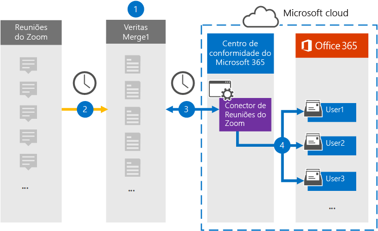

# Configurar um conector para arquivar dados de reuniões de zoom (visualização)

Use um conector Globanet no centro de conformidade da Microsoft 365 para importar e arquivar dados de reuniões de zoom para caixas de correio de usuários na sua organização do Microsoft 365. O Globanet fornece um conector de [reuniões de zoom](https://globanet.com/zoom/) que é configurado para capturar itens da fonte de dados de terceiros (em uma base regular) e importá-los para o Microsoft 365. O conector converte o conteúdo das reuniões (incluindo chats, arquivos gravados e metadados) da conta de reuniões de zoom para um formato de mensagem de email e, em seguida, importa esses itens para caixas de correio do usuário no Microsoft 365.

Após o zoom de dados de reuniões serem armazenados nas caixas de correio do usuário, você pode aplicar recursos de conformidade do Microsoft 365, como retenção de litígio, descoberta eletrônica, políticas de retenção e rótulos de retenção e conformidade de comunicação. O uso de um conector de reuniões de zoom para importar e arquivar dados no Microsoft 365 pode ajudar sua organização a se manter em conformidade com as políticas governamentais e regulamentares.

## Visão geral do arquivamento de dados de reuniões de zoom

A visão geral a seguir explica o processo de usar um conector para arquivar dados de reuniões de zoom no Microsoft 365.

1. Sua organização trabalha com as reuniões de zoom para configurar e configurar um site de reuniões de zoom.

2. Uma vez a cada 24 horas, os itens de reunião de compromissos de zoom são copiados para o site do Globanet Merge1. O conector também converte o conteúdo das reuniões em um formato de mensagem de email.

3. O conector de reuniões de zoom que você cria no centro de conformidade da Microsoft 365, conecta-se ao Globanet Merge1 todos os dias e transfere as mensagens de reunião para um local seguro de armazenamento do Azure na nuvem da Microsoft.

4. O conector importa os itens de reunião convertidos para as caixas de correio de usuários específicos usando o valor da propriedade *email* e o mapeamento de usuário automático, conforme descrito na etapa 3. Uma nova subpasta na pasta caixa de entrada chamada **zoom** de reunião é criada nas caixas de correio do usuário e os itens de reunião são importados para essa pasta. O conector faz isso usando o valor da propriedade *email* . Cada item de reunião contém essa propriedade, que é preenchida com o endereço de email de todos os participantes da reunião.

## Antes de começar

- Crie uma conta do Globanet Merge1 aceitando os termos e condições de um conector de descoberta eletrônica de margem de atraso. Para fazer isso, entre em contato com o [suporte ao cliente Globanet](https://globanet.com/contact-us). Você precisa entrar nessa conta ao criar o conector na etapa 1.

- Obter o nome de usuário e a senha para a conta de negócios ou de zoom da sua organização. Você precisará entrar nesta conta na etapa 2 ao configurar o zoom do conector de reuniões.

- Crie os seguintes aplicativos no [mercado de zoom](https://marketplace.zoom.us):

  - Aplicativo OAuth

  - Aplicativo JWT

  Depois de criar esses aplicativos, a plataforma de zoom gera um conjunto de credenciais exclusivas usadas para gerar os tokens. Esses tokens são usados para autenticar o conector quando se conecta à sua conta de zoom e copia itens para o site do Merge1. Você usará esses tokens ao configurar o conector de zoom na etapa 2.

  Para obter instruções passo a passo sobre como criar os aplicativos OAuth e JWT, confira o [Guia do usuário do Merge1 conectores de terceiros](https://docs.ms.merge1.globanetportal.com/Merge1%20Third-Party%20Connectors%20Zoom%20Meetings%20User%20Guide%20.pdf).

- O usuário que cria o conector de reuniões de zoom na etapa 1 (e conclui-lo na etapa 3) deve ser atribuído à função de exportação de importação de caixa de correio no Exchange Online. Essa função é necessária para adicionar conectores na página **conectores de dados** no centro de conformidade da Microsoft 365. Por padrão, essa função não é atribuída a nenhum grupo de função no Exchange Online. Você pode adicionar a função de exportação de importação de caixa de correio ao grupo de funções Gerenciamento da organização no Exchange Online. Ou você pode criar um grupo de função, atribua a função de exportação de importação de caixa de correio e, em seguida, adicione os usuários apropriados como membros. Para obter mais informações, consulte as seções [criar grupos de função](https://docs.microsoft.com/Exchange/permissions-exo/role-groups#create-role-groups) ou [modificar grupos de função](https://docs.microsoft.com/Exchange/permissions-exo/role-groups#modify-role-groups) no artigo "gerenciar grupos de função no Exchange Online".

## Etapa 1: configurar o zoom do conector de reuniões

A primeira etapa é acessar os **conectores de dados** no centro de conformidade do Microsoft 365 e criar um conector de reuniões com zoom.

1. Vá para [https://compliance.microsoft.com](https://compliance.microsoft.com/) e clique em **conectores de dados**  >  **zoom das reuniões**.

2. Na página descrição do produto de **zoom de reuniões** , clique em **Adicionar conector**.

3. Na página **termos de serviço** , clique em **aceitar**.

4. Insira um nome exclusivo que identifique o conector e clique em **Avançar**.

5. Entre em sua conta do Merge1 para configurar o conector.

## Etapa 2: configurar o zoom do conector de reuniões

A segunda etapa é configurar o conector de reuniões de zoom no site do Merge1. Para obter mais informações sobre como configurar o conector de reuniões de zoom no site do Globanet Merge1, consulte [Merge1 de terceiros conectores do usuário](https://docs.ms.merge1.globanetportal.com/Merge1%20Third-Party%20Connectors%20Zoom%20Meetings%20User%20Guide%20.pdf).

Após clicar em **salvar & concluir**, você será direcionado para o centro de conformidade da Microsoft 365, para a página **mapeamento de usuário** no assistente de conector.

## Etapa 3: mapear usuários e concluir a configuração do conector

1. Na página **mapear usuários externos para usuários do Microsoft 365** , habilite o mapeamento automático do usuário.

   Os itens de zoom de reunião incluem uma propriedade chamada *email* que contém endereços de email para usuários em sua organização. Se o conector puder associar esse endereço a um usuário do Microsoft 365, os itens serão importados para a caixa de correio desse usuário

2. Na página **consentimento do administrador** , clique no botão **fornecer consentimento** . Você será redirecionado para o site da Microsoft. Clique em **aceitar** para fornecer o consentimento.
  
   Sua organização deve dar o consentimento para permitir que o serviço de importação do Office 365 acesse dados de caixa de correio em sua organização. Para fornecer o consentimento do administrador, você deve estar conectado com as credenciais de um administrador global do Microsoft 365 e aceitar a solicitação de consentimento. Se você não estiver conectado como um administrador global, poderá ir para [esta página](https://login.microsoftonline.com/common/oauth2/authorize?client_id=570d0bec-d001-4c4e-985e-3ab17fdc3073&response_type=code&redirect_uri=https://portal.azure.com/&nonce=1234&prompt=admin_consent) e entrar usando as credenciais de administrador global para aceitar a solicitação.

3. Clique em **Avançar**, revise suas configurações e vá para a página **conectores de dados** para ver o andamento do processo de importação para o novo conector.

## Etapa 4: monitorar o zoom no conector de reuniões

Depois de criar o conector de reuniões de zoom, você pode visualizar o status do conector no centro de conformidade da Microsoft 365.

1. Vá para [https://compliance.microsoft.com](https://compliance.microsoft.com) e clique em **conectores de dados** no painel de navegação esquerdo.

2. Clique na guia **conectores** e, em seguida, selecione o conector de **reuniões de zoom** para exibir a página de submenu, que contém as propriedades e informações sobre o conector.

3. Em **status do conector com origem**, clique no link **baixar log** para abrir (ou salvar) o log de status do conector. Esse log contém informações sobre os dados que foram importados para a nuvem da Microsoft.

## Problemas conhecidos

- No momento, não há suporte para a importação de anexos com mais de 10 MB, mas o suporte a itens maiores estará disponível em uma data posterior.

- Para que o conector de reuniões de zoom funcione, você deve habilitar gravações ao configurar as reuniões de zoom.
