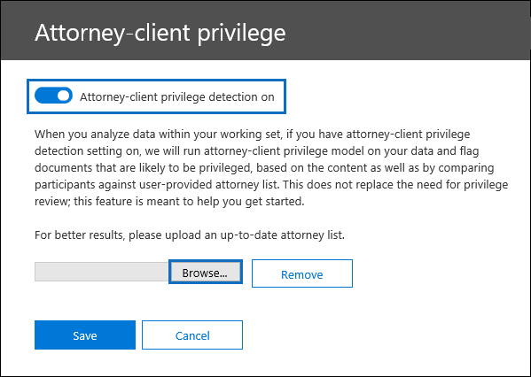

# Configurar a detecção de privilégio advogado-cliente em Advanced eDiscoverySet up attorney-client privilege detection in Advanced eDiscovery

Um aspecto importante e caro da fase de revisão de qualquer processo de Descoberta e é analisar documentos para conteúdo privilegiado.A major and costly aspect of the review phase of any eDiscovery process is reviewing documents for privileged content. Advanced eDiscovery fornece detecção baseada em aprendizado de máquina de conteúdo privilegiado para tornar esse processo mais eficiente.Advanced eDiscovery provides machine learning-based detection of privileged content to make this process more efficient. Esse recurso é chamado de *detecção de privilégio advogado-cliente.*This feature is called *attorney-client privilege detection*.

## Como funciona?How does it work?

Quando a detecção de privilégio advogado-cliente estiver habilitada, todos os documentos em  um conjunto de revisão serão processados pelo modelo de detecção de privilégio advogado-cliente quando você analisar os dados no conjunto de revisão.When attorney-client privilege detection is enabled, all documents in a review set will be processed by the attorney-client privilege detection model when you [analyze the data](analyzing-data-in-review-set.md) in the review set. O modelo procura duas coisas:The model looks for two things:

- Conteúdo privilegiado – O modelo usa o aprendizado de máquina para determinar a probabilidade de que o documento contenha conteúdo legal de natureza.Privileged content – The model uses machine learning to determine the likelihood that the document contains content that is legal in nature.

- Participantes – Como parte da configuração da detecção de privilégio advogado-cliente, você precisa enviar uma lista de advogados para sua organização.Participants – As part of setting up attorney-client privilege detection, you have to submit a list of attorneys for your organization. Em seguida, o modelo compara os participantes do documento com a lista de contatos para determinar se um documento tem pelo menos um participante.The model then compares the participants of the document with the attorney list to determine if a document has at least one attorney participant.

O modelo produz as três propriedades a seguir para cada documento:The model produces the following three properties for every document:

- **AttorneyClientPrivilegeScore:** A probabilidade de o documento ser legal; os valores da pontuação estão entre **0** e **1**.**AttorneyClientPrivilegeScore:** The likelihood the document is legal in nature; the values for the score are between **0** and **1**.

- **HasAttorney:** Essa propriedade será definida como **true** se um dos participantes do documento estiver listado na lista de advogados; caso contrário, o valor é **false**.**HasAttorney:** This property is set to **true** if one of the document participants is listed in the attorney list; otherwise the value is **false**. O valor também será definido como **falso** caso sua organização não tenha carregado uma lista de valores.The value is also set to **false** if your organization didn't upload an attorney list.

- **IsPrivilege:** Essa propriedade será definida como **true** se o valor **de AttorneyClientPrivilegeScore** estiver acima do limite ou se o documento tiver um participante de advogado;  caso contrário, o valor é definido como **false**.**IsPrivilege:** This property is set to **true** if the value for **AttorneyClientPrivilegeScore** is above the threshold *or* if the document has an attorney participant; otherwise the value is set to **false**.

Essas propriedades (e seus valores correspondentes) são adicionadas aos metadados de arquivo dos documentos em um conjunto de revisão, conforme mostrado na captura de tela a seguir:These properties (and their corresponding values) are added to the file metadata of the documents in a review set, as shown in the following screenshot:

Essas três propriedades também podem ser pesquisadas em um conjunto de revisão.These three properties are also searchable within a review set. Para obter mais informações, [consulte Query the data in a review set](review-set-search.md).For more information, see [Query the data in a review set](review-set-search.md).

## Configurar o modelo de detecção de privilégio advogado-clienteSet up the attorney-client privilege detection model

Para habilitar o modelo de detecção de privilégio advogado-cliente, sua organização precisa ative-lo e carregar uma lista de advogados.To enable the attorney-client privilege detection model, your organization has to turn it on and then upload an attorney list.

### Etapa 1: Ativar a detecção de privilégio advogado-clienteStep 1: Turn on attorney-client privilege detection

Uma pessoa que seja um Administrador de Descoberta e Descoberta Na sua organização (membro do subgrupo Administrador de Descoberta e No grupo de funções do Gerenciador de Descobertas E) deve disponibilizar o modelo em seus Advanced eDiscovery de descoberta.A person who is an eDiscovery Administrator in your organization (a member of the eDiscovery Administrator subgroup in the eDiscovery Manager role group) must make the model available in your Advanced eDiscovery cases.

1. No Centro de Conformidade & segurança, acesse **eDiscovery > Advanced eDiscovery**.In the Security & Compliance Center, go to **eDiscovery > Advanced eDiscovery**.

2. Na home **page Advanced eDiscovery,** no **Configurações,** clique em **Configurar configurações de análise global**.On the **Advanced eDiscovery** home page, in the **Settings** tile, click **Configure global analytics settings**.

   

3. Na guia **Configurações do Analytics,** selecione **Gerenciar a configuração de privilégio advogado-cliente.**On the **Analytics settings** tab, select **Manage attorney-client privilege setting**.

4. Na página **Privilégio do cliente de**, use o recurso de alternância para ativar o recurso e selecione **Salvar**.On the **Attorney-client privilege** flyout page, use the toggle to turn on the feature and then select **Save**.

### Etapa 2: Upload uma lista de advogados (opcional)Step 2: Upload a list of attorneys (optional)

Para aproveitar ao máximo o modelo de detecção de privilégio advogado-cliente e usar os resultados da detecção **Has Attorney** ou **Potentially Privileged** que foi descrita anteriormente, recomendamos carregar uma lista de endereços de email para os advogados e a equipe jurídica que trabalham para sua organização.To take full advantage of the attorney-client privilege detection model and use the results of the **Has Attorney** or **Potentially Privileged** detection that was previously described, we recommend that you upload a list of email addresses for the lawyers and legal personnel who work for your organization. 

Para carregar uma lista de advogados para uso pelo modelo de detecção de privilégio advogado-cliente:To upload an attorney list for use by the attorney-client privilege detection model:

1. Crie um arquivo .csv (sem uma linha de cabeçalho) e adicione o endereço de email para cada pessoa apropriada em uma linha separada. Salve este arquivo em seu computador local.Create a .csv file (without a header row) and add the email address for each appropriate person on a separate line. Save this file to your local computer.

2. Na home **page Advanced eDiscovery,** no  Configurações, selecione **Configurar** recursos experimentais e selecione Gerenciar configuração de privilégio **advogado-cliente.**On the **Advanced eDiscovery** home page, in the **Settings** tile, select **Configure experimental features**, and then select **Manage attorney-client privilege setting**.

   A página de privilégio **advogado-cliente** é exibida, e a alternância de detecção de privilégio **advogado-cliente** está 2016.The **Attorney-client privilege** page is displayed, and the **Attorney-client privilege detection** toggle is turned on.

   

3. Selecione **Procurar** e, em seguida, encontre e selecione o arquivo .csv que você criou na etapa 1.Select **Browse** and then find and select the .csv file that you created in step 1.

4. Selecione **Salvar** para carregar a lista de advogados.Select **Save** to upload the attorney list.

## Usar o modelo de detecção de privilégio advogado-clienteUse the attorney-client privilege detection model

Siga as etapas nesta seção para usar a detecção de privilégio advogado-cliente para documentos em um conjunto de revisão.Follow the steps in this section to use attorney-client privilege detection for documents in a review set.

### Etapa 1: Criar um grupo de marca inteligente com o modelo de detecção de privilégio advogado-clienteStep 1: Create a smart tag group with attorney-client privilege detection model

Uma das principais maneiras de ver os resultados da detecção de privilégios de cliente potencial em seu processo de revisão é usar um grupo de marca inteligente.One of the primary ways to see the results of attorney-client privilege detection in your review process is by using a smart tag group. Um grupo de marcas inteligentes indica os resultados da detecção de privilégios de cliente para análise e mostra os resultados alinhados ao lado das marcas em um grupo de marcas inteligentes.A smart tag group indicates the results of the attorney-client privilege detection and shows the results in-line next to the tags in a smart tag group. Isso permite identificar rapidamente documentos potencialmente privilegiados durante a revisão de documentos.This lets you quickly identify potentially privileged documents during document review. Além disso, você também pode usar as marcas no grupo de marcas inteligentes para marcar documentos como privilegiados ou não privilegiados.Additionally, you can also use the tags in the smart tag group to tag documents as privileged or non-privileged. Para obter mais informações sobre marcas inteligentes, consulte Configurar marcas [inteligentes em Advanced eDiscovery](smart-tags.md).For more information about smart tags, see [Set up smart tags in Advanced eDiscovery](smart-tags.md).

1. No conjunto de revisão que contém os documentos que  você analisou na Etapa 1, selecione Gerenciar conjunto de revisão e selecione **Gerenciar marcas**.In the review set that contains the documents that you analyzed in Step 1, select **Manage review set** and then select **Manage tags**.
 
2. Em **Marcas,** selecione a pull-down ao lado de **Adicionar grupo** e selecione Adicionar grupo de marca **inteligente**.Under **Tags**, select the pull-down next to **Add group** and then select **Add smart tag group**.

   

3. Na página **Escolher um modelo para sua marca inteligente,** escolha **Selecionar** ao lado do **privilégio Advogado-cliente**.On the **Choose a model for your smart tag** page, choose **Select** next to **Attorney-client privilege**.

   Um grupo de marca chamado **Privilégio advogado-cliente** é exibido.A tag group named **Attorney-client privilege** is displayed. Ele contém duas marcas filho chamadas **Positivo** e **Negativo**, que correspondem aos possíveis resultados produzidos pelo modelo.It contains two child tags named **Positive** and **Negative**, which correspond to the possible results produced by the model.

   

3. Renomeie o grupo de marcas e as marcas conforme apropriado para sua revisão.Rename the tag group and tags as appropriate for your review. Por exemplo, você pode renomear **Positivo** para **Privilegiado** e **Negativo** para **Não Privilegiado.**For example, you can rename **Positive** to **Privileged** and **Negative** to **Not privileged**.

### Etapa 2: Analisar um conjunto de revisãoStep 2: Analyze a review set

Quando você analisa os documentos em um conjunto de revisão, o modelo de detecção de privilégio advogado-cliente também será executado e as propriedades correspondentes (descritas em Como [funciona?](#how-does-it-work) serão adicionadas a cada documento no conjunto de revisão.When you analyze the documents in a review set, the attorney-client privilege detection model will also run and the corresponding properties (described in [How does it work?](#how-does-it-work) will be added to every document in the review set. Para obter mais informações sobre como analisar dados no conjunto de revisão, consulte [Analyze data in a review set in Advanced eDiscovery](analyzing-data-in-review-set.md).For more information about analyzing data in review set, see [Analyze data in a review set in Advanced eDiscovery](analyzing-data-in-review-set.md).

### Etapa 3: Usar o grupo de marca inteligente para revisão de conteúdo privilegiadoStep 3: Use the smart tag group for review of privileged content

Depois de analisar o conjunto de revisão e configurar marcas inteligentes, a próxima etapa é revisar os documentos.After analyzing the review set and setting up smart tags, the next step is to review the documents. Se o modelo tiver determinado que o documento é  potencialmente privilegiado, a marca inteligente correspondente no painel De marcação indicará os seguintes resultados produzidos pela detecção de privilégio advogado-cliente:If the model has determined the document is potentially privileged, the corresponding smart tag in the **Tagging panel** will indicate the following results produced by the attorney-client privilege detection:

- Se o documento tiver conteúdo que possa ser legal, o rótulo **Conteúdo legal** será exibido ao lado da marca inteligente correspondente (que, nesse caso, é a marca **Positiva** padrão).If the document has content that may be legal in nature, the label **Legal content** is displayed next to the corresponding smart tag (which in this case is the default **Positive** tag).

- Se o documento tiver um participante encontrado na lista de advogados da sua organização, o rótulo **Advogado** será exibido ao lado da marca inteligente correspondente (que, nesse caso, também é a marca Positiva **padrão).**If the document has a participant who is found in your organization's attorney list, the label **Attorney** is displayed next to the corresponding smart tag (which in this case is also the default **Positive** tag).

- Se o documento tiver conteúdo que  possa ser legal e tiver um participante  encontrado na lista de advogados, os rótulos Conteúdo **Legal** e Advogado serão exibidos.If the document has content that may be legal in nature *and* has a participant found in the attorney list, both the **Legal content**  and **Attorney** labels are displayed. 

Se o modelo determinar que um documento não contém conteúdo legal ou que não contenha um participante da lista de advogados, nenhum rótulo será exibido no painel de marcação.If the model determines that a document doesn't contain content that is legal in nature or doesn't contain a participant from the attorney list, then neither label is displayed in the tagging panel.

Por exemplo, as capturas de tela a seguir mostram dois documentos.For example, the following screenshots show two documents. O primeiro contém conteúdo legal e tem um participante encontrado na lista de advogados.The first one contains content that is legal in nature and has a participant found in the list of attorneys. O segundo não contém nenhum e, portanto, não exibe rótulos.The second contains neither and therefore doesn't display any labels.

Depois de revisar um documento para ver se ele contém conteúdo privilegiado, você pode marcar o documento com a marca apropriada.After you review a document to see if it contains privileged content, you can tag the document with the appropriate tag.
