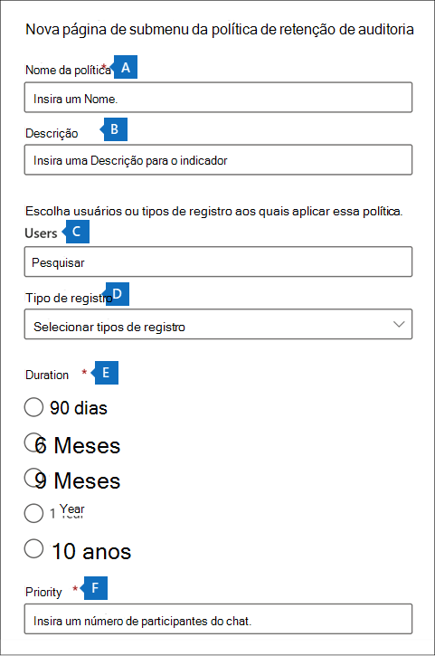

# <a name="manage-audit-log-retention-policies"></a>Gerenciar políticas de retenção de log de auditoria

Você pode criar e gerenciar políticas de retenção de log de auditoria no Centro de Conformidade e Segurança. As políticas de retenção de log de auditoria fazem parte dos novos recursos Avançados de Auditoria no Microsoft 365. Uma política de retenção de log de auditoria permite especificar por quanto tempo reter os logs de auditoria em sua organização. Você pode manter os logs de auditoria por até dez anos. Você pode criar políticas com base nos critérios a seguir:

- Todas as atividades em um ou mais serviços do Microsoft 365
- As atividades específicas (em um serviço do Microsoft 365) executadas por todos os usuários ou por usuários específicos
- Um nível de prioridade que especifica qual política tem precedência se você tiver várias políticas em sua organização

## <a name="default-audit-log-retention-policy"></a>Política de retenção de log de auditoria padrão

A Auditoria Avançada no Microsoft 365 fornece uma política de retenção de log de auditoria padrão para todas as organizações. Essa política mantém todos os registros de auditoria do Exchange Online, do OneDrive for Business e do Azure Active Directory por um ano. Essa política padrão mantém registros de auditoria que contêm o valor do **Exchange**, **SharePoint**, **OneDrive**, **AzureActiveDirectory** para a propriedade **Carga de trabalho** (que é o serviço em que a atividade ocorreu). A política padrão não pode ser modificada. Confira a seção [Mais informações](#more-information) neste artigo para obter uma lista de tipos de registro para cada carga de trabalho inclusa na política padrão.

> [!NOTE]
> A política de retenção do log de auditoria padrão aplica-se somente a registros de auditoria para atividades executadas por usuários que receberam uma licença do Office 365 ou Microsoft 365 E5 ou têm uma licença complementar do Microsoft 365 E5 Compliance ou E5 Descoberta Eletrônica e licença complementar de Auditoria. Se você tiver usuários não E5 ou usuários convidados em sua organização, seus registros de auditoria correspondentes serão retidos por 90 dias.

## <a name="before-you-create-an-audit-log-retention-policy"></a>Antes de você criar uma política de retenção de log de auditoria

- É preciso estar na função de Configuração da Organização no Centro de Conformidade e Segurança para criar ou modificar uma política de retenção de auditoria.

- Você pode ter até 50 políticas de retenção de log de auditoria em sua organização.

- Para reter um log de auditoria por mais de 90 dias (e até 1 ano), o usuário que gera o log de auditoria (realizando uma atividade auditada) deve ser atribuído uma licença Office 365 E5 ou Microsoft 365 E5 ou ter um Microsoft 365 E5 Compliance ou E5 eDiscovery e complemento de licença de Auditoria. Para reter logs de auditoria por 10 anos, o usuário que gera o log de auditoria também deve receber uma licença complementar de retenção de log de auditoria de 10 anos, além de uma licença E5.

- Todas as políticas de retenção de log de auditoria personalizadas (criadas por sua organização) têm prioridade sobre a política de retenção padrão. Por exemplo, se você criar uma política de retenção de log de auditoria para a atividade de caixa de correio do Exchange que tenha um período de retenção menor que um ano, os registros de auditoria para as atividades de caixa de correio serão mantidos por um período menor especificado pela política personalizada.

## <a name="create-an-audit-log-retention-policy"></a>Criar uma política de retenção de log de auditoria

1. Vá para <https://compliance.microsoft.com> e entre com uma conta de usuário que tenha atribuído a função de Configuração da Organização na página Permissões do Centro de Conformidade e Segurança.

2. No painel esquerdo do Centro de Conformidade do Microsoft 365, clique em **Mostrar todos** e, em seguida, clique em **Auditoria**.

3. Clique na guia **Políticas de retenção de Auditoria**.

4. Clique em **Criar política de retenção de auditoria** e preencha os seguintes campos na página submenu:

   

   1. **Nome da política:** O nome da política de retenção do log de auditoria. Esse nome deve ser exclusivo em sua organização e não pode ser alterado após a criação da política.

   2. **Descrição:** opcional, mas útil para fornecer informações sobre a política, como o tipo de registro ou a carga de trabalho, os usuários especificados na política e a duração.

   3. **Usuários:** selecione um ou mais usuários aos quais aplicar a política. Se você deixar essa caixa em branco, a política será aplicada a todos os usuários. Se você deixar os **Tipos de registro** em branco, você deve selecionar um usuário.

   4. **Tipos de registro:** O tipo de registro de auditoria ao qual a política se aplica. Além disso, se você deixar essa propriedade em branco, deve selecionar um usuário na caixa **Usuários**.  Você pode selecionar um único tipo de registro ou vários tipos de registro:
      - Se você selecionar um único tipo de registro, o campo **Atividades** será exibido dinamicamente. Você pode usar a lista suspensa para selecionar atividades do tipo de registro selecionado para a qual aplicar a política. Se você não consegue selecionar atividades especificas, a política será aplicada a todas as atividades do tipo de registro selecionado.
      - Se você selecionar vários tipos de registro, não será possível selecionar atividades. A política será aplicada a todas as atividades dos tipos de registro selecionados.

   5. **Duração:** O tempo necessário para manter os logs de auditoria que atendam aos critérios da política.

   6. **Prioridade:** esse valor determinar a ordem na qual as políticas de retenção de log de auditoria são processadas na sua organização. Um valor mais baixo indica uma prioridade mais alta. As prioridades válidas são valores numéricos entre **1** e **10.000**. Um valor de **1** é a prioridade mais alta e um valor de **10000** é a prioridade mais baixa. Por exemplo, uma política com valor **5** tem prioridade sobre uma política com valor **10**. Como explicado anteriormente, qualquer política de retenção de log de auditoria personalizada tem prioridade sobre a política padrão da sua organização.

5. Clique em **Salvar** para criar a nova política de retenção.

A nova política é exibida na lista da guia **Políticas de retenção de Auditoria**.

## <a name="manage-audit-log-retention-policies-in-the-microsoft-365-compliance-center"></a>Gerenciar as políticas de retenção de log de auditoria no Centro de conformidade do Microsoft 365

As políticas de retenção de log de auditoria estão listadas na guia **Políticas de retenção de Auditoria** (também chamado de *painel*). Você pode usar o painel para exibir, editar e excluir políticas de retenção de auditoria.

### <a name="view-policies-in-the-dashboard"></a>Exibir políticas no painel

As políticas de retenção de log de Auditoria são listadas no painel. Uma vantagem de visualizar as políticas no painel é que você pode clicar na coluna **Prioridade** para listar as políticas na prioridade em que são aplicadas. Conforme explicado anteriormente, um valor mais alto indica uma prioridade mais alta.


Você também pode selecionar uma política para exibir suas configurações na página de submenu.

> [!NOTE]
> A política de retenção de log de auditoria padrão para sua organização não é exibida no painel.

### <a name="edit-policies-in-the-dashboard"></a>Editar políticas no painel

Para editar uma política, selecione-a para exibir a página de submenu. Você pode modificar uma ou mais configurações e salvar suas alterações.

> [!IMPORTANT]
>
> Se você usar o cmdlet **New-UnifiedAuditLogRetentionPolicy**, é possível criar uma política de retenção de log de auditoria para tipos de registro ou atividades que não estão disponíveis na ferramenta **Criar política de retenção de auditoria** no painel. Nesse caso, você não poderá editar a política (por exemplo, alterar a duração da retenção ou adicionar e remover atividades) no painel **Políticas de retenção de Auditoria**. Você só poderá exibir e excluir a política na central de conformidade. Para editar a política, você terá que usar o cmdlet [Set-UnifiedAuditLogRetentionPolicy](/powershell/module/exchange/set-unifiedauditlogretentionpolicy) no Centro de Conformidade e Segurança do Windows PowerShell.>
>
> **Dica:** Uma mensagem é exibida na parte superior da página de submenu para políticas que devem ser editadas usando o Windows PowerShell.

### <a name="delete-policies-in-the-dashboard"></a>Excluir políticas no painel

Para excluir uma política, clique no ícone **Excluir** e confirme que deseja excluir a política. A política é removida do painel, mas pode demorar até 30 minutos para que a política seja removida de sua organização.

## <a name="create-and-manage-audit-log-retention-policies-in-powershell"></a>Criar e gerenciar políticas de retenção de log de auditoria no Windows PowerShell

Você também pode usar o Centro de Conformidade e Segurança do Windows PowerShell para criar e gerenciar políticas de retenção de log de auditoria. Um motivo para usar o Windows PowerShell é criar uma política para um tipo de registro ou atividade que não está disponível na interface do usuário.

### <a name="create-an-audit-log-retention-policy-in-powershell"></a>Criar uma política de retenção de log de auditoria no Windows PowerShell

Siga estas etapas para criar uma política de retenção de log de auditoria no Windows PowerShell:

1. [Conectar-se ao PowerShell do Centro de Conformidade e Segurança](/powershell/exchange/connect-to-scc-powershell).

2. Execute o seguinte comando para criar uma política de retenção de log de auditoria:

   ```powershell
   New-UnifiedAuditLogRetentionPolicy -Name "Microsoft Teams Audit Policy" -Description "One year retention policy for all Microsoft Teams activities" -RecordTypes MicrosoftTeams -RetentionDuration TenYears -Priority 100
   ```

   Este exemplo cria uma política de retenção de log de auditoria chamada “Política de Auditoria do Microsoft Teams” com as seguintes configurações:

   - Uma descrição da política.
   - Retém todas as atividades do Microsoft Teams (conforme definido pelo parâmetro *RecordType*).
   - Retém os logs de auditoria do Microsoft Teams por dez anos.
   - Prioridade de 100.

Veja outro exemplo de como criar uma política de retenção de log de auditoria. Essa política mantém os logs de auditoria para a atividade “Usuário conectado” por seis meses para o usuário admin@contoso.onmicrosoft.com.

```powershell
New-UnifiedAuditLogRetentionPolicy -Name "SixMonth retention for admin logons" -RecordTypes AzureActiveDirectoryStsLogon -Operations UserLoggedIn -UserIds admin@contoso.onmicrosoft.com -RetentionDuration SixMonths -Priority 25
```

Para saber mais, confira [New-UnifiedAuditLogRetentionPolicy](/powershell/module/exchange/new-unifiedauditlogretentionpolicy).

### <a name="view-policies-in-powershell"></a>Exibir políticas no Windows PowerShell

Use o cmdlet [Get-UnifiedAuditLogRetentionPolicy](/powershell/module/exchange/get-unifiedauditlogretentionpolicy) no Centro de Conformidade e Segurança do Windows PowerShell para exibir as políticas de retenção de log de auditoria.

Este é um exemplo de comando para exibir as configurações de todas as políticas de retenção de log de auditoria em sua organização. Este comando classifica as políticas da prioridade mais alta para a mais baixa.

```powershell
Get-UnifiedAuditLogRetentionPolicy | Sort-Object -Property Priority -Descending | FL Priority,Name,Description,RecordTypes,Operations,UserIds,RetentionDuration
```

> [!NOTE]
> O cmdlet **Get-UnifiedAuditLogRetentionPolicy** não retorna a política de retenção de log de auditoria padrão para sua organização.

### <a name="edit-policies-in-powershell"></a>Editar políticas no Windows PowerShell

Use o cmdlet [Set-UnifiedAuditLogRetentionPolicy](/powershell/module/exchange/set-unifiedauditlogretentionpolicy) no Centro de Conformidade e Segurança do Windows PowerShell para editar uma política de retenção de log de auditoria existente.

### <a name="delete-policies-in-powershell"></a>Excluir políticas no Windows PowerShell

Use o cmdlet [Remove-UnifiedAuditLogRetentionPolicy](/powershell/module/exchange/remove-unifiedauditlogretentionpolicy) no Centro de Conformidade e Segurança do Windows PowerShell para excluir uma política de retenção de log de auditoria. Pode levar até 30 minutos para que a política seja removida de sua organização.

## <a name="more-information"></a>Mais Informações

Conforme declarado anteriormente, os registros de auditoria para operações no Azure Active Directory, Exchange Online, SharePoint Online e OneDrive for Business são retidos por um ano por padrão. A seguinte tabela lista todos os tipos de registro (para cada um desses serviços) incluídos na política de retenção de log de auditoria padrão. Isso significa que os logs de auditoria para qualquer operação com esse tipo de registro são mantidos por um ano, a menos que uma política de retenção de log de auditoria personalizada tenha precedência sobre um tipo específico de registro, uma operação ou usuário. O valor de enumeração (que é exibido como o valor da propriedade RecordType em um registro de auditoria) para cada tipo de registro é mostrado entre parênteses.

<br>

****

|AzureActiveDirectory|Exchange |SharePoint ou OneDrive|
|---|---|---|
|AzureActiveDirectory (8)|ExchangeAdmin (1)|ComplianceDLPSharePoint (11)|
|AzureActiveDirectoryAccountLogon (9)|ExchangeItem (2)|ComplianceDLPSharePointClassification (33)|
|AzureActiveDirectoryStsLogon (15)|Campaign (62)|Project (35)|
||ComplianceDLPExchange (13)|SharePoint (4)|
||ComplianceSupervisionExchange (68)|SharePointCommentOperation (37)|
||CustomerKeyServiceEncryption (69)|SharePointContentTypeOperation (55)|
||ExchangeAggregatedOperation (19)|SharePointFieldOperation (56)|
||ExchangeItemAggregated (50)|SharePointFileOperation (6)|
||ExchangeItemGroup (3)|SharePointListOperation (36)|
||InformationBarrierPolicyApplication (53)|SharePointSharingOperation (14)|
||||
