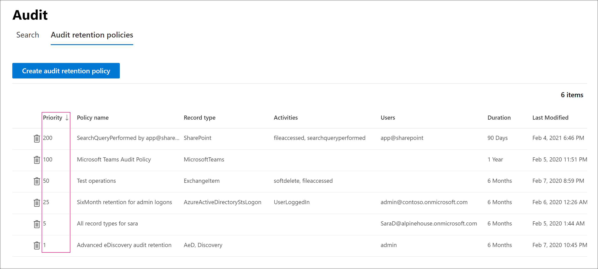

# <a name="manage-audit-log-retention-policies"></a><span data-ttu-id="95865-104">Gerenciar políticas de retenção de log de auditoria</span><span class="sxs-lookup"><span data-stu-id="95865-104">Manage audit log retention policies</span></span>

<span data-ttu-id="95865-105">Você pode criar e gerenciar políticas de retenção de log de auditoria no Centro de Conformidade e Segurança.</span><span class="sxs-lookup"><span data-stu-id="95865-105">You can create and manage audit log retention policies in the Security & Compliance Center.</span></span> <span data-ttu-id="95865-106">As políticas de retenção de log de auditoria fazem parte dos novos recursos Avançados de Auditoria no Microsoft 365.</span><span class="sxs-lookup"><span data-stu-id="95865-106">Audit log retention policies are part of the new Advanced Audit capabilities in Microsoft 365.</span></span> <span data-ttu-id="95865-107">Uma política de retenção de log de auditoria permite especificar por quanto tempo reter os logs de auditoria em sua organização.</span><span class="sxs-lookup"><span data-stu-id="95865-107">An audit log retention policy lets you specify how long to retain audit logs in your organization.</span></span> <span data-ttu-id="95865-108">Você pode manter os logs de auditoria por até dez anos.</span><span class="sxs-lookup"><span data-stu-id="95865-108">You can retain audit logs for up to 10 years.</span></span> <span data-ttu-id="95865-109">Você pode criar políticas com base nos critérios a seguir:</span><span class="sxs-lookup"><span data-stu-id="95865-109">You can create policies based on the following criteria:</span></span>

- <span data-ttu-id="95865-110">Todas as atividades em um ou mais serviços do Microsoft 365</span><span class="sxs-lookup"><span data-stu-id="95865-110">All activities in one or more Microsoft 365 services</span></span>

- <span data-ttu-id="95865-111">As atividades específicas (em um serviço do Microsoft 365) executadas por todos os usuários ou por usuários específicos</span><span class="sxs-lookup"><span data-stu-id="95865-111">Specific activities (in a Microsoft 365 service) performed by all users or by specific users</span></span>

- <span data-ttu-id="95865-112">Um nível de prioridade que especifica qual política tem precedência se você tiver várias políticas em sua organização</span><span class="sxs-lookup"><span data-stu-id="95865-112">A priority level that specifies which policy takes precedence in you have multiple policies in your organization</span></span>

## <a name="default-audit-log-retention-policy"></a><span data-ttu-id="95865-113">Política de retenção de log de auditoria padrão</span><span class="sxs-lookup"><span data-stu-id="95865-113">Default audit log retention policy</span></span>

<span data-ttu-id="95865-114">A Auditoria Avançada no Microsoft 365 fornece uma política de retenção de log de auditoria padrão para todas as organizações.</span><span class="sxs-lookup"><span data-stu-id="95865-114">Advanced Audit in Microsoft 365 provides a default audit log retention policy for all organizations.</span></span> <span data-ttu-id="95865-115">Essa política mantém todos os registros de auditoria do Exchange, do SharePoint e do Azure Active Directory por um ano.</span><span class="sxs-lookup"><span data-stu-id="95865-115">This policy retains all Exchange, SharePoint, and Azure Active Directory audit records for one year.</span></span> <span data-ttu-id="95865-116">Essa política padrão mantém registros de auditoria que contêm o valor do **AzureActiveDirectory**, **Exchange** ou **SharePoint** para a propriedade **Carga de trabalho** (que é o serviço em que a atividade ocorreu).</span><span class="sxs-lookup"><span data-stu-id="95865-116">This default policy retains audit records that contain the value of **AzureActiveDirectory**, **Exchange**, or **SharePoint** for the **Workload** property (which is the service in which the activity occurred).</span></span> <span data-ttu-id="95865-117">A política padrão não pode ser modificada.</span><span class="sxs-lookup"><span data-stu-id="95865-117">The default policy can't be modified.</span></span> <span data-ttu-id="95865-118">Confira a seção [Mais informações](#more-information) neste artigo para obter uma lista de tipos de registro para cada carga de trabalho inclusa na política padrão.</span><span class="sxs-lookup"><span data-stu-id="95865-118">See the [More information](#more-information) section in this article for a list of record types for each workload that are included in the default policy.</span></span>

> [!NOTE]
> <span data-ttu-id="95865-119">A política de retenção do log de auditoria padrão aplica-se somente a registros de auditoria para atividades executadas por usuários que receberam uma licença do Office 365 ou Microsoft 365 E5 ou têm uma licença complementar do Microsoft 365 E5 Compliance ou E5 Descoberta Eletrônica e licença complementar de Auditoria.</span><span class="sxs-lookup"><span data-stu-id="95865-119">The default audit log retention policy only applies to audit records for activity performed by users who are assigned an Office 365 or Microsoft 365 E5 license or have a Microsoft 365 E5 Compliance or E5 eDiscovery and Audit add-on license.</span></span> <span data-ttu-id="95865-120">Se você tiver usuários não E5 ou usuários convidados em sua organização, seus registros de auditoria correspondentes serão retidos por 90 dias.</span><span class="sxs-lookup"><span data-stu-id="95865-120">If you have non-E5 users or guest users in your organization, their corresponding audit records are retained for 90 days.</span></span>

## <a name="before-you-create-an-audit-log-retention-policy"></a><span data-ttu-id="95865-121">Antes de você criar uma política de retenção de log de auditoria</span><span class="sxs-lookup"><span data-stu-id="95865-121">Before you create an audit log retention policy</span></span>

- <span data-ttu-id="95865-122">É preciso estar na função de Configuração da Organização no Centro de Conformidade e Segurança para criar ou modificar uma política de retenção de auditoria.</span><span class="sxs-lookup"><span data-stu-id="95865-122">You have to be assigned the Organization Configuration role in the Security & Compliance Center to create or modify an audit retention policy.</span></span>

- <span data-ttu-id="95865-123">Você pode ter até 50 políticas de retenção de log de auditoria em sua organização.</span><span class="sxs-lookup"><span data-stu-id="95865-123">You can have a maximum of 50 audit log retention policies in your organization.</span></span>

- <span data-ttu-id="95865-124">Para reter um log de auditoria por mais de 90 dias (e até 1 ano), o usuário que gera o log de auditoria (realizando uma atividade auditada) deve ser atribuído uma licença Office 365 E5 ou Microsoft 365 E5 ou ter um Microsoft 365 E5 Compliance ou E5 eDiscovery e complemento de licença de Auditoria.</span><span class="sxs-lookup"><span data-stu-id="95865-124">To retain an audit log for longer than 90 days (and up to 1 year), the user who generates the audit log (by performing an audited activity) must be assigned an Office 365 E5 or Microsoft 365 E5 license or have a Microsoft 365 E5 Compliance or E5 eDiscovery and Audit add-on license.</span></span> <span data-ttu-id="95865-125">Para reter logs de auditoria por 10 anos, o usuário que gera o log de auditoria também deve receber uma licença complementar de retenção de log de auditoria de 10 anos, além de uma licença E5.</span><span class="sxs-lookup"><span data-stu-id="95865-125">To retain audit logs for 10 years, the user who generates the audit log must also be assigned a 10-year audit log retention add-on license in addition to an E5 license.</span></span>

- <span data-ttu-id="95865-126">Todas as políticas de retenção de log de auditoria personalizadas (criadas por sua organização) têm prioridade sobre a política de retenção padrão.</span><span class="sxs-lookup"><span data-stu-id="95865-126">All custom audit log retention policies (created by your organization) take priority over the default retention policy.</span></span> <span data-ttu-id="95865-127">Por exemplo, se você criar uma política de retenção de log de auditoria para a atividade de caixa de correio do Exchange que tenha um período de retenção menor que um ano, os registros de auditoria para as atividades de caixa de correio serão mantidos por um período menor especificado pela política personalizada.</span><span class="sxs-lookup"><span data-stu-id="95865-127">For example, if you create an audit log retention policy for Exchange mailbox activity that has a retention period that's shorter than one year, audit records for Exchange mailbox activities will be retained for the shorter duration specified by the custom policy.</span></span>

## <a name="create-an-audit-log-retention-policy"></a><span data-ttu-id="95865-128">Criar uma política de retenção de log de auditoria</span><span class="sxs-lookup"><span data-stu-id="95865-128">Create an audit log retention policy</span></span>

1. <span data-ttu-id="95865-129">Vá para [https://compliance.microsoft.com](https://compliance.microsoft.com) e entre com uma conta de usuário que tenha atribuído a função de Configuração da Organização na página Permissões do Centro de Conformidade e Segurança.</span><span class="sxs-lookup"><span data-stu-id="95865-129">Go to [https://compliance.microsoft.com](https://compliance.microsoft.com) and sign in with a user account that's assigned the Organization Configuration role on the Permissions page in the Security & Compliance Center.</span></span>

2. <span data-ttu-id="95865-130">No painel esquerdo do Centro de Conformidade do Microsoft 365, clique em **Mostrar todos** e, em seguida, clique em **Auditoria**.</span><span class="sxs-lookup"><span data-stu-id="95865-130">In the left pane of the Microsoft 365 compliance center, click **Show all**, and then click **Audit**.</span></span>

3. <span data-ttu-id="95865-131">Clique na guia **Políticas de retenção de Auditoria**.</span><span class="sxs-lookup"><span data-stu-id="95865-131">Click the **Audit retention policies** tab.</span></span>

4. <span data-ttu-id="95865-132">Clique em **Criar política de retenção de auditoria** e preencha os seguintes campos na página submenu:</span><span class="sxs-lookup"><span data-stu-id="95865-132">Click **Create audit retention policy**, and then complete the following fields on the flyout page:</span></span>

    

   1. <span data-ttu-id="95865-134">**Nome da política:** O nome da política de retenção do log de auditoria.</span><span class="sxs-lookup"><span data-stu-id="95865-134">**Policy name:** The name of the audit log retention policy.</span></span> <span data-ttu-id="95865-135">Esse nome deve ser exclusivo em sua organização e não pode ser alterado após a criação da política.</span><span class="sxs-lookup"><span data-stu-id="95865-135">This name must be unique in your organization, and it can't be change after the policy is created.</span></span>

   2. <span data-ttu-id="95865-136">**Descrição:** opcional, mas útil para fornecer informações sobre a política, como o tipo de registro ou a carga de trabalho, os usuários especificados na política e a duração.</span><span class="sxs-lookup"><span data-stu-id="95865-136">**Description:** Optional, but helpful to provide information about the policy, such as the record type or workload, users specified in the policy, and the duration.</span></span>

   3. <span data-ttu-id="95865-137">**Usuários:** selecione um ou mais usuários aos quais aplicar a política.</span><span class="sxs-lookup"><span data-stu-id="95865-137">**Users:** Select one or more users to apply the policy to.</span></span> <span data-ttu-id="95865-138">Se você deixar essa caixa em branco, a política será aplicada a todos os usuários.</span><span class="sxs-lookup"><span data-stu-id="95865-138">If you leave this box blank, then the policy will apply to all users.</span></span> <span data-ttu-id="95865-139">Se você deixar os **Tipos de registro** em branco, você deve selecionar um usuário.</span><span class="sxs-lookup"><span data-stu-id="95865-139">If you leave the **Record type** blank, then you must select a user.</span></span>

   4. <span data-ttu-id="95865-140">**Tipos de registro:** O tipo de registro de auditoria ao qual a política se aplica.</span><span class="sxs-lookup"><span data-stu-id="95865-140">**Record type:** The audit record type the policy applies to.</span></span> <span data-ttu-id="95865-141">Além disso, se você deixar essa propriedade em branco, deve selecionar um usuário na caixa **Usuários**. </span><span class="sxs-lookup"><span data-stu-id="95865-141">If you leave this property blank, you must select a user in the **Users** box.</span></span> <span data-ttu-id="95865-142">Você pode selecionar um único tipo de registro ou vários tipos de registro:</span><span class="sxs-lookup"><span data-stu-id="95865-142">You can select a single record type or multiple record types:</span></span>

   - <span data-ttu-id="95865-143">Se você selecionar um único tipo de registro, o campo **Atividades** será exibido dinamicamente.</span><span class="sxs-lookup"><span data-stu-id="95865-143">If you select a single record type, the **Activities** field is dynamically displayed.</span></span> <span data-ttu-id="95865-144">Você pode usar a lista suspensa para selecionar atividades do tipo de registro selecionado para a qual aplicar a política.</span><span class="sxs-lookup"><span data-stu-id="95865-144">You can use the drop-down list to select activities from the selected record type to apply the policy to.</span></span> <span data-ttu-id="95865-145">Se você não consegue selecionar atividades especificas, a política será aplicada a todas as atividades do tipo de registro selecionado.</span><span class="sxs-lookup"><span data-stu-id="95865-145">If you don't choose specific activities, the policy will apply to all activities of the selected record type.</span></span>

   - <span data-ttu-id="95865-146">Se você selecionar vários tipos de registro, não será possível selecionar atividades.</span><span class="sxs-lookup"><span data-stu-id="95865-146">If you select multiple record types, you don't have the ability to select activities.</span></span> <span data-ttu-id="95865-147">A política será aplicada a todas as atividades dos tipos de registro selecionados.</span><span class="sxs-lookup"><span data-stu-id="95865-147">The policy will apply to all activities of the selected record types.</span></span>

   5. <span data-ttu-id="95865-148">**Duração:** O tempo necessário para manter os logs de auditoria que atendam aos critérios da política.</span><span class="sxs-lookup"><span data-stu-id="95865-148">**Duration:** The amount of time to retain the audit logs that meet the criteria of the policy.</span></span>

   6. <span data-ttu-id="95865-149">**Prioridade:** esse valor determinar a ordem na qual as políticas de retenção de log de auditoria são processadas na sua organização.</span><span class="sxs-lookup"><span data-stu-id="95865-149">**Priority:** This value determines the order in which audit log retention policies in your organization are processed.</span></span> <span data-ttu-id="95865-150">Um valor mais alto indica uma prioridade mais alta.</span><span class="sxs-lookup"><span data-stu-id="95865-150">A higher value indicates a higher priority.</span></span> <span data-ttu-id="95865-151">Por exemplo, uma política com um valor de prioridade de **5** teria prioridade sobre uma política com um valor de prioridade **0**.</span><span class="sxs-lookup"><span data-stu-id="95865-151">For example, a policy with a priority value of **5** would take priority over a policy with a priority value of **0**.</span></span> <span data-ttu-id="95865-152">Como explicado anteriormente, qualquer política de retenção de log de auditoria personalizada tem prioridade sobre a política padrão da sua organização.</span><span class="sxs-lookup"><span data-stu-id="95865-152">As previously explained, any custom audit log retention policy takes priority over the default policy for your organization.</span></span>

5. <span data-ttu-id="95865-153">Clique em **Salvar** para criar a nova política de retenção.</span><span class="sxs-lookup"><span data-stu-id="95865-153">Click **Save** to create the new audit log retention policy.</span></span>

   <span data-ttu-id="95865-154">A nova política é exibida na lista da guia **Políticas de retenção de Auditoria**.</span><span class="sxs-lookup"><span data-stu-id="95865-154">The new policy is displayed in the list on the **Audit retention policies** tab.</span></span>

## <a name="manage-audit-log-retention-policies"></a><span data-ttu-id="95865-155">Gerenciar políticas de retenção de log de auditoria</span><span class="sxs-lookup"><span data-stu-id="95865-155">Manage audit log retention policies</span></span>

<span data-ttu-id="95865-156">As políticas de retenção de log de auditoria estão listadas na guia **Políticas de retenção de Auditoria** (também chamado de *painel*).</span><span class="sxs-lookup"><span data-stu-id="95865-156">Audit log retention policies are listed on the **Audit retention policies** tab (also called the *dashboard*).</span></span> <span data-ttu-id="95865-157">Você pode usar o painel para exibir, editar e excluir políticas de retenção de auditoria.</span><span class="sxs-lookup"><span data-stu-id="95865-157">You can use the dashboard to view, edit, and delete audit retention policies.</span></span>

### <a name="view-policies-in-the-dashboard"></a><span data-ttu-id="95865-158">Exibir políticas no painel</span><span class="sxs-lookup"><span data-stu-id="95865-158">View policies in the dashboard</span></span>

<span data-ttu-id="95865-159">As políticas de retenção de log de Auditoria são listadas no painel.</span><span class="sxs-lookup"><span data-stu-id="95865-159">Audit log retention policies are listed in the dashboard.</span></span> <span data-ttu-id="95865-160">Uma vantagem de visualizar as políticas no painel é que você pode clicar na coluna **Prioridade** para listar as políticas na prioridade em que são aplicadas.</span><span class="sxs-lookup"><span data-stu-id="95865-160">One advantage of viewing policies in the dashboard is that you can click the **Priority** column to list the policies in the priority in which they are applied.</span></span> <span data-ttu-id="95865-161">Conforme explicado anteriormente, um valor mais alto indica uma prioridade mais alta.</span><span class="sxs-lookup"><span data-stu-id="95865-161">As previously explained, a higher value indicates a higher priority.</span></span>



<span data-ttu-id="95865-163">Você também pode selecionar uma política para exibir suas configurações na página de submenu.</span><span class="sxs-lookup"><span data-stu-id="95865-163">You can also select a policy to display its settings on the flyout page.</span></span>

> [!NOTE]
> <span data-ttu-id="95865-164">A política de retenção de log de auditoria padrão para sua organização não é exibida no painel.</span><span class="sxs-lookup"><span data-stu-id="95865-164">The default audit log retention policy for your organization isn't displayed in the dashboard.</span></span>

### <a name="edit-policies-in-the-dashboard"></a><span data-ttu-id="95865-165">Editar políticas no painel</span><span class="sxs-lookup"><span data-stu-id="95865-165">Edit policies in the dashboard</span></span>

<span data-ttu-id="95865-166">Para editar uma política, selecione-a para exibir a página de submenu.</span><span class="sxs-lookup"><span data-stu-id="95865-166">To edit a policy, select it to display the flyout page.</span></span> <span data-ttu-id="95865-167">Você pode modificar uma ou mais configurações e salvar suas alterações.</span><span class="sxs-lookup"><span data-stu-id="95865-167">You can modify one or more setting and then save your changes.</span></span>


> [!IMPORTANT]
> <span data-ttu-id="95865-168">Se você usar o cmdlet **New-UnifiedAuditLogRetentionPolicy**, é possível criar uma política de retenção de log de auditoria para tipos de registro ou atividades que não estão disponíveis na ferramenta **Criar política de retenção de auditoria** no painel.</span><span class="sxs-lookup"><span data-stu-id="95865-168">If you use the **New-UnifiedAuditLogRetentionPolicy** cmdlet, it's possible to create an audit log retention policy for record types or activities that aren't available in the **Create audit retention policy** tool in the dashboard.</span></span> <span data-ttu-id="95865-169">Nesse caso, você não poderá editar a política (por exemplo, alterar a duração da retenção ou adicionar e remover atividades) no painel **Políticas de retenção de Auditoria**.</span><span class="sxs-lookup"><span data-stu-id="95865-169">In this case, you won't be able to edit the policy (for example, change the retention duration or add and remove activities) from the **Audit retention policies** dashboard.</span></span> <span data-ttu-id="95865-170">Você só poderá exibir e excluir a política na central de conformidade.</span><span class="sxs-lookup"><span data-stu-id="95865-170">You'll only be able to view and delete the policy in the compliance center.</span></span> <span data-ttu-id="95865-171">Para editar a política, você terá que usar o cmdlet [Set-UnifiedAuditLogRetentionPolicy](/powershell/module/exchange/set-unifiedauditlogretentionpolicy) no Centro de Conformidade e Segurança do Windows PowerShell.</span><span class="sxs-lookup"><span data-stu-id="95865-171">To edit the policy, you'll have to use the [Set-UnifiedAuditLogRetentionPolicy](/powershell/module/exchange/set-unifiedauditlogretentionpolicy) cmdlet in Security & Compliance Center PowerShell.</span></span><br/><br/><span data-ttu-id="95865-172">**Dica:** Uma mensagem é exibida na parte superior da página de submenu para políticas que devem ser editadas usando o Windows PowerShell.</span><span class="sxs-lookup"><span data-stu-id="95865-172">**Tip:** A message is displayed at the top of the flyout page for policies that have to be edited using PowerShell.</span></span>

### <a name="delete-policies-in-the-dashboard"></a><span data-ttu-id="95865-173">Excluir políticas no painel</span><span class="sxs-lookup"><span data-stu-id="95865-173">Delete policies in the dashboard</span></span>

<span data-ttu-id="95865-174">Para excluir uma política, clique no ícone **Excluir** e confirme que deseja excluir a política.</span><span class="sxs-lookup"><span data-stu-id="95865-174">To delete a policy, click the **Delete**  icon and then confirm that you want to delete the policy.</span></span> <span data-ttu-id="95865-175">A política é removida do painel, mas pode demorar até 30 minutos para que a política seja removida de sua organização.</span><span class="sxs-lookup"><span data-stu-id="95865-175">The policy is removed from the dashboard, but it might take up to 30 minutes for the policy to be removed from your organization.</span></span>

## <a name="create-and-manage-audit-log-retention-policies-in-powershell"></a><span data-ttu-id="95865-176">Criar e gerenciar políticas de retenção de log de auditoria no Windows PowerShell</span><span class="sxs-lookup"><span data-stu-id="95865-176">Create and manage audit log retention policies in PowerShell</span></span>

<span data-ttu-id="95865-177">Você também pode usar o Centro de Conformidade e Segurança do Windows PowerShell para criar e gerenciar políticas de retenção de log de auditoria.</span><span class="sxs-lookup"><span data-stu-id="95865-177">You can also use Security & Compliance Center PowerShell to create and manage audit log retention policies.</span></span> <span data-ttu-id="95865-178">Um motivo para usar o Windows PowerShell é criar uma política para um tipo de registro ou atividade que não está disponível na interface do usuário.</span><span class="sxs-lookup"><span data-stu-id="95865-178">One reason to use PowerShell is to create a policy for a record type or activity that isn't available in the UI.</span></span>

### <a name="create-an-audit-log-retention-policy-in-powershell"></a><span data-ttu-id="95865-179">Criar uma política de retenção de log de auditoria no Windows PowerShell</span><span class="sxs-lookup"><span data-stu-id="95865-179">Create an audit log retention policy in PowerShell</span></span>

<span data-ttu-id="95865-180">Siga estas etapas para criar uma política de retenção de log de auditoria no Windows PowerShell:</span><span class="sxs-lookup"><span data-stu-id="95865-180">Follow these steps to create an audit log retention policy in PowerShell:</span></span>

1. <span data-ttu-id="95865-181">[Conectar-se ao PowerShell do Centro de Conformidade e Segurança](/powershell/exchange/connect-to-scc-powershell).</span><span class="sxs-lookup"><span data-stu-id="95865-181">[Connect to Security & Compliance Center PowerShell](/powershell/exchange/connect-to-scc-powershell).</span></span>

2. <span data-ttu-id="95865-182">Execute o seguinte comando para criar uma política de retenção de log de auditoria.</span><span class="sxs-lookup"><span data-stu-id="95865-182">Run the following command to create an audit log retention policy.</span></span>

   ```powershell
   New-UnifiedAuditLogRetentionPolicy -Name "Microsoft Teams Audit Policy" -Description "One year retention policy for all Microsoft Teams activities" -RecordTypes MicrosoftTeams -RetentionDuration TenYears -Priority 100
   ```

    <span data-ttu-id="95865-183">Este exemplo cria uma política de retenção de log de auditoria chamada “Política de Auditoria do Microsoft Teams” com as seguintes configurações:</span><span class="sxs-lookup"><span data-stu-id="95865-183">This example creates an audit log retention policy named "Microsoft Teams Audit Policy" with these settings:</span></span>

   - <span data-ttu-id="95865-184">Uma descrição da política.</span><span class="sxs-lookup"><span data-stu-id="95865-184">A description of the policy.</span></span>

   - <span data-ttu-id="95865-185">Retém todas as atividades do Microsoft Teams (conforme definido pelo parâmetro *RecordType*).</span><span class="sxs-lookup"><span data-stu-id="95865-185">Retains all Microsoft Teams activities (as defined by the *RecordType* parameter).</span></span>

   - <span data-ttu-id="95865-186">Retém os logs de auditoria do Microsoft Teams por dez anos.</span><span class="sxs-lookup"><span data-stu-id="95865-186">Retains Microsoft Teams audit logs for 10 years.</span></span>

   - <span data-ttu-id="95865-187">Prioridade de 100.</span><span class="sxs-lookup"><span data-stu-id="95865-187">A priority of 100.</span></span>

<span data-ttu-id="95865-188">Veja outro exemplo de como criar uma política de retenção de log de auditoria.</span><span class="sxs-lookup"><span data-stu-id="95865-188">Here's another example of creating an audit log retention policy.</span></span> <span data-ttu-id="95865-189">Essa política mantém os logs de auditoria para a atividade “Usuário conectado” por seis meses para o usuário admin@contoso.onmicrosoft.com.</span><span class="sxs-lookup"><span data-stu-id="95865-189">This policy retains audit logs for the "User logged in" activity for six months for the user admin@contoso.onmicrosoft.com.</span></span>

```powershell
New-UnifiedAuditLogRetentionPolicy -Name "SixMonth retention for admin logons" -RecordTypes AzureActiveDirectoryStsLogon -Operations UserLoggedIn -UserIds admin@contoso.onmicrosoft.com -RetentionDuration SixMonths -Priority 25
```

<span data-ttu-id="95865-190">Para saber mais, confira [New-UnifiedAuditLogRetentionPolicy](/powershell/module/exchange/new-unifiedauditlogretentionpolicy).</span><span class="sxs-lookup"><span data-stu-id="95865-190">For more information, see [New-UnifiedAuditLogRetentionPolicy](/powershell/module/exchange/new-unifiedauditlogretentionpolicy).</span></span>

### <a name="view-policies-in-powershell"></a><span data-ttu-id="95865-191">Exibir políticas no Windows PowerShell</span><span class="sxs-lookup"><span data-stu-id="95865-191">View policies in PowerShell</span></span>

<span data-ttu-id="95865-192">Use o cmdlet [Get-UnifiedAuditLogRetentionPolicy](/powershell/module/exchange/get-unifiedauditlogretentionpolicy) no Centro de Conformidade e Segurança do Windows PowerShell para exibir as políticas de retenção de log de auditoria.</span><span class="sxs-lookup"><span data-stu-id="95865-192">Use the [Get-UnifiedAuditLogRetentionPolicy](/powershell/module/exchange/get-unifiedauditlogretentionpolicy) cmdlet in Security & Compliance Center PowerShell to view audit log retention policies.</span></span>

<span data-ttu-id="95865-193">Este é um exemplo de comando para exibir as configurações de todas as políticas de retenção de log de auditoria em sua organização.</span><span class="sxs-lookup"><span data-stu-id="95865-193">Here's a sample command to display the settings for all audit log retention policies in your organization.</span></span> <span data-ttu-id="95865-194">Este comando classifica as políticas da prioridade mais alta para a mais baixa.</span><span class="sxs-lookup"><span data-stu-id="95865-194">This command sorts the policies from the highest to lowest priority.</span></span>

```powershell
Get-UnifiedAuditLogRetentionPolicy | Sort-Object -Property Priority -Descending | FL Priority,Name,Description,RecordTypes,Operations,UserIds,RetentionDuration
```

> [!NOTE]
> <span data-ttu-id="95865-195">O cmdlet **Get-UnifiedAuditLogRetentionPolicy** não retorna a política de retenção de log de auditoria padrão para sua organização.</span><span class="sxs-lookup"><span data-stu-id="95865-195">The **Get-UnifiedAuditLogRetentionPolicy** cmdlet doesn't return the default audit log retention policy for your organization.</span></span>

### <a name="edit-policies-in-powershell"></a><span data-ttu-id="95865-196">Editar políticas no Windows PowerShell</span><span class="sxs-lookup"><span data-stu-id="95865-196">Edit policies in PowerShell</span></span>

<span data-ttu-id="95865-197">Use o cmdlet [Set-UnifiedAuditLogRetentionPolicy](/powershell/module/exchange/set-unifiedauditlogretentionpolicy) no Centro de Conformidade e Segurança do Windows PowerShell para editar uma política de retenção de log de auditoria existente.</span><span class="sxs-lookup"><span data-stu-id="95865-197">Use the [Set-UnifiedAuditLogRetentionPolicy](/powershell/module/exchange/set-unifiedauditlogretentionpolicy) cmdlet in Security & Compliance Center PowerShell to edit an existing audit log retention policy.</span></span>

### <a name="delete-policies-in-powershell"></a><span data-ttu-id="95865-198">Excluir políticas no Windows PowerShell</span><span class="sxs-lookup"><span data-stu-id="95865-198">Delete policies in PowerShell</span></span>

<span data-ttu-id="95865-199">Use o cmdlet [Remove-UnifiedAuditLogRetentionPolicy](/powershell/module/exchange/remove-unifiedauditlogretentionpolicy) no Centro de Conformidade e Segurança do Windows PowerShell para excluir uma política de retenção de log de auditoria.</span><span class="sxs-lookup"><span data-stu-id="95865-199">Use the [Remove-UnifiedAuditLogRetentionPolicy](/powershell/module/exchange/remove-unifiedauditlogretentionpolicy) cmdlet in Security & Compliance Center PowerShell to delete an audit log retention policy.</span></span> <span data-ttu-id="95865-200">Pode levar até 30 minutos para que a política seja removida de sua organização.</span><span class="sxs-lookup"><span data-stu-id="95865-200">It might take up to 30 minutes for the policy to be removed from your organization.</span></span>

## <a name="more-information"></a><span data-ttu-id="95865-201">Mais Informações</span><span class="sxs-lookup"><span data-stu-id="95865-201">More information</span></span>

<span data-ttu-id="95865-202">Conforme declarado anteriormente, os registros de auditoria para operações no Microsoft Azure Active Directory, Exchange e Microsoft Office SharePoint Online são retidos por um ano por padrão.</span><span class="sxs-lookup"><span data-stu-id="95865-202">As previously stated, audit records for operations in Azure Active Directory, Exchange, and SharePoint are retained for one year by default.</span></span> <span data-ttu-id="95865-203">A seguinte tabela lista todos os tipos de registro (para cada um desses serviços) incluídos na política de retenção de log de auditoria padrão.</span><span class="sxs-lookup"><span data-stu-id="95865-203">The following table lists all the record types (for each of these services) included in the default audit log retention policy.</span></span> <span data-ttu-id="95865-204">Isso significa que os logs de auditoria para qualquer operação com esse tipo de registro são mantidos por um ano, a menos que uma política de retenção de log de auditoria personalizada tenha precedência sobre um tipo específico de registro, uma operação ou usuário.</span><span class="sxs-lookup"><span data-stu-id="95865-204">This means that audit logs for any operation with this record type are retained for one year unless a custom audit log retention policy takes precedence for a specific record type, operation, or user.</span></span> <span data-ttu-id="95865-205">O valor de enumeração (que é exibido como o valor da propriedade RecordType em um registro de auditoria) para cada tipo de registro é mostrado entre parênteses.</span><span class="sxs-lookup"><span data-stu-id="95865-205">The Enum value (which is displayed as the value for the RecordType property in an audit record) for each record type is shown in parentheses.</span></span>

|<span data-ttu-id="95865-206">AzureActiveDirectory</span><span class="sxs-lookup"><span data-stu-id="95865-206">AzureActiveDirectory</span></span> |<span data-ttu-id="95865-207">Exchange</span><span class="sxs-lookup"><span data-stu-id="95865-207">Exchange</span></span>  |<span data-ttu-id="95865-208">SharePoint</span><span class="sxs-lookup"><span data-stu-id="95865-208">SharePoint</span></span>|
|:---------|:---------|:---------|
|<span data-ttu-id="95865-209">AzureActiveDirectory (8)</span><span class="sxs-lookup"><span data-stu-id="95865-209">AzureActiveDirectory (8)</span></span>|<span data-ttu-id="95865-210">ExchangeAdmin (1)</span><span class="sxs-lookup"><span data-stu-id="95865-210">ExchangeAdmin (1)</span></span>|<span data-ttu-id="95865-211">ComplianceDLPSharePoint (11)</span><span class="sxs-lookup"><span data-stu-id="95865-211">ComplianceDLPSharePoint (11)</span></span>|
|<span data-ttu-id="95865-212">AzureActiveDirectoryAccountLogon (9)</span><span class="sxs-lookup"><span data-stu-id="95865-212">AzureActiveDirectoryAccountLogon (9)</span></span>|<span data-ttu-id="95865-213">ExchangeItem (2)</span><span class="sxs-lookup"><span data-stu-id="95865-213">ExchangeItem (2)</span></span>|<span data-ttu-id="95865-214">ComplianceDLPSharePointClassification (33)</span><span class="sxs-lookup"><span data-stu-id="95865-214">ComplianceDLPSharePointClassification (33)</span></span>|
|<span data-ttu-id="95865-215">AzureActiveDirectoryStsLogon (15)</span><span class="sxs-lookup"><span data-stu-id="95865-215">AzureActiveDirectoryStsLogon (15)</span></span>|<span data-ttu-id="95865-216">Campaign (62)</span><span class="sxs-lookup"><span data-stu-id="95865-216">Campaign (62)</span></span>|<span data-ttu-id="95865-217">Project (35)</span><span class="sxs-lookup"><span data-stu-id="95865-217">Project (35)</span></span>|
||<span data-ttu-id="95865-218">ComplianceDLPExchange (13)</span><span class="sxs-lookup"><span data-stu-id="95865-218">ComplianceDLPExchange (13)</span></span>|<span data-ttu-id="95865-219">SharePoint (4)</span><span class="sxs-lookup"><span data-stu-id="95865-219">SharePoint (4)</span></span>|
||<span data-ttu-id="95865-220">ComplianceSupervisionExchange (68)</span><span class="sxs-lookup"><span data-stu-id="95865-220">ComplianceSupervisionExchange (68)</span></span>|<span data-ttu-id="95865-221">SharePointCommentOperation (37)</span><span class="sxs-lookup"><span data-stu-id="95865-221">SharePointCommentOperation (37)</span></span>|
||<span data-ttu-id="95865-222">CustomerKeyServiceEncryption (69)</span><span class="sxs-lookup"><span data-stu-id="95865-222">CustomerKeyServiceEncryption (69)</span></span>|<span data-ttu-id="95865-223">SharePointContentTypeOperation (55)</span><span class="sxs-lookup"><span data-stu-id="95865-223">SharePointContentTypeOperation (55)</span></span>|
||<span data-ttu-id="95865-224">ExchangeAggregatedOperation (19)</span><span class="sxs-lookup"><span data-stu-id="95865-224">ExchangeAggregatedOperation (19)</span></span>|<span data-ttu-id="95865-225">SharePointFieldOperation (56)</span><span class="sxs-lookup"><span data-stu-id="95865-225">SharePointFieldOperation (56)</span></span>|
||<span data-ttu-id="95865-226">ExchangeItemAggregated (50)</span><span class="sxs-lookup"><span data-stu-id="95865-226">ExchangeItemAggregated (50)</span></span>|<span data-ttu-id="95865-227">SharePointFileOperation (6)</span><span class="sxs-lookup"><span data-stu-id="95865-227">SharePointFileOperation (6)</span></span>|
||<span data-ttu-id="95865-228">ExchangeItemGroup (3)</span><span class="sxs-lookup"><span data-stu-id="95865-228">ExchangeItemGroup (3)</span></span>|<span data-ttu-id="95865-229">SharePointListOperation (36)</span><span class="sxs-lookup"><span data-stu-id="95865-229">SharePointListOperation (36)</span></span>|
||<span data-ttu-id="95865-230">InformationBarrierPolicyApplication (53)</span><span class="sxs-lookup"><span data-stu-id="95865-230">InformationBarrierPolicyApplication (53)</span></span>|<span data-ttu-id="95865-231">SharePointSharingOperation (14)</span><span class="sxs-lookup"><span data-stu-id="95865-231">SharePointSharingOperation (14)</span></span>|
||||