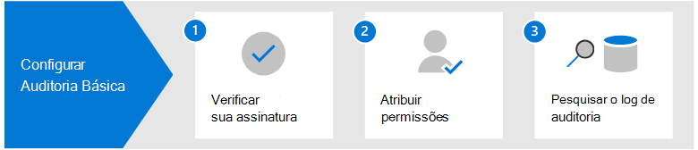

# Soluções de auditoria no Microsoft 365

As soluções de auditoria do Microsoft 365 fornecem uma solução integrada para ajudar as organizações a responder com eficácia a eventos de segurança, investigações forenses, investigações internas e obrigações de conformidade. Milhares de operações de usuário e de administrador realizadas em dezenas de serviços e soluções do Microsoft 365 são capturadas, registradas e retidas no log de auditoria unificado da sua organização. Os registros de auditoria para esses eventos podem ser pesquisados em sua organização por operadores de segurança, administradores de TI, equipes de risco internas e investigadores legais e de conformidade. Esse recurso fornece visibilidade das atividades realizadas em sua organização Microsoft 365.

## Soluções de auditoria do Microsoft 365

O Microsoft 365 oferece duas soluções de auditoria: Auditoria Básica e Auditoria Avançada.

### Auditoria Básica

A Auditoria Básica fornece a você a capacidade de registrar e pesquisar atividades auditadas e potencializar suas investigações forenses, de TI, de conformidade e legais.

- **Habilitada por padrão**. A Auditoria Básica é ativada por padrão para todas as organizações com a assinatura apropriada. Isso significa que os registros das atividades auditadas serão capturados e pesquisáveis. A única configuração necessária é atribuir as permissões necessárias para acessar a ferramenta de pesquisa de log de auditoria (e o cmdlet correspondente) e garantir que o usuário tenha a licença correta para os recursos de Auditoria Avançada.
- **Milhares de eventos de auditoria pesquisáveis**. Você pode pesquisar uma ampla variedade de atividades auditadas que ocorrem na maioria dos serviços do Microsoft 365 em sua organização. Para obter uma lista parcial das atividades que você pode pesquisar, consulte [Atividades auditadas](search-the-audit-log-in-security-and-compliance.md#audited-activities). Para obter uma lista dos serviços e recursos que oferecem suporte às atividades auditadas, consulte [Tipo de registro de log de Auditoria](/office/office-365-management-api/office-365-management-activity-api-schema#auditlogrecordtype).
- **Ferramenta de pesquisa de auditoria no centro de conformidade do Microsoft 365**. Use a ferramenta de pesquisa de log de Auditoria no centro de conformidade do Microsoft 365 para pesquisar registros de auditoria. Você pode pesquisar atividades específicas, atividades realizadas por usuários específicos e atividades que ocorreram em um intervalo de datas. Aqui está uma captura de tela da ferramenta de pesquisa de Auditoria no centro de conformidade.

   

- **Search-UnifiedAuditLog cmdlet**. Você também pode usar o cmdlet **Search-UnifiedAuditLog** no PowerShell do Exchange Online (o cmdlet subjacente para a ferramenta de pesquisa) para pesquisar eventos de auditoria ou para usar em um script. Para mais informações, confira:

  - [referência do cmdlet Search-UnifiedAuditLog](/powershell/module/exchange/search-unifiedauditlog)
  - [Usar um script do PowerShell para pesquisar o log de auditoria](audit-log-search-script.md)

- **Exportar registros de auditoria para um arquivo CSV**. Depois de executar a ferramenta de pesquisa de log de Auditoria na central de conformidade, você pode exportar os registros de auditoria retornados pela pesquisa para um arquivo CSV. Isso permite que você use a classificação e o filtro do Microsoft Excel em diferentes propriedades do registro de auditoria. Você também pode usar a funcionalidade de transformação do Power Query para Excel para dividir cada propriedade no objeto JSON AuditData em sua própria coluna. Isso permite que você exiba e compare com eficácia dados semelhantes para eventos diferentes. Para saber mais, confira [Exportar, configurar e exibir registros de log de auditoria](export-view-audit-log-records.md).

- **Acesso a registros de auditoria por meio da API da Atividade de Gestão do Office 365**. Um terceiro método para acessar e recuperar registros de auditoria é usar a API da Atividade de Gestão do Office 365. Isso permite que as organizações retenham dados de auditoria por períodos mais longos do que o padrão de 90 dias e permite que importem os seus dados de auditoria para uma solução de SIEM. Para mais informações, confira [referência da API da Atividade de Gestão do Office 365](/office/office-365-management-api/office-365-management-activity-api-reference).

- **Retenção de log de auditoria por 90 dias**. Quando uma atividade auditada é realizada por um usuário ou administrador, um registro de auditoria é gerado e armazenado no log de auditoria para a sua organização. Na Auditoria Básica, os registros são retidos por 90 dias, o que significa que você pode pesquisar atividades que ocorreram nos últimos três meses.

### Auditoria Avançada

A Auditoria Avançada se baseia nos recursos da Auditoria Básica, fornecendo políticas de retenção de log de auditoria, retenção mais longa de registros de auditoria, eventos cruciais de alto valor e acesso de maior largura de banda para a API da Atividade de Gestão do Office 365.

- **Políticas de retenção de log de Auditoria**. Você pode criar políticas de retenção de logs de auditoria personalizadas para manter registros de auditoria por períodos mais longos de até um ano (e até 10 anos para usuários com a licença complementar necessária). Você pode criar uma política para manter registros de auditoria com base no serviço onde ocorrem as atividades auditadas, em atividades auditadas específicas ou no usuário que executa uma atividade auditada.

- **Retenção mais longa de registros de auditoria**. Os registros de auditoria do Exchange, SharePoint e Azure Active Directory são retidos por um ano por padrão. Os registros de auditoria para todas as outras atividades são retidos por 90 dias por padrão, ou você pode usar políticas de retenção de log de auditoria para configurar períodos de retenção mais longos.

- **Eventos cruciais e de alto valor**. Os registros de auditoria para eventos cruciais podem ajudar sua organização a conduzir investigações forenses e de conformidade, fornecendo visibilidade a eventos como quando itens de email foram acessados ou quando itens de email foram respondidos e encaminhados, ou quando e o que um usuário pesquisou no Exchange Online e no SharePoint Online. Esses eventos cruciais podem ajudá-lo a investigar possíveis violações e a determinar o escopo dos comprometimentos.

- **Maior largura de banda para a API da Atividade de Gestão do Office 365**. A Auditoria Avançada fornece às organizações mais largura de banda para acessar os logs de auditoria por meio da API da Atividade de Gestão do Office 365. Embora todas as organizações (que possuem Auditoria Básica ou Auditoria Avançada) tenham inicialmente alocadas uma linha de base de 2.000 solicitações por minuto, esse limite aumentará dinamicamente dependendo da contagem de estações de uma organização e da sua assinatura de licenciamento. Isso faz com que as organizações com Auditoria Avançada obtenham cerca de duas vezes a largura de banda das organizações com Auditoria Básica.

Para obter informações mais detalhadas sobre os recursos de Auditoria Avançada, consulte [Auditoria Avançada no Microsoft 365](advanced-audit.md).

## Comparação dos principais recursos

A tabela a seguir compara os principais recursos disponíveis na Auditoria Básica e Auditoria Avançada. Todas as funcionalidades da Auditoria Básica estão incluídas na Auditoria Avançada.

|Funcionalidade|Auditoria Básica|Auditoria Avançada|
|:------|:-------------|:-------------|
|Habilitada por padrão|||
|Milhares de eventos de auditoria pesquisáveis|||
|Ferramenta de pesquisa de auditoria no centro de conformidade do Microsoft 365|||
|cmdlet Search-UnifiedAuditLog |||
|Exportar registros de auditoria para arquivo CSV|||
|Acesso a registros de auditoria por meio da API da Atividade de Gestão do Office 365 1|||
|Retenção de log de auditoria por 90 dias|||
|Retenção de log de auditoria por 1 ano|||
|Retenção de log de auditoria por 10 ano 2|||
|Políticas de retenção de log de Auditoria|||
|Eventos cruciais e de alto valor|||
||||
> [!NOTE]
> 1 A Auditoria Avançada inclui maior largura de banda de acesso à API da Atividade de Gestão do Office 365, que fornece acesso mais rápido aos dados de auditoria. 2 Além do licenciamento necessário para Auditoria Avançada (descrito na próxima seção), um usuário deve receber uma licença adicional de Retenção de Log de Auditoria de 10 anos para reter os seus registros de auditoria por 10 anos.

## Requisitos de licenciamento

As seções a seguir identificam os requisitos de licenciamento para Auditoria Básica e Auditoria Avançada. A funcionalidade de Auditoria Básica está incluída na Auditoria Avançada.

### Auditoria Básica

- Assinatura do Microsoft 365 Enterprise E3
- Microsoft 365 Business Premium
- Assinatura do Microsoft 365 Education A3
- Assinatura do Microsoft 365 US Government G3
- Assinatura do Microsoft 365 Government G1
- Assinatura do Office 365 Enterprise E3
- Assinatura do Office 365 Enterprise E1
- Assinatura do Office 365 Education A1
- Assinatura do Office 365 Education A3

### Auditoria Avançada

- Assinatura do Microsoft 365 Enterprise E5.
- Assinatura do Microsoft 365 Enterprise E3 + complemento do Microsoft 365 E5 Compliance.
- Assinatura do Microsoft 365 Enterprise E3 + complemento do Microsoft 365 E5 Compliance e complemento de Auditoria
- Assinatura do Microsoft 365 Education A5
- Assinatura do Microsoft 365 Education A3 + complemento do Microsoft 365 A5 Compliance.
- Assinatura do Microsoft 365 Education A3 + complemento do Microsoft 365 A5 eDiscovery e complemento de Auditoria
- Assinatura do Microsoft 365 Government G5
- Assinatura do Microsoft 365 Enterprise G5 + complemento do Microsoft 365 G5 Compliance.
- Assinatura do Microsoft 365 Enterprise G5 + complemento do Microsoft 365 G5 eDiscovery e complemento de Auditoria
- Assinatura do Office 365 Enterprise E5
- Assinatura do Office 365 Education A5
- Assinatura do Office 365 Enterprise E3 + complemento da Conformidade Avançada do Office 365 (indisponível para novas assinaturas)

## Configurar as soluções de auditoria do Microsoft 365

Para começar a usar as soluções de auditoria no Microsoft 365, consulte as seguintes orientações de configuração.

### Configurar Auditoria Básica

A primeira etapa é configurar a Auditoria Básica e, em seguida, iniciar as pesquisas de log de auditoria.

1. Verifique se sua organização tem uma assinatura que ofereça suporte à Auditoria Básica e, se aplicável, uma assinatura que ofereça suporte à Auditoria Avançada.

2. Atribua permissões no Exchange Online para pessoas na sua organização que usarão a ferramenta de pesquisa de log de auditoria no Centro de conformidade do Microsoft 365 ou usarão o cmdlet **Search-UnifiedAuditLog**. Especificamente, os usuários devem ser atribuídos à função Logs de Auditoria Somente Exibição ou Logs de Auditoria no Exchange Online.

3. Pesquise o log de auditoria. Depois de concluir as etapas 1 e 2, os usuários na sua organização poderão usar a ferramenta de pesquisa de log de auditoria (ou cmdlet correspondente) para pesquisar atividades auditadas.

Para obter instruções mais detalhadas, consulte [Configurar Auditoria Básica](set-up-basic-audit.md).

### Configurar Auditoria Avançada

Se a sua organização tiver uma assinatura que ofereça suporte à Auditoria Avançada, execute as etapas a seguir para configurar e usar os recursos adicionais da Auditoria Avançada.

1. Configurar Auditoria Avançada para usuários. Esta etapa consiste nas seguintes tarefas:

   - Verificar se os usuários foram atribuídos a licença apropriada ou a licença complementar para Auditoria Avançada.
  
   - A ativação do aplicativo/plano de serviço de Auditoria Avançada deve estar habilitada para esses usuários.
  
   - Habilitar a auditoria de eventos cruciais e, em seguida, ativar o aplicativo/plano de serviço de Auditoria Avançada para esses usuários.

2. Habilitar o registro de eventos cruciais quando os usuários realizam pesquisas no Exchange Online e no SharePoint Online.

3. Configurar as políticas de retenção de log de auditoria. Além da política padrão que retém os logs de auditoria do Microsoft Exchange, Microsoft Office SharePoint Online e Microsoft Azure AD por um ano, você pode criar políticas adicionais de retenção de log de auditoria para atender aos requisitos de operações de segurança, TI e equipes de conformidade da sua organização.

4. Pesquise eventos cruciais e outras atividades ao conduzir investigações forenses. Depois de concluir as etapas 1 e 2, você pode pesquisar o log de auditoria em busca de eventos cruciais e outras atividades durante as investigações forenses de contas comprometidas e outros tipos de investigações de segurança ou conformidade.

Para obter instruções mais detalhadas, consulte [Configurar Auditoria Avançada](set-up-advanced-audit.md).

## Treinamento

Treinar sua equipe de operações de segurança, administradores de TI e equipe de investigadores de conformidade nos conceitos base de Auditoria Básica e Auditoria Avançada pode ajudar sua organização a começar mais rapidamente a usar a auditoria para ajudar em suas investigações. O Microsoft 365 fornece o seguinte recurso para ajudar esses usuários em sua organização a começar com a auditoria: [Descrever os recursos de descoberta eletrônica e auditoria no Microsoft 365](/learn/modules/describe-ediscovery-capabilities-of-microsoft-365).
