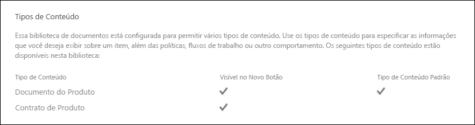

# <a name="use-retention-labels-to-manage-the-lifecycle-of-documents-stored-in-sharepoint"></a>Use os rótulos de retenção para gerenciar o ciclo de vida dos documentos armazenados no SharePoint.

>*[Diretrizes de licenciamento do Microsoft 365 para segurança e conformidade](https://aka.ms/ComplianceSD).*

Este artigo descreve como você pode gerenciar o ciclo de vida dos documentos que estão armazenados no SharePoint usando rótulos de retenção aplicados automaticamente e a retenção baseada em eventos.

A funcionalidade de aplicação automática usa metadados do SharePoint para classificação de documento. O exemplo neste artigo é para documentos relacionados a produtos, mas os mesmos conceitos podem ser usados para outros cenários. Por exemplo, no setor de petróleo e gás, você pode usá-lo para gerenciar o ciclo de vida dos documentos sobre ativos físicos, como plataformas de petróleo, registros de poços ou licenças de produção. No setor de serviços financeiros, você poderia gerenciar conta bancária, hipoteca ou documentos de contratos de seguro. No setor público, você poderia gerenciar autorizações de construção ou formulários de imposto.

Neste artigo, analisaremos a arquitetura de informações e a definição dos rótulos de retenção. Em seguida, classificaremos documentos pela aplicação automática dos rótulos. E finalmente, geraremos os eventos que iniciam o período de retenção.

## <a name="information-architecture"></a>Arquitetura de informações

Nosso cenário é uma empresa de manufatura que usa o SharePoint para armazenar todos os documentos sobre os produtos que a empresa desenvolve. Esses documentos incluem as especificações do produto, acordos com fornecedores e manuais de usuário. Quando esses documentos são armazenados no SharePoint através de políticas de Gerenciamento de Conteúdo Corporativo, os metadados do documento que são usados para classificá-lo são definidos. Cada documento tem as seguintes propriedades de metadados:

- **Tipo de Documento** (como especificações de produto, contrato ou manual do usuário)

- **Nome do produto**

- **Status** (rascunho ou final)

Esses metadados formam uma base do tipo de conteúdo chamado de *Documento de Produção* para todos os documentos.


> [!NOTE]
> As propriedades **Tipos de Documento** e **Status** são usadas mais tarde pelas políticas de retenção deste cenário para classificação e aplicação automática dos rótulos de retenção.

Poderíamos ter vários tipos de conteúdo que representam diferentes tipos de documentos, mas vamos nos concentrar na documentação do produto.

Neste cenário, usamos o serviço de Metadados Gerenciados e o Repositório de Termos para criar um conjunto de termos para *Tipo de Documento* e outro para *Nome do Produto*. Para cada conjunto de termos, criamos um termo para cada valor. Seria algo parecido com isto no Repositório de Termos do SharePoint da sua organização:


*Tipo de Conteúdo* pode ser criado e publicado pelo uso do [Hub de Tipo de Conteúdo](https://support.office.com/article/manage-content-type-publishing-06f39ac0-5576-4b68-abbc-82b68334889b). Você também pode criar e publicar um tipo de conteúdo pelo uso de ferramentas de provisionamento de site, como a [estrutura de provisionamento PnP](https://docs.microsoft.com/sharepoint/dev/solution-guidance/pnp-provisioning-framework) ou [esquema JSON de design de site](https://docs.microsoft.com/sharepoint/dev/declarative-customization/site-design-json-schema#define-a-new-content-type).

Cada produto tem um site dedicado do SharePoint que contém uma biblioteca de documentos que tem os corretos tipos de conteúdo habilitados. Todos os documentos são armazenados na biblioteca de documentos.

[  ](../media/SPRetention3.png#lightbox)

> [!NOTE]
> Em vez de ter um site do SharePoint por produto, a empresa de manufatura deste cenário poderia usar um Microsoft Team por produto para colaboração de suporte entre os membros da equipe, como através de chat persistente e o uso da guia **Arquivos** no Teams para gerenciamento de documentos. Neste artigo, nós apenas concentramos em documentos, portanto, só usaremos um site.

Este é um modo de exibição da biblioteca de documentos do produto Spinning Widget:

[  ](../media/SPRetention4.png#lightbox)

Agora que temos a arquitetura de informações básica em vigor para o gerenciamento de documentos, vamos dar uma olhada na estratégia de retenção e descarte para os documentos que usam os metadados e como classificamos esses documentos.

## <a name="retention-and-disposition"></a>Retenção e disposição

As políticas de conformidade e de governança de dados da empresa de manufatura ditam como os dados são preservados e descartados. Os documentos relacionados a produtos devem ser mantidos enquanto o produto estiver sendo fabricado e por um determinado período adicional. O período adicional difere para as especificações do produto, contratos e manuais do usuário. A tabela a seguir indica os requisitos de retenção e descarte:

|   Tipo de documento            |   Retenção                            |   Disposição                                |
| -------------------------- | -------------------------------------- | -------------------------------------------- |
| Especificações do produto      | 5 anos após o fim da produção  | Excluir                                       |
| Contratos de produtos          | 10 anos após o fim da produção | Analisar                                       |
| Manuais do usuário                | 5 anos após o fim da produção  | Excluir                                       |
| Todos os outros tipos de documentos | Não reter ativamente  | Excluir quando o documento tiver mais de 3 anos <br /><br /> Um documento é considerado com mais de 3 anos se não tiver sido modificado nos últimos 3 anos. |
|||

Usamos o Centro de Conformidade do Microsoft 365 para criar os seguintes [rótulos de retenção](retention.md#retention-labels):

  - Especificação do Produto

  - Contrato de produto

  - Manual de usuário

Neste artigo, mostraremos como criar e aplicar automaticamente o rótulo de retenção da Especificação do Produto. Para implementar o cenário completo, você também deve criar e aplicar automaticamente os rótulos de retenção para os outros dois tipos de documento.

### <a name="settings-for-the-product-specification-retention-label"></a>Configurações para a etiqueta de retenção da Especificação do Produto

Aqui está o [plano de arquivo](file-plan-manager.md) para a etiqueta de retenção da Especificação de Produto:

- **Nome:** Especificação do Produto

- **Descrição para administradores:** Reter por 5 anos após o fim da produção, exclusão automática, retenção baseada em evento, e o tipo de evento é *Cessação do Produto*.

- **Descrição para usuários:** Reter por 5 anos após o fim da produção.

- **Ação de retenção:** Reter e excluir.

- **Duração da retenção:** 5 anos (1,825 dias).

- **Rótulo de registro**: Configure o rótulo de registro para classificar o conteúdo como um [registro](records-management.md#records). (Os documentos que são classificados como um *registro* não podem ser modificados ou excluídos por usuários.)

- **Descritores de plano de arquivo:** (para simplificar o cenário, nenhum descritor de arquivo é fornecido)

A captura de tela a seguir mostra as configurações quando você cria o rótulo de retenção para Especificação do Produto no Centro de Conformidade do Microsoft 365. Você pode criar o tipo de evento *Cessação do Produto* ao criar o rótulo de retenção. Confira o procedimento nas seguintes seções.


> [!NOTE]
> Para evitar uma espera de 5 anos para a exclusão do documento, defina a duração da retenção para ***1 dia*** se estiver recriando esse cenário em um ambiente de teste.

### <a name="create-an-event-type-when-you-create-a-retention-label"></a>Criar um tipo de evento quando você criar um rótulo de retenção

1. Do **Conteúdo retido ou excluído baseado em** lista suspensa, selecione **um evento**.

2. Selecione **Escolher um tipo de evento**.
    
    

3. Selecione **Escolher um tipo de evento**, e depois selecione **Criar novos tipos de eventos** na página **escolher um tipo de evento**.

4. Crie um tipo de evento denominado ***Cessação do Produto***, digite uma descrição, e selecione **Concluir**.

5. Novamente na página **Escolher um tipo de evento**, selecione o tipo de evento **Cessação do Produto** que você criou e, em seguida, selecione **Adicionar**.

   Veja como é a aparência das configurações para o rótulo de retenção de Especificação do Produto. 

   

6. Selecione **Criar esse rótulo**. 

   > [!TIP]
   > Para etapas mais detalhadas, confira [Criar um rótulo cujo período de retenção está baseado em um evento](event-driven-retention.md#step-1-create-a-label-whose-retention-period-is-based-on-an-event).

Agora, vamos dar uma olhada em como aplicar automaticamente o rótulo de retenção ao conteúdo de especificação do produto.

## <a name="auto-apply-retention-labels-to-classify-content"></a>Aplicação automática dos rótulos de retenção para classificar conteúdo.

Vamos usar a Linguagem de Consulta de Palavra-chave (KQL) para [aplicação automática](apply-retention-labels-automatically.md) de rótulos de retenção que criamos. KQL é a linguagem que é usada para compilar consultas de pesquisa. Na KQL, você pode pesquisar usando as palavras-chave ou as propriedades gerenciadas. Para mais informações, confira [Referência de sintaxe da Linguagem de Consulta de Palavra-chave (KQL)](https://docs.microsoft.com/sharepoint/dev/general-development/keyword-query-language-kql-syntax-reference).

Basicamente, gostaríamos de dizer ao Microsoft 365 para "aplicar o rótulo de retenção da *Especificação do Produto* a todos os documentos que têm um **Status** de ***Final*** e um **Tipo de Documento** de ***Especificação de Produto***.” Lembre-se de que **Status** e **Tipo de Documento** são as colunas de site que definimos para o tipo de conteúdo de Documentação do Produto na seção [Arquitetura de Informação](#information-architecture). Para fazer isso, precisamos configurar o esquema de pesquisa.

Quando o SharePoint indexa conteúdo, ele gera automaticamente propriedades rastreadas para cada coluna de site. Neste cenário, estamos interessados nas propriedades **Tipo de documento** e **Status**. Precisamos de documentos na biblioteca que são do tipo de conteúdo correto e tenham as colunas de site preenchidas na pesquisa para assim criar as propriedades rastreadas.

No centro de administração do SharePoint, abra a configuração de Pesquisa e selecione **Gerenciar Esquema de Pesquisa** para exibir e configurar as propriedades rastreadas.


Se digitarmos ***status*** na caixa **Propriedades rastreadas** e selecionarmos a seta verde, vamos ver um resultado como esse:


A propriedade **ows\_Status\_** (repare no sublinhado duplo) é a que nos interessa. Ela mapeia a propriedade **Status** do tipo de conteúdo do Documento de Produção.

Agora, se digitarmos ***ows\_doc*** e selecionarmos a seta verde, vamos ver algo assim:


A propriedade **ows\_Doc\_x0020\_Type** é a segunda propriedade que nos interessa. Ela mapeia a propriedade **Tipo de Documento** do tipo de conteúdo do Documento de Produção.

> [!TIP]
> Para identificar o nome de uma propriedade rastreada para esse cenário, vá para a biblioteca de documentos que contém os documentos da produção. Em seguida, vá para as configurações da biblioteca. Para **Colunas**, selecione o nome da coluna (por exemplo, **Status** ou **Tipo de Documento**) para abrir a página da coluna do site. O parâmetro *Campo* na URL dessa página contém o nome do campo. O nome do campo, com o prefixo "ows_", é o nome da propriedade rastreada. Por exemplo, a propriedade rastreada da URL `https://tenantname.sharepoint.com/sites/SpinningWidget/_layouts/15/FldEdit.aspx?List=%7BC38C2F45-3BD6-4C3B-AA3B-EF5DF6B3D172%7D&Field=_Status` corresponde ao *OWS\_\_status*.

Se as propriedades rastreadas que você está procurando não aparecerem na seção Gerenciar Esquema de Pesquisa no centro de administração do SharePoint:

- Talvez os documentos ainda não foram indexados. Você pode forçar uma nova indexação da biblioteca acessando **Configurações da biblioteca do documento** > **Configurações Avançadas**.

- Se a biblioteca de documentos estiver em um site moderno, certifique-se de que o administrador do SharePoint também é um administrador do conjunto de sites.

Para obter mais informações sobre propriedades rastreadas e gerenciadas, consulte [Propriedades gerenciadas criadas automaticamente no SharePoint Server](https://docs.microsoft.com/sharepoint/technical-reference/automatically-created-managed-properties-in-sharepoint).

### <a name="map-crawled-properties-to-pre-defined-managed-properties"></a>Mapear propriedades rastreadas para propriedades gerenciadas predefinidas

KQL não pode usar propriedades rastreadas em consultas de pesquisa. É preciso usar uma propriedade gerenciada. Em um cenário típico de pesquisa, criamos uma propriedade gerenciada e a mapeamos para a propriedade rastreada que precisamos. No entanto, para aplicar automaticamente os rótulos de retenção, só é possível especificar as propriedades gerenciadas predefinidas em KQL, e não as propriedades gerenciadas personalizadas. Existe um conjunto de propriedades gerenciadas predefinidas no sistema para cadeia de caracteres *RefinableString00* para *RefinableString199* que você pode usar. Para obter uma lista completa, confira [Propriedades gerenciadas padrão não usadas ](https://docs.microsoft.com/sharepoint/manage-search-schema#default-unused-managed-properties). Essas propriedades gerenciadas padrão costumam ser usadas para definir refinadores de pesquisa.

Para a consulta KQL aplicar automaticamente o rótulo de retenção correto ao conteúdo de documento do produto, mapeamos as propriedades rastreadas **ows\_Doc\_x0020\_Type* e *ows\_\_Status** para duas propriedades gerenciadas refináveis. Em nosso ambiente de teste para esse cenário, **RefinableString00** e **RefinableString01** não estão sendo usadas. Determinamos isso ao examinar **Propriedades Gerenciadas** em **Gerenciar Esquema de Pesquisa** no centro de administração do SharePoint.

[  ](../media/SPRetention12.png#lightbox)

Observe que a coluna **Propriedades Rastreadas Mapeadas** na captura de tela anterior está vazia.

Para mapear a propriedade rastreada **ows\_Doc\_x0020\_Type**, siga as seguintes etapas:

1. Na caixa de filtro **Propriedade gerenciada**, digite ***RefinableString00*** e selecione a seta verde.

2. Na lista de resultados, selecione o link **RefinableString00** e, em seguida, role para baixo até a seção **Mapeamentos para propriedades rastreadas**.  

3. Selecione **Adicionar um Mapeamento** e digite ***ows\_Doc\_x0020\_Type*** na caixa **Pesquisar um nome de propriedade rastreada** na janela **Seleção da propriedade rastreada**. Selecione **Localizar**.  

4. Na lista de resultados, selecione **ows\_Doc\_x0020\_Type** e, em seguida, selecione **OK**.

   Na seção **Propriedades Rastreadas Mapeadas**, você verá algo semelhante a essa captura de tela:

   [  ](../media/SPRetention13.png#lightbox)


5. Role até a parte inferior da página e selecione **OK** para salvar o mapeamento.

Repita essas etapas para mapear **RefinableString01** e **ows\_\_Status**.

Agora, você deve ter duas propriedades gerenciadas mapeadas para duas propriedades rastreadas:

[](../media/SPRetention14.png#lightbox)

Vamos verificar se nossa configuração está correta, executando uma pesquisa corporativa. Em um navegador, vá para *https://\<your_tenant>. sharepoint.com/search*. Na caixa de pesquisa, digite ***RefinableString00: "Especificação do Produto"*** e pressione Enter. Essa pesquisa deve retornar todos os documentos que tenham uma **Especificação de Produto** do ***Tipo de Documento***.

Agora, na caixa de pesquisa, digite **RefinableString00: "Especificação do Produto" e RefinableString01: Final** e pressione Enter. Isso deve retornar todos os documentos que tenham **Especificação de Produto** do ***Tipo de Documento*** e um **Status** de ***Final***.

### <a name="create-auto-apply-label-policies"></a>Criar as políticas de aplicação automática de rótulos

Agora que verificamos que a consulta KQL está funcionando, vamos criar uma política de rótulo que usa uma consulta KQL para aplicar automaticamente o rótulo de retenção de Especificação do Produto aos documentos apropriados.

1. No [centro de conformidade](https://compliance.microsoft.com/homepage), vá para **Gerenciamento de registros** > **Políticas de rótulo** > **Aplicar um rótulo automaticamente**.

   [](../media/SPRetention16.png#lightbox)

2. Na página do assistente**Escolher um rótulo para aplicar automaticamente**, selecione **Escolher um rótulo para aplicar automaticamente**.

3. Na lista de rótulos, selecione **Especificação do Produto**. Em seguida, selecione **Adicionar** e **Próximo**.

4. Selecione **Aplicar rótulo ao conteúdo que contém propriedades, palavras ou frases específicas** e, em seguida, selecione **Próximo**.

   [](../media/SPRetention17.png#lightbox)

   Na próxima etapa, você fornecerá a mesma consulta de pesquisa KQL que testamos na seção anterior. Esta consulta retorna todos os documentos de Especificação do Produto que têm um status *Final*. Quando usamos essa mesma consulta na política de rótulos, o rótulo de retenção de Especificação do Produto será automaticamente aplicado a todos os documentos que a correspondem.

5. Na caixa **Editor de consulta de palavra-chave**, digite ***RefinableString00: "Especificação do Produto" E RefinableString01:Final*** e, em seguida, selecione **Próximo**.

   

6. Digite um nome (por exemplo, ***Aplicação automática de Rótulo de Especificação do Produto***) e uma descrição opcional para a política de rótulo e, em seguida, selecione **Próximo**.

7. Na página do assistente **Escolher locais**, selecione os locais de conteúdo aos quais deseja aplicar a política. Para este cenário, aplicamos essa política apenas a locais do SharePoint, pois todos os documentos de produção são armazenados nas bibliotecas de documentos do SharePoint. Selecione **Deixe-me escolher locais específicos** e, em seguida, alterne para desativado o status de **email do Exchange**, **contas do OneDrive**, e **Grupos do Microsoft 365**. Certifique-se que o status de sites do SharePoint está definido como ativado. 

    

   > [!TIP]
   > Em vez de aplicar a política a todos os sites do SharePoint, você pode selecionar **Escolher sites** e adicionar as URLs para sites específicos do SharePoint.

8. Selecione **Próximo** para exibir a página **Examinar suas configurações**.

    

9. Selecione **Aplicar automaticamente** para criar a política do rótulo.

   >[!NOTE]
   >Leva até 7 dias para aplicar automaticamente o rótulo de especificação do produto a todos os documentos que correspondam à consulta de pesquisa KQL.

### <a name="verify-that-the-retention-label-was-automatically-applied"></a>Verificar que o rótulo de retenção foi aplicado automaticamente

Depois de 7 dias, use o [explorador de atividades](data-classification-activity-explorer.md) no centro de conformidade para verificar que a política de rótulos que criamos tenha aplicado automaticamente os rótulos de retenção para os documentos do produto.

Também examine as propriedades dos documentos na Biblioteca de Documento. No painel de informações, você pode ver que o rótulo de retenção é aplicado a um documento selecionado.

[](../media/SPRetention21.png#lightbox)

Como os rótulos de retenção foram aplicados automaticamente aos documentos, esses documentos são protegidos de exclusão porque o rótulo de retenção foi configurado para declarar os documentos como *registros*. Como um exemplo dessa proteção, obtemos a seguinte mensagem de erro quando tentamos excluir um desses documentos:

[](../media/SPRetention22.png#lightbox)

## <a name="generate-the-event-that-triggers-the-retention-period"></a>Gerar o evento que dispara o período de retenção

Agora que os rótulos de retenção foram aplicados, vamos nos concentrar no evento que indicará o fim da produção para um determinado produto. Esse evento dispara o início do período de retenção que é definido nos rótulos de retenção. Por exemplo, para documentos de especificação do produto, o período de retenção de 5 anos começa quando o evento "fim da produção" é acionado.

Você pode criar manualmente o evento no Centro de Conformidade do Microsoft 365 acessando **Gerenciamento de Registros** > **Eventos**. Você escolheria o tipo de evento, definiria as identificações de ativos corretas e inseriria uma data para o evento. Para mais informações, confira [Iniciar a retenção quando um evento ocorrer](event-driven-retention.md).

Mas, para este cenário, geraremos automaticamente o evento a partir de um sistema de produção externo. O sistema é uma lista simples do SharePoint que indica se um produto está em produção. Um fluxo de [Power Automate](https://docs.microsoft.com/flow/getting-started) que é associado à lista disparará o evento. Em um cenário real, você poderia usar vários sistemas para gerar o evento, como um sistema de RH ou de CRM. O Power Automate inclui várias interações prontas para uso e o bloco de compilação para cargas de trabalho do Microsoft 365, como Microsoft Exchange, SharePoint, Teams e Dynamics 365 mais os aplicativos de terceiros, como Twitter, Box, Salesforce e Workdays. Esse recurso facilita a integração do Power Automate com vários sistemas. Para obter mais informações, confira [Automatizar a retenção orientada a eventos](automate-event-driven-retention.md).

A captura de tela a seguir mostra a lista do SharePoint que será usada para acionar o evento:

[](../media/SPRetention23.png#lightbox)

Há dois produtos em produção no momento, como indicados pelo valor ***Sim*** na coluna **Em Produção**. Quando o valor nesta coluna está definido como ***Não*** para um produto, o fluxo associado à lista gerará automaticamente o evento. Este evento dispara o início do período de retenção para o rótulo de retenção que foi aplicado automaticamente aos documentos do produto correspondente.

Para esse cenário, usamos o seguinte fluxo para disparar o evento:

[](../media/SPRetention24.png#lightbox)

Para criar esse fluxo, inicie o a partir de um conector do SharePoint e selecione o disparador **Quando um item é criado ou modificado**. Especifique o endereço do site e o nome da lista. Em seguida, adicione uma condição baseada em quando o valor de coluna da lista **Em Produção** é definido como ***Não*** (ou igual a *falso* no cartão da condição). Em seguida, adicione uma ação com base no modelo interno HTTP. Use os valores da seção a seguir para configurar a ação HTTP. Você pode copiar os valores das propriedades para **URI** e **Corpo** da próxima seção e, colá-los no modelo.

- **Método**: POSTAR
- **URI**: `https://ps.compliance.protection.outlook.com/psws/service.svc/ComplianceRetentionEvent`
- **Cabeçalhos**: Chave = content-type, valor = application/atom+xml
- **Corpo**:
    
    ```xml
    <?xml version='1.0' encoding='utf-8' standalone='yes'>
    <entry xmlns:d='http://schemas.microsoft.com/ado/2007/08/dataservices' xmlns:m='http://schemas.microsoft.com/ado/2007/08/dataservices/metadata' xmlns='https://www.w3.org/2005/Atom'>
    <category scheme='http://schemas.microsoft.com/ado/2007/08/dataservices/scheme' term='Exchange.ComplianceRetentionEvent'>
    <updated>9/9/2017 10:50:00 PM</updated>
    <content type='application/xml'>
    <m:properties>
    <d:Name>Cessation Production @{triggerBody()?['Product_x0020_Name']?['Value']}</d:Name>
    <d:EventType>Product Cessation&lt;</d:EventType>
    <d:SharePointAssetIdQuery>ProductName:&quot;@{triggerBody()?['Product_x0020_Name']?['Value']}<d:SharePointAssetIdQuery>
    <d:EventDateTime>@{formatDateTime(utcNow(),'yyyy-MM-dd')}</d:EventDateTime>
    </m:properties>
    </content&gt>
    </entry>
    ```

Esta lista descreve os parâmetros na propriedade **Corpo** da ação que deve ser configurada para este cenário:

- **Nome**: Esse parâmetro especifica o nome do evento a ser criado no Centro de Conformidade do Microsoft 365. Para este cenário, o nome é "Cessação de Produção *xxx*", em que *xxx* é o valor da propriedade gerenciada **ProductName** que criamos anteriormente.
- **EventType**: O valor desse parâmetro corresponde ao tipo de evento ao qual o evento criado será aplicado. Esse tipo de evento foi definido quando você criou o rótulo de retenção. Para esse cenário, o tipo de evento é "Cessação de Produção."
- **SharePointAssetIdQuery**: Esse parâmetro define a ID do ativo para o evento. A retenção baseada em evento precisa de um identificador exclusivo para o documento. Podemos usar as IDs de ativos para identificar os documentos aos quais um determinado evento é aplicável, ou como neste cenário, a coluna de metadados do **Nome do Produto**. Para fazer isso, precisamos criar uma nova propriedade gerenciada do **ProductName** que pode ser usada na consulta KQL. (Como alternativa, poderíamos usar **RefinableString00**, em vez de criar uma nova propriedade gerenciada). Também precisamos mapear essa nova propriedade gerenciada para a propriedade rastreada ** ows_Product_x0020_Name**. Aqui está uma captura de tela da propriedade gerenciada.

    [](../media/SPRetention25.png#lightbox)

- **EventDateTime**: Este parâmetro define a data que ocorre o evento. Usar o formato da data atual:<br/><br/>*formatDateTime(utcNow(),'yyyy-MM-dd'*)

### <a name="putting-it-all-together"></a>Colocando tudo em um só lugar

Agora, o rótulo de retenção é criado e aplicado automaticamente, e o fluxo é configurado e criado. Quando o valor na coluna **Em Produção** para o produto Widget Giratório na lista Produtos for alterado de ***Sim*** para ***Não***, o fluxo é disparado para criar o evento. Para ver esse evento no centro de conformidade, vá para **Gerenciamento de registros** > **Eventos**.

[](../media/SPRetention28.png#lightbox)

Selecione o evento para visualizar os detalhes na página do submenu. Observe que mesmo que criando o evento, o status do evento mostra que nenhum site do SharePoint ou documentos foram processados.


Porém, após um atraso, status do evento mostrará que um site do SharePoint e um documento do SharePoint foram processados.  


 
Isso mostra que o período de retenção para o rótulo aplicado ao documento do produto Widget Giratório foi iniciado, com base nos dados de evento do evento *Cessação de Produção do Widget Giratório*. Supondo que você implementou o cenário em seu ambiente de teste, configurando um período de retenção de um dia, você poderá acessar a biblioteca de documentos para os documentos de seu produto alguns dias após o evento ser criado e verificar se o documento foi excluído (após o trabalho de exclusão no SharePoint ter sido executado).

### <a name="more-about-asset-ids"></a>Mais sobre IDs de ativos

Como o artigo sobre[Iniciar de retenção quando um evento ocorre](event-driven-retention.md) explica, é importante compreender a relação entre tipos de evento, rótulos de retenção, eventos e as IDs de ativos. A ID de ativos é simplesmente uma propriedade de documento no SharePoint e no OneDrive. Ela ajuda você a identificar os documentos cujo período de retenção será disparado pelo evento. Por padrão, o SharePoint tem uma propriedade **ID de Ativo** que você pode usar para a retenção de eventos:


Conforme a seguinte captura de tela mostra, a propriedade gerenciada por ID de ativo é chamada de **ComplianceAssetId**.

[](../media/SPRetention27.png#lightbox)

Em vez de usar a propriedade **ID de ativo** padrão, como fazemos nesse cenário, você pode usar qualquer outra propriedade. Mas é importante entender que se você não especificar uma ID de ativo ou palavras-chave para um evento, todo o conteúdo que tenha um rótulo desse tipo de evento, terá seu período de retenção disparado pelo evento.

### <a name="using-advanced-search-in-sharepoint"></a>Usando a pesquisa avançada no SharePoint

Na captura de tela anterior, você pode ver que há outra propriedade gerenciada relacionada aos rótulos de retenção chamada **ComplianceTag**, e que é mapeada para uma propriedade rastreada. A propriedade gerenciada **ComplianceAssetId** também é mapeada para uma propriedade rastreada. Isso significa que você pode usar essas propriedades gerenciadas na pesquisa avançada para recuperar todos os documentos que tenham sido marcados com um rótulo de retenção.
