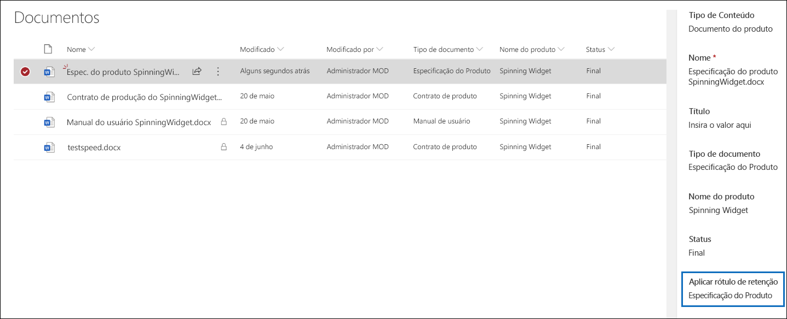

# <a name="manage-the-lifecycle-of-sharepoint-documents-with-retention-labels"></a><span data-ttu-id="bff87-104">Gerencie o ciclo de vida dos documentos do SharePoint com rótulos de retenção</span><span class="sxs-lookup"><span data-stu-id="bff87-104">Manage the lifecycle of SharePoint documents with retention labels</span></span>

><span data-ttu-id="bff87-105">*[Diretrizes de licenciamento do Microsoft 365 para segurança e conformidade](https://aka.ms/ComplianceSD).*</span><span class="sxs-lookup"><span data-stu-id="bff87-105">*[Microsoft 365 licensing guidance for security & compliance](https://aka.ms/ComplianceSD).*</span></span>

<span data-ttu-id="bff87-106">Este artigo descreve como é possível gerenciar o ciclo de vida dos documentos relacionados a produtos armazenados no SharePoint Online usando rótulos de retenção do Office 365, e especificamente aplicando automaticamente os rótulos e configurando a retenção baseada em eventos.</span><span class="sxs-lookup"><span data-stu-id="bff87-106">This article describes how you can manage the lifecycle of product-related documents stored in SharePoint Online by using Office 365 retention labels, and specifically by auto-applying labels and configuring event-based retention.</span></span> <span data-ttu-id="bff87-107">A funcionalidade de aplicação automática usa a classificação de documentos usando os metadados do SharePoint.</span><span class="sxs-lookup"><span data-stu-id="bff87-107">The auto-apply functionality leverages document classification by the use of SharePoint metadata.</span></span> <span data-ttu-id="bff87-108">O cenário neste artigo se baseia em documentos relacionados a produtos, mas os mesmos conceitos podem ser usados para outros cenários.</span><span class="sxs-lookup"><span data-stu-id="bff87-108">The scenario in this article is based on product-related documents, but the same concepts can be used for other scenarios.</span></span> <span data-ttu-id="bff87-109">Por exemplo, no setor de petróleo e gás, você pode gerenciar o ciclo de vida dos documentos relacionados a ativos físicos, como plataformas de petróleo, registros de poços ou licenças de produção.</span><span class="sxs-lookup"><span data-stu-id="bff87-109">For example, in the oil and gas industry, you could manage the lifecycle of documents related to physical assets such as oil platforms, well logs, or production licenses.</span></span> <span data-ttu-id="bff87-110">No setor de serviços financeiros, você pode gerenciar documentos relacionados a contas bancárias, hipotecas ou contratos de seguro.</span><span class="sxs-lookup"><span data-stu-id="bff87-110">In the financial services industry, you can manage documents related to bank accounts, mortgages, or insurance contracts.</span></span> <span data-ttu-id="bff87-111">No setor público, você pode gerenciar documentos relacionados a autorizações de construção ou formulários de imposto.</span><span class="sxs-lookup"><span data-stu-id="bff87-111">In the public sector, you can manage documents related to construction permits or tax forms.</span></span>

<span data-ttu-id="bff87-112">Vamos dar uma olhada no cenário deste artigo.</span><span class="sxs-lookup"><span data-stu-id="bff87-112">Let's look at the scenario for this article.</span></span> <span data-ttu-id="bff87-113">Analisaremos a arquitetura de informações e a definição dos rótulos de retenção.</span><span class="sxs-lookup"><span data-stu-id="bff87-113">We'll look at the information architecture and the definition of the retention labels.</span></span> <span data-ttu-id="bff87-114">Em seguida, examinaremos a classificação de documentos, aplicando automaticamente os rótulos e, por fim, geraremos os eventos que iniciam o período de retenção.</span><span class="sxs-lookup"><span data-stu-id="bff87-114">Then we'll look at classifying documents by auto-applying the labels, and finally generating the events that initiate the start of the retention period.</span></span>

## <a name="information-architecture"></a><span data-ttu-id="bff87-115">Arquitetura de informações</span><span class="sxs-lookup"><span data-stu-id="bff87-115">Information architecture</span></span>

<span data-ttu-id="bff87-116">O cenário deste artigo baseia-se em uma empresa de manufatura que usa o Office 365 SharePoint Online para armazenar todos os documentos relacionados aos produtos da empresa.</span><span class="sxs-lookup"><span data-stu-id="bff87-116">The scenario for this article is based on a manufacturing company that uses Office 365 SharePoint Online to store all the documents related to the products the company develops.</span></span> <span data-ttu-id="bff87-117">Esses documentos incluem as especificações do produto, acordos com fornecedores e manuais de usuário.</span><span class="sxs-lookup"><span data-stu-id="bff87-117">These documents include product specifications, agreements with suppliers, and user manuals.</span></span> <span data-ttu-id="bff87-118">Ao armazenar esses documentos no SharePoint como parte das políticas de Gerenciamento de Conteúdo Corporativo, os metadados do documento são definidos e usados para classificá-los.</span><span class="sxs-lookup"><span data-stu-id="bff87-118">When these documents are stored in SharePoint as part of the Enterprise Content Management policies, document metadata is defined and used to classify them.</span></span> <span data-ttu-id="bff87-119">Cada documento tem as seguintes propriedades de metadados:</span><span class="sxs-lookup"><span data-stu-id="bff87-119">Each document has the following metadata properties:</span></span>

- <span data-ttu-id="bff87-120">**Tipo de documento** (como especificações de produto, contrato e manuais do usuário)</span><span class="sxs-lookup"><span data-stu-id="bff87-120">**Doc Type** (such as product specification, agreement, and user manual)</span></span>

- <span data-ttu-id="bff87-121">**Nome do produto**</span><span class="sxs-lookup"><span data-stu-id="bff87-121">**Product Name**</span></span>

- <span data-ttu-id="bff87-122">**Status** (rascunho ou final)</span><span class="sxs-lookup"><span data-stu-id="bff87-122">**Status** (draft or final)</span></span>

<span data-ttu-id="bff87-123">Esses metadados formam o tipo de conteúdo base chamado **Documento de Produção** para todos os documentos.</span><span class="sxs-lookup"><span data-stu-id="bff87-123">This metadata forms the base content type called **Production Document** for all documents.</span></span>


> [!NOTE]
> <span data-ttu-id="bff87-125">As propriedades **Tipos de Documento** e **Status** serão usadas pelas políticas de retenção mais tarde, no cenário de classificação e aplicação automática de rótulos de retenção.</span><span class="sxs-lookup"><span data-stu-id="bff87-125">The **Doc Type** and **Status** properties are used by retention policies later in the scenario to classify and auto-apply retention labels.</span></span>

<span data-ttu-id="bff87-126">Podemos ter vários tipos de conteúdo que representam diferentes tipos de documentos, mas vamos nos concentrar na documentação do produto.</span><span class="sxs-lookup"><span data-stu-id="bff87-126">We can have several content types that represent different types of documents, but let's focus on the Product Documentation.</span></span>

<span data-ttu-id="bff87-127">Neste cenário, usamos o serviço de metadados gerenciados e o repositório de termos para criar um conjunto de termos para **Tipo de documento** e outro para **Nome do produto**.</span><span class="sxs-lookup"><span data-stu-id="bff87-127">In this scenario, we use the Managed Metadata service and the Term store to create a term set for **Doc Type** and another one for **Product Name**.</span></span> <span data-ttu-id="bff87-128">Para cada conjunto de termos, criamos um termo para cada valor.</span><span class="sxs-lookup"><span data-stu-id="bff87-128">For each term set, we create a term for each value.</span></span> <span data-ttu-id="bff87-129">No Repositório de termos da sua organização do SharePoint, seria parecido com algo assim:</span><span class="sxs-lookup"><span data-stu-id="bff87-129">It would look like something like this in Term store for your SharePoint organization:</span></span>


<span data-ttu-id="bff87-131">O Tipo de Conteúdo pode ser criado e publicado usando o [Hub de Tipo de Conteúdo](https://support.office.com/article/manage-content-type-publishing-06f39ac0-5576-4b68-abbc-82b68334889b).</span><span class="sxs-lookup"><span data-stu-id="bff87-131">Content Type can be created and published using the [Content Type Hub](https://support.office.com/article/manage-content-type-publishing-06f39ac0-5576-4b68-abbc-82b68334889b).</span></span> <span data-ttu-id="bff87-132">Também é possível criar e publicar um tipo de conteúdo usando as ferramentas de provisionamento de site, como [estrutura de provisionamento PnP](https://docs.microsoft.com/sharepoint/dev/solution-guidance/pnp-provisioning-framework) ou [esquema JSON de design de site](https://docs.microsoft.com/sharepoint/dev/declarative-customization/site-design-json-schema#define-a-new-content-type).</span><span class="sxs-lookup"><span data-stu-id="bff87-132">A content type can also be created and published using site provisioning tools such as the [PnP provisioning framework](https://docs.microsoft.com/sharepoint/dev/solution-guidance/pnp-provisioning-framework) or the [site design JSON schema](https://docs.microsoft.com/sharepoint/dev/declarative-customization/site-design-json-schema#define-a-new-content-type).</span></span>

<span data-ttu-id="bff87-133">Cada produto tem um site dedicado do SharePoint Online com uma biblioteca de documentos, com os tipos de conteúdo corretos habilitados.</span><span class="sxs-lookup"><span data-stu-id="bff87-133">Each product has a dedicated SharePoint Online site that contains one document library, with the right content types enabled.</span></span> <span data-ttu-id="bff87-134">Todos os documentos são armazenados na biblioteca de documentos.</span><span class="sxs-lookup"><span data-stu-id="bff87-134">All documents are stored in this document library.</span></span>


> [!NOTE]
> <span data-ttu-id="bff87-136">Em vez de ter um site do SharePoint Online por produto, neste cenário a empresa de fabricação poderia usar um Microsoft Team por produto, o que ofereceria suporte à colaboração com os membros da equipe, como chat persistente e uso da guia **Arquivos** na equipe de gerenciamento de documentos.</span><span class="sxs-lookup"><span data-stu-id="bff87-136">Instead of having a SharePoint Online site per product, the manufacturing company in this scenario could use a Microsoft Team per product that would support collaboration with members of the team, such as persistent chat and use the **Files** tab in the team for document management.</span></span> <span data-ttu-id="bff87-137">Neste artigo, nos concentramos apenas em documentos, portanto, só usaremos um site.</span><span class="sxs-lookup"><span data-stu-id="bff87-137">In this article we only focus on documents, therefore we will only use a site.</span></span>

<span data-ttu-id="bff87-138">Este é um modo de exibição da biblioteca de documentos do produto Spinning Widget:</span><span class="sxs-lookup"><span data-stu-id="bff87-138">Here's a view of the document library for the Spinning Widget product:</span></span>


<span data-ttu-id="bff87-140">Agora que temos a arquitetura de informações básica para o gerenciamento de documentos, vamos dar uma olhada na estratégia de retenção e descarte dos documentos que usam os metadados e a classificação de documentos.</span><span class="sxs-lookup"><span data-stu-id="bff87-140">Now that we have the basic information architecture in place for document management, let's look at the retention and disposal strategy of the documents that use the metadata and classification of documents.</span></span>

## <a name="retention-and-disposition"></a><span data-ttu-id="bff87-141">Retenção e disposição</span><span class="sxs-lookup"><span data-stu-id="bff87-141">Retention and disposition</span></span>

<span data-ttu-id="bff87-142">As políticas de conformidade e de governança de dados da empresa de manufatura ditam a maneira como os dados são preservados e descartados.</span><span class="sxs-lookup"><span data-stu-id="bff87-142">The manufacturing company's compliance and data governance policies dictate the way data is preserved and disposed of.</span></span> <span data-ttu-id="bff87-143">Os documentos relacionados a produtos devem ser mantidos enquanto o produto estiver sendo fabricado e por um determinado período depois disso.</span><span class="sxs-lookup"><span data-stu-id="bff87-143">Product-related documents must be kept for as long as the product is manufactured, and for a certain period after that.</span></span> <span data-ttu-id="bff87-144">Esse período é diferente para as especificações do produto, acordos e manuais do usuário.</span><span class="sxs-lookup"><span data-stu-id="bff87-144">This period is different for product specifications, agreements, and user manuals.</span></span> <span data-ttu-id="bff87-145">A tabela a seguir indica os requisitos de retenção e descarte:</span><span class="sxs-lookup"><span data-stu-id="bff87-145">The following table indicates the retention and disposition requirements:</span></span>

| <span data-ttu-id="bff87-146">**Tipo de Documento**</span><span class="sxs-lookup"><span data-stu-id="bff87-146">**Document type**</span></span>          | <span data-ttu-id="bff87-147">**Retenção**</span><span class="sxs-lookup"><span data-stu-id="bff87-147">**Retention**</span></span>                          | <span data-ttu-id="bff87-148">**Disposição**</span><span class="sxs-lookup"><span data-stu-id="bff87-148">**Disposition**</span></span>                              |
| -------------------------- | -------------------------------------- | -------------------------------------------- |
| <span data-ttu-id="bff87-149">Especificação do produto</span><span class="sxs-lookup"><span data-stu-id="bff87-149">Product specification</span></span>      | <span data-ttu-id="bff87-150">5 anos após o encerramento da produção</span><span class="sxs-lookup"><span data-stu-id="bff87-150">5 years after cessation of production</span></span>  | <span data-ttu-id="bff87-151">Excluir</span><span class="sxs-lookup"><span data-stu-id="bff87-151">Delete</span></span>                                       |
| <span data-ttu-id="bff87-152">Contrato de produto</span><span class="sxs-lookup"><span data-stu-id="bff87-152">Product agreement</span></span>          | <span data-ttu-id="bff87-153">10 anos após o encerramento da produção</span><span class="sxs-lookup"><span data-stu-id="bff87-153">10 years after cessation of production</span></span> | <span data-ttu-id="bff87-154">Revisão</span><span class="sxs-lookup"><span data-stu-id="bff87-154">Review</span></span>                                       |
| <span data-ttu-id="bff87-155">Manual de usuário</span><span class="sxs-lookup"><span data-stu-id="bff87-155">User manual</span></span>                | <span data-ttu-id="bff87-156">5 anos após o encerramento da produção</span><span class="sxs-lookup"><span data-stu-id="bff87-156">5 years after cessation of production</span></span>  | <span data-ttu-id="bff87-157">Excluir</span><span class="sxs-lookup"><span data-stu-id="bff87-157">Delete</span></span>                                       |
| <span data-ttu-id="bff87-158">Todos os outros tipos de documentos</span><span class="sxs-lookup"><span data-stu-id="bff87-158">All other types of documents</span></span> | <span data-ttu-id="bff87-159">Não manter outros documentos ativamente</span><span class="sxs-lookup"><span data-stu-id="bff87-159">Don't actively retain other documents</span></span>  | <span data-ttu-id="bff87-160">Excluir quando o documento tiver mais de três anos<sup>\*</sup></span><span class="sxs-lookup"><span data-stu-id="bff87-160">Delete when document is older than 3 years<sup>\*</sup></span></span>  |
|||

> [!NOTE]
> <span data-ttu-id="bff87-161"><sup>\*</sup> Um documento é considerado com mais de três anos se não tiver sido modificado nos últimos três anos.</span><span class="sxs-lookup"><span data-stu-id="bff87-161"><sup>\*</sup> A document is considered older than 3 years if it hasn't been modified within the last 3 years.</span></span>

<span data-ttu-id="bff87-162">Usando o centro de segurança e conformidade, criamos os seguintes rótulos de retenção:</span><span class="sxs-lookup"><span data-stu-id="bff87-162">Using the security and compliance center, we create the following retention labels:</span></span>

  - <span data-ttu-id="bff87-163">Especificação do Produto</span><span class="sxs-lookup"><span data-stu-id="bff87-163">Product Specification</span></span>

  - <span data-ttu-id="bff87-164">Contrato de produto</span><span class="sxs-lookup"><span data-stu-id="bff87-164">Product Agreement</span></span>

  - <span data-ttu-id="bff87-165">Manual de usuário</span><span class="sxs-lookup"><span data-stu-id="bff87-165">User Manual</span></span>

<span data-ttu-id="bff87-166">Neste artigo, mostraremos como criar e aplicar automaticamente o rótulo de retenção da Especificação do Produto.</span><span class="sxs-lookup"><span data-stu-id="bff87-166">In this article, we only show how to create and auto-apply the Product Specification retention label.</span></span> <span data-ttu-id="bff87-167">Para implementar o cenário completo, você deve criar e aplicar automaticamente os rótulos de retenção dos outros dois tipos de documento.</span><span class="sxs-lookup"><span data-stu-id="bff87-167">To implement the complete scenario, you would create and auto-apply retention labels for the other two document types.</span></span>

### <a name="settings-for-the-product-specification-retention-label"></a><span data-ttu-id="bff87-168">Configurações para a etiqueta de retenção da Especificação do Produto</span><span class="sxs-lookup"><span data-stu-id="bff87-168">Settings for the Product Specification retention label</span></span>

<span data-ttu-id="bff87-169">Aqui está o [plano de arquivo](file-plan-manager.md) para a etiqueta de retenção da Especificação de Produto:</span><span class="sxs-lookup"><span data-stu-id="bff87-169">Here's the [file plan](file-plan-manager.md) for the Product Specification retention label:</span></span> 

- <span data-ttu-id="bff87-170">**Nome:** Especificação do Produto</span><span class="sxs-lookup"><span data-stu-id="bff87-170">**Name:** Product Specification</span></span>

- <span data-ttu-id="bff87-171">**Descrição para administradores:** o Rótulo de Especificação do Produto, retido por cinco anos após a cessação da produção, exclusão automática, retenção baseada em evento, é o tipo de evento de Cessação do Produto.</span><span class="sxs-lookup"><span data-stu-id="bff87-171">**Description for admins:** Product Specification Label, retain for five years after cessation of production, auto delete, event-based retention, event type is Product Cessation.</span></span>

- <span data-ttu-id="bff87-172">**Descrição para usuários:** retida por cinco anos após a cessação da produção.</span><span class="sxs-lookup"><span data-stu-id="bff87-172">**Description for users:** Retain for five years after cessation of production.</span></span>

- <span data-ttu-id="bff87-173">**Ação de retenção:** manter e excluir</span><span class="sxs-lookup"><span data-stu-id="bff87-173">**Retention action:** Keep and delete</span></span>

- <span data-ttu-id="bff87-174">**Duração da retenção:** cinco anos (1825 dias)</span><span class="sxs-lookup"><span data-stu-id="bff87-174">**Retention duration:** Five years (1825 days)</span></span>

- <span data-ttu-id="bff87-175">**Rótulo de registro**: configurar o rótulo de retenção para classificar o conteúdo como um [registro](labels.md#using-retention-labels-for-records-management) (documentos que são classificados como registro não podem ser modificados nem excluídos por usuários)</span><span class="sxs-lookup"><span data-stu-id="bff87-175">**Record label**: Configure the retention label to classify content as a [record](labels.md#using-retention-labels-for-records-management) (documents that are classified as a record can't be modified or deleted by users)</span></span>

- <span data-ttu-id="bff87-176">**Descritores de plano de arquivo:** (para simplificar o cenário, nenhum descritor de arquivo é fornecido)</span><span class="sxs-lookup"><span data-stu-id="bff87-176">**File plan descriptors:** (for simplifying the scenario, no file descriptors are provided)</span></span>

<span data-ttu-id="bff87-177">A captura de tela a seguir mostra as configurações quando você cria o[rótulo de retenção](labels.md) Especificação do Produto no centro de segurança e conformidade.</span><span class="sxs-lookup"><span data-stu-id="bff87-177">The following screenshot shows the settings when you create the Product Specification [retention label](labels.md) in the security and compliance center.</span></span> <span data-ttu-id="bff87-178">Você pode criar o tipo de evento **Cessação do Produto** ao criar o rótulo de retenção.</span><span class="sxs-lookup"><span data-stu-id="bff87-178">You can create the **Product Cessation** event type when you create the retention label.</span></span> <span data-ttu-id="bff87-179">Veja as instruções a seguir.</span><span class="sxs-lookup"><span data-stu-id="bff87-179">See the steps below.</span></span>


> [!NOTE]
> <span data-ttu-id="bff87-181">Para finalidades práticas e para evitar ter que esperar 5 anos para ver um documento automaticamente excluído, defina a duração da retenção como 1 dia, se você estiver recriando esse cenário em um ambiente de teste.</span><span class="sxs-lookup"><span data-stu-id="bff87-181">For the practical purposes and to avoid having to wait 5 years to see a document automatically deleted, set the retention duration to 1 day if you're recreating this scenario in your test environment.</span></span>

### <a name="create-an-event-type-when-creating-a-retention-label"></a><span data-ttu-id="bff87-182">Criar um tipo de evento ao criar um rótulo de retenção</span><span class="sxs-lookup"><span data-stu-id="bff87-182">Create an event type when creating a retention label</span></span>

1. <span data-ttu-id="bff87-183">Na lista suspensa **Reter ou excluir o conteúdo com base em**, selecione **um evento**.</span><span class="sxs-lookup"><span data-stu-id="bff87-183">In the **Retain or delete content based** on dropdown list, select **an event**.</span></span>

2. <span data-ttu-id="bff87-184">Selecione **Escolher um tipo de evento**.</span><span class="sxs-lookup"><span data-stu-id="bff87-184">Select **Choose an event type**.</span></span>

   

3. <span data-ttu-id="bff87-186">Na página **Escolher um tipo de evento**, selecione **Você pode criar novos tipos de evento aqui**.</span><span class="sxs-lookup"><span data-stu-id="bff87-186">On the **Choose an event type** page, select **You can create new event types here**.</span></span>

4. <span data-ttu-id="bff87-187">Crie um tipo de evento denominado **Cessação do Produto**, dê uma descrição e selecione **Concluir** para criá-lo.</span><span class="sxs-lookup"><span data-stu-id="bff87-187">Create an event type named **Product Cessation**, give a description, and select **Finish** to create it.</span></span> 

5. <span data-ttu-id="bff87-188">Novamente na página **Escolher um tipo de evento**, selecione o tipo de evento **Cessação do Produto** que você criou e, em seguida, selecione **Adicionar**.</span><span class="sxs-lookup"><span data-stu-id="bff87-188">Back on the **Choose an event type** page, select the **Product Cessation** event type that you created, and then select **Add**.</span></span>

<span data-ttu-id="bff87-189">Veja como é a aparência das configurações para o rótulo de retenção de Especificação do Produto.</span><span class="sxs-lookup"><span data-stu-id="bff87-189">Here's what the settings look like for the Product Specification retention label.</span></span> <span data-ttu-id="bff87-190">Selecione **Criar este rótulo** para criá-lo.</span><span class="sxs-lookup"><span data-stu-id="bff87-190">Select **Create this label** to create it.</span></span>


> [!TIP]
> <span data-ttu-id="bff87-192">Para obter mais etapas detalhadas, confira [Criar um rótulo cujo período de retenção se baseie em um evento](event-driven-retention.md#step-1-create-a-label-whose-retention-period-is-based-on-an-event).</span><span class="sxs-lookup"><span data-stu-id="bff87-192">For more detailed steps, see [Create a label whose retention period is based on an event](event-driven-retention.md#step-1-create-a-label-whose-retention-period-is-based-on-an-event).</span></span>

<span data-ttu-id="bff87-193">Agora que o rótulo de retenção foi criado, vamos dar uma olhada em como aplicar automaticamente o rótulo de retenção ao conteúdo de especificação do produto.</span><span class="sxs-lookup"><span data-stu-id="bff87-193">Now that the retention label is created, let's look at auto-applying the retention label to product specification content.</span></span>

## <a name="classifying-content-by-auto-applying-retention-labels"></a><span data-ttu-id="bff87-194">Classificando o conteúdo aplicando automaticamente os rótulos de retenção</span><span class="sxs-lookup"><span data-stu-id="bff87-194">Classifying content by auto-applying retention labels</span></span>

<span data-ttu-id="bff87-195">Vamos para a [aplicação automática](labels.md#applying-a-retention-label-automatically-based-on-conditions) de rótulos de retenção criados para esse cenário usando a linguagem de consulta de palavra-chave (KQL).</span><span class="sxs-lookup"><span data-stu-id="bff87-195">We're going to [auto-apply](labels.md#applying-a-retention-label-automatically-based-on-conditions) the retention labels that we've created for this scenario by using Keyword Query Language (KQL).</span></span> <span data-ttu-id="bff87-196">KQL é a linguagem usada para criar consultas de pesquisa.</span><span class="sxs-lookup"><span data-stu-id="bff87-196">KQL is the language used to build search queries.</span></span> <span data-ttu-id="bff87-197">Na KQL, você pode pesquisar usando as palavras-chave ou as propriedades gerenciadas.</span><span class="sxs-lookup"><span data-stu-id="bff87-197">In KQL, you can search by using keywords or managed properties.</span></span> <span data-ttu-id="bff87-198">Para obter mais informações sobre KQL, confira <https://docs.microsoft.com/sharepoint/dev/general-development/keyword-query-language-kql-syntax-reference></span><span class="sxs-lookup"><span data-stu-id="bff87-198">For more information about KQL, see <https://docs.microsoft.com/sharepoint/dev/general-development/keyword-query-language-kql-syntax-reference></span></span>

<span data-ttu-id="bff87-199">Em um nível alto, gostaríamos de dizer ao Office 365 para "aplicar o rótulo de retenção **Especificação de Produto** a todos os documentos que têm o **Status** **Final** e um **Tipo de Documento** de **Especificações de Produto**.</span><span class="sxs-lookup"><span data-stu-id="bff87-199">At a high level, we want to tell Office 365 to "apply the **Product Specification** retention label to all documents that have a **Status** of **Final** and a **Doc Type** of **Product Specification**.</span></span> <span data-ttu-id="bff87-200">Lembre-se de que **Status** e **Tipo de documento** são as colunas de site definidas anteriormente para o tipo de conteúdo de documentação do produto na seção [Arquitetura de informações](#information-architecture).</span><span class="sxs-lookup"><span data-stu-id="bff87-200">Recall that **Status** and **Doc Type** are the site columns we previously defined for Product Documentation content type in the [Information architecture](#information-architecture) section.</span></span> <span data-ttu-id="bff87-201">Para alcançar isso, precisamos configurar o esquema de pesquisa.</span><span class="sxs-lookup"><span data-stu-id="bff87-201">To achieve this, we need to configure the search schema.</span></span>

<span data-ttu-id="bff87-202">Quando o SharePoint indexa conteúdo, ele gera automaticamente propriedades rastreadas para cada coluna de site.</span><span class="sxs-lookup"><span data-stu-id="bff87-202">When SharePoint indexes content, it automatically generates crawled properties for each site column.</span></span> <span data-ttu-id="bff87-203">Neste cenário, estamos interessados nas propriedades **Tipo de documento** e **Status**.</span><span class="sxs-lookup"><span data-stu-id="bff87-203">For this scenario, we're interested in the **Doc Type** and **Status** properties.</span></span> <span data-ttu-id="bff87-204">Precisamos que os documentos na biblioteca usem o tipo de conteúdo correto e tenham as colunas de site preenchidas, para que a pesquisa possa criar as propriedades rastreadas.</span><span class="sxs-lookup"><span data-stu-id="bff87-204">We need documents in the library using the right content type and have the site columns filled in, in order for search to create the crawled properties.</span></span>

<span data-ttu-id="bff87-205">No centro de administração do SharePoint, é possível abrir a configuração de Pesquisa e selecionar **Gerenciar Esquema de Pesquisa** para exibir e configurar as propriedades rastreadas.</span><span class="sxs-lookup"><span data-stu-id="bff87-205">In the SharePoint admin center, we can open the Search configuration, and select **Manage Search Schema** to view and configure the crawled properties.</span></span>


<span data-ttu-id="bff87-207">Se digitarmos **status** na caixa **Propriedades rastreadas** e selecionarmos a seta verde, vamos ver um resultado assim:</span><span class="sxs-lookup"><span data-stu-id="bff87-207">If we type **status** in the **Crawled properties** box, and select the green arrow, we should see a result like this:</span></span>


<span data-ttu-id="bff87-209">A propriedade **ows\_Status \_** (repare no sublinhado duplo) é o que nos interessa.</span><span class="sxs-lookup"><span data-stu-id="bff87-209">The property **ows\_\_Status** (notice the double underscore) is the one that interests us.</span></span> <span data-ttu-id="bff87-210">Isso mapeia a propriedade **Status** do tipo de conteúdo do Documento de Produção.</span><span class="sxs-lookup"><span data-stu-id="bff87-210">This maps to the **Status** property of the Production Document content type.</span></span>

<span data-ttu-id="bff87-211">Agora, se digitarmos **ows\_doc** e selecionarmos a seta verde, vamos ver algo assim:</span><span class="sxs-lookup"><span data-stu-id="bff87-211">Now if we type **ows\_doc** and select the green arrow we should see something like this:</span></span>


<span data-ttu-id="bff87-213">A propriedade **ows\_doc\_x0020\_Type** é a segunda propriedade que nos interessa.</span><span class="sxs-lookup"><span data-stu-id="bff87-213">The property **ows\_Doc\_x0020\_Type** is the second property that interests us.</span></span> <span data-ttu-id="bff87-214">Isso mapeia para a propriedade **Tipo de Documento** do tipo de conteúdo do Documento de Produção.</span><span class="sxs-lookup"><span data-stu-id="bff87-214">This maps to the **Doc Type** property of the Production Document content type.</span></span>

> [!TIP]
> <span data-ttu-id="bff87-215">Para identificar o nome de uma propriedade rastreada para esse cenário, vá para a biblioteca de documentos que contém os documentos da produção e, em seguida, vá para as configurações da biblioteca.</span><span class="sxs-lookup"><span data-stu-id="bff87-215">To identify the name of a crawled property for this scenario, go the document library that contains the production documents and then go to the library settings.</span></span> <span data-ttu-id="bff87-216">Em **Colunas**, selecione o nome da coluna (por exemplo, **Status** ou **Tipo de Documento**) para abrir a página da coluna do site.</span><span class="sxs-lookup"><span data-stu-id="bff87-216">In the **Columns**, select the name of the column (for example, **Status** or **Doc Type**) to open the site column page.</span></span> <span data-ttu-id="bff87-217">O parâmetro **Campo** na URL dessa página contém o nome do campo.</span><span class="sxs-lookup"><span data-stu-id="bff87-217">The **Field** parameter in the URL for that page contains the name of the field.</span></span> <span data-ttu-id="bff87-218">O nome do campo, com o prefixo "ows_", é o nome da propriedade rastreada.</span><span class="sxs-lookup"><span data-stu-id="bff87-218">This field name, prefixed with "ows_", is the name of the crawled property.</span></span> <span data-ttu-id="bff87-219">Por exemplo, a propriedade rastreada da URL `https://tenantname.sharepoint.com/sites/SpinningWidget/_layouts/15/FldEdit.aspx?List=%7BC38C2F45-3BD6-4C3B-AA3B-EF5DF6B3D172%7D&Field=_Status` corresponde ao **OWS\_\_status**.</span><span class="sxs-lookup"><span data-stu-id="bff87-219">For example, the URL `https://tenantname.sharepoint.com/sites/SpinningWidget/_layouts/15/FldEdit.aspx?List=%7BC38C2F45-3BD6-4C3B-AA3B-EF5DF6B3D172%7D&Field=_Status` corresponds to the **ows\_\_Status** crawled property.</span></span>

<span data-ttu-id="bff87-220">Se as propriedades rastreadas que você está procurando não aparecerem na seção Gerenciar Esquema de Pesquisa no centro de administração do SharePoint, pode ser por um dos seguintes motivos:</span><span class="sxs-lookup"><span data-stu-id="bff87-220">If the crawled properties you're looking for don't appear in the Manage Search Schema section in the SharePoint admin center, it could be for one of the following reasons:</span></span>

- <span data-ttu-id="bff87-221">Os documentos ainda não foram indexados.</span><span class="sxs-lookup"><span data-stu-id="bff87-221">The documents haven't been indexed.</span></span> <span data-ttu-id="bff87-222">Você pode forçar uma nova indexação da biblioteca acessando as Configurações da Biblioteca de Documentos > Configurações Avançadas.</span><span class="sxs-lookup"><span data-stu-id="bff87-222">You can force a re-index of the library by going to Document library settings > Advanced Settings.</span></span>

- <span data-ttu-id="bff87-223">Se a biblioteca de documentos estiver em um site moderno, certifique-se de que o administrador do SharePoint também é um administrador do conjunto de sites.</span><span class="sxs-lookup"><span data-stu-id="bff87-223">If the document library is in a modern site, make sure that the SharePoint admin is also a site collection admin.</span></span>

<span data-ttu-id="bff87-224">Para obter mais informações sobre propriedades rastreadas e gerenciadas, consulte [Propriedades gerenciadas criadas automaticamente no SharePoint Server](https://docs.microsoft.com/sharepoint/technical-reference/automatically-created-managed-properties-in-sharepoint).</span><span class="sxs-lookup"><span data-stu-id="bff87-224">For more information about crawled and managed properties, see [Automatically created managed properties in SharePoint Server](https://docs.microsoft.com/sharepoint/technical-reference/automatically-created-managed-properties-in-sharepoint).</span></span>

### <a name="mapping-crawled-properties-to-pre-defined-managed-properties"></a><span data-ttu-id="bff87-225">Mapeando propriedades rastreadas para propriedades gerenciadas predefinidas</span><span class="sxs-lookup"><span data-stu-id="bff87-225">Mapping crawled properties to pre-defined managed properties</span></span>

<span data-ttu-id="bff87-226">KQL não pode usar propriedades rastreadas em consultas de pesquisa.</span><span class="sxs-lookup"><span data-stu-id="bff87-226">KQL can't use crawled properties in search queries.</span></span> <span data-ttu-id="bff87-227">É preciso usar uma propriedade gerenciada.</span><span class="sxs-lookup"><span data-stu-id="bff87-227">It has to use a managed property.</span></span> <span data-ttu-id="bff87-228">Em um cenário de pesquisa normal, criamos uma propriedade gerenciada e a mapeamos para a propriedade rastreada necessária.</span><span class="sxs-lookup"><span data-stu-id="bff87-228">In a normal search scenario, we create a managed property and map it to the crawled property that we need.</span></span> <span data-ttu-id="bff87-229">No entanto, para aplicar automaticamente os rótulos de retenção, só é possível especificar na KQL as propriedades gerenciadas predefinidas e não as propriedades gerenciadas personalizadas.</span><span class="sxs-lookup"><span data-stu-id="bff87-229">However, for auto-applying retention labels, you can only specify in KQL pre-defined managed properties and not custom managed properties.</span></span> <span data-ttu-id="bff87-230">É possível usar um conjunto de propriedades gerenciadas predefinidas já criadas no sistema para a cadeia RefinableString00 a RefinableString199.</span><span class="sxs-lookup"><span data-stu-id="bff87-230">There's a set of predefined managed properties already created in the system for string RefinableString00 to RefinableString199 that can be used.</span></span> <span data-ttu-id="bff87-231">Para obter uma lista completa, confira [Propriedades gerenciadas padrão não usadas ](https://docs.microsoft.com/sharepoint/manage-search-schema#default-unused-managed-properties).</span><span class="sxs-lookup"><span data-stu-id="bff87-231">For a complete list, see [Default unused managed properties](https://docs.microsoft.com/sharepoint/manage-search-schema#default-unused-managed-properties).</span></span> <span data-ttu-id="bff87-232">Essas propriedades gerenciadas padrão costumam ser usadas para definir refinadores de pesquisa.</span><span class="sxs-lookup"><span data-stu-id="bff87-232">These default managed properties are typically used for defining search refiners.</span></span>

<span data-ttu-id="bff87-233">Para a consulta KQL trabalhar e aplicar automaticamente o rótulo de retenção correto ao conteúdo de documento do produto, mapeamos as propriedades rastreadas **ows\_doc\_x0020\_Type** e **ows\_\_Status** para duas propriedades gerenciadas refináveis.</span><span class="sxs-lookup"><span data-stu-id="bff87-233">For the KQL query to work and automatically apply the correct retention label to product document content, we map the crawled properties **ows\_Doc\_x0020\_Type** and **ows\_\_Status** to two refinable managed properties.</span></span> <span data-ttu-id="bff87-234">Em nosso ambiente de teste para esse cenário, **RefinableString00** e **RefinableString01** não estão sendo usadas.</span><span class="sxs-lookup"><span data-stu-id="bff87-234">In our test environment for this scenario, **RefinableString00** and **RefinableString01** aren't being used.</span></span> <span data-ttu-id="bff87-235">Nós determinamos isso analisando as **Propriedades Gerenciadas**em **Gerenciar Esquema de Pesquisa** no centro de administração do SharePont.</span><span class="sxs-lookup"><span data-stu-id="bff87-235">We determined this by looking at **Managed Properties** in the **Manage Search Schema** in the SharePont admin center.</span></span>


<span data-ttu-id="bff87-237">Observe que a coluna **Propriedades Rastreadas Mapeadas** na captura de tela anterior está vazia.</span><span class="sxs-lookup"><span data-stu-id="bff87-237">Notice that the **Mapped Crawled Properties** column in the previous screenshot is empty.</span></span>

<span data-ttu-id="bff87-238">Para mapear a propriedade rastreada **ows\_Doc\_x0020\_Type**, faça o seguinte:</span><span class="sxs-lookup"><span data-stu-id="bff87-238">To map the **ows\_Doc\_x0020\_Type** crawled property, do the following:</span></span>

1. <span data-ttu-id="bff87-239">Na caixa de filtro **Propriedade gerenciada**, digite **RefinableString00** e selecione a seta verde.</span><span class="sxs-lookup"><span data-stu-id="bff87-239">In the **Managed property** filter box, type **RefinableString00** and select the green arrow.</span></span>

2. <span data-ttu-id="bff87-240">Na lista de resultados, selecione o link **RefinableString00** e, em seguida, role para baixo até a seção **Mapeamentos para propriedades rastreadas**.</span><span class="sxs-lookup"><span data-stu-id="bff87-240">In the results list, select the **RefinableString00** link, and then scroll down to the **Mappings to crawled properties** section.</span></span>  

3. <span data-ttu-id="bff87-241">Selecione **Adicionar um Mapeamento** e digite **ows\_Doc\_x0020\_Type** na caixa **Pesquisar um nome de propriedade rastreada** na janela **Seleção da propriedade rastreada**.</span><span class="sxs-lookup"><span data-stu-id="bff87-241">Select **Add a Mapping**, and then type **ows\_Doc\_x0020\_Type** in the **Search for a crawled property name** box in the **Crawled property selection** window.</span></span> <span data-ttu-id="bff87-242">Selecione **Localizar**.</span><span class="sxs-lookup"><span data-stu-id="bff87-242">Select **Find**.</span></span>  

4. <span data-ttu-id="bff87-243">Na lista de resultados, selecione **ows\_Doc\_x0020\_Type** e, em seguida, selecione **OK**.</span><span class="sxs-lookup"><span data-stu-id="bff87-243">In the results list, select **ows\_Doc\_x0020\_Type** and then select **OK**.</span></span>

   <span data-ttu-id="bff87-244">Na seção **Propriedades Rastreadas Mapeadas**, você verá algo semelhante a essa captura de tela:</span><span class="sxs-lookup"><span data-stu-id="bff87-244">In the **Mapped Crawled Properties** section, you should see something similar to this screenshot:</span></span>

   

5. <span data-ttu-id="bff87-246">Role até a parte inferior da página e selecione **OK** para salvar o mapeamento.</span><span class="sxs-lookup"><span data-stu-id="bff87-246">Scroll to the bottom of the page and select **OK** to save the mapping.</span></span>

<span data-ttu-id="bff87-247">Repita esse mesmo procedimento para mapear RefinableString01 e ows\_\_Status.</span><span class="sxs-lookup"><span data-stu-id="bff87-247">Repeat this same procedure to map RefinableString01 and ows\_\_Status.</span></span>

<span data-ttu-id="bff87-248">Agora, você deve ter duas propriedades gerenciadas mapeadas para duas propriedades rastreadas:</span><span class="sxs-lookup"><span data-stu-id="bff87-248">Now you should have two managed properties mapped to the two crawled properties:</span></span>


<span data-ttu-id="bff87-250">Podemos verificar se tudo está configurado corretamente executando uma pesquisa corporativa.</span><span class="sxs-lookup"><span data-stu-id="bff87-250">Let's verify that all this is set up correctly by running an enterprise search.</span></span> <span data-ttu-id="bff87-251">Em um navegador, vá para https://yourtenant.sharepoint.com/search.</span><span class="sxs-lookup"><span data-stu-id="bff87-251">In a browser, go to https://yourtenant.sharepoint.com/search.</span></span> <span data-ttu-id="bff87-252">Na caixa Pesquisar, digite **RefinableString00: "Especificação do Produto"** e pressione Enter.</span><span class="sxs-lookup"><span data-stu-id="bff87-252">In the search box, type **RefinableString00:"Product Specification"** and press enter.</span></span> <span data-ttu-id="bff87-253">Isso deve retornar todos os documentos com especificação de produto como **Tipo de Documento**.</span><span class="sxs-lookup"><span data-stu-id="bff87-253">This should return all documents that have Product Specification as **Doc Type**.</span></span>

<span data-ttu-id="bff87-254">Agora, na caixa de pesquisa, digite **RefinableString00: "Especificação do Produto" e RefinableString01: Final** e pressione Enter.</span><span class="sxs-lookup"><span data-stu-id="bff87-254">Now in the search box, type **RefinableString00:"Product Specification" AND RefinableString01:Final** and press enter.</span></span> <span data-ttu-id="bff87-255">Isso deve retornar todos os documentos que têm a especificação de produto como **Tipo de Documento** e o status de **Final**.</span><span class="sxs-lookup"><span data-stu-id="bff87-255">This should return all documents that have Product Specification as **Doc Type** and a Status of **Final**.</span></span>

### <a name="creating-the-auto-apply-label-policies"></a><span data-ttu-id="bff87-256">Criando as políticas de aplicação automática de rótulos</span><span class="sxs-lookup"><span data-stu-id="bff87-256">Creating the auto-apply label policies</span></span>

<span data-ttu-id="bff87-257">Agora que verificamos se a consulta KQL está funcionando corretamente, vamos criar a política de rótulo que usa uma consulta KQL para aplicar automaticamente o rótulo de retenção de Especificação do Produto aos documentos apropriados.</span><span class="sxs-lookup"><span data-stu-id="bff87-257">Now that we verified that the KQL query is working correctly, let's create the label policy that uses a KQL query to auto-apply the Product Specification retention label to the appropriate documents.</span></span>

1. <span data-ttu-id="bff87-258">No [centro de segurança e conformidade](https://protection.office.com), vá para **Classificação** > **Rótulos de retenção** e, em seguida, selecione **Aplicar um rótulo automaticamente**.</span><span class="sxs-lookup"><span data-stu-id="bff87-258">In the [security and compliance center](https://protection.office.com), go to **Classification** > **Retention labels**, and then select **Auto-apply a label**.</span></span> 

   

2. <span data-ttu-id="bff87-260">Na página do assistente**Escolher um rótulo para aplicar automaticamente**, selecione **Escolher um rótulo para aplicar automaticamente**.</span><span class="sxs-lookup"><span data-stu-id="bff87-260">On the **Choose a label to auto-apply** wizard page, select **Choose a label to auto-apply**.</span></span>

3. <span data-ttu-id="bff87-261">Na lista de rótulos, selecione **Especificação do Produto**, selecione **Adicionar** e, em seguida, **Próximo**.</span><span class="sxs-lookup"><span data-stu-id="bff87-261">In the list of labels, select **Product Specification**, select **Add**, and then select **Next**.</span></span>

4. <span data-ttu-id="bff87-262">Selecione **Aplicar rótulo ao conteúdo que contém propriedades, palavras ou frases específicas** e, em seguida, selecione **Próximo**.</span><span class="sxs-lookup"><span data-stu-id="bff87-262">Select **Apply label to content that contains specific words or phrases, or properties**, and then select **Next**.</span></span>

   

   <span data-ttu-id="bff87-264">Na próxima etapa, você fornecerá a mesma consulta de pesquisa KQL que testamos na seção anterior.</span><span class="sxs-lookup"><span data-stu-id="bff87-264">In the next step, you will provide the same KQL search query that we tested in the previous section.</span></span> <span data-ttu-id="bff87-265">Como você se lembra, esta consulta retornou todos os documentos de especificação de produto com o status final.</span><span class="sxs-lookup"><span data-stu-id="bff87-265">As you recall, this query returned all Product Specification documents that have a status of Final.</span></span> <span data-ttu-id="bff87-266">O resultado de usar essa mesma consulta na política de rótulos significa que o rótulo de retenção de Especificação do Produto será automaticamente aplicado a todos os documentos que correspondem a essa consulta de pesquisa.</span><span class="sxs-lookup"><span data-stu-id="bff87-266">The result of using this same query in the label policy means that the Product Specification retention label will be automatically applied to all documents that match this search query.</span></span>

5. <span data-ttu-id="bff87-267">Na caixa **Editor de consulta de palavra-chave**, digite **RefinableString00: "Especificação do Produto" E RefinableString01:Final** e, em seguida, selecione **Próximo**.</span><span class="sxs-lookup"><span data-stu-id="bff87-267">In the **Keyword query editor** box, type **RefinableString00:"Product Specification" AND RefinableString01:Final**, and then select **Next**.</span></span>

   

6. <span data-ttu-id="bff87-269">Digite um nome (por exemplo, **Aplicação automática de Rótulo de Especificação do Produto**) e uma descrição opcional para a política de rótulo e, em seguida, selecione **Próximo**.</span><span class="sxs-lookup"><span data-stu-id="bff87-269">Type a name (for example, **Auto apply Product Specification label**) and an optional description for the label policy, and then select **Next**.</span></span> 

7. <span data-ttu-id="bff87-270">Na página do assistente **Escolher locais**, selecione os locais de conteúdo aos quais deseja aplicar a política.</span><span class="sxs-lookup"><span data-stu-id="bff87-270">On the **Choose locations** wizard page, you select the content locations that you want to apply the policy to.</span></span> <span data-ttu-id="bff87-271">Neste cenário, aplicamos essa política apenas a locais do SharePoint porque todos os documentos de produção são armazenados somente nas bibliotecas de documentos do SharePoint.</span><span class="sxs-lookup"><span data-stu-id="bff87-271">For this scenario, we apply the policy only to SharePoint locations because all production documents are stored only in SharePoint document libraries.</span></span> <span data-ttu-id="bff87-272">Selecione **Deixe-me escolher locais específicos**, alterne o status dos emails do Exchange, das contas do OneDrive e dos grupos do Office 365 para desativar e verifique se o status de sites do SharePoint está ativado.</span><span class="sxs-lookup"><span data-stu-id="bff87-272">Select **Let me choose specific locations**, toggle the status for Exchange email, OneDrive accounts, and Office 365 groups to off and make sure the status for SharePoint sites is toggled on.</span></span> 

    

   > [!TIP]
   > <span data-ttu-id="bff87-274">Em vez de aplicar a política a todos os sites do SharePoint, você pode selecionar **Escolher sites** e adicionar as URLs para sites específicos do SharePoint.</span><span class="sxs-lookup"><span data-stu-id="bff87-274">Instead of applying the policy to all SharePoint sites, you can select **Choose sites** and add the URLs for specific SharePoint sites.</span></span>

8. <span data-ttu-id="bff87-275">Selecione **Próximo** para exibir a página **Examinar suas configurações**.</span><span class="sxs-lookup"><span data-stu-id="bff87-275">Select **Next** to display the **Review your settings** page.</span></span> 

    

9. <span data-ttu-id="bff87-277">Selecione **Aplicar automaticamente** para criar a política do rótulo.</span><span class="sxs-lookup"><span data-stu-id="bff87-277">Select **Auto-apply** to create the label policy.</span></span> <span data-ttu-id="bff87-278">São necessários até sete dias para aplicar automaticamente o rótulo de Especificação do Produto a todos os documentos que correspondam à consulta de pesquisa KQL fornecida.</span><span class="sxs-lookup"><span data-stu-id="bff87-278">It takes up to seven days to automatically apply the Product Specification label to all documents that match the KQL search query that you provided.</span></span>

### <a name="verifying-the-retention-label-was-automatically-applied"></a><span data-ttu-id="bff87-279">Verificar se o rótulo de retenção foi aplicado automaticamente </span><span class="sxs-lookup"><span data-stu-id="bff87-279">Verifying the retention label was automatically applied</span></span>

<span data-ttu-id="bff87-280">Após sete dias, use o [Explorador de atividade de rótulo](view-label-activity-for-documents.md) no centro de segurança e conformidade para ver se a política do rótulo que criamos aplicou automaticamente os rótulos de retenção neste cenário para os documentos do produto.</span><span class="sxs-lookup"><span data-stu-id="bff87-280">After seven days, use the [Label activity explorer](view-label-activity-for-documents.md) in the security and compliance center to see that the label policy that we created has automatically applied the retention labels in this scenario to the product documents.</span></span> <span data-ttu-id="bff87-281">Na captura de tela a seguir, os rótulos de retenção também foram aplicados a acordos de produtos e manuais do usuário, mesmo que não tenhamos abordado a criação desses rótulos de retenção e políticas de rótulo neste artigo.</span><span class="sxs-lookup"><span data-stu-id="bff87-281">In the following screenshot, retention labels have also been applied to product agreements and user manuals, even though we didn't cover creating those retention labels and label policies in this article.</span></span>


<span data-ttu-id="bff87-283">Outra etapa de verificação é examinar as propriedades do documento na Biblioteca de Documentos.</span><span class="sxs-lookup"><span data-stu-id="bff87-283">Another verification step is to look at the properties of the document in the Document Library.</span></span> <span data-ttu-id="bff87-284">No painel de informações, você pode ver que o rótulo de retenção é aplicado a um documento selecionado.</span><span class="sxs-lookup"><span data-stu-id="bff87-284">In the information panel, you can see that the retention label is applied to a selected document.</span></span>



<span data-ttu-id="bff87-286">Como os rótulos de retenção foram aplicados automaticamente aos documentos, os documentos são protegidos de serem excluídos porque o rótulo de retenção foi configurado para declarar os documentos como registros.</span><span class="sxs-lookup"><span data-stu-id="bff87-286">Because the retention labels have been auto-applied to documents, the documents are protected from being deleted because the retention label was configured to declare the documents as records.</span></span> <span data-ttu-id="bff87-287">Como exemplo dessa proteção, recebemos uma mensagem de erro mostrada na captura de tela a seguir quando tentamos excluir um desses documentos.</span><span class="sxs-lookup"><span data-stu-id="bff87-287">As an example of this protection, we receive an error message shown in the following screenshot when we try to delete one of these documents.</span></span>


## <a name="generating-the-events-that-trigger-the-start-of-the-retention-period"></a><span data-ttu-id="bff87-289">Gerando os eventos que disparam o início do período de retenção</span><span class="sxs-lookup"><span data-stu-id="bff87-289">Generating the events that trigger the start of the retention period</span></span>

<span data-ttu-id="bff87-290">Agora que os rótulos de retenção foram automaticamente aplicados, vamos nos concentrar no evento que indicará o fim da produção para um determinado produto.</span><span class="sxs-lookup"><span data-stu-id="bff87-290">Now that the retention labels were successfully automatically applied, let's focus on the event that will indicate the end of production for a particular product.</span></span> <span data-ttu-id="bff87-291">Quando esse evento ocorrer, ele acionará o início do período de retenção definido em rótulos de retenção aplicados automaticamente aos documentos.</span><span class="sxs-lookup"><span data-stu-id="bff87-291">When this event occurs, it triggers the beginning of the retention period defined in retention labels auto-applied to documents.</span></span> <span data-ttu-id="bff87-292">Por exemplo, para documentos de especificação do produto, o período de retenção de cinco anos começa quando o evento "fim da produção" é acionado.</span><span class="sxs-lookup"><span data-stu-id="bff87-292">For example, for product specification documents, the five-year retention period begins when the "end of production" event is triggered.</span></span>

<span data-ttu-id="bff87-293">Você pode criar manualmente o evento no centro de segurança e conformidade acessando **Gerenciamento de Registros** > **Eventos**, e escolhendo o tipo de evento, configurando as IDs do ativo correto e inserindo uma data para o evento.</span><span class="sxs-lookup"><span data-stu-id="bff87-293">You can manually create the event in the security and compliance center by going to **Records Managements** > **Events** and choosing the event type, setting the correct Asset Ids, and entering a date for the event.</span></span> <span data-ttu-id="bff87-294">Para mais informações, confira [Visão geral dos rótulos de retenção baseada em eventos](event-driven-retention.md).</span><span class="sxs-lookup"><span data-stu-id="bff87-294">For more information, see [Overview of event-driven retention](event-driven-retention.md).</span></span>

<span data-ttu-id="bff87-295">Neste cenário, criaremos automaticamente o evento gerando-o a partir de um sistema de produção externo.</span><span class="sxs-lookup"><span data-stu-id="bff87-295">For this scenario, we'll automatically create the event by generating it from an external production system.</span></span> <span data-ttu-id="bff87-296">Nesse caso, o sistema que gera o evento é uma lista simples do SharePoint que indica se um produto está em produção ou não e um [Microsoft Flow](https://docs.microsoft.com/flow/getting-started) que está associado à lista e disparará o evento.</span><span class="sxs-lookup"><span data-stu-id="bff87-296">In this case, the system that generates the event is a simple SharePoint list that indicates whether a product is in production and a [Microsoft Flow](https://docs.microsoft.com/flow/getting-started) that's associated with the list and will trigger the event.</span></span> <span data-ttu-id="bff87-297">Em um cenário real, qualquer sistema pode gerar o evento, como um sistema de RH ou CRM.</span><span class="sxs-lookup"><span data-stu-id="bff87-297">In a real-world scenario, it could be any system that generates the event, such as an HR or CRM system.</span></span> <span data-ttu-id="bff87-298">O fluxo inclui várias interações prontas para uso e o bloco de construção das cargas de trabalho do Office 365, como o Exchange, o SharePoint, o Teams e o Dynamics 365, além de aplicativos de terceiros, como o Twitter, o Box, o Salesforce e Workdays.</span><span class="sxs-lookup"><span data-stu-id="bff87-298">Flow contains many ready-to-use interactions and building block for Office 365 workloads such as Exchange, SharePoint, Teams, and Dynamics 365, and third-party apps such as Twitter, Box, Salesforce, and Workdays.</span></span> <span data-ttu-id="bff87-299">Isso facilita a integração do Flow com esses sistemas.</span><span class="sxs-lookup"><span data-stu-id="bff87-299">This makes it easy to integrate Flow with these systems.</span></span> <span data-ttu-id="bff87-300">Para obter mais informações, confira [Automatizar a retenção orientada a eventos](automate-event-driven-retention.md).</span><span class="sxs-lookup"><span data-stu-id="bff87-300">For more information, see [Automate event-driven retention](automate-event-driven-retention.md).</span></span>

<span data-ttu-id="bff87-301">A captura de tela a seguir mostra a lista do SharePoint que será usada para acionar o evento:</span><span class="sxs-lookup"><span data-stu-id="bff87-301">The following screenshot shows the SharePoint list that will be used the trigger the event:</span></span> 


<span data-ttu-id="bff87-303">Há dois produtos em produção no momento, indicados pelo valor **Sim** na coluna **Em Produção**.</span><span class="sxs-lookup"><span data-stu-id="bff87-303">There are two products currently in production, which is indicated by the value of **Yes** in the **In Production** column.</span></span> <span data-ttu-id="bff87-304">Quando o valor nesta coluna está definido como **Não** para um produto, o fluxo associado à lista gerará automaticamente o evento.</span><span class="sxs-lookup"><span data-stu-id="bff87-304">When the value in this column is set to **No** for a product, the flow associated with the list will automatically generate the event.</span></span> <span data-ttu-id="bff87-305">Por sua vez, isso desencadeia o início do período de retenção para a etiqueta de retenção que foi aplicada automaticamente aos documentos do produto correspondente.</span><span class="sxs-lookup"><span data-stu-id="bff87-305">This in turn triggers the start of the retention period for the retention label that was auto-applied to the corresponding product documents.</span></span>

<span data-ttu-id="bff87-306">Para esse cenário, usamos o seguinte fluxo para disparar o evento:</span><span class="sxs-lookup"><span data-stu-id="bff87-306">For this scenario, we use the following flow to trigger the event:</span></span>


<span data-ttu-id="bff87-308">Para criar esse fluxo, inicie o a partir de um conector do SharePoint e selecione o disparador **Quando um item é criado ou modificado**.</span><span class="sxs-lookup"><span data-stu-id="bff87-308">To create this flow, start from a SharePoint connector and select the **When an item is created or modified** trigger.</span></span> <span data-ttu-id="bff87-309">Especifique o endereço do site e o nome da lista e, em seguida, adicione uma condição baseada em quando o valor de coluna da lista **Em Produção**estiver definida como**Não** (ou igual a falso no cartão da condição).</span><span class="sxs-lookup"><span data-stu-id="bff87-309">Specify the site address and list name, and then add a condition based on when the **In Production** list column value is set to **No** (or equal to false in the condition card).</span></span> <span data-ttu-id="bff87-310">Em seguida, adicione uma ação com base no modelo interno HTTP.</span><span class="sxs-lookup"><span data-stu-id="bff87-310">Then add an action based on the built-in HTTP template.</span></span> <span data-ttu-id="bff87-311">Use os valores da seção a seguir para configurar a ação HTTP.</span><span class="sxs-lookup"><span data-stu-id="bff87-311">Use the values in the following section to configure the HTTP action.</span></span> <span data-ttu-id="bff87-312">Você pode copiar os valores das propriedades URI e Body da tabela abaixo e, em seguida, colá-los no modelo.</span><span class="sxs-lookup"><span data-stu-id="bff87-312">You can copy the values for the URI and Body properties from the section below and then paste them into the template.</span></span>

- <span data-ttu-id="bff87-313">**Method**: POST</span><span class="sxs-lookup"><span data-stu-id="bff87-313">**Method**: POST</span></span>
- <span data-ttu-id="bff87-314">**URI**: https://ps.compliance.protection.outlook.com/psws/service.svc/ComplianceRetentionEvent</span><span class="sxs-lookup"><span data-stu-id="bff87-314">**URI**: https://ps.compliance.protection.outlook.com/psws/service.svc/ComplianceRetentionEvent</span></span>
- <span data-ttu-id="bff87-315">**Cabeçalhos**: Chave = content-type, valor = application/atom+xml</span><span class="sxs-lookup"><span data-stu-id="bff87-315">**Headers**: Key = Content-Type, Value = application/atom+xml</span></span>
- <span data-ttu-id="bff87-316">**Corpo**:</span><span class="sxs-lookup"><span data-stu-id="bff87-316">**Body**:</span></span>

```HTML
<?xml version='1.0' encoding='utf-8' standalone='yes'>
<entry xmlns:d='https://schemas.microsoft.com/ado/2007/08/dataservices' xmlns:m='https://schemas.microsoft.com/ado/2007/08/dataservices/metadata' xmlns='https://www.w3.org/2005/Atom'>
<category scheme='https://schemas.microsoft.com/ado/2007/08/dataservices/scheme' term='Exchange.ComplianceRetentionEvent'>
<updated>9/9/2017 10:50:00 PM</updated>
<content type='application/xml'>
<m:properties>
<d:Name>Cessation Production @{triggerBody()?['Product_x0020_Name']?['Value']}</d:Name>
<d:EventType>Product Cessation&lt;</d:EventType>
<d:SharePointAssetIdQuery>ProductName:&quot;@{triggerBody()?['Product_x0020_Name']?['Value']}<d:SharePointAssetIdQuery>
<d:EventDateTime>@{formatDateTime(utcNow(),'yyyy-MM-dd')}</d:EventDateTime>
</m:properties>
</content&gt>
</entry>
```

<span data-ttu-id="bff87-317">A seção a seguir descreve os parâmetros na propriedade *Body* da ação que deve ser configurada especificamente para esse cenário.</span><span class="sxs-lookup"><span data-stu-id="bff87-317">The following section describes the parameters within the *Body* property of the action that must be configured specifically for this scenario.</span></span>

- <span data-ttu-id="bff87-318">**Name**: Esse parâmetro especifica o nome do evento a ser criado no centro de segurança e conformidade.</span><span class="sxs-lookup"><span data-stu-id="bff87-318">**Name**: This parameter specifies the name of the event that will be created in the security and compliance center.</span></span> <span data-ttu-id="bff87-319">Neste cenário, o nome é "Cessation Production xxx", em que xxx é o valor da propriedade gerenciada ProductName criado anteriormente.</span><span class="sxs-lookup"><span data-stu-id="bff87-319">For this scenario, the name is "Cessation Production xxx", where xxx is the value of the ProductName managed property that we created earlier.</span></span>
- <span data-ttu-id="bff87-320">**EventType**: O valor desse parâmetro corresponde ao tipo de evento ao qual o evento criado será aplicado.</span><span class="sxs-lookup"><span data-stu-id="bff87-320">**EventType**: The value for this parameter corresponds to the event type that the created event will apply to.</span></span> <span data-ttu-id="bff87-321">Esse tipo de evento foi definido quando você criou o rótulo de retenção.</span><span class="sxs-lookup"><span data-stu-id="bff87-321">This event type was defined when you created the retention label.</span></span> <span data-ttu-id="bff87-322">Para esse cenário, o tipo de evento é "Product Cessation".</span><span class="sxs-lookup"><span data-stu-id="bff87-322">For this scenario, the event type is "Product Cessation".</span></span>
- <span data-ttu-id="bff87-323">**SharePointAssetIdQuery**: Esse parâmetro define a ID do Ativo para o evento.</span><span class="sxs-lookup"><span data-stu-id="bff87-323">**SharePointAssetIdQuery**:This parameter defines the Asset Id for the event.</span></span> <span data-ttu-id="bff87-324">A retenção baseada em evento precisa de um identificador exclusivo para o documento.</span><span class="sxs-lookup"><span data-stu-id="bff87-324">Event-based retention needs a unique identifier for the document.</span></span> <span data-ttu-id="bff87-325">Podemos usar IDs de Ativos para identificar os documentos aos quais um determinado evento é aplicável, ou como fazemos para esse cenário, uma coluna de metadados, nosso próprio Nome de Produto.</span><span class="sxs-lookup"><span data-stu-id="bff87-325">We can use Asset Ids to identify the documents that a particular event applies to, or as we do for this scenario, a metadata column, our own Product Name.</span></span> <span data-ttu-id="bff87-326">Para fazer isso, precisamos criar uma nova propriedade gerenciada chamada ProductName, que pode ser usada na consulta KQL (ou poderíamos ter usado RefinableString00, em vez de criar uma nova propriedade gerenciada).</span><span class="sxs-lookup"><span data-stu-id="bff87-326">To do  this, we have to create a new managed property named ProductName that can be used in the KQL query (or we could have used RefinableString00 instead of creating a new managed property).</span></span> <span data-ttu-id="bff87-327">Também precisamos mapear essa nova propriedade gerenciada para a propriedade rastreada ows_Product_x0020_Name.</span><span class="sxs-lookup"><span data-stu-id="bff87-327">We also need to map this new managed property to the ows_Product_x0020_Name crawled property.</span></span> <span data-ttu-id="bff87-328">Aqui está uma captura de tela da propriedade gerenciada.</span><span class="sxs-lookup"><span data-stu-id="bff87-328">Here's a screenshot of this managed property.</span></span>

    

- <span data-ttu-id="bff87-330">**EventDateTime**: Esse parâmetro define a data do evento.</span><span class="sxs-lookup"><span data-stu-id="bff87-330">**EventDateTime**: This parameter defines the date the event occurs.</span></span> <span data-ttu-id="bff87-331">Use o formato de data atual: *formatDateTime(utcNow(),'AAAA-MM-DD'*)</span><span class="sxs-lookup"><span data-stu-id="bff87-331">Use the current date format: *formatDateTime(utcNow(),'yyyy-MM-dd'*)</span></span>

### <a name="putting-it-all-together"></a><span data-ttu-id="bff87-332">Colocando tudo em um só lugar</span><span class="sxs-lookup"><span data-stu-id="bff87-332">Putting it all together</span></span>

<span data-ttu-id="bff87-333">Agora que o rótulo de retenção foi criado e aplicado automaticamente, e o fluxo está configurado e criado, veja aqui o que acontece quando o valor na coluna**Em Produção** do seu produto de Spinning Widget na lista de Produtos é alterado de **Sim** para **Não**.</span><span class="sxs-lookup"><span data-stu-id="bff87-333">Now that the retention label is created and auto-applied and the flow is configured and created, here's what happens when the value in the **In Production** column for the Spinning Widget product in the Products list is changed from **Yes** to **No**.</span></span> <span data-ttu-id="bff87-334">O fluxo é disparado e cria o evento.</span><span class="sxs-lookup"><span data-stu-id="bff87-334">The flow is triggered and creates the event.</span></span> <span data-ttu-id="bff87-335">Para ver esse evento no centro de segurança e conformidade, vá para **Gerenciamento de registros**  > **Eventos**.</span><span class="sxs-lookup"><span data-stu-id="bff87-335">To see this event in the security and compliance center, go to **Records management** > **Events**.</span></span>


<span data-ttu-id="bff87-337">Selecione o evento para exibir os detalhes na página do submenu.</span><span class="sxs-lookup"><span data-stu-id="bff87-337">Select the event to view the details on the flyout page.</span></span> <span data-ttu-id="bff87-338">Observe que, apesar de o evento estar criado, os detalhes no status do evento mostram que nenhum documento ou site do SharePoint foi processado.</span><span class="sxs-lookup"><span data-stu-id="bff87-338">Notice that even though the event is created, the details in the event status show that no SharePoint sites or documents have been processed.</span></span>


<span data-ttu-id="bff87-340">Porém, após algum tempo, a seção status do evento mostrará que um site do SharePoint e um documento do SharePoint foram processados.</span><span class="sxs-lookup"><span data-stu-id="bff87-340">But after some time, the event status section shows that for a SharePoint site and a SharePoint document have been processed.</span></span>  


 
<span data-ttu-id="bff87-342">Isso significa que o período de retenção para o rótulo aplicado ao documento do produto do Spinning Widget foi iniciado, com base na data do evento da Cessação de Produção do Spinning Widget.</span><span class="sxs-lookup"><span data-stu-id="bff87-342">This means the retention period for the label applied to the Spinning Widget product document has been initiated, based on the event date of the Cessation Production Spinning Widget event.</span></span> <span data-ttu-id="bff87-343">Supondo que você tenha implementado o cenário em seu ambiente de teste, configurando um período de retenção de um dia, você poderá acessar a biblioteca de documentos para os documentos de seu produto alguns dias após o evento ser criado e verificar se o documento foi excluído (após o trabalho de exclusão no SharePoint ter sido executado).</span><span class="sxs-lookup"><span data-stu-id="bff87-343">Assuming you implemented the scenario in your test environment by configuring a one-day retention period, you can go to the document library for your product documents a few days after the event was created and verify that the document is deleted (after the deletion job in SharePoint has run).</span></span>

### <a name="more-about-asset-ids"></a><span data-ttu-id="bff87-344">Mais sobre IDs de Ativos</span><span class="sxs-lookup"><span data-stu-id="bff87-344">More about Asset Ids</span></span>

<span data-ttu-id="bff87-345">Conforme explicado em [Visão geral da retenção controlada por eventos](event-driven-retention.md), é importante entender a relação entre tipos de eventos, rótulos, eventos e IDs de ativos.</span><span class="sxs-lookup"><span data-stu-id="bff87-345">As explained in the [overview of event-driven retention](event-driven-retention.md), it's important to understand the relationship between event types, labels, events, and asset Ids.</span></span> <span data-ttu-id="bff87-346">A ID de Ativos é simplesmente outra propriedade do documento no SharePoint e no OneDrive.</span><span class="sxs-lookup"><span data-stu-id="bff87-346">The Asset Id is simply another document property in SharePoint and OneDrive.</span></span> <span data-ttu-id="bff87-347">Ela ajuda você a identificar melhor os documentos cujo período de retenção será disparado pelo evento.</span><span class="sxs-lookup"><span data-stu-id="bff87-347">It helps you to further identify the documents whose retention period will be triggered by the event.</span></span> <span data-ttu-id="bff87-348">Por padrão, o SharePoint tem uma propriedade ID de Ativos que você pode usar para a retenção de eventos:</span><span class="sxs-lookup"><span data-stu-id="bff87-348">By default, SharePoint has an Asset Id property that you can use for event-driven retention:</span></span>


<span data-ttu-id="bff87-350">Conforme mostrado na captura de tela a seguir, a propriedade gerenciada por ID de Ativos é chamada de **ComplianceAssetId**.</span><span class="sxs-lookup"><span data-stu-id="bff87-350">As shown in the following screenshot, the Asset Id managed property is called **ComplianceAssetId**.</span></span>


<span data-ttu-id="bff87-352">Em vez de usar a propriedade ID de Ativos padrão, você também pode usar qualquer outra propriedade, como fazemos nesse cenário.</span><span class="sxs-lookup"><span data-stu-id="bff87-352">Instead of using the default Asset Id property, you can also use any other property, as we do in this scenario.</span></span> <span data-ttu-id="bff87-353">Mas é importante entender que se você não especificar uma ID de ativos ou palavras-chave para um evento, todo o conteúdo com um rótulo desse tipo de evento terá um período de retenção desencadeado pelo evento.</span><span class="sxs-lookup"><span data-stu-id="bff87-353">But it's important to understand that if you don't specify an asset ID or keywords for an event, all of the content with a label of that event type will have its retention period triggered by the event.</span></span>

### <a name="using-advanced-search-in-sharepoint"></a><span data-ttu-id="bff87-354">Usando a pesquisa avançada no SharePoint</span><span class="sxs-lookup"><span data-stu-id="bff87-354">Using advanced search in SharePoint</span></span>

<span data-ttu-id="bff87-355">Na captura de tela anterior, também podemos ver que há outra propriedade gerenciada relacionada aos rótulos de retenção chamada **ComplianceTag**, e que ela é mapeada para uma propriedade rastreada.</span><span class="sxs-lookup"><span data-stu-id="bff87-355">In the previous screenshot, we can also see that there's another managed property related to retention labels called **ComplianceTag** and that it's mapped to a crawled property.</span></span> <span data-ttu-id="bff87-356">A propriedade gerenciada **ComplianceAssetId** também é mapeada para uma propriedade rastreada.</span><span class="sxs-lookup"><span data-stu-id="bff87-356">The **ComplianceAssetId** managed property is also mapped to a crawled property.</span></span> <span data-ttu-id="bff87-357">Isso significa que você pode usar essas propriedades gerenciadas na pesquisa avançada para recuperar todos os documentos que foram marcados com um rótulo de retenção.</span><span class="sxs-lookup"><span data-stu-id="bff87-357">This means you can use these managed properties in advanced search to retrieve all documents that have been tagged with a retention label.</span></span>

## <a name="summary"></a><span data-ttu-id="bff87-358">Resumo</span><span class="sxs-lookup"><span data-stu-id="bff87-358">Summary</span></span>

<span data-ttu-id="bff87-359">Este artigo ilustrou um cenário de gerenciamento de documentos em que aplicamos automaticamente uma etiqueta de retenção com base em uma coluna de site do SharePoint.</span><span class="sxs-lookup"><span data-stu-id="bff87-359">This article illustrated a document management scenario where we automatically applied a retention label based on a site column in SharePoint.</span></span> <span data-ttu-id="bff87-360">Em seguida, usamos a retenção baseada em eventos e o fluxo da Microsoft para disparar automaticamente o início do período de retenção com base em um evento externo.</span><span class="sxs-lookup"><span data-stu-id="bff87-360">Then we used event-based retention and Microsoft Flow to automatically trigger the start of the retention period based on an external event.</span></span>

## <a name="credits"></a><span data-ttu-id="bff87-361">Créditos</span><span class="sxs-lookup"><span data-stu-id="bff87-361">Credits</span></span>

<span data-ttu-id="bff87-362">Esse cenário foi criado por:</span><span class="sxs-lookup"><span data-stu-id="bff87-362">This scenario was authored by:</span></span> 

<span data-ttu-id="bff87-363">Frederic Lapierre</span><span class="sxs-lookup"><span data-stu-id="bff87-363">Frederic Lapierre</span></span><br/><span data-ttu-id="bff87-364">Consultor Diretor de Serviços Microsoft</span><span class="sxs-lookup"><span data-stu-id="bff87-364">Principal Consultant, Microsoft Services</span></span>
