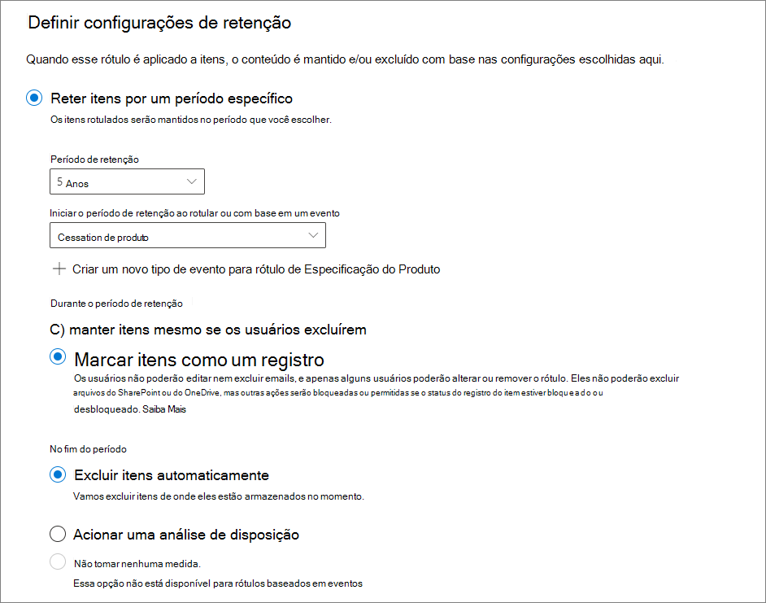
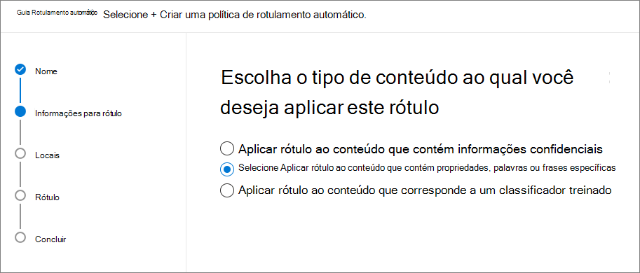

# <a name="manage-the-lifecycle-of-sharepoint-documents-with-retention-labels"></a>Gerencie o ciclo de vida dos documentos do SharePoint com rótulos de retenção

>*[Diretrizes de licenciamento do Microsoft 365 para segurança e conformidade](https://aka.ms/ComplianceSD).*

Este artigo descreve como é possível gerenciar o ciclo de vida dos documentos relacionados a produtos armazenados no SharePoint Online usando rótulos de retenção, e especificamente aplicando automaticamente os rótulos e configurando a retenção baseada em eventos. A funcionalidade de aplicação automática usa a classificação de documentos usando os metadados do SharePoint. O cenário neste artigo se baseia em documentos relacionados a produtos, mas os mesmos conceitos podem ser usados para outros cenários. Por exemplo, no setor de petróleo e gás, você pode gerenciar o ciclo de vida dos documentos relacionados a ativos físicos, como plataformas de petróleo, registros de poços ou licenças de produção. No setor de serviços financeiros, você pode gerenciar documentos relacionados a contas bancárias, hipotecas ou contratos de seguro. No setor público, você pode gerenciar documentos relacionados a autorizações de construção ou formulários de imposto.

Vamos dar uma olhada no cenário deste artigo. Analisaremos a arquitetura de informações e a definição dos rótulos de retenção. Em seguida, examinaremos a classificação de documentos, aplicando automaticamente os rótulos e, por fim, geraremos os eventos que iniciam o período de retenção.

## <a name="information-architecture"></a>Arquitetura de informações

O cenário deste artigo baseia-se em uma empresa de manufatura que usa o SharePoint Online para armazenar todos os documentos relacionados aos produtos da empresa. Esses documentos incluem as especificações do produto, acordos com fornecedores e manuais de usuário. Ao armazenar esses documentos no SharePoint como parte das políticas de Gerenciamento de Conteúdo Corporativo, os metadados do documento são definidos e usados para classificá-los. Cada documento tem as seguintes propriedades de metadados:

- **Tipo de documento** (como especificações de produto, contrato e manuais do usuário)

- **Nome do produto**

- **Status** (rascunho ou final)

Esses metadados formam o tipo de conteúdo base chamado **Documento de Produção** para todos os documentos.


> [!NOTE]
> As propriedades **Tipos de Documento** e **Status** serão usadas pelas políticas de retenção mais tarde, no cenário de classificação e aplicação automática de rótulos de retenção.

Podemos ter vários tipos de conteúdo que representam diferentes tipos de documentos, mas vamos nos concentrar na documentação do produto.

Neste cenário, usamos o serviço de metadados gerenciados e o repositório de termos para criar um conjunto de termos para **Tipo de documento** e outro para **Nome do produto**. Para cada conjunto de termos, criamos um termo para cada valor. No Repositório de termos da sua organização do SharePoint, seria parecido com algo assim:


O Tipo de Conteúdo pode ser criado e publicado usando o [Hub de Tipo de Conteúdo](https://support.office.com/article/manage-content-type-publishing-06f39ac0-5576-4b68-abbc-82b68334889b). Também é possível criar e publicar um tipo de conteúdo usando as ferramentas de provisionamento de site, como [estrutura de provisionamento PnP](https://docs.microsoft.com/sharepoint/dev/solution-guidance/pnp-provisioning-framework) ou [esquema JSON de design de site](https://docs.microsoft.com/sharepoint/dev/declarative-customization/site-design-json-schema#define-a-new-content-type).

Cada produto tem um site dedicado do SharePoint Online com uma biblioteca de documentos, com os tipos de conteúdo corretos habilitados. Todos os documentos são armazenados na biblioteca de documentos.


> [!NOTE]
> Em vez de ter um site do SharePoint Online por produto, neste cenário a empresa de fabricação poderia usar um Microsoft Team por produto, o que ofereceria suporte à colaboração com os membros da equipe, como chat persistente e uso da guia **Arquivos** na equipe de gerenciamento de documentos. Neste artigo, nos concentramos apenas em documentos, portanto, só usaremos um site.

Este é um modo de exibição da biblioteca de documentos do produto Spinning Widget:


Agora que temos a arquitetura de informações básica para o gerenciamento de documentos, vamos dar uma olhada na estratégia de retenção e descarte dos documentos que usam os metadados e a classificação de documentos.

## <a name="retention-and-disposition"></a>Retenção e disposição

As políticas de conformidade e de governança de dados da empresa de manufatura ditam a maneira como os dados são preservados e descartados. Os documentos relacionados a produtos devem ser mantidos enquanto o produto estiver sendo fabricado e por um determinado período depois disso. Esse período é diferente para as especificações do produto, acordos e manuais do usuário. A tabela a seguir indica os requisitos de retenção e descarte:

| **Tipo de Documento**          | **Retenção**                          | **Disposição**                              |
| -------------------------- | -------------------------------------- | -------------------------------------------- |
| Especificação do produto      | 5 anos após o encerramento da produção  | Excluir                                       |
| Contrato de produto          | 10 anos após o encerramento da produção | Revisão                                       |
| Manual de usuário                | 5 anos após o encerramento da produção  | Excluir                                       |
| Todos os outros tipos de documentos | Não manter outros documentos ativamente  | Excluir quando o documento tiver mais de três anos<sup>\*</sup>  |
|||

> [!NOTE]
> <sup>\*</sup> Um documento é considerado com mais de três anos se não tiver sido modificado nos últimos três anos.

Usando o centro de segurança e conformidade, criamos os seguintes rótulos de retenção:

  - Especificação do Produto

  - Contrato de produto

  - Manual de usuário

Neste artigo, mostraremos como criar e aplicar automaticamente o rótulo de retenção da Especificação do Produto. Para implementar o cenário completo, você deve criar e aplicar automaticamente os rótulos de retenção dos outros dois tipos de documento.

### <a name="settings-for-the-product-specification-retention-label"></a>Configurações para a etiqueta de retenção da Especificação do Produto

Aqui está o [plano de arquivo](file-plan-manager.md) para a etiqueta de retenção da Especificação de Produto: 

- **Nome:** Especificação do Produto

- **Descrição para administradores:** o Rótulo de Especificação do Produto, retido por cinco anos após a cessação da produção, exclusão automática, retenção baseada em evento, é o tipo de evento de Cessação do Produto.

- **Descrição para usuários:** retida por cinco anos após a cessação da produção.

- **Ação de retenção:** manter e excluir

- **Duração da retenção:** cinco anos (1825 dias)

- **Rótulo de registro**: configurar o rótulo de retenção para classificar o conteúdo como um [registro](records.md) (documentos que são classificados como registro não podem ser modificados nem excluídos por usuários)

- **Descritores de plano de arquivo:** (para simplificar o cenário, nenhum descritor de arquivo é fornecido)

A captura de tela a seguir mostra as configurações quando você cria o[rótulo de retenção](retention.md#retention-labels) Especificação do Produto no centro de conformidade do Microsoft 365. Você pode criar o tipo de evento **Cessação do Produto** ao criar o rótulo de retenção. Veja as instruções a seguir.



> [!NOTE]
> Para finalidades práticas e para evitar ter que esperar 5 anos para ver um documento automaticamente excluído, defina a duração da retenção como 1 dia, se você estiver recriando esse cenário em um ambiente de teste.

### <a name="create-an-event-type-when-creating-a-retention-label"></a>Criar um tipo de evento ao criar um rótulo de retenção

1. Na lista suspensa **Reter ou excluir o conteúdo com base em**, selecione **um evento**.

2. Selecione **Escolher um tipo de evento**.
    
    

3. Selecione **Escolher um tipo de evento** e, na página **Escolher um tipo de evento**, selecione **Criar novos tipos de eventos**.

4. Crie um tipo de evento denominado **Cessação do Produto**, dê uma descrição e selecione **Concluir** para criá-lo. 

5. Novamente na página **Escolher um tipo de evento**, selecione o tipo de evento **Cessação do Produto** que você criou e, em seguida, selecione **Adicionar**.

Veja como é a aparência das configurações para o rótulo de retenção de Especificação do Produto. Selecione **Criar este rótulo** para criá-lo.


> [!TIP]
> Para obter mais etapas detalhadas, confira [Criar um rótulo cujo período de retenção se baseie em um evento](event-driven-retention.md#step-1-create-a-label-whose-retention-period-is-based-on-an-event).

Agora que o rótulo de retenção foi criado, vamos dar uma olhada em como aplicar automaticamente o rótulo de retenção ao conteúdo de especificação do produto.

## <a name="classifying-content-by-auto-applying-retention-labels"></a>Classificando o conteúdo aplicando automaticamente os rótulos de retenção

Vamos para a [aplicação automática](apply-retention-labels-automatically.md) de rótulos de retenção criados para esse cenário usando a linguagem de consulta de palavra-chave (KQL). KQL é a linguagem usada para criar consultas de pesquisa. Na KQL, você pode pesquisar usando as palavras-chave ou as propriedades gerenciadas. Para obter mais informações sobre KQL, confira <https://docs.microsoft.com/sharepoint/dev/general-development/keyword-query-language-kql-syntax-reference>

Em um nível alto, gostaríamos de dizer ao Microsoft 365 para "aplicar o rótulo de retenção a**especificação do produto** a todos os documentos que têm o **status** de **final** e um **tipo de documento** de **especificações de produto**. Lembre-se de que **Status** e **Tipo de documento** são as colunas de site definidas anteriormente para o tipo de conteúdo de documentação do produto na seção [Arquitetura de informações](#information-architecture). Para alcançar isso, precisamos configurar o esquema de pesquisa.

Quando o SharePoint indexa conteúdo, ele gera automaticamente propriedades rastreadas para cada coluna de site. Neste cenário, estamos interessados nas propriedades **Tipo de documento** e **Status**. Precisamos que os documentos na biblioteca usem o tipo de conteúdo correto e tenham as colunas de site preenchidas, para que a pesquisa possa criar as propriedades rastreadas.

No centro de administração do SharePoint, é possível abrir a configuração de Pesquisa e selecionar **Gerenciar Esquema de Pesquisa** para exibir e configurar as propriedades rastreadas.


Se digitarmos **status** na caixa **Propriedades rastreadas** e selecionarmos a seta verde, vamos ver um resultado assim:


A propriedade **ows\_Status \_** (repare no sublinhado duplo) é o que nos interessa. Isso mapeia a propriedade **Status** do tipo de conteúdo do Documento de Produção.

Agora, se digitarmos **ows\_doc** e selecionarmos a seta verde, vamos ver algo assim:


A propriedade **ows\_doc\_x0020\_Type** é a segunda propriedade que nos interessa. Isso mapeia para a propriedade **Tipo de Documento** do tipo de conteúdo do Documento de Produção.

> [!TIP]
> Para identificar o nome de uma propriedade rastreada para esse cenário, vá para a biblioteca de documentos que contém os documentos da produção e, em seguida, vá para as configurações da biblioteca. Em **Colunas**, selecione o nome da coluna (por exemplo, **Status** ou **Tipo de Documento**) para abrir a página da coluna do site. O parâmetro **Campo** na URL dessa página contém o nome do campo. O nome do campo, com o prefixo "ows_", é o nome da propriedade rastreada. Por exemplo, a propriedade rastreada da URL `https://tenantname.sharepoint.com/sites/SpinningWidget/_layouts/15/FldEdit.aspx?List=%7BC38C2F45-3BD6-4C3B-AA3B-EF5DF6B3D172%7D&Field=_Status` corresponde ao **OWS\_\_status**.

Se as propriedades rastreadas que você está procurando não aparecerem na seção Gerenciar Esquema de Pesquisa no centro de administração do SharePoint, pode ser por um dos seguintes motivos:

- Os documentos ainda não foram indexados. Você pode forçar uma nova indexação da biblioteca acessando as Configurações da Biblioteca de Documentos > Configurações Avançadas.

- Se a biblioteca de documentos estiver em um site moderno, certifique-se de que o administrador do SharePoint também é um administrador do conjunto de sites.

Para obter mais informações sobre propriedades rastreadas e gerenciadas, consulte [Propriedades gerenciadas criadas automaticamente no SharePoint Server](https://docs.microsoft.com/sharepoint/technical-reference/automatically-created-managed-properties-in-sharepoint).

### <a name="mapping-crawled-properties-to-pre-defined-managed-properties"></a>Mapeando propriedades rastreadas para propriedades gerenciadas predefinidas

KQL não pode usar propriedades rastreadas em consultas de pesquisa. É preciso usar uma propriedade gerenciada. Em um cenário de pesquisa normal, criamos uma propriedade gerenciada e a mapeamos para a propriedade rastreada necessária. No entanto, para aplicar automaticamente os rótulos de retenção, só é possível especificar na KQL as propriedades gerenciadas predefinidas e não as propriedades gerenciadas personalizadas. É possível usar um conjunto de propriedades gerenciadas predefinidas já criadas no sistema para a cadeia RefinableString00 a RefinableString199. Para obter uma lista completa, confira [Propriedades gerenciadas padrão não usadas ](https://docs.microsoft.com/sharepoint/manage-search-schema#default-unused-managed-properties). Essas propriedades gerenciadas padrão costumam ser usadas para definir refinadores de pesquisa.

Para a consulta KQL trabalhar e aplicar automaticamente o rótulo de retenção correto ao conteúdo de documento do produto, mapeamos as propriedades rastreadas **ows\_doc\_x0020\_Type** e **ows\_\_Status** para duas propriedades gerenciadas refináveis. Em nosso ambiente de teste para esse cenário, **RefinableString00** e **RefinableString01** não estão sendo usadas. Isso é determinado quando examinamos as **Propriedades Gerenciadas** em **Gerenciar Esquema de Pesquisa** no centro de administração do SharePoint.


Observe que a coluna **Propriedades Rastreadas Mapeadas** na captura de tela anterior está vazia.

Para mapear a propriedade rastreada **ows\_Doc\_x0020\_Type**, faça o seguinte:

1. Na caixa de filtro **Propriedade gerenciada**, digite **RefinableString00** e selecione a seta verde.

2. Na lista de resultados, selecione o link **RefinableString00** e, em seguida, role para baixo até a seção **Mapeamentos para propriedades rastreadas**.  

3. Selecione **Adicionar um Mapeamento** e digite **ows\_Doc\_x0020\_Type** na caixa **Pesquisar um nome de propriedade rastreada** na janela **Seleção da propriedade rastreada**. Selecione **Localizar**.  

4. Na lista de resultados, selecione **ows\_Doc\_x0020\_Type** e, em seguida, selecione **OK**.

   Na seção **Propriedades Rastreadas Mapeadas**, você verá algo semelhante a essa captura de tela:

   

5. Role até a parte inferior da página e selecione **OK** para salvar o mapeamento.

Repita esse mesmo procedimento para mapear RefinableString01 e ows\_\_Status.

Agora, você deve ter duas propriedades gerenciadas mapeadas para duas propriedades rastreadas:


Podemos verificar se tudo está configurado corretamente executando uma pesquisa corporativa. Em um navegador, vá para https://yourtenant.sharepoint.com/search. Na caixa Pesquisar, digite **RefinableString00: "Especificação do Produto"** e pressione Enter. Isso deve retornar todos os documentos com especificação de produto como **Tipo de Documento**.

Agora, na caixa de pesquisa, digite **RefinableString00: "Especificação do Produto" e RefinableString01: Final** e pressione Enter. Isso deve retornar todos os documentos que têm a especificação de produto como **Tipo de Documento** e o status de **Final**.

### <a name="creating-the-auto-apply-label-policies"></a>Criando as políticas de aplicação automática de rótulos

Agora que verificamos se a consulta KQL está funcionando corretamente, vamos criar a política de rótulo que usa uma consulta KQL para aplicar automaticamente o rótulo de retenção de Especificação do Produto aos documentos apropriados.

1. No [centro de conformidade](https://compliance.microsoft.com/homepage), vá para **Gerenciamento de registros** > **Políticas de rótulo** e selecione **Aplicar um rótulo automaticamente**. 

   

2. Na página do assistente**Escolher um rótulo para aplicar automaticamente**, selecione **Escolher um rótulo para aplicar automaticamente**.

3. Na lista de rótulos, selecione **Especificação do Produto**, selecione **Adicionar** e, em seguida, **Próximo**.

4. Selecione **Aplicar rótulo ao conteúdo que contém propriedades, palavras ou frases específicas** e, em seguida, selecione **Próximo**.

   

   Na próxima etapa, você fornecerá a mesma consulta de pesquisa KQL que testamos na seção anterior. Como você se lembra, esta consulta retornou todos os documentos de especificação de produto com o status final. O resultado de usar essa mesma consulta na política de rótulos significa que o rótulo de retenção de Especificação do Produto será automaticamente aplicado a todos os documentos que correspondem a essa consulta de pesquisa.

5. Na caixa **Editor de consulta de palavra-chave**, digite **RefinableString00: "Especificação do Produto" E RefinableString01:Final** e, em seguida, selecione **Próximo**.

   

6. Digite um nome (por exemplo, **Aplicação automática de Rótulo de Especificação do Produto**) e uma descrição opcional para a política de rótulo e, em seguida, selecione **Próximo**. 

7. Na página do assistente **Escolher locais**, selecione os locais de conteúdo aos quais deseja aplicar a política. Neste cenário, aplicamos essa política apenas a locais do SharePoint porque todos os documentos de produção são armazenados somente nas bibliotecas de documentos do SharePoint. Selecione **deixe-me escolher locais específicos**, alterne o status dos emails do Exchange, das contas do OneDrive e dos grupos do Microsoft 365 para desativar e verifique se o status de sites do SharePoint está ativado. 

    

   > [!TIP]
   > Em vez de aplicar a política a todos os sites do SharePoint, você pode selecionar **Escolher sites** e adicionar as URLs para sites específicos do SharePoint.

8. Selecione **Próximo** para exibir a página **Examinar suas configurações**. 

    

9. Selecione **Aplicar automaticamente** para criar a política do rótulo. São necessários até sete dias para aplicar automaticamente o rótulo de Especificação do Produto a todos os documentos que correspondam à consulta de pesquisa KQL fornecida.

### <a name="verifying-the-retention-label-was-automatically-applied"></a>Verificar se o rótulo de retenção foi aplicado automaticamente 

Depois de sete dias, use o [explorador de atividades](data-classification-activity-explorer.md) no centro de conformidade para garantir que a política de rótulos que criamos tenha aplicado automaticamente os rótulos de retenção neste cenário aos documentos do produto. 

Outra etapa de verificação é examinar as propriedades do documento na Biblioteca de Documentos. No painel de informações, você pode ver que o rótulo de retenção é aplicado a um documento selecionado.


Como os rótulos de retenção foram aplicados automaticamente aos documentos, os documentos são protegidos de serem excluídos porque o rótulo de retenção foi configurado para declarar os documentos como registros. Como exemplo dessa proteção, recebemos uma mensagem de erro mostrada na captura de tela a seguir quando tentamos excluir um desses documentos.


## <a name="generating-the-events-that-trigger-the-start-of-the-retention-period"></a>Gerando os eventos que disparam o início do período de retenção

Agora que os rótulos de retenção foram automaticamente aplicados, vamos nos concentrar no evento que indicará o fim da produção para um determinado produto. Quando esse evento ocorrer, ele acionará o início do período de retenção definido em rótulos de retenção aplicados automaticamente aos documentos. Por exemplo, para documentos de especificação do produto, o período de retenção de cinco anos começa quando o evento "fim da produção" é acionado.

Você pode criar manualmente o evento no centro de segurança e conformidade acessando **Gerenciamento de Registros** > **Eventos**, e escolhendo o tipo de evento, configurando as IDs do ativo correto e inserindo uma data para o evento. Para mais informações, confira [Iniciar a retenção quando um evento ocorrer](event-driven-retention.md).

Neste cenário, criaremos automaticamente o evento gerando-o a partir de um sistema de produção externo. Nesse caso, o sistema que gera o evento é uma lista simples do SharePoint que indica se um produto está em produção ou não e um [Microsoft Flow](https://docs.microsoft.com/flow/getting-started) que está associado à lista e disparará o evento. Em um cenário real, qualquer sistema pode gerar o evento, como um sistema de RH ou CRM. O fluxo inclui várias interações prontas para uso e o bloco de construção das cargas de trabalho do Microsoft 365, como o Exchange, o SharePoint, o Teams e o Dynamics 365, além de aplicativos de terceiros, como o Twitter, o Box, o Salesforce e Workdays. Isso facilita a integração do Flow com esses sistemas. Para obter mais informações, confira [Automatizar a retenção orientada a eventos](automate-event-driven-retention.md).

A captura de tela a seguir mostra a lista do SharePoint que será usada para acionar o evento: 


Há dois produtos em produção no momento, indicados pelo valor **Sim** na coluna **Em Produção**. Quando o valor nesta coluna está definido como **Não** para um produto, o fluxo associado à lista gerará automaticamente o evento. Por sua vez, isso desencadeia o início do período de retenção para a etiqueta de retenção que foi aplicada automaticamente aos documentos do produto correspondente.

Para esse cenário, usamos o seguinte fluxo para disparar o evento:


Para criar esse fluxo, inicie o a partir de um conector do SharePoint e selecione o disparador **Quando um item é criado ou modificado**. Especifique o endereço do site e o nome da lista e, em seguida, adicione uma condição baseada em quando o valor de coluna da lista **Em Produção**estiver definida como**Não** (ou igual a falso no cartão da condição). Em seguida, adicione uma ação com base no modelo interno HTTP. Use os valores da seção a seguir para configurar a ação HTTP. Você pode copiar os valores das propriedades URI e Body da tabela abaixo e, em seguida, colá-los no modelo.

- **Method**: POST
- **URI**: `https://ps.compliance.protection.outlook.com/psws/service.svc/ComplianceRetentionEvent`
- **Cabeçalhos**: Chave = content-type, valor = application/atom+xml
- **Corpo**:
    
    ```HTML
    <?xml version='1.0' encoding='utf-8' standalone='yes'>
    <entry xmlns:d='http://schemas.microsoft.com/ado/2007/08/dataservices' xmlns:m='http://schemas.microsoft.com/ado/2007/08/dataservices/metadata' xmlns='https://www.w3.org/2005/Atom'>
    <category scheme='http://schemas.microsoft.com/ado/2007/08/dataservices/scheme' term='Exchange.ComplianceRetentionEvent'>
    <updated>9/9/2017 10:50:00 PM</updated>
    <content type='application/xml'>
    <m:properties>
    <d:Name>Cessation Production @{triggerBody()?['Product_x0020_Name']?['Value']}</d:Name>
    <d:EventType>Product Cessation&lt;</d:EventType>
    <d:SharePointAssetIdQuery>ProductName:&quot;@{triggerBody()?['Product_x0020_Name']?['Value']}<d:SharePointAssetIdQuery>
    <d:EventDateTime>@{formatDateTime(utcNow(),'yyyy-MM-dd')}</d:EventDateTime>
    </m:properties>
    </content&gt>
    </entry>
    ```

A seção a seguir descreve os parâmetros na propriedade *Body* da ação que deve ser configurada especificamente para esse cenário.

- **Name**: Esse parâmetro especifica o nome do evento a ser criado no centro de segurança e conformidade. Neste cenário, o nome é "Cessation Production xxx", em que xxx é o valor da propriedade gerenciada ProductName criado anteriormente.
- **EventType**: O valor desse parâmetro corresponde ao tipo de evento ao qual o evento criado será aplicado. Esse tipo de evento foi definido quando você criou o rótulo de retenção. Para esse cenário, o tipo de evento é "Product Cessation".
- **SharePointAssetIdQuery**: Esse parâmetro define a ID do Ativo para o evento. A retenção baseada em evento precisa de um identificador exclusivo para o documento. Podemos usar IDs de Ativos para identificar os documentos aos quais um determinado evento é aplicável, ou como fazemos para esse cenário, uma coluna de metadados, nosso próprio Nome de Produto. Para fazer isso, precisamos criar uma nova propriedade gerenciada chamada ProductName, que pode ser usada na consulta KQL (ou poderíamos ter usado RefinableString00, em vez de criar uma nova propriedade gerenciada). Também precisamos mapear essa nova propriedade gerenciada para a propriedade rastreada ows_Product_x0020_Name. Aqui está uma captura de tela da propriedade gerenciada.

    

- **EventDateTime**: Esse parâmetro define a data do evento. Use o formato de data atual: *formatDateTime(utcNow(),'AAAA-MM-DD'*)

### <a name="putting-it-all-together"></a>Colocando tudo em um só lugar

Agora que o rótulo de retenção foi criado e aplicado automaticamente, e o fluxo está configurado e criado, veja aqui o que acontece quando o valor na coluna**Em Produção** do seu produto de Spinning Widget na lista de Produtos é alterado de **Sim** para **Não**. O fluxo é disparado e cria o evento. Para ver esse evento no centro de segurança e conformidade, vá para **Gerenciamento de registros**  > **Eventos**.


Selecione o evento para exibir os detalhes na página do submenu. Observe que, apesar de o evento estar criado, os detalhes no status do evento mostram que nenhum documento ou site do SharePoint foi processado.


Porém, após algum tempo, a seção status do evento mostrará que um site do SharePoint e um documento do SharePoint foram processados.  


 
Isso significa que o período de retenção para o rótulo aplicado ao documento do produto do Spinning Widget foi iniciado, com base na data do evento da Cessação de Produção do Spinning Widget. Supondo que você tenha implementado o cenário em seu ambiente de teste, configurando um período de retenção de um dia, você poderá acessar a biblioteca de documentos para os documentos de seu produto alguns dias após o evento ser criado e verificar se o documento foi excluído (após o trabalho de exclusão no SharePoint ter sido executado).

### <a name="more-about-asset-ids"></a>Mais sobre IDs de Ativos

Conforme explicado no [Iniciar a retenção quando um evento ocorre](event-driven-retention.md), é importante compreender a relação entre os tipos de evento, os rótulos de retenção, os eventos e as IDs de ativos. A ID de Ativos é simplesmente outra propriedade do documento no SharePoint e no OneDrive. Ela ajuda você a identificar melhor os documentos cujo período de retenção será disparado pelo evento. Por padrão, o SharePoint tem uma propriedade ID de Ativos que você pode usar para a retenção de eventos:


Conforme mostrado na captura de tela a seguir, a propriedade gerenciada por ID de Ativos é chamada de **ComplianceAssetId**.


Em vez de usar a propriedade ID de Ativos padrão, você também pode usar qualquer outra propriedade, como fazemos nesse cenário. Mas é importante entender que se você não especificar uma ID de ativos ou palavras-chave para um evento, todo o conteúdo com um rótulo desse tipo de evento terá um período de retenção desencadeado pelo evento.

### <a name="using-advanced-search-in-sharepoint"></a>Usando a pesquisa avançada no SharePoint

Na captura de tela anterior, também podemos ver que há outra propriedade gerenciada relacionada aos rótulos de retenção chamada **ComplianceTag**, e que ela é mapeada para uma propriedade rastreada. A propriedade gerenciada **ComplianceAssetId** também é mapeada para uma propriedade rastreada. Isso significa que você pode usar essas propriedades gerenciadas na pesquisa avançada para recuperar todos os documentos que foram marcados com um rótulo de retenção.

## <a name="summary"></a>Resumo

Este artigo ilustrou um cenário de gerenciamento de documentos em que aplicamos automaticamente uma etiqueta de retenção com base em uma coluna de site do SharePoint. Em seguida, usamos a retenção baseada em eventos e o fluxo da Microsoft para disparar automaticamente o início do período de retenção com base em um evento externo.

## <a name="credits"></a>Créditos

Esse cenário foi criado por: 

Frederic Lapierre<br/>Consultor Diretor de Serviços Microsoft
