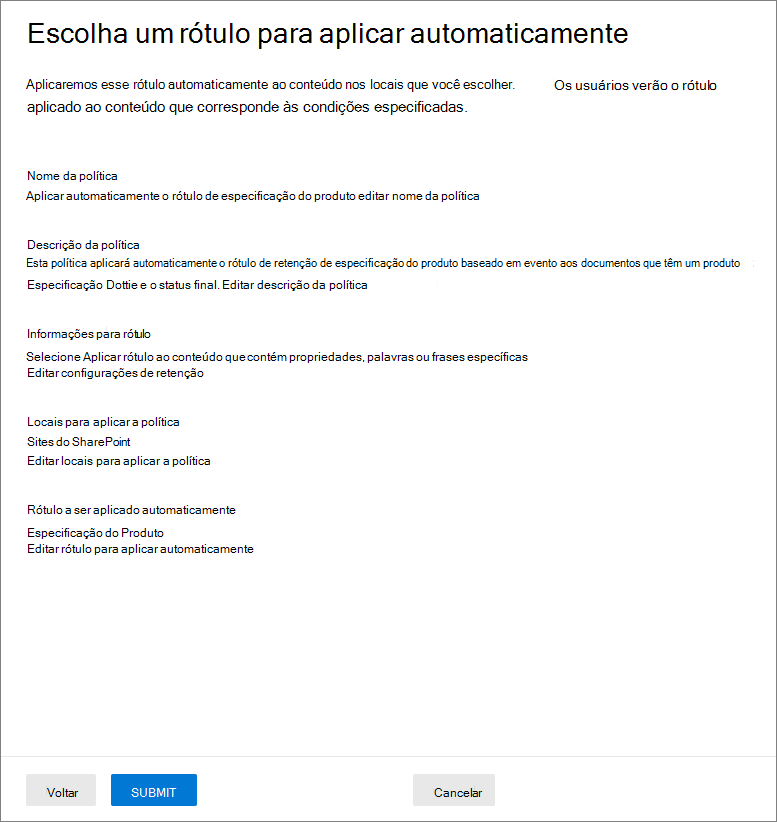

# <a name="use-retention-labels-to-manage-the-lifecycle-of-documents-stored-in-sharepoint"></a><span data-ttu-id="49a7a-103">Use os rótulos de retenção para gerenciar o ciclo de vida dos documentos armazenados no SharePoint.</span><span class="sxs-lookup"><span data-stu-id="49a7a-103">Use retention labels to manage the lifecycle of documents stored in SharePoint</span></span>

><span data-ttu-id="49a7a-104">*[Diretrizes de licenciamento do Microsoft 365 para segurança e conformidade](/office365/servicedescriptions/microsoft-365-service-descriptions/microsoft-365-tenantlevel-services-licensing-guidance/microsoft-365-security-compliance-licensing-guidance).*</span><span class="sxs-lookup"><span data-stu-id="49a7a-104">*[Microsoft 365 licensing guidance for security & compliance](/office365/servicedescriptions/microsoft-365-service-descriptions/microsoft-365-tenantlevel-services-licensing-guidance/microsoft-365-security-compliance-licensing-guidance).*</span></span>

<span data-ttu-id="49a7a-105">Este artigo descreve como você pode gerenciar o ciclo de vida dos documentos que estão armazenados no SharePoint usando rótulos de retenção aplicados automaticamente e a retenção baseada em eventos.</span><span class="sxs-lookup"><span data-stu-id="49a7a-105">This article describes how you can manage the lifecycle of documents that are stored in SharePoint by using automatically applied retention labels and event-based retention.</span></span>

<span data-ttu-id="49a7a-106">A funcionalidade de aplicação automática usa metadados do SharePoint para classificação de documento.</span><span class="sxs-lookup"><span data-stu-id="49a7a-106">The auto-apply functionality uses SharePoint metadata for document classification.</span></span> <span data-ttu-id="49a7a-107">O exemplo neste artigo é para documentos relacionados a produtos, mas os mesmos conceitos podem ser usados para outros cenários.</span><span class="sxs-lookup"><span data-stu-id="49a7a-107">The example in this article is for product-related documents, but the same concepts can be used for other scenarios.</span></span> <span data-ttu-id="49a7a-108">Por exemplo, no setor de petróleo e gás, você pode usá-lo para gerenciar o ciclo de vida dos documentos sobre ativos físicos, como plataformas de petróleo, registros de poços ou licenças de produção.</span><span class="sxs-lookup"><span data-stu-id="49a7a-108">For example, in the oil and gas industry, you could use it to manage the lifecycle of documents about physical assets such as oil platforms, well logs, or production licenses.</span></span> <span data-ttu-id="49a7a-109">No setor de serviços financeiros, você poderia gerenciar conta bancária, hipoteca ou documentos de contratos de seguro.</span><span class="sxs-lookup"><span data-stu-id="49a7a-109">In the financial services industry, you could manage bank account, mortgage, or insurance contract documents.</span></span> <span data-ttu-id="49a7a-110">No setor público, você poderia gerenciar autorizações de construção ou formulários de imposto.</span><span class="sxs-lookup"><span data-stu-id="49a7a-110">In the public sector, you could manage construction permits or tax forms.</span></span>

<span data-ttu-id="49a7a-111">Neste artigo, analisaremos a arquitetura de informações e a definição dos rótulos de retenção.</span><span class="sxs-lookup"><span data-stu-id="49a7a-111">In this article, we'll look at the information architecture and definition of the retention labels.</span></span> <span data-ttu-id="49a7a-112">Em seguida, classificaremos documentos pela aplicação automática dos rótulos.</span><span class="sxs-lookup"><span data-stu-id="49a7a-112">Then we'll classify documents by auto-applying the labels.</span></span> <span data-ttu-id="49a7a-113">E finalmente, geraremos os eventos que iniciam o período de retenção.</span><span class="sxs-lookup"><span data-stu-id="49a7a-113">And finally we'll generate the events that initiate the retention period.</span></span>

## <a name="information-architecture"></a><span data-ttu-id="49a7a-114">Arquitetura de informações</span><span class="sxs-lookup"><span data-stu-id="49a7a-114">Information architecture</span></span>

<span data-ttu-id="49a7a-115">Nosso cenário é uma empresa de manufatura que usa o SharePoint para armazenar todos os documentos sobre os produtos que a empresa desenvolve.</span><span class="sxs-lookup"><span data-stu-id="49a7a-115">Our scenario is a manufacturing company that uses SharePoint to store all the documents about the products that the company develops.</span></span> <span data-ttu-id="49a7a-116">Esses documentos incluem as especificações do produto, acordos com fornecedores e manuais de usuário.</span><span class="sxs-lookup"><span data-stu-id="49a7a-116">These documents include product specifications, agreements with suppliers, and user manuals.</span></span> <span data-ttu-id="49a7a-117">Quando esses documentos são armazenados no SharePoint através de políticas de Gerenciamento de Conteúdo Corporativo, os metadados do documento que são usados para classificá-lo são definidos.</span><span class="sxs-lookup"><span data-stu-id="49a7a-117">When these documents are stored in SharePoint through Enterprise Content Management policies, document metadata is defined, which is used to classify them.</span></span> <span data-ttu-id="49a7a-118">Cada documento tem as seguintes propriedades de metadados:</span><span class="sxs-lookup"><span data-stu-id="49a7a-118">Each document has the following metadata properties:</span></span>

- <span data-ttu-id="49a7a-119">**Tipo de Documento** (como especificações de produto, contrato ou manual do usuário)</span><span class="sxs-lookup"><span data-stu-id="49a7a-119">**Doc Type** (such as product specification, agreement, or user manual)</span></span>

- <span data-ttu-id="49a7a-120">**Nome do produto**</span><span class="sxs-lookup"><span data-stu-id="49a7a-120">**Product Name**</span></span>

- <span data-ttu-id="49a7a-121">**Status** (rascunho ou final)</span><span class="sxs-lookup"><span data-stu-id="49a7a-121">**Status** (draft or final)</span></span>

<span data-ttu-id="49a7a-122">Esses metadados formam uma base do tipo de conteúdo chamado de *Documento de Produção* para todos os documentos.</span><span class="sxs-lookup"><span data-stu-id="49a7a-122">This metadata forms a base content type called *Production Document* for all the documents.</span></span>


> [!NOTE]
> <span data-ttu-id="49a7a-124">As propriedades **Tipos de Documento** e **Status** são usadas mais tarde pelas políticas de retenção deste cenário para classificação e aplicação automática dos rótulos de retenção.</span><span class="sxs-lookup"><span data-stu-id="49a7a-124">The **Doc Type** and **Status** properties are used by retention policies later in this scenario to classify and auto-apply retention labels.</span></span>

<span data-ttu-id="49a7a-125">Poderíamos ter vários tipos de conteúdo que representam diferentes tipos de documentos, mas vamos nos concentrar na documentação do produto.</span><span class="sxs-lookup"><span data-stu-id="49a7a-125">We might have several content types that represent different types of documents, but let's focus on the product documentation.</span></span>

<span data-ttu-id="49a7a-126">Neste cenário, usamos o serviço de Metadados Gerenciados e o Repositório de Termos para criar um conjunto de termos para *Tipo de Documento* e outro para *Nome do Produto*.</span><span class="sxs-lookup"><span data-stu-id="49a7a-126">In this scenario, we use the Managed Metadata service and the Term Store to create a term set for *Doc Type* and another one for *Product Name*.</span></span> <span data-ttu-id="49a7a-127">Para cada conjunto de termos, criamos um termo para cada valor.</span><span class="sxs-lookup"><span data-stu-id="49a7a-127">For each term set, we create a term for each value.</span></span> <span data-ttu-id="49a7a-128">Seria algo parecido com isto no Repositório de Termos do SharePoint da sua organização:</span><span class="sxs-lookup"><span data-stu-id="49a7a-128">It would look like something like this in Term Store for your SharePoint organization:</span></span>


<span data-ttu-id="49a7a-130">*Tipo de Conteúdo* pode ser criado e publicado pelo uso do [Hub de Tipo de Conteúdo](https://support.office.com/article/manage-content-type-publishing-06f39ac0-5576-4b68-abbc-82b68334889b).</span><span class="sxs-lookup"><span data-stu-id="49a7a-130">*Content Type* can be created and published by using the [Content Type Hub](https://support.office.com/article/manage-content-type-publishing-06f39ac0-5576-4b68-abbc-82b68334889b).</span></span> <span data-ttu-id="49a7a-131">Você também pode criar e publicar um tipo de conteúdo pelo uso de ferramentas de provisionamento de site, como a [estrutura de provisionamento PnP](/sharepoint/dev/solution-guidance/pnp-provisioning-framework) ou [esquema JSON de design de site](/sharepoint/dev/declarative-customization/site-design-json-schema#define-a-new-content-type).</span><span class="sxs-lookup"><span data-stu-id="49a7a-131">You can also create and publish a content type by using site provisioning tools, such as the [PnP provisioning framework](/sharepoint/dev/solution-guidance/pnp-provisioning-framework) or [site design JSON schema](/sharepoint/dev/declarative-customization/site-design-json-schema#define-a-new-content-type).</span></span>

<span data-ttu-id="49a7a-132">Cada produto tem um site dedicado do SharePoint que contém uma biblioteca de documentos que tem os corretos tipos de conteúdo habilitados.</span><span class="sxs-lookup"><span data-stu-id="49a7a-132">Each product has a dedicated SharePoint site that contains one document library that has the right content types enabled.</span></span> <span data-ttu-id="49a7a-133">Todos os documentos são armazenados na biblioteca de documentos.</span><span class="sxs-lookup"><span data-stu-id="49a7a-133">All documents are stored in this document library.</span></span>

<span data-ttu-id="49a7a-134">[  ](../media/SPRetention3.png#lightbox)</span><span class="sxs-lookup"><span data-stu-id="49a7a-134">[  ](../media/SPRetention3.png#lightbox)</span></span>

> [!NOTE]
> <span data-ttu-id="49a7a-135">Em vez de ter um site do SharePoint por produto, a empresa de manufatura deste cenário poderia usar um Microsoft Team por produto para colaboração de suporte entre os membros da equipe, como através de chat persistente e o uso da guia **Arquivos** no Teams para gerenciamento de documentos.</span><span class="sxs-lookup"><span data-stu-id="49a7a-135">Instead of having a SharePoint site per product, the manufacturing company in this scenario could use a Microsoft Team per product to support collaboration among members of the team, such as through persistent chat, and use the **Files** tab in Teams for document management.</span></span> <span data-ttu-id="49a7a-136">Neste artigo, nós apenas concentramos em documentos, portanto, só usaremos um site.</span><span class="sxs-lookup"><span data-stu-id="49a7a-136">In this article we only focus on documents, so, we'll only use a site.</span></span>

<span data-ttu-id="49a7a-137">Este é um modo de exibição da biblioteca de documentos do produto Spinning Widget:</span><span class="sxs-lookup"><span data-stu-id="49a7a-137">Here's a view of the document library for the Spinning Widget product:</span></span>

<span data-ttu-id="49a7a-138">[  ](../media/SPRetention4.png#lightbox)</span><span class="sxs-lookup"><span data-stu-id="49a7a-138">[  ](../media/SPRetention4.png#lightbox)</span></span>

<span data-ttu-id="49a7a-139">Agora que temos a arquitetura de informações básica em vigor para o gerenciamento de documentos, vamos dar uma olhada na estratégia de retenção e descarte para os documentos que usam os metadados e como classificamos esses documentos.</span><span class="sxs-lookup"><span data-stu-id="49a7a-139">Now that we have the basic information architecture in place for document management, let's look at the retention and disposal strategy for the documents that use the metadata and how we classify those documents.</span></span>

## <a name="retention-and-disposition"></a><span data-ttu-id="49a7a-140">Retenção e disposição</span><span class="sxs-lookup"><span data-stu-id="49a7a-140">Retention and disposition</span></span>

<span data-ttu-id="49a7a-141">As políticas de conformidade e de governança de dados da empresa de manufatura ditam como os dados são preservados e descartados.</span><span class="sxs-lookup"><span data-stu-id="49a7a-141">The manufacturing company's compliance and data governance policies dictate how data is preserved and disposed of.</span></span> <span data-ttu-id="49a7a-142">Os documentos relacionados a produtos devem ser mantidos enquanto o produto estiver sendo fabricado e por um determinado período adicional.</span><span class="sxs-lookup"><span data-stu-id="49a7a-142">Product-related documents must be kept for as long as the product is manufactured and for a certain additional period.</span></span> <span data-ttu-id="49a7a-143">O período adicional difere para as especificações do produto, contratos e manuais do usuário.</span><span class="sxs-lookup"><span data-stu-id="49a7a-143">The additional period differs for product specifications, agreements, and user manuals.</span></span> <span data-ttu-id="49a7a-144">A tabela a seguir indica os requisitos de retenção e descarte:</span><span class="sxs-lookup"><span data-stu-id="49a7a-144">The following table indicates the retention and disposition requirements:</span></span>

|   <span data-ttu-id="49a7a-145">Tipo de documento</span><span class="sxs-lookup"><span data-stu-id="49a7a-145">Document type</span></span>            |   <span data-ttu-id="49a7a-146">Retenção</span><span class="sxs-lookup"><span data-stu-id="49a7a-146">Retention</span></span>                            |   <span data-ttu-id="49a7a-147">Disposição</span><span class="sxs-lookup"><span data-stu-id="49a7a-147">Disposition</span></span>                                |
| -------------------------- | -------------------------------------- | -------------------------------------------- |
| <span data-ttu-id="49a7a-148">Especificações do produto</span><span class="sxs-lookup"><span data-stu-id="49a7a-148">Product specifications</span></span>      | <span data-ttu-id="49a7a-149">5 anos após o fim da produção</span><span class="sxs-lookup"><span data-stu-id="49a7a-149">5 years after production stops</span></span>  | <span data-ttu-id="49a7a-150">Excluir</span><span class="sxs-lookup"><span data-stu-id="49a7a-150">Delete</span></span>                                       |
| <span data-ttu-id="49a7a-151">Contratos de produtos</span><span class="sxs-lookup"><span data-stu-id="49a7a-151">Product agreements</span></span>          | <span data-ttu-id="49a7a-152">10 anos após o fim da produção</span><span class="sxs-lookup"><span data-stu-id="49a7a-152">10 years after production stops</span></span> | <span data-ttu-id="49a7a-153">Analisar</span><span class="sxs-lookup"><span data-stu-id="49a7a-153">Review</span></span>                                       |
| <span data-ttu-id="49a7a-154">Manuais do usuário</span><span class="sxs-lookup"><span data-stu-id="49a7a-154">User manuals</span></span>                | <span data-ttu-id="49a7a-155">5 anos após o fim da produção</span><span class="sxs-lookup"><span data-stu-id="49a7a-155">5 years after production stops</span></span>  | <span data-ttu-id="49a7a-156">Excluir</span><span class="sxs-lookup"><span data-stu-id="49a7a-156">Delete</span></span>                                       |
| <span data-ttu-id="49a7a-157">Todos os outros tipos de documentos</span><span class="sxs-lookup"><span data-stu-id="49a7a-157">All other types of documents</span></span> | <span data-ttu-id="49a7a-158">Não reter ativamente</span><span class="sxs-lookup"><span data-stu-id="49a7a-158">Don't actively retain</span></span>  | <span data-ttu-id="49a7a-159">Excluir quando o documento tiver mais de 3 anos</span><span class="sxs-lookup"><span data-stu-id="49a7a-159">Delete when document is older than 3 years</span></span> <br /><br /> <span data-ttu-id="49a7a-160">Um documento é considerado com mais de 3 anos se não tiver sido modificado nos últimos 3 anos.</span><span class="sxs-lookup"><span data-stu-id="49a7a-160">A document is considered older than 3 years if it hasn't been modified within the last 3 years.</span></span> |
|||

<span data-ttu-id="49a7a-161">Usamos o Centro de Conformidade do Microsoft 365 para criar os seguintes [rótulos de retenção](retention.md#retention-labels):</span><span class="sxs-lookup"><span data-stu-id="49a7a-161">We use the Microsoft 365 compliance center to create the following [retention labels](retention.md#retention-labels):</span></span>

  - <span data-ttu-id="49a7a-162">Especificação do Produto</span><span class="sxs-lookup"><span data-stu-id="49a7a-162">Product Specification</span></span>

  - <span data-ttu-id="49a7a-163">Contrato de produto</span><span class="sxs-lookup"><span data-stu-id="49a7a-163">Product Agreement</span></span>

  - <span data-ttu-id="49a7a-164">Manual de usuário</span><span class="sxs-lookup"><span data-stu-id="49a7a-164">User Manual</span></span>

<span data-ttu-id="49a7a-165">Neste artigo, mostraremos como criar e aplicar automaticamente o rótulo de retenção da Especificação do Produto.</span><span class="sxs-lookup"><span data-stu-id="49a7a-165">In this article, we only show how to create and auto-apply the Product Specification retention label.</span></span> <span data-ttu-id="49a7a-166">Para implementar o cenário completo, você também deve criar e aplicar automaticamente os rótulos de retenção para os outros dois tipos de documento.</span><span class="sxs-lookup"><span data-stu-id="49a7a-166">To implement the complete scenario, you would also create and auto-apply retention labels for the other two document types.</span></span>

### <a name="settings-for-the-product-specification-retention-label"></a><span data-ttu-id="49a7a-167">Configurações para a etiqueta de retenção da Especificação do Produto</span><span class="sxs-lookup"><span data-stu-id="49a7a-167">Settings for the Product Specification retention label</span></span>

<span data-ttu-id="49a7a-168">Aqui está o [plano de arquivo](file-plan-manager.md) para a etiqueta de retenção da Especificação de Produto:</span><span class="sxs-lookup"><span data-stu-id="49a7a-168">Here's the [file plan](file-plan-manager.md) for the Product Specification retention label:</span></span>

- <span data-ttu-id="49a7a-169">**Nome:** Especificação do Produto</span><span class="sxs-lookup"><span data-stu-id="49a7a-169">**Name:** Product Specification</span></span>

- <span data-ttu-id="49a7a-170">**Descrição para usuários:** Reter por 5 anos após o fim da produção.</span><span class="sxs-lookup"><span data-stu-id="49a7a-170">**Description for users:** Retain for 5 years after production stops.</span></span>

- <span data-ttu-id="49a7a-171">**Descrição para administradores:** Reter por 5 anos após o fim da produção, exclusão automática, retenção baseada em evento, e o tipo de evento é *Cessação do Produto*.</span><span class="sxs-lookup"><span data-stu-id="49a7a-171">**Description for admins:** Retain for 5 years after production stops, auto delete, event-based retention, event type is *Product Cessation*.</span></span>

- <span data-ttu-id="49a7a-172">**Ação de retenção:** Reter e excluir.</span><span class="sxs-lookup"><span data-stu-id="49a7a-172">**Retention action:** Retain and delete.</span></span>

- <span data-ttu-id="49a7a-173">**Duração da retenção:** 5 anos (1,825 dias).</span><span class="sxs-lookup"><span data-stu-id="49a7a-173">**Retention duration:** 5 years (1,825 days).</span></span>

- <span data-ttu-id="49a7a-174">**Rótulo de registro**: Configure o rótulo de retenção para marcar os itens como [registro](records-management.md#records), o que significa que os documentos rotulados não podem ser modificados ou excluídos por usuários.</span><span class="sxs-lookup"><span data-stu-id="49a7a-174">**Record label**: Configure the retention label to mark items as a [record](records-management.md#records), which means the labeled documents can't then be modified or deleted by users.</span></span>

- <span data-ttu-id="49a7a-175">**Descritores de plano de arquivo:** Para simplificar o cenário, nenhum descritor de arquivo é fornecido.</span><span class="sxs-lookup"><span data-stu-id="49a7a-175">**File plan descriptors:** For simplifying the scenario, no optional file descriptors are provided.</span></span>

<span data-ttu-id="49a7a-176">A captura de tela a seguir mostra as configurações quando você cria o rótulo de retenção para Especificação do Produto no Centro de Conformidade do Microsoft 365.</span><span class="sxs-lookup"><span data-stu-id="49a7a-176">The following screenshot shows the settings when you create the Product Specification retention label in the Microsoft 365 compliance center.</span></span> <span data-ttu-id="49a7a-177">Você pode criar o tipo de evento *Cessação do Produto* ao criar o rótulo de retenção.</span><span class="sxs-lookup"><span data-stu-id="49a7a-177">You can create the *Product Cessation* event type when you create the retention label.</span></span> <span data-ttu-id="49a7a-178">Confira o procedimento nas seguintes seções.</span><span class="sxs-lookup"><span data-stu-id="49a7a-178">See the procedure in the following section.</span></span>


> [!NOTE]
> <span data-ttu-id="49a7a-180">Para evitar uma espera de 5 anos para a exclusão do documento, defina a duração da retenção para ***1 dia*** se estiver recriando esse cenário em um ambiente de teste.</span><span class="sxs-lookup"><span data-stu-id="49a7a-180">To avoid a 5-year wait for document deletion, set the retention duration to ***1 day*** if you're recreating this scenario in a test environment.</span></span>

### <a name="create-an-event-type-when-you-create-a-retention-label"></a><span data-ttu-id="49a7a-181">Criar um tipo de evento quando você criar um rótulo de retenção</span><span class="sxs-lookup"><span data-stu-id="49a7a-181">Create an event type when you create a retention label</span></span>

1. <span data-ttu-id="49a7a-182">Na página **Definir as configurações de retenção** do assistente Criar etiqueta de retenção, depois de **Iniciar o período de retenção com base em**, selecione **Criar novo tipo de evento**:</span><span class="sxs-lookup"><span data-stu-id="49a7a-182">On the **Define retention settings** page of the Create retention label wizard, after **Start the retention period based on**, select **Create new event type**:</span></span>
    
    

3. <span data-ttu-id="49a7a-184">Na página **Nomear o tipo de evento**, digite **Cessação do Produto** e uma descrição opcional.</span><span class="sxs-lookup"><span data-stu-id="49a7a-184">On the **Name your event type** page, enter **Product Cessation** and an optional description.</span></span> <span data-ttu-id="49a7a-185">Em seguida, selecione **Próximo**, **Enviar**, e **Concluído**.</span><span class="sxs-lookup"><span data-stu-id="49a7a-185">Then select **Next**, **Submit**, and **Done**.</span></span>

4. <span data-ttu-id="49a7a-186">De volta à página **Definir configurações de retenção**, para **Iniciar o período de retenção com base em**, use a lista suspensa para selecionar o tipo de evento **Cessação de Produto** que você criou.</span><span class="sxs-lookup"><span data-stu-id="49a7a-186">Back on the **Define retention settings** page, for **Start the retention period based on**, use the dropdown box to select the **Product Cessation** event type that you created.</span></span>
    
    <span data-ttu-id="49a7a-187">Veja como é a aparência das configurações para o rótulo de retenção de Especificação do Produto:</span><span class="sxs-lookup"><span data-stu-id="49a7a-187">Here's what the settings look like for the Product Specification retention label:</span></span> 
    
   

6. <span data-ttu-id="49a7a-189">Marque **Criar rótulos** e, na próxima página, quando vir as opções para publicar a etiqueta, aplique a etiqueta automaticamente ou apenas salve o rótulo: selecione **Somente salvar o rótulo por enquanto**, em seguida, selecione **Concluído**.</span><span class="sxs-lookup"><span data-stu-id="49a7a-189">Select **Create label**, and on the next page when you see the options to publish the label, auto-apply the label, or just save the label: Select **Just save the label for now**, and then select **Done**.</span></span> 
    
    > [!TIP]
    > <span data-ttu-id="49a7a-190">Para etapas mais detalhadas, confira [Criar um rótulo cujo período de retenção está baseado em um evento](event-driven-retention.md#step-1-create-a-label-whose-retention-period-is-based-on-an-event).</span><span class="sxs-lookup"><span data-stu-id="49a7a-190">For more detailed steps, see [Create a label whose retention period is based on an event](event-driven-retention.md#step-1-create-a-label-whose-retention-period-is-based-on-an-event).</span></span>

<span data-ttu-id="49a7a-191">Agora, vamos dar uma olhada em como aplicar automaticamente o rótulo de retenção ao conteúdo de especificação do produto.</span><span class="sxs-lookup"><span data-stu-id="49a7a-191">Now let's look at how we'll auto-apply the retention label to product-specification content.</span></span>

## <a name="auto-apply-retention-labels-to-documents"></a><span data-ttu-id="49a7a-192">Aplicação automática de rótulos de retenção</span><span class="sxs-lookup"><span data-stu-id="49a7a-192">Auto-apply retention labels to documents</span></span>

<span data-ttu-id="49a7a-193">Vamos usar a Linguagem de Consulta de Palavra-chave (KQL) para [aplicação automática](apply-retention-labels-automatically.md) de rótulos de retenção que criamos.</span><span class="sxs-lookup"><span data-stu-id="49a7a-193">We're going to use Keyword Query Language (KQL) to [auto-apply](apply-retention-labels-automatically.md) the retention labels that we created.</span></span> <span data-ttu-id="49a7a-194">KQL é a linguagem que é usada para compilar consultas de pesquisa.</span><span class="sxs-lookup"><span data-stu-id="49a7a-194">KQL is the language that's used to build search queries.</span></span> <span data-ttu-id="49a7a-195">Na KQL, você pode pesquisar usando as palavras-chave ou as propriedades gerenciadas.</span><span class="sxs-lookup"><span data-stu-id="49a7a-195">In KQL, you can search by using keywords or managed properties.</span></span> <span data-ttu-id="49a7a-196">Para mais informações, confira [Referência de sintaxe da Linguagem de Consulta de Palavra-chave (KQL)](/sharepoint/dev/general-development/keyword-query-language-kql-syntax-reference).</span><span class="sxs-lookup"><span data-stu-id="49a7a-196">For more information, see [Keyword Query Language (KQL) syntax reference](/sharepoint/dev/general-development/keyword-query-language-kql-syntax-reference).</span></span>

<span data-ttu-id="49a7a-197">Basicamente, gostaríamos de dizer ao Microsoft 365 para "aplicar o rótulo de retenção da **Especificação do Produto** a todos os documentos que têm um **Status** de **Final** e um **Tipo de Documento** de **Especificação de Produto**.”</span><span class="sxs-lookup"><span data-stu-id="49a7a-197">Basically, we want to tell Microsoft 365 to "apply the **Product Specification** retention label to all documents that have a **Status** of **Final** and a **Doc Type** of **Product Specification**."</span></span> <span data-ttu-id="49a7a-198">Lembre-se de que **Status** e **Tipo de Documento** são as colunas de site que definimos para o tipo de conteúdo de Documentação do Produto na seção [Arquitetura de Informação](#information-architecture).</span><span class="sxs-lookup"><span data-stu-id="49a7a-198">Recall that **Status** and **Doc Type** are the site columns that we defined for the Product Documentation content type in the [Information architecture](#information-architecture) section.</span></span> <span data-ttu-id="49a7a-199">Para fazer isso, precisamos configurar o esquema de pesquisa.</span><span class="sxs-lookup"><span data-stu-id="49a7a-199">To do this, we need to configure the search schema.</span></span>

<span data-ttu-id="49a7a-200">Quando o SharePoint indexa conteúdo, ele gera automaticamente propriedades rastreadas para cada coluna de site.</span><span class="sxs-lookup"><span data-stu-id="49a7a-200">When SharePoint indexes content, it automatically generates crawled properties for each site column.</span></span> <span data-ttu-id="49a7a-201">Neste cenário, estamos interessados nas propriedades **Tipo de documento** e **Status**.</span><span class="sxs-lookup"><span data-stu-id="49a7a-201">For this scenario, we're interested in the **Doc Type** and **Status** properties.</span></span> <span data-ttu-id="49a7a-202">Precisamos de documentos na biblioteca que são do tipo de conteúdo correto e tenham as colunas de site preenchidas na pesquisa para assim criar as propriedades rastreadas.</span><span class="sxs-lookup"><span data-stu-id="49a7a-202">We need documents in the library that are the right content type and have the site columns filled in for search to create the crawled properties.</span></span>

<span data-ttu-id="49a7a-203">No centro de administração do SharePoint, abra a configuração de Pesquisa e selecione **Gerenciar Esquema de Pesquisa** para exibir e configurar as propriedades rastreadas.</span><span class="sxs-lookup"><span data-stu-id="49a7a-203">In the SharePoint admin center, open the Search configuration, and select **Manage Search Schema** to view and configure the crawled properties.</span></span>


<span data-ttu-id="49a7a-205">Se digitarmos \***status** _ na caixa _ *Propriedades rastreadas* e selecionarmos a seta verde, veremos um resultado como este:</span><span class="sxs-lookup"><span data-stu-id="49a7a-205">If we type ***status** _ in the _ *Crawled properties** box and select the green arrow, we should see a result like this:</span></span>


<span data-ttu-id="49a7a-207">A propriedade **ows\_Status\_** (repare no sublinhado duplo) é a que nos interessa.</span><span class="sxs-lookup"><span data-stu-id="49a7a-207">The **ows\_\_Status** property (notice the double underscore) is the one that interests us.</span></span> <span data-ttu-id="49a7a-208">Ela mapeia a propriedade **Status** do tipo de conteúdo do Documento de Produção.</span><span class="sxs-lookup"><span data-stu-id="49a7a-208">It maps to the **Status** property of the Production Document content type.</span></span>

<span data-ttu-id="49a7a-209">Agora, se digitarmos ***ows\_doc*** e selecionarmos a seta verde, vamos ver algo assim:</span><span class="sxs-lookup"><span data-stu-id="49a7a-209">Now, if we type ***ows\_doc*** and select the green arrow, we should see something like this:</span></span>


<span data-ttu-id="49a7a-211">A propriedade **ows\_Doc\_x0020\_Type** é a segunda propriedade que nos interessa.</span><span class="sxs-lookup"><span data-stu-id="49a7a-211">The **ows\_Doc\_x0020\_Type** property is the second property that interests us.</span></span> <span data-ttu-id="49a7a-212">Ela mapeia a propriedade **Tipo de Documento** do tipo de conteúdo do Documento de Produção.</span><span class="sxs-lookup"><span data-stu-id="49a7a-212">It maps to the **Doc Type** property of the Production Document content type.</span></span>

> [!TIP]
> <span data-ttu-id="49a7a-213">Para identificar o nome de uma propriedade rastreada para esse cenário, vá para a biblioteca de documentos que contém os documentos da produção.</span><span class="sxs-lookup"><span data-stu-id="49a7a-213">To identify the name of a crawled property for this scenario, go to the document library that contains the production documents.</span></span> <span data-ttu-id="49a7a-214">Em seguida, vá para as configurações da biblioteca.</span><span class="sxs-lookup"><span data-stu-id="49a7a-214">Then go to the library settings.</span></span> <span data-ttu-id="49a7a-215">Para **Colunas**, selecione o nome da coluna (por exemplo, **Status** ou **Tipo de Documento**) para abrir a página da coluna do site.</span><span class="sxs-lookup"><span data-stu-id="49a7a-215">For **Columns**, select the name of the column (for example, **Status** or **Doc Type**) to open the site column page.</span></span> <span data-ttu-id="49a7a-216">O parâmetro *Campo* na URL dessa página contém o nome do campo.</span><span class="sxs-lookup"><span data-stu-id="49a7a-216">The *Field* parameter in the URL for that page contains the name of the field.</span></span> <span data-ttu-id="49a7a-217">O nome do campo, com o prefixo "ows_", é o nome da propriedade rastreada.</span><span class="sxs-lookup"><span data-stu-id="49a7a-217">This field name, prefixed with "ows_", is the name of the crawled property.</span></span> <span data-ttu-id="49a7a-218">Por exemplo, a propriedade rastreada da URL `https://tenantname.sharepoint.com/sites/SpinningWidget/_layouts/15/FldEdit.aspx?List=%7BC38C2F45-3BD6-4C3B-AA3B-EF5DF6B3D172%7D&Field=_Status` corresponde ao *OWS\_\_status*.</span><span class="sxs-lookup"><span data-stu-id="49a7a-218">For example, the URL `https://tenantname.sharepoint.com/sites/SpinningWidget/_layouts/15/FldEdit.aspx?List=%7BC38C2F45-3BD6-4C3B-AA3B-EF5DF6B3D172%7D&Field=_Status` corresponds to the *ows\_\_Status* crawled property.</span></span>

<span data-ttu-id="49a7a-219">Se as propriedades rastreadas que você está procurando não aparecerem na seção Gerenciar Esquema de Pesquisa no centro de administração do SharePoint:</span><span class="sxs-lookup"><span data-stu-id="49a7a-219">If the crawled properties you're looking for don't appear in the Manage Search Schema section in SharePoint admin center:</span></span>

- <span data-ttu-id="49a7a-220">Talvez os documentos ainda não foram indexados.</span><span class="sxs-lookup"><span data-stu-id="49a7a-220">Maybe the documents haven't been indexed.</span></span> <span data-ttu-id="49a7a-221">Você pode forçar uma nova indexação da biblioteca acessando **Configurações da biblioteca do documento** > **Configurações Avançadas**.</span><span class="sxs-lookup"><span data-stu-id="49a7a-221">You can force a reindex of the library by going to **Document library settings** > **Advanced Settings**.</span></span>

- <span data-ttu-id="49a7a-222">Se a biblioteca de documentos estiver em um site moderno, certifique-se de que o administrador do SharePoint também é um administrador do conjunto de sites.</span><span class="sxs-lookup"><span data-stu-id="49a7a-222">If the document library is in a modern site, make sure that the SharePoint admin is also a site collection admin.</span></span>

<span data-ttu-id="49a7a-223">Para obter mais informações sobre propriedades rastreadas e gerenciadas, consulte [Propriedades gerenciadas criadas automaticamente no SharePoint Server](/sharepoint/technical-reference/automatically-created-managed-properties-in-sharepoint).</span><span class="sxs-lookup"><span data-stu-id="49a7a-223">For more information about crawled and managed properties, see [Automatically created managed properties in SharePoint Server](/sharepoint/technical-reference/automatically-created-managed-properties-in-sharepoint).</span></span>

### <a name="map-crawled-properties-to-pre-defined-managed-properties"></a><span data-ttu-id="49a7a-224">Mapear propriedades rastreadas para propriedades gerenciadas predefinidas</span><span class="sxs-lookup"><span data-stu-id="49a7a-224">Map crawled properties to pre-defined managed properties</span></span>

<span data-ttu-id="49a7a-225">KQL não pode usar propriedades rastreadas em consultas de pesquisa.</span><span class="sxs-lookup"><span data-stu-id="49a7a-225">KQL can't use crawled properties in search queries.</span></span> <span data-ttu-id="49a7a-226">É preciso usar uma propriedade gerenciada.</span><span class="sxs-lookup"><span data-stu-id="49a7a-226">It has to use a managed property.</span></span> <span data-ttu-id="49a7a-227">Em um cenário típico de pesquisa, criamos uma propriedade gerenciada e a mapeamos para a propriedade rastreada que precisamos.</span><span class="sxs-lookup"><span data-stu-id="49a7a-227">In a typical search scenario, we create a managed property and map it to the crawled property that we need.</span></span> <span data-ttu-id="49a7a-228">No entanto, para aplicar automaticamente os rótulos de retenção, só é possível especificar as propriedades gerenciadas predefinidas em KQL, e não as propriedades gerenciadas personalizadas.</span><span class="sxs-lookup"><span data-stu-id="49a7a-228">However, for auto-applying retention labels, you can only specify pre-defined managed properties in KQL, not custom managed properties.</span></span> <span data-ttu-id="49a7a-229">Existe um conjunto de propriedades gerenciadas predefinidas no sistema para cadeia de caracteres *RefinableString00* para *RefinableString199* que você pode usar.</span><span class="sxs-lookup"><span data-stu-id="49a7a-229">There's a set of predefined managed properties in the system for string *RefinableString00* to *RefinableString199* that you can use.</span></span> <span data-ttu-id="49a7a-230">Para obter uma lista completa, confira [Propriedades gerenciadas padrão não usadas ](/sharepoint/manage-search-schema#default-unused-managed-properties).</span><span class="sxs-lookup"><span data-stu-id="49a7a-230">For a complete list, see [Default unused managed properties](/sharepoint/manage-search-schema#default-unused-managed-properties).</span></span> <span data-ttu-id="49a7a-231">Essas propriedades gerenciadas padrão costumam ser usadas para definir refinadores de pesquisa.</span><span class="sxs-lookup"><span data-stu-id="49a7a-231">These default managed properties are typically used for defining search refiners.</span></span>

<span data-ttu-id="49a7a-232">Para a consulta KQL aplicar automaticamente o rótulo de retenção correto ao conteúdo de documento do produto, mapeamos as propriedades rastreadas **ows\_Doc\_x0020\_Type* e *ows\_\_Status** para duas propriedades gerenciadas refináveis.</span><span class="sxs-lookup"><span data-stu-id="49a7a-232">For the KQL query to automatically apply the correct retention label to product document content, we map the crawled properties **ows\_Doc\_x0020\_Type* and *ows\_\_Status** to two refinable managed properties.</span></span> <span data-ttu-id="49a7a-233">Em nosso ambiente de teste para esse cenário, **RefinableString00** e **RefinableString01** não estão sendo usadas.</span><span class="sxs-lookup"><span data-stu-id="49a7a-233">In our test environment for this scenario, **RefinableString00** and **RefinableString01** aren't being used.</span></span> <span data-ttu-id="49a7a-234">Determinamos isso ao examinar **Propriedades Gerenciadas** em **Gerenciar Esquema de Pesquisa** no centro de administração do SharePoint.</span><span class="sxs-lookup"><span data-stu-id="49a7a-234">We determined this by looking at **Managed Properties** in **Manage Search Schema** in the SharePoint admin center.</span></span>

<span data-ttu-id="49a7a-235">[  ](../media/SPRetention12.png#lightbox)</span><span class="sxs-lookup"><span data-stu-id="49a7a-235">[  ](../media/SPRetention12.png#lightbox)</span></span>

<span data-ttu-id="49a7a-236">Observe que a coluna **Propriedades Rastreadas Mapeadas** na captura de tela anterior está vazia.</span><span class="sxs-lookup"><span data-stu-id="49a7a-236">Notice that the **Mapped Crawled Properties** column in the previous screenshot is empty.</span></span>

<span data-ttu-id="49a7a-237">Para mapear a propriedade rastreada **ows\_Doc\_x0020\_Type**, siga as seguintes etapas:</span><span class="sxs-lookup"><span data-stu-id="49a7a-237">To map the **ows\_Doc\_x0020\_Type** crawled property, follow these steps:</span></span>

1. <span data-ttu-id="49a7a-238">Na caixa de filtro **Propriedade gerenciada**, digite **_RefinableString00_** e selecione a seta verde.</span><span class="sxs-lookup"><span data-stu-id="49a7a-238">In the **Managed property** filter box, type **_RefinableString00_** and select the green arrow.</span></span>

2. <span data-ttu-id="49a7a-239">Na lista de resultados, selecione o link **RefinableString00** e, em seguida, role para baixo até a seção **Mapeamentos para propriedades rastreadas**.</span><span class="sxs-lookup"><span data-stu-id="49a7a-239">In the results list, select the **RefinableString00** link, and then scroll down to the **Mappings to crawled properties** section.</span></span>  

3. <span data-ttu-id="49a7a-240">Selecione **Adicionar um Mapeamento** e digite **_ows\_Doc\_x0020\_Digite_*_ na caixa _\* Pesquisar um nome de propriedade rastreada*\* na janela **Seleção da propriedade rastreada**.</span><span class="sxs-lookup"><span data-stu-id="49a7a-240">Select **Add a Mapping**, and then type **_ows\_Doc\_x0020\_Type_*_ in the _\* Search for a crawled property name*\* box in the **Crawled property selection** window.</span></span> <span data-ttu-id="49a7a-241">Selecione **Localizar**.</span><span class="sxs-lookup"><span data-stu-id="49a7a-241">Select **Find**.</span></span>  

4. <span data-ttu-id="49a7a-242">Na lista de resultados, selecione **ows\_Doc\_x0020\_Type** e, em seguida, selecione **OK**.</span><span class="sxs-lookup"><span data-stu-id="49a7a-242">In the results list, select **ows\_Doc\_x0020\_Type** and then select **OK**.</span></span>

   <span data-ttu-id="49a7a-243">Na seção **Propriedades Rastreadas Mapeadas**, você verá algo semelhante a essa captura de tela:</span><span class="sxs-lookup"><span data-stu-id="49a7a-243">In the **Mapped Crawled Properties** section, you should see something similar to this screenshot:</span></span>

   <span data-ttu-id="49a7a-244">[  ](../media/SPRetention13.png#lightbox)</span><span class="sxs-lookup"><span data-stu-id="49a7a-244">[  ](../media/SPRetention13.png#lightbox)</span></span>


5. <span data-ttu-id="49a7a-245">Role até a parte inferior da página e selecione **OK** para salvar o mapeamento.</span><span class="sxs-lookup"><span data-stu-id="49a7a-245">Scroll to the bottom of the page and select **OK** to save the mapping.</span></span>

<span data-ttu-id="49a7a-246">Repita essas etapas para mapear **RefinableString01** e **ows\_\_Status**.</span><span class="sxs-lookup"><span data-stu-id="49a7a-246">Repeat these steps to map **RefinableString01** and **ows\_\_Status**.</span></span>

<span data-ttu-id="49a7a-247">Agora, você deve ter duas propriedades gerenciadas mapeadas para duas propriedades rastreadas:</span><span class="sxs-lookup"><span data-stu-id="49a7a-247">Now you should have two managed properties mapped to the two crawled properties:</span></span>

<span data-ttu-id="49a7a-248">[](../media/SPRetention14.png#lightbox)</span><span class="sxs-lookup"><span data-stu-id="49a7a-248">[  ](../media/SPRetention14.png#lightbox)</span></span>

<span data-ttu-id="49a7a-249">Vamos verificar se nossa configuração está correta, executando uma pesquisa corporativa.</span><span class="sxs-lookup"><span data-stu-id="49a7a-249">Let's verify that our setup is correct by running an enterprise search.</span></span> <span data-ttu-id="49a7a-250">Em um navegador, vá para *https://\<your_tenant>. sharepoint.com/search*.</span><span class="sxs-lookup"><span data-stu-id="49a7a-250">In a browser, go to *https://\<your_tenant>.sharepoint.com/search*.</span></span> <span data-ttu-id="49a7a-251">Na caixa de pesquisa, digite \***RefinableString00: "Especificação do Produto"** _ e pressione Enter.</span><span class="sxs-lookup"><span data-stu-id="49a7a-251">In the search box, type \***RefinableString00:"Product Specification"** _ and press enter.</span></span> <span data-ttu-id="49a7a-252">Essa pesquisa deve retornar todos os documentos que tenham uma *Especificação de Produto*\* do **_Tipo de Documento_**.</span><span class="sxs-lookup"><span data-stu-id="49a7a-252">This search should return all documents that have a _ *Product Specification*\* of **_Doc Type_**.</span></span>

<span data-ttu-id="49a7a-253">Agora, na caixa de pesquisa, digite **RefinableString00: "Especificação do Produto" E RefinableString01: Final** e pressione Enter.</span><span class="sxs-lookup"><span data-stu-id="49a7a-253">Now in the search box, type **RefinableString00:"Product Specification" AND RefinableString01:Final** and press enter.</span></span> <span data-ttu-id="49a7a-254">Isso deve retornar todos os documentos que tenham **Especificação de Produto** do **_Tipo de Documento_*_ e um_\* Status*\* de **_Final_**.</span><span class="sxs-lookup"><span data-stu-id="49a7a-254">This should return all documents that have **Product Specification** of **_Doc Type_*_ and a _\* Status*\* of **_Final_**.</span></span>

### <a name="create-auto-apply-label-policies"></a><span data-ttu-id="49a7a-255">Criar as políticas de aplicação automática de rótulos</span><span class="sxs-lookup"><span data-stu-id="49a7a-255">Create auto-apply label policies</span></span>

<span data-ttu-id="49a7a-256">Agora que verificamos que a consulta KQL está funcionando, vamos criar uma política de rótulo que usa uma consulta KQL para aplicar automaticamente o rótulo de retenção Especificação do Produto aos documentos apropriados.</span><span class="sxs-lookup"><span data-stu-id="49a7a-256">Now that we've verified that the KQL query is working, let's create an auto-apply label policy that uses a KQL query to automatically apply the Product Specification retention label to the appropriate documents.</span></span>

1. <span data-ttu-id="49a7a-257">No [centro de conformidade](https://compliance.microsoft.com/homepage), vá para **Gerenciamento de registros** > **Políticas de rótulo** > **Aplicar um rótulo automaticamente**.</span><span class="sxs-lookup"><span data-stu-id="49a7a-257">In the [compliance center](https://compliance.microsoft.com/homepage), go to **Records management** > **Label policies** > **Auto-apply a label**.</span></span>

   <span data-ttu-id="49a7a-258">[](../media/SPRetention16.png#lightbox)</span><span class="sxs-lookup"><span data-stu-id="49a7a-258">[  ](../media/SPRetention16.png#lightbox)</span></span>

2. <span data-ttu-id="49a7a-259">No assistente criar política de rotulação automática, na página **Nome da sua política de rotulamento automática**, digite um nome como **Rótulo de Especificação de Produto de Aplicação Automática** e uma descrição opcional.</span><span class="sxs-lookup"><span data-stu-id="49a7a-259">In the Create auto-labeling policy wizard, on the **Name your auto-labeling policy** page, enter a name such as **Auto-apply Product Specification label**, and an optional description.</span></span> <span data-ttu-id="49a7a-260">Em seguida, selecione **Avançar**.</span><span class="sxs-lookup"><span data-stu-id="49a7a-260">Then select **Next**.</span></span>

3. <span data-ttu-id="49a7a-261">Em **Escolher o tipo de conteúdo ao qual você deseja aplicar a essa etiqueta** página, selecione **Aplicar rótulo ao conteúdo que contém palavras ou frases específicas, ou propriedades** e, em seguida, selecione **Próximo**.</span><span class="sxs-lookup"><span data-stu-id="49a7a-261">On the **Choose the type of content you want to apply this label to** page, select **Apply label to content that contains specific words or phrases, or properties**, and then select **Next**.</span></span>
    
   <span data-ttu-id="49a7a-262">[  ](../media/SPRetention17.png#lightbox)</span><span class="sxs-lookup"><span data-stu-id="49a7a-262">[  ](../media/SPRetention17.png#lightbox)</span></span>
    
   <span data-ttu-id="49a7a-263">Na próxima etapa, você fornecerá a mesma consulta de pesquisa KQL que testamos na seção anterior.</span><span class="sxs-lookup"><span data-stu-id="49a7a-263">This option lets us provide the same KQL search query that we tested in the previous section.</span></span> <span data-ttu-id="49a7a-264">Esta consulta retorna todos os documentos de Especificação do Produto que têm um status *Final*.</span><span class="sxs-lookup"><span data-stu-id="49a7a-264">The query returns all Product Specification documents that have a status of *Final*.</span></span> <span data-ttu-id="49a7a-265">Quando usamos essa mesma consulta na política de rótulos de aplicação automática, o rótulo de retenção de Especificação de Produto será automaticamente aplicado a todos os documentos que a correspondam.</span><span class="sxs-lookup"><span data-stu-id="49a7a-265">When we use this same query in the auto-apply label policy, the Product Specification retention label will be automatically applied to all documents that match it.</span></span>

4. <span data-ttu-id="49a7a-266">Na página **Aplicar rótulo ao conteúdo que corresponda à consulta**, digite **RefinableString00:"Especificação do produto" e RefinableString01:Final** e, em seguida, selecione **Próximo**.</span><span class="sxs-lookup"><span data-stu-id="49a7a-266">On the **Apply label to content matching this query** page, type **RefinableString00:"Product Specification" AND RefinableString01:Final**, and then select **Next**.</span></span>

   

5. <span data-ttu-id="49a7a-268">Na página **Escolha locais para aplicar a política**, selecione os locais de conteúdo aos quais deseja aplicar a política.</span><span class="sxs-lookup"><span data-stu-id="49a7a-268">On the **Choose locations to apply the policy** page, you select the content locations that you want to apply the policy to.</span></span> <span data-ttu-id="49a7a-269">Para este cenário, aplicamos a política apenas a locais do SharePoint, pois todos os documentos de produção são armazenados nas bibliotecas de documentos do SharePoint.</span><span class="sxs-lookup"><span data-stu-id="49a7a-269">For this scenario, we apply the policy only to SharePoint locations, because all the production documents are stored in SharePoint document libraries.</span></span> <span data-ttu-id="49a7a-270">Ativar/desativar o status do **email do Exchange**, **contas do OneDrive** e **Grupos do Microsoft 365** para **Desativado**.</span><span class="sxs-lookup"><span data-stu-id="49a7a-270">Toggle the status for **Exchange email**, **OneDrive accounts**, and **Microsoft 365 Groups** to **Off**.</span></span> <span data-ttu-id="49a7a-271">Verifique se o status dos sites do SharePoint está definido como **Ativado** antes de selecionar **Próximo**:</span><span class="sxs-lookup"><span data-stu-id="49a7a-271">Make sure that the status for SharePoint sites is set to **On** before you select **Next**:</span></span> 
    
    
    
   > [!TIP]
   > <span data-ttu-id="49a7a-273">Em vez de aplicar a política a todos os sites do SharePoint, você pode selecionar **Escolher sites** e adicionar as URLs para sites específicos do SharePoint.</span><span class="sxs-lookup"><span data-stu-id="49a7a-273">Instead of applying the policy to all SharePoint sites, you can select **Choose site** and add the URLs for specific SharePoint sites.</span></span>

6. <span data-ttu-id="49a7a-274">Na página **Escolha um rótulo para aplicar automaticamente a**, selecione **Adicionar rótulo**.</span><span class="sxs-lookup"><span data-stu-id="49a7a-274">On the **Choose a label to auto-apply** page, select **Add label**.</span></span>

7. <span data-ttu-id="49a7a-275">Na lista de rótulos, selecione **Especificação do Produto**.</span><span class="sxs-lookup"><span data-stu-id="49a7a-275">From the list of retention labels, select **Product Specification**.</span></span> <span data-ttu-id="49a7a-276">Em seguida, selecione **Adicionar** e **Próximo**.</span><span class="sxs-lookup"><span data-stu-id="49a7a-276">Then select **Add** and **Next**.</span></span>

8. <span data-ttu-id="49a7a-277">Revise as suas configurações:</span><span class="sxs-lookup"><span data-stu-id="49a7a-277">Review your settings:</span></span>

    

9. <span data-ttu-id="49a7a-279">Selecione **Enviar** para criar a política do rótulo de aplicação automática.</span><span class="sxs-lookup"><span data-stu-id="49a7a-279">Select **Submit** to create the auto-apply label policy.</span></span>
    
   >[!NOTE]
   ><span data-ttu-id="49a7a-280">Leva até 7 dias para aplicar automaticamente o rótulo de especificação do produto a todos os documentos que correspondam à consulta de pesquisa KQL.</span><span class="sxs-lookup"><span data-stu-id="49a7a-280">It takes up to 7 days to automatically apply the Product Specification label to all documents that match the KQL search query.</span></span>

### <a name="verify-that-the-retention-label-was-automatically-applied"></a><span data-ttu-id="49a7a-281">Verificar que o rótulo de retenção foi aplicado automaticamente</span><span class="sxs-lookup"><span data-stu-id="49a7a-281">Verify that the retention label was automatically applied</span></span>

<span data-ttu-id="49a7a-282">Após 7 dias, use [explorador de atividades](data-classification-activity-explorer.md) no centro de conformidade para verificar se a política de rótulo de aplicação automática que criamos aplicou automaticamente os rótulos de retenção aos documentos do produto.</span><span class="sxs-lookup"><span data-stu-id="49a7a-282">After 7 days, use [activity explorer](data-classification-activity-explorer.md) in the compliance center to verify that the auto-apply label policy that we created did automatically apply the retention labels to the product documents.</span></span>

<span data-ttu-id="49a7a-283">Também examine as propriedades dos documentos na Biblioteca de Documento.</span><span class="sxs-lookup"><span data-stu-id="49a7a-283">Also look at the properties of the documents in the Document Library.</span></span> <span data-ttu-id="49a7a-284">No painel de informações, você pode ver que o rótulo de retenção é aplicado a um documento selecionado.</span><span class="sxs-lookup"><span data-stu-id="49a7a-284">In the information panel, you can see that the retention label is applied to a selected document.</span></span>

<span data-ttu-id="49a7a-285">[](../media/SPRetention21.png#lightbox)</span><span class="sxs-lookup"><span data-stu-id="49a7a-285">[  ](../media/SPRetention21.png#lightbox)</span></span>

<span data-ttu-id="49a7a-286">Como os rótulos de retenção foram aplicados automaticamente aos documentos, esses documentos são protegidos de exclusão porque o rótulo de retenção foi configurado para declarar os documentos como *registros*.</span><span class="sxs-lookup"><span data-stu-id="49a7a-286">Because the retention labels were auto-applied to documents, those documents are protected from deletion because the retention label was configured to declare the documents as *records*.</span></span> <span data-ttu-id="49a7a-287">Como um exemplo dessa proteção, obtemos a seguinte mensagem de erro quando tentamos excluir um desses documentos:</span><span class="sxs-lookup"><span data-stu-id="49a7a-287">As an example of this protection, we get the following error message when we try to delete one of these documents:</span></span>

<span data-ttu-id="49a7a-288">[](../media/SPRetention22.png#lightbox)</span><span class="sxs-lookup"><span data-stu-id="49a7a-288">[  ](../media/SPRetention22.png#lightbox)</span></span>

## <a name="generate-the-event-that-triggers-the-retention-period"></a><span data-ttu-id="49a7a-289">Gerar o evento que dispara o período de retenção</span><span class="sxs-lookup"><span data-stu-id="49a7a-289">Generate the event that triggers the retention period</span></span>

<span data-ttu-id="49a7a-290">Agora que os rótulos de retenção foram aplicados, vamos nos concentrar no evento que indicará o fim da produção para um determinado produto.</span><span class="sxs-lookup"><span data-stu-id="49a7a-290">Now that the retention labels are applied, let's focus on the event that will indicate the end of production for a particular product.</span></span> <span data-ttu-id="49a7a-291">Esse evento dispara o início do período de retenção que é definido nos rótulos de retenção.</span><span class="sxs-lookup"><span data-stu-id="49a7a-291">This event triggers the beginning of the retention period that's defined in the retention labels.</span></span> <span data-ttu-id="49a7a-292">Por exemplo, para documentos de especificação do produto, o período de retenção de 5 anos começa quando o evento "fim da produção" é acionado.</span><span class="sxs-lookup"><span data-stu-id="49a7a-292">For example, for product specification documents, the 5-year retention period begins when the "end of production" event is triggered.</span></span>

<span data-ttu-id="49a7a-293">Você pode criar manualmente o evento no Centro de Conformidade do Microsoft 365 acessando **Gerenciamento de Registros** > **Eventos**.</span><span class="sxs-lookup"><span data-stu-id="49a7a-293">You can manually create the event in the Microsoft 365 compliance center by going to **Records Managements** > **Events**.</span></span> <span data-ttu-id="49a7a-294">Você escolheria o tipo de evento, definiria as identificações de ativos corretas e inseriria uma data para o evento.</span><span class="sxs-lookup"><span data-stu-id="49a7a-294">You would choose the event type, set the correct asset IDs, and enter a date for the event.</span></span> <span data-ttu-id="49a7a-295">Para mais informações, confira [Iniciar a retenção quando um evento ocorrer](event-driven-retention.md).</span><span class="sxs-lookup"><span data-stu-id="49a7a-295">For more information, see [Start retention when an event occurs](event-driven-retention.md).</span></span>

<span data-ttu-id="49a7a-296">Mas, para este cenário, geraremos automaticamente o evento a partir de um sistema de produção externo.</span><span class="sxs-lookup"><span data-stu-id="49a7a-296">But for this scenario, we'll automatically generate the event from an external production system.</span></span> <span data-ttu-id="49a7a-297">O sistema é uma lista simples do SharePoint que indica se um produto está em produção.</span><span class="sxs-lookup"><span data-stu-id="49a7a-297">The system is a simple SharePoint list that indicates whether a product is in production.</span></span> <span data-ttu-id="49a7a-298">Um fluxo de [Power Automate](/flow/getting-started) que é associado à lista disparará o evento.</span><span class="sxs-lookup"><span data-stu-id="49a7a-298">A [Power Automate](/flow/getting-started) flow that's associated with the list will trigger the event.</span></span> <span data-ttu-id="49a7a-299">Em um cenário real, você poderia usar vários sistemas para gerar o evento, como um sistema de RH ou de CRM.</span><span class="sxs-lookup"><span data-stu-id="49a7a-299">In a real-world scenario, you could use various systems to generate the event, such as an HR or CRM system.</span></span> <span data-ttu-id="49a7a-300">O Power Automate inclui várias interações prontas para uso e o bloco de compilação para cargas de trabalho do Microsoft 365, como Microsoft Exchange, SharePoint, Teams e Dynamics 365 mais os aplicativos de terceiros, como Twitter, Box, Salesforce e Workdays.</span><span class="sxs-lookup"><span data-stu-id="49a7a-300">Power Automate contains many ready-to-use interactions and building block for Microsoft 365 workloads, such as Microsoft Exchange, SharePoint, Teams, and Dynamics 365, plus third-party apps such as Twitter, Box, Salesforce, and Workdays.</span></span> <span data-ttu-id="49a7a-301">Esse recurso facilita a integração do Power Automate com vários sistemas.</span><span class="sxs-lookup"><span data-stu-id="49a7a-301">This feature makes it easy to integrate Power Automate with various systems.</span></span> <span data-ttu-id="49a7a-302">Para obter mais informações, confira [Automatizar a retenção orientada a eventos](./event-driven-retention.md#automate-events-by-using-a-rest-api).</span><span class="sxs-lookup"><span data-stu-id="49a7a-302">For more information, see [Automate event-driven retention](./event-driven-retention.md#automate-events-by-using-a-rest-api).</span></span>

<span data-ttu-id="49a7a-303">A captura de tela a seguir mostra a lista do SharePoint que será usada para acionar o evento:</span><span class="sxs-lookup"><span data-stu-id="49a7a-303">The following screenshot shows the SharePoint list that will be used the trigger the event:</span></span>

<span data-ttu-id="49a7a-304">[](../media/SPRetention23.png#lightbox)</span><span class="sxs-lookup"><span data-stu-id="49a7a-304">[  ](../media/SPRetention23.png#lightbox)</span></span>

<span data-ttu-id="49a7a-305">Há dois produtos em produção no momento, como indicado pelo \***Sim** _ na coluna _ \*Em Produção\*\*.</span><span class="sxs-lookup"><span data-stu-id="49a7a-305">There are two products currently in production, as indicated by the ***Yes** _ in the _ *In Production** column.</span></span> <span data-ttu-id="49a7a-306">Quando o valor nesta coluna está definido como **_Não_** para um produto, o fluxo associado à lista gerará automaticamente o evento.</span><span class="sxs-lookup"><span data-stu-id="49a7a-306">When the value in this column is set to **_No_** for a product, the flow associated with the list will automatically generate the event.</span></span> <span data-ttu-id="49a7a-307">Este evento dispara o início do período de retenção para o rótulo de retenção que foi aplicado automaticamente aos documentos do produto correspondente.</span><span class="sxs-lookup"><span data-stu-id="49a7a-307">The event triggers the start of the retention period for the retention label that was auto-applied to the corresponding product documents.</span></span>

<span data-ttu-id="49a7a-308">Para esse cenário, usamos o seguinte fluxo para disparar o evento:</span><span class="sxs-lookup"><span data-stu-id="49a7a-308">For this scenario, we use the following flow to trigger the event:</span></span>

<span data-ttu-id="49a7a-309">[](../media/SPRetention24.png#lightbox)</span><span class="sxs-lookup"><span data-stu-id="49a7a-309">[  ](../media/SPRetention24.png#lightbox)</span></span>

<span data-ttu-id="49a7a-310">Para criar esse fluxo, inicie o a partir de um conector do SharePoint e selecione o disparador **Quando um item é criado ou modificado**.</span><span class="sxs-lookup"><span data-stu-id="49a7a-310">To create this flow, start from a SharePoint connector and select the **When an item is created or modified** trigger.</span></span> <span data-ttu-id="49a7a-311">Especifique o endereço do site e o nome da lista.</span><span class="sxs-lookup"><span data-stu-id="49a7a-311">Specify the site address and list name.</span></span> <span data-ttu-id="49a7a-312">Em seguida, adicione uma condição baseada em quando o valor de coluna da lista **Em Produção** é definido como**_Não_* _ (ou igual a _falso* no cartão de condição).</span><span class="sxs-lookup"><span data-stu-id="49a7a-312">Then add a condition based on when the **In Production** list column value is set to **_No_* _ (or equal to _false* on the condition card).</span></span> <span data-ttu-id="49a7a-313">Em seguida, adicione uma ação com base no modelo interno HTTP.</span><span class="sxs-lookup"><span data-stu-id="49a7a-313">Then add an action based on the built-in HTTP template.</span></span> <span data-ttu-id="49a7a-314">Use os valores da seção a seguir para configurar a ação HTTP.</span><span class="sxs-lookup"><span data-stu-id="49a7a-314">Use the values in the following section to configure the HTTP action.</span></span> <span data-ttu-id="49a7a-315">Você pode copiar os valores das propriedades para **URI** e **Corpo** da próxima seção e, colá-los no modelo.</span><span class="sxs-lookup"><span data-stu-id="49a7a-315">You can copy the values for the **URI** and **Body** properties from the following section and paste them into the template.</span></span>

- <span data-ttu-id="49a7a-316">**Método**: POSTAR</span><span class="sxs-lookup"><span data-stu-id="49a7a-316">**Method**: POST</span></span>
- <span data-ttu-id="49a7a-317">**URI**: `https://ps.compliance.protection.outlook.com/psws/service.svc/ComplianceRetentionEvent`</span><span class="sxs-lookup"><span data-stu-id="49a7a-317">**URI**: `https://ps.compliance.protection.outlook.com/psws/service.svc/ComplianceRetentionEvent`</span></span>
- <span data-ttu-id="49a7a-318">**Cabeçalhos**: Chave = content-type, valor = application/atom+xml</span><span class="sxs-lookup"><span data-stu-id="49a7a-318">**Headers**: Key = Content-Type, Value = application/atom+xml</span></span>
- <span data-ttu-id="49a7a-319">**Corpo**:</span><span class="sxs-lookup"><span data-stu-id="49a7a-319">**Body**:</span></span>
    
    ```xml
    <?xml version='1.0' encoding='utf-8' standalone='yes'>
    <entry xmlns:d='http://schemas.microsoft.com/ado/2007/08/dataservices' xmlns:m='http://schemas.microsoft.com/ado/2007/08/dataservices/metadata' xmlns='https://www.w3.org/2005/Atom'>
    <category scheme='http://schemas.microsoft.com/ado/2007/08/dataservices/scheme' term='Exchange.ComplianceRetentionEvent'>
    <updated>9/9/2017 10:50:00 PM</updated>
    <content type='application/xml'>
    <m:properties>
    <d:Name>Cessation Production @{triggerBody()?['Product_x0020_Name']?['Value']}</d:Name>
    <d:EventType>Product Cessation&lt;</d:EventType>
    <d:SharePointAssetIdQuery>ProductName:&quot;@{triggerBody()?['Product_x0020_Name']?['Value']}<d:SharePointAssetIdQuery>
    <d:EventDateTime>@{formatDateTime(utcNow(),'yyyy-MM-dd')}</d:EventDateTime>
    </m:properties>
    </content&gt>
    </entry>
    ```

<span data-ttu-id="49a7a-320">Esta lista descreve os parâmetros na propriedade **Corpo** da ação que deve ser configurada para este cenário:</span><span class="sxs-lookup"><span data-stu-id="49a7a-320">This list describes the parameters in the **Body** property of the action that must be configured for this scenario:</span></span>

- <span data-ttu-id="49a7a-321">**Nome**: Esse parâmetro especifica o nome do evento a ser criado no Centro de Conformidade do Microsoft 365.</span><span class="sxs-lookup"><span data-stu-id="49a7a-321">**Name**: This parameter specifies the name of the event that will be created in the Microsoft 365 compliance center.</span></span> <span data-ttu-id="49a7a-322">Para este cenário, o nome é "Cessação de Produção *xxx*", em que *xxx* é o valor da propriedade gerenciada **ProductName** que criamos anteriormente.</span><span class="sxs-lookup"><span data-stu-id="49a7a-322">For this scenario, the name is "Cessation Production *xxx*", where *xxx* is the value of the **ProductName** managed property that we created earlier.</span></span>
- <span data-ttu-id="49a7a-323">**EventType**: O valor desse parâmetro corresponde ao tipo de evento ao qual o evento criado será aplicado.</span><span class="sxs-lookup"><span data-stu-id="49a7a-323">**EventType**: The value for this parameter corresponds to the event type that the created event will apply to.</span></span> <span data-ttu-id="49a7a-324">Esse tipo de evento foi definido quando você criou o rótulo de retenção.</span><span class="sxs-lookup"><span data-stu-id="49a7a-324">This event type was defined when you created the retention label.</span></span> <span data-ttu-id="49a7a-325">Para esse cenário, o tipo de evento é "Cessação de Produção."</span><span class="sxs-lookup"><span data-stu-id="49a7a-325">For this scenario, the event type is "Product Cessation."</span></span>
- <span data-ttu-id="49a7a-326">**SharePointAssetIdQuery**: Esse parâmetro define a ID do ativo para o evento.</span><span class="sxs-lookup"><span data-stu-id="49a7a-326">**SharePointAssetIdQuery**: This parameter defines the asset ID for the event.</span></span> <span data-ttu-id="49a7a-327">A retenção baseada em evento precisa de um identificador exclusivo para o documento.</span><span class="sxs-lookup"><span data-stu-id="49a7a-327">Event-based retention needs a unique identifier for the document.</span></span> <span data-ttu-id="49a7a-328">Podemos usar as IDs de ativos para identificar os documentos aos quais um determinado evento é aplicável, ou como neste cenário, a coluna de metadados do **Nome do Produto**.</span><span class="sxs-lookup"><span data-stu-id="49a7a-328">We can use asset IDs to identify the documents that a particular event applies to or, as in this scenario, the metadata column **Product Name**.</span></span> <span data-ttu-id="49a7a-329">Para fazer isso, precisamos criar uma nova propriedade gerenciada do **ProductName** que pode ser usada na consulta KQL.</span><span class="sxs-lookup"><span data-stu-id="49a7a-329">To do  this, we need to create a new **ProductName** managed property that can be used in the KQL query.</span></span> <span data-ttu-id="49a7a-330">(Como alternativa, poderíamos usar **RefinableString00**, em vez de criar uma nova propriedade gerenciada).</span><span class="sxs-lookup"><span data-stu-id="49a7a-330">(Alternatively, we could use **RefinableString00** instead of creating a new managed property).</span></span> <span data-ttu-id="49a7a-331">Também precisamos mapear essa nova propriedade gerenciada para a propriedade rastreada **ows_Product_x0020_Name**.</span><span class="sxs-lookup"><span data-stu-id="49a7a-331">We also need to map this new managed property to the **ows_Product_x0020_Name** crawled property.</span></span> <span data-ttu-id="49a7a-332">Aqui está uma captura de tela da propriedade gerenciada.</span><span class="sxs-lookup"><span data-stu-id="49a7a-332">Here's a screenshot of this managed property.</span></span>

    <span data-ttu-id="49a7a-333">[](../media/SPRetention25.png#lightbox)</span><span class="sxs-lookup"><span data-stu-id="49a7a-333">[  ](../media/SPRetention25.png#lightbox)</span></span>

- <span data-ttu-id="49a7a-334">**EventDateTime**: Este parâmetro define a data que ocorre o evento.</span><span class="sxs-lookup"><span data-stu-id="49a7a-334">**EventDateTime**: This parameter defines the date that the event occurs.</span></span> <span data-ttu-id="49a7a-335">Usar o formato da data atual:</span><span class="sxs-lookup"><span data-stu-id="49a7a-335">Use the current date format:</span></span><br/><br/><span data-ttu-id="49a7a-336">*formatDateTime(utcNow(),'yyyy-MM-dd'*)</span><span class="sxs-lookup"><span data-stu-id="49a7a-336">*formatDateTime(utcNow(),'yyyy-MM-dd'*)</span></span>

### <a name="putting-it-all-together"></a><span data-ttu-id="49a7a-337">Colocando tudo em um só lugar</span><span class="sxs-lookup"><span data-stu-id="49a7a-337">Putting it all together</span></span>

<span data-ttu-id="49a7a-338">Agora, o rótulo de retenção é criado e aplicado automaticamente, e o fluxo é configurado e criado.</span><span class="sxs-lookup"><span data-stu-id="49a7a-338">Now the retention label is created and auto-applied, and the flow is configured and created.</span></span> <span data-ttu-id="49a7a-339">Quando o valor na coluna **Em Produção** para o produto Spinning Widget na lista Produtos é alterado de **_Sim_*_ para _*_Não_*_, o fluxo é acionado para criar o evento. Para ver esse evento no centro de conformidade, vá para _\* Gerenciamento de registros*\* > **Eventos**.</span><span class="sxs-lookup"><span data-stu-id="49a7a-339">When the value in the **In Production** column for the Spinning Widget product in the Products list is changed from **_Yes_*_ to _*_No_*_, the flow is triggered to create the event. To see this event in the compliance center, go to _\* Records management*\* > **Events**.</span></span>

<span data-ttu-id="49a7a-340">[](../media/SPRetention28.png#lightbox)</span><span class="sxs-lookup"><span data-stu-id="49a7a-340">[  ](../media/SPRetention28.png#lightbox)</span></span>

<span data-ttu-id="49a7a-341">Selecione o evento para visualizar os detalhes na página do submenu.</span><span class="sxs-lookup"><span data-stu-id="49a7a-341">Select the event to view the details on the flyout page.</span></span> <span data-ttu-id="49a7a-342">Observe que mesmo que criando o evento, o status do evento mostra que nenhum site do SharePoint ou documentos foram processados.</span><span class="sxs-lookup"><span data-stu-id="49a7a-342">Notice that even though the event is created, the event status shows that no SharePoint sites or documents have been processed.</span></span>


<span data-ttu-id="49a7a-344">Porém, após um atraso, status do evento mostrará que um site do SharePoint e um documento do SharePoint foram processados.</span><span class="sxs-lookup"><span data-stu-id="49a7a-344">But after a delay, the event status shows that a SharePoint site and a SharePoint document have been processed.</span></span>  


 
<span data-ttu-id="49a7a-346">Isso mostra que o período de retenção para o rótulo aplicado ao documento do produto Widget Giratório foi iniciado, com base nos dados de evento do evento *Cessação de Produção do Widget Giratório*.</span><span class="sxs-lookup"><span data-stu-id="49a7a-346">This shows that the retention period for the label applied to the Spinning Widget product document has been initiated, based on the event date of the *Cessation Production Spinning Widget* event.</span></span> <span data-ttu-id="49a7a-347">Supondo que você implementou o cenário em seu ambiente de teste, configurando um período de retenção de um dia, você poderá acessar a biblioteca de documentos para os documentos de seu produto alguns dias após o evento ser criado e verificar se o documento foi excluído (após o trabalho de exclusão no SharePoint ter sido executado).</span><span class="sxs-lookup"><span data-stu-id="49a7a-347">Assuming that you implemented the scenario in your test environment by configuring a one-day retention period, you can go to the document library for your product documents a few days after the event was created and verify that the document was deleted (after the deletion job in SharePoint has run).</span></span>

### <a name="more-about-asset-ids"></a><span data-ttu-id="49a7a-348">Mais sobre IDs de ativos</span><span class="sxs-lookup"><span data-stu-id="49a7a-348">More about asset IDs</span></span>

<span data-ttu-id="49a7a-349">Como o artigo sobre[Iniciar de retenção quando um evento ocorre](event-driven-retention.md) explica, é importante compreender a relação entre tipos de evento, rótulos de retenção, eventos e as IDs de ativos.</span><span class="sxs-lookup"><span data-stu-id="49a7a-349">As the [Start retention when an event occurs](event-driven-retention.md) article explains, it's important to understand the relationship between event types, retention labels, events, and asset IDs.</span></span> <span data-ttu-id="49a7a-350">A ID de ativos é simplesmente uma propriedade de documento no SharePoint e no OneDrive.</span><span class="sxs-lookup"><span data-stu-id="49a7a-350">The asset ID is simply a document property in SharePoint and OneDrive.</span></span> <span data-ttu-id="49a7a-351">Ela ajuda você a identificar os documentos cujo período de retenção será disparado pelo evento.</span><span class="sxs-lookup"><span data-stu-id="49a7a-351">It helps you identify the documents whose retention period will be triggered by the event.</span></span> <span data-ttu-id="49a7a-352">Por padrão, o SharePoint tem uma propriedade **ID de Ativo** que você pode usar para a retenção de eventos:</span><span class="sxs-lookup"><span data-stu-id="49a7a-352">By default, SharePoint has an **Asset Id** property that you can use for event-driven retention:</span></span>


<span data-ttu-id="49a7a-354">Conforme a seguinte captura de tela mostra, a propriedade gerenciada por ID de ativo é chamada de **ComplianceAssetId**.</span><span class="sxs-lookup"><span data-stu-id="49a7a-354">As the following screenshot shows, the asset ID managed property is called **ComplianceAssetId**.</span></span>

<span data-ttu-id="49a7a-355">[](../media/SPRetention27.png#lightbox)</span><span class="sxs-lookup"><span data-stu-id="49a7a-355">[  ](../media/SPRetention27.png#lightbox)</span></span>

<span data-ttu-id="49a7a-356">Em vez de usar a propriedade **ID de ativo** padrão, como fazemos nesse cenário, você pode usar qualquer outra propriedade.</span><span class="sxs-lookup"><span data-stu-id="49a7a-356">Instead of using the default **Asset Id** property as we do in this scenario, you can use any other property.</span></span> <span data-ttu-id="49a7a-357">Mas é importante entender que se você não especificar uma ID de ativo ou palavras-chave para um evento, todo o conteúdo que tenha um rótulo desse tipo de evento, terá seu período de retenção disparado pelo evento.</span><span class="sxs-lookup"><span data-stu-id="49a7a-357">But it's important to understand that if you don't specify an asset ID or keywords for an event, all the content that has a label of that event type will get its retention period triggered by the event.</span></span>

### <a name="using-advanced-search-in-sharepoint"></a><span data-ttu-id="49a7a-358">Usando a pesquisa avançada no SharePoint</span><span class="sxs-lookup"><span data-stu-id="49a7a-358">Using advanced search in SharePoint</span></span>

<span data-ttu-id="49a7a-359">Na captura de tela anterior, você pode ver que há outra propriedade gerenciada relacionada aos rótulos de retenção chamada **ComplianceTag**, e que é mapeada para uma propriedade rastreada.</span><span class="sxs-lookup"><span data-stu-id="49a7a-359">In the previous screenshot, you can see that there's another managed property related to retention labels called **ComplianceTag** that's mapped to a crawled property.</span></span> <span data-ttu-id="49a7a-360">A propriedade gerenciada **ComplianceAssetId** também é mapeada para uma propriedade rastreada.</span><span class="sxs-lookup"><span data-stu-id="49a7a-360">The **ComplianceAssetId** managed property is also mapped to a crawled property.</span></span> <span data-ttu-id="49a7a-361">Isso significa que você pode usar essas propriedades gerenciadas na pesquisa avançada para recuperar todos os documentos que tenham sido marcados com um rótulo de retenção.</span><span class="sxs-lookup"><span data-stu-id="49a7a-361">This means that you can use these managed properties in advanced search to retrieve all documents that have been tagged with a retention label.</span></span>