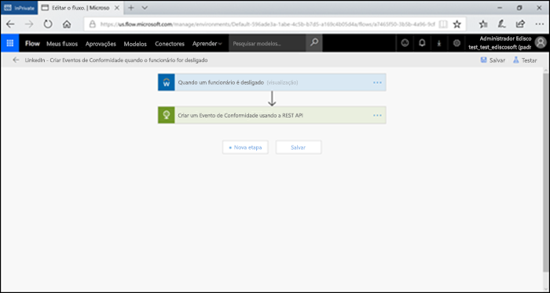

# Automatizar retenção baseada em eventos

>*[Diretrizes de licenciamento do Microsoft 365 para segurança e conformidade](https://aka.ms/ComplianceSD).*

O dramático aumento no volume de conteúdo nas organizações e como ele pode se tornar ROT (redundante, obsoleto, trivial) é um negócio sério. Para continuar encarando de frente os desafios legais, comerciais e de conformidade regulamentar, as empresas devem ser capaz de proteger informações importantes, e identificar rapidamente o que é relevante. Para que uma empresa seja bem-sucedida, é fundamental que ela retenha apenas informações importantes e pertinentes.

Para atender à essa necessidade, as organizações podem aproveitar as soluções de retenção no Centro de Conformidade e Segurança do Office 365. A retenção pode ser ativada pelo uso de [rótulos de retenção](labels.md). O rótulo de retenção tem a opção de [basear o período de retenção em um evento específico](event-driven-retention.md). Normalmente, o período de retenção se baseia em uma data conhecida, como a data de criação ou a data da última modificação do conteúdo. No entanto, as organizações também têm requisitos para descartar conteúdo com base na ocorrência de um evento, por exemplo, sete anos depois que um funcionário deixa a organização.

Para garantir o conteúdo seja descartado de acordo com as regras, é fundamental saber quando um evento ocorre. Com o volume de conteúdo aumentando rapidamente, fica cada vez mais difícil retê-lo e descartá-lo em conformidade e de maneira oportuna.

A retenção baseada em eventos resolve esse problema. Este tópico explica como configurar os fluxos dos processos empresariais para automatizar a retenção por meio de eventos usando a API REST do Microsoft 365.

## Sobre a retenção baseada em eventos

Sejam as organizações de pequeno, médio ou grande porte, a quantidade de documentos comerciais e jurídicos, arquivos de funcionários, contratos e documentação de produtos que se cria e se gerencia todos os dias está aumentando radicalmente.

Por exemplo, todos os dias, dezenas ou centenas de funcionários entram e saem das organizações. O departamento de RH continua a criar, atualizar ou excluir documentos relacionados a funcionários de acordo com as exigências comerciais. Esse processo está sujeito às diferentes políticas de retenção descritas para o negócio:

- **O período de retenção do conteúdo pode ser uma data conhecida**, como a data da criação, a data da última modificação ou da rotulagem do conteúdo. Por exemplo, você pode reter documentos por sete anos depois de criá-los e excluí-los em seguida.

- **O período de retenção do conteúdo pode ser uma data desconhecida**. Por exemplo, com os rótulos de retenção, é possível basear o período de retenção na ocasião em que ocorre um tipo específico de evento, como a data em que um funcionário sai da empresa.

O evento desencadeia o início do período de retenção, e todo o conteúdo com um rótulo aplicado para esse tipo de evento faz com que as ações de retenção do rótulo sejam aplicadas a ele. Isso se chama retenção baseada em eventos. Para saber mais, confira [Visão geral da retenção direcionada por eventos](event-driven-retention.md).

## Configurar a retenção baseada em eventos

Esta seção descreve o que é necessário fazer antes da retenção do conteúdo.

### Identificar as funções

Identificar as diferentes funções dentro de uma organização que executam as tarefas de Gerenciamento de Registros e que seriam responsáveis pela retenção eficaz e eficiente de documentos comerciais.

  | **Pessoal**| **Função**|
  | - | - |
  | Administrador | Cria tipos de evento de retenção, rótulos de retenção e repositórios de registro no SharePoint |
  | Gerente de registros                                  | Fornece políticas de retenção, diretrizes de agendamento de retenção e detalhes de conformidade   |
  | Administrador do sistema (empresa)                          | Configura e gerencia sistemas externos para trabalhar com o Microsoft 365                       |
  | Operador de Informações                               | Gerencia o ciclo de vida dos seus processos empresariais (RH, finanças, TI e assim por diante)                 |

### Configurar o Centro de Conformidade e Segurança
  
1. O administrador de conformidade cria um tipo de evento &ndash;, por exemplo, Rescisão de Funcionário, Vencimento de Contrato ou Término de Fabricação de Produto. (confira o processo passo a passo na [ Retenção orientada por eventos](event-driven-retention.md).
    
2. O administrador de conformidade cria um rótulo de retenção com base em um evento e associa o rótulo a um tipo de evento.
    
    Há quatro tipos de fatores desencadeantes para rótulos de retenção:
            
    1. Data de criação
                
    2. Última modificação
                
    3. Data do rótulo (quando o conteúdo foi rotulado)
                
    4. Com base em eventos
    
3. O administrador de conformidade publica o rótulo de retenção.

### Configurar o SharePoint
   
Para criar um repositório de registros, o administrador de conformidade:

1. Cria um site do SharePoint.

2. Faz um dos seguintes procedimentos:
        
    - Cria uma biblioteca do SharePoint: ele define um rótulo baseado em eventos no nível da biblioteca. Para saber mais, confira [Como aplicar um rótulo de retenção padrão a todo o conteúdo de uma biblioteca, pasta ou de um conjunto de documentos do SharePoint](labels.md#applying-a-default-retention-label-to-all-content-in-a-sharepoint-library-folder-or-document-set).
          
    - Faz a configuração de um conjunto de documentos no SharePoint. Para saber mais, confira [Introdução a conjuntos de documentos](https://support.office.com/article/3DBCD93E-0BED-46B7-B1BA-B31DE2BCD234).
      
3. Atribui uma ID de ativo ao conjunto de documentos de cada funcionário. Uma ID do ativo é um nome do produto ou código do produto usado pela organização, por exemplo, o Número do funcionário pode ser uma ID do ativo. Ao atribuir a ID do ativo à pasta, todos os itens dessa pasta passar a ter automaticamente a mesma ID do ativo. Isso significa que todos os itens podem ter o período de retenção desencadeado pelo mesmo evento.

## Maneiras de disparar a retenção baseada em eventos

Há duas maneiras pelas quais a retenção baseada em eventos pode ser disparada:

- **Usando a interface do usuário do centro de administração** Esse é um processo que pode ser usado para reter menos conteúdo de cada vez ou no caso de o gatilho que ativa a retenção não ser muito frequente (mensal ou anual, por exemplo). Para mais informações sobre esse método, confira a [Visão geral dos rótulos de retenção baseada em eventos](event-driven-retention.md). No entanto, esse método de gatilho de retenção pode ser demorado e propenso a erros, desse modo inibindo escalabilidade. Portanto, uma solução automatizada e ordenada para acionar a retenção pode melhorar a segurança e a conformidade dos dados.

- **Usando uma API REST do Microsoft 365** Esse processo pode ser usado quando grandes quantidades de conteúdo devem ser retidas por vez e/ou quando a frequência de disparo da retenção for mais frequente, como diária ou semanal. O fluxo detecta quando um evento ocorre no sistema de linha de negócios e cria automaticamente um evento relacionado no Centro de Conformidade e Segurança. Não é necessário criar manualmente um evento na interface do usuário sempre que ocorrer um.

Há duas opções de uso para a API REST:

- **O Microsoft Flow ou um aplicativo semelhante** pode ser usado para desencadear automaticamente a ocorrência de um evento. O Microsoft Flow é um orquestrador para a conexão com outros sistemas. Usar o Microsoft Flow não requer uma solução personalizada.

- **PowerShell ou um cliente HTTP para chamar a REST API** Usando o PowerShell (versão 6 ou superior) para chamar a API REST do Microsoft 365 para criar eventos. 

Uma API REST é um ponto de extremidade de serviço que oferece suporte a conjuntos de operações HTTP (métodos), que fornecem o acesso criar/recuperar/atualizar/deletar aos recursos do serviço. Para saber mais, confira [Componenente de uma solicitação/resposta do API REST](https://docs.microsoft.com/rest/api/gettingstarted/#components-of-a-rest-api-requestresponse). Nesse caso, usando o Microsoft 365 REST API, eventos podem ser criados e recuperados usando operações (métodos) POST e GET.

## Exemplos de cenários

Vamos considerar os seguintes cenários:

### Cenário 1: funcionários que deixam a organização 

Uma organização cria e armazena vários documentos relativos ao contrato de trabalho para cada funcionário. Esses documentos são gerenciados e mantidos enquanto durar o vínculo de emprego de cada funcionário. No entanto, quando o funcionário deixa a organização ou o contrato de trabalho chega ao fim, a organização é obrigada por requisitos legais e comerciais a guardar os documentos desse funcionário por um período estipulado.

Agora, se vários funcionários deixarem a organização todos os dias, ela deverá disparar o tempo de retenção de centenas ou milhares de documentos por dia.

Além disso, o período de retenção deve ser calculado para cada um desses funcionários, como a Data de rescisão + número de dias, meses ou anos, com base no tipo de registro do funcionário. Por exemplo, a remuneração versus os registros de benefícios desse funcionário pode precisar de uma retenção diferente.

O diagrama abaixo mostra como pode haver diversos rótulos associados a um único evento. Aqui estão todos os arquivos sob o rótulo de Indenização do trabalhador e todos os arquivos sob o rótulo de Benefícios dos funcionários estão ambos associados a um único evento, que é o funcionário deixando a organização. Cada um desses arquivos tem diferentes relógios de retenção. Portanto, quando um funcionário deixa a organização, esses arquivos dentro de cada etiqueta têm um período de retenção diferente. Disparar todos esses relógios diferentes para cada tipo de arquivo ou rótulo para cada funcionário é uma tarefa bastante desafiadora. Imagine fazer isso para vários funcionários.

Portanto, um processo automatizado para acionar esses diferentes relógios de retenção para vários funcionários economizaria tempo, seria isento de erros e extremamente eficiente.

**Como configurar a retenção automatizada baseada em eventos para este cenário:**

  - O administrador criar pastas de funcionários para o Conjunto de documentos, como Sara Melo, Diogo Martins.

  - O administrador adiciona arquivos de funcionários, como Benefícios, Folha de pagamento e Seguro-doença, à pasta de cada funcionário.

  - O administrador atribui uma ID de ativo para a pasta de cada funcionário. 

  - O administrador do CCS entra no Centro de Conformidade e Segurança.

  - O administrador do Centro de Conformidade e Segurança cria tipos de eventos relacionados a funcionários, como "Rescisão de Funcionário" e "Contratação de Funcionário".

  - O administrador do Centro de Conformidade e Segurança cria o rótulo "Retenção de Funcionários".

  - O rótulo "Retenção de Funcionário" é publicado e aplicado de forma automática ou manual aos arquivos de funcionários no SharePoint.

  - Um sistema de gerenciamento de RH, como o Workday, pode trabalhar com o Microsoft Flow para realizar periodicamente o gerenciamento de arquivos de funcionários.

  - Quando um funcionário deixa a organização, o Flow dispara a API REST de retenção baseada em eventos do Microsoft 365, que inicia o relógio de retenção nos arquivos específicos do funcionário.

#### Usando o Microsoft Flow

Etapa 1 – Criar um fluxo para criar um evento usando a API REST do Microsoft 365

##### Criar um evento

Exemplo de código para chamar a API REST

<table>
<thead>
<tr class="header">
<th>Método</th>
<th>POST</th>
<th></th>
</tr>
</thead>
<tbody>
<tr class="odd">
<td>URL</td>
<td>https://ps.compliance.protection.outlook.com/psws/service.svc/ComplianceRetentionEvent</td>
<td></td>
</tr>
<tr class="even">
<td>Cabeçalhos</td>
<td>Content-Type</td>
<td>application/atom+xml</td>
</tr>
<tr class="odd">
<td>Corpo</td>
<td>
&lt;?xml version='1.0' encoding='utf-8' standalone='yes'?&gt;

&lt;entry xmlns:d='https://schemas.microsoft.com/ado/2007/08/dataservices'

xmlns:m='https://schemas.microsoft.com/ado/2007/08/dataservices/metadata'

xmlns='https://www.w3.org/2005/Atom'&gt;

&lt;category scheme='https://schemas.microsoft.com/ado/2007/08/dataservices/scheme' term='Exchange.ComplianceRetentionEvent' /&gt;

&lt;updated&gt;9/9/2017 10:50:00 PM&lt;/updated&gt;

&lt;content type='application/xml'&gt;

&lt;m:properties&gt;

&lt;d:Name&gt;Employee Termination &lt;/d:Name&gt;

&lt;d:EventType&gt;99e0ae64-a4b8-40bb-82ed-645895610f56&lt;/d:EventType&gt;

&lt;d:SharePointAssetIdQuery&gt;1234&lt;/d:SharePointAssetIdQuery&gt;

&lt;d:EventDateTime&gt;2018-12-01T00:00:00Z &lt;/d:EventDateTime&gt;

&lt;/m:properties&gt;

&lt;/content&gt;

&lt;/entry&gt;
</td>
<td></td>
</tr>
<tr class="even">
<td>Autenticação</td>
<td>Básica</td>
<td></td>
</tr>
<tr class="odd">
<td>Nome de usuário</td>
<td>"Usuáriodeconformidade"</td>
<td></td>
</tr>
<tr class="even">
<td>Senha</td>
<td>"Senhadeconformidade"</td>
<td></td>
</tr>
</tbody>
</table>

##### Parâmetros disponíveis

<table>
<thead>
<tr class="header">
<th><strong>Parâmetros</strong></th>
<th><strong>Descrição</strong></th>
<th><strong>Anotações</strong></th>
</tr>
</thead>
<tbody>
<tr class="odd">
<td>&lt;d:Name&gt;&lt;/d:Name&gt;</td>
<td>Fornece um nome exclusivo para o evento.</td>
<td>Não pode conter espaços à direita nem os seguintes caracteres: % * \ &amp; &lt; &gt; | # ? , : ;</td>
</tr>
<tr class="even">
<td>&lt;d:EventType&gt;&lt;/d:EventType&gt;</td>
<td>Insere o nome do tipo de evento (ou GUID).</td>
<td>Exemplo: "Rescisão de funcionário". O Tipo de evento deve estar associado a um rótulo de retenção.</td>
</tr>
<tr class="odd">
<td>&lt;d:SharePointAssetIdQuery&gt;&lt;/d:SharePointAssetIdQuery&gt;</td>
<td>Insere "ComplianceAssetId:"” + ID do funcionário.</td>
<td>Exemplo: &quot;ComplianceAssetId:12345&quot;</td>
</tr>
<tr class="even">
<td>&lt;d:EventDateTime&gt;&lt;/d:EventDateTime&gt;</td>
<td>Data e hora do evento</td>
<td>
Formato: yyyy-MM-ddTHH:mm:ssZ. Exemplo:

2018-12-01T00:00:00Z
</td>
</tr>
</tbody>
</table>

##### Códigos de resposta

| **Código de resposta** | **Descrição**       |
| ----------------- | --------------------- |
| 302               | Redirecionamento              |
| 201               | Criado em               |
| 403               | Falha na autorização  |
| 401               | Falha na autenticação |

##### Obter eventos com base em intervalo de tempo

<table>
<thead>
<tr class="header">
<th>Método</th>
<th>GET</th>
<th></th>
</tr>
</thead>
<tbody>
<tr class="odd">
<td>URL</td>
<td><ol start="4" type="1">
<li>
https://ps.compliance.protection.outlook.com/psws/service.svc/ComplianceRetentionEvent?BeginDateTime=2019-01-11&amp;EndDateTime=2019-01-16
</li>
</ol></td>
<td></td>
</tr>
<tr class="even">
<td>Cabeçalhos</td>
<td>Content-Type</td>
<td>application/atom+xml</td>
</tr>
<tr class="odd">
<td></td>
<td></td>
<td></td>
</tr>
<tr class="even">
<td>Autenticação</td>
<td>Básica</td>
<td></td>
</tr>
<tr class="odd">
<td>Nome de usuário</td>
<td>"Usuáriodeconformidade"</td>
<td></td>
</tr>
<tr class="even">
<td>Senha</td>
<td>"Senhadeconformidade"</td>
<td></td>
</tr>
</tbody>
</table>

##### Códigos de resposta

| **Código de resposta** | **Descrição**                   |
| ----------------- | --------------------------------- |
| 200               | OK. Uma lista de eventos em atom+xml |
| 404               | Não encontrado                         |
| 302               | Redirecionamento                          |
| 401               | Falha na autorização              |
| 403               | Falha na autenticação             |

##### Obter um evento por ID

| Método         | GET   |                      |
| -------------- | ------------------------------------------------------------------------------------------------------------------------------------------------------------------------------------------------------------------------------------------------------------------ | -------------------- |
| URL            | [https://ps.compliance.protection.outlook.com/psws/service.svc/ComplianceRetentionEvent(‘174e9a86-74ff-4450-8666-7c11f7730f66’)](https://ps.compliance.protection.outlook.com/psws/service.svc/ComplianceRetentionEvent\('174e9a86-74ff-4450-8666-7c11f7730f66'\)) |                      |
| Cabeçalho         | Content-Type                                                                                                                                                                                                                                                       | application/atom+xml |
| Autenticação | Básica                                                                                                                                                                                                                                                              |                      |
| Nome de usuário       | "Usuáriodeconformidade"                                                                                                                                                                                                                                                   |                      |
| Senha       | "Senhadeconformidade"                                                                                                                                                                                                                                               |                      |

##### Códigos de resposta

| **Código de resposta** | **Descrição**                                      |
| ----------------- | ---------------------------------------------------- |
| 200               | OK. O corpo da resposta contém o evento em atom+xml. |
| 404               | Não encontrado                                            |
| 302               | Redirecionamento                                             |
| 401               | Falha na autorização                                 |
| 403               | Falha na autenticação                                |

##### Obter um evento por nome

| Método         | GET       |                      |
| -------------- | -------------------------------------------------------------------------------------------------------------------------------------------- | -------------------- |
| URL            | <https://ps.compliance.protection.outlook.com/psws/service.svc/ComplianceRetentionEvent('EventByRESTPost-2226bfebcc2841a8968ba71f9516b763')> |                      |
| Cabeçalhos        | Content-Type                                                                                                                                 | application/atom+xml |
| Autenticação | Básica                                                                                                                                        |                      |
| Nome de usuário       | "Usuáriodeconformidade"                                                                                                                             |                      |
| Senha       | "Senhadeconformidade"                                                                                                                         |                      |

##### Códigos de resposta

| **Código de resposta** | **Descrição**                                      |
| ----------------- | ---------------------------------------------------- |
| 200               | OK. O corpo da resposta contém o evento em atom+xml. |
| 404               | Não encontrado                                            |
| 302               | Redirecionamento                                             |
| 401               | Falha na autorização                                 |
| 403               | Falha na autenticação                                |

#### Usando o PowerShell (versão 6 ou posterior) ou um cliente HTTP

Etapa 1 – Conectar-se ao PowerShell.

Etapa 2 – Executar o seguinte script.

<table>
<tbody>
<tr class="odd">
<td>
param([string]$baseUri)

$userName = &quot;UserName&quot;

$password = &quot;Password&quot;

$securePassword = ConvertTo-SecureString $password -AsPlainText -Force

$credentials = New-Object System.Management.Automation.PSCredential($userName, $securePassword)

$EventName=&quot;EventByRESTPost-$(([Guid]::NewGuid()).ToString('N'))&quot;

Write-Host &quot;Start to create an event with name: $EventName&quot;

$body = &quot;&lt;?xml version='1.0' encoding='utf-8' standalone='yes'?&gt;

&lt;entry xmlns:d='https://schemas.microsoft.com/ado/2007/08/dataservices'

xmlns:m='https://schemas.microsoft.com/ado/2007/08/dataservices/metadata'

xmlns='https://www.w3.org/2005/Atom'&gt;

&lt;category scheme='https://schemas.microsoft.com/ado/2007/08/dataservices/scheme' term='Exchange.ComplianceRetentionEvent' /&gt;

&lt;updated&gt;7/14/2017 2:03:36 PM&lt;/updated&gt;

&lt;content type='application/xml'&gt;

&lt;m:properties&gt;

&lt;d:Name&gt;$EventName&lt;/d:Name&gt;

&lt;d:EventType&gt;e823b782-9a07-4e30-8091-034fc01f9347&lt;/d:EventType&gt;

&lt;d:SharePointAssetIdQuery&gt;'ComplianceAssetId:123'&lt;/d:SharePointAssetIdQuery&gt;

&lt;/m:properties&gt;

&lt;/content&gt;

&lt;/entry&gt;&quot;

$event = $null

try

{

$event = Invoke-RestMethod -Body $body -Method 'POST' -Uri &quot;$baseUri/ComplianceRetentionEvent&quot; -ContentType &quot;application/atom+xml&quot; -Authentication Basic -Credential $credentials -MaximumRedirection 0

}

catch

{

$response = $_.Exception.Response

if($response.StatusCode -eq &quot;Redirect&quot;)

{

$url = $response.Headers.Location

Write-Host &quot;redirected to $url&quot;

$event = Invoke-RestMethod -Body $body -Method 'POST' -Uri $url -ContentType &quot;application/atom+xml&quot; -Authentication Basic -Credential $credentials -MaximumRedirection 0

}

}

$event | fl *
</td>
</tr>
</tbody>
</table>

#### Verificar o resultado nas duas opções

Etapa 1: Vá para o Centro de Conformidade e Segurança.

Etapa 2: Selecione **Eventos** em **Governança de informações**.

Etapa 3 : Verifique se o Evento foi criado.

Da mesma forma, as opções acima para automatizar a retenção baseada em eventos também podem ser usadas também para os cenários a seguir.

### Cenário 2 : Expiração de Contratos

Uma organização pode fazer registros múltiplos para um único contrato com clientes, fornecedores e parceiros. Esse documentos podem ser colocados em uma biblioteca de documentos como o Sharepoint. O término de um contrato determina o início do período de retenção dos documentos associados àquele contrato. Por exemplo, todos os registros relacionados a contratos precisam ser retidos por cinco anos contados da data em que o contrato expirou. O evento que desencadeia o período de retenção de cinco anos é a expiração do contrato.

Um sistema de CRM (gerenciamento de relacionamento com o cliente) pode trabalhar com o Microsoft 365 e disparar a retenção de documentos do contrato.

**Como configurar a retenção automatizada baseada em eventos para este cenário:**

  - O administrador cria uma biblioteca do SharePoint com várias pastas para cada tipo de contrato.

  - O administrador adiciona arquivos de contrato, como Contratos de Licença e Contratos de Desenvolvimento, a cada pasta de contrato.

  - O administrador atribui uma ID de ativo à pasta de cada contrato.

  - O administrador do CCS entra no Centro de Conformidade e Segurança.

  - O administrador do Centro de Conformidade e Segurança cria tipos de eventos relacionados a contratos, como "Criação de Contrato" e "Expiração de Contrato".

  - O administrador do Centro de Conformidade e Segurança cria o rótulo "Expiração do Contrato".

  - O rótulo "Expiração de Contrato" é publicado e aplicado de forma automática ou manual aos arquivos de contratos no SharePoint.

  - O Sistema de Gerenciamento de Contratos pode trabalhar com o Microsoft Flow ou um aplicativo semelhante para realizar periodicamente o gerenciamento de arquivos de contratos.

  - Quando um contrato expira, o Microsoft Flow dispara a API REST de retenção baseada em eventos do Microsoft 365, que inicia o relógio de retenção nos arquivos específicos do contrato.

### Cenário 3 – Término de fabricação de produto

Uma empresa que fabrica diferentes linhas de produtos cria muitas especificações de fabricação e documentos de precificação. Quando o produto deixa de ser fabricado, todas as especificações e os documentos vinculados a esse produto devem ser retidos por um período específico, após o término da vida útil do produto.

Um sistema de ERP (Planejamento de Recursos Empresariais) pode trabalhar com o Microsoft 365 e o Microsoft Flow para disparar a retenção.

**Como configurar a retenção automatizada baseada em eventos para este cenário:**

  - O administrador cria pastas de produtos no Conjunto de documentos, como Produto 1, Produto 2 e assim por diante.

  - O administrador adiciona arquivos de produto, como Especificações de Fabricação, Preços de Produto e Licenciamento de Produto, a cada pasta de produto.

  - O administrador atribui uma ID de ativo à pasta de cada produto.

  - O administrador do CCS entra no Centro de Conformidade e Segurança.

  - O administrador do Centro de Conformidade e Segurança cria tipos de eventos relacionados a funcionários, como "Início de Fabricação de Produto" e "Término de Fabricação de Produto".

  - O administrador do Centro de Conformidade e Segurança cria o rótulo "Término de Fabricação de Produto".

  - O rótulo "Término de Fabricação de Produto" é publicado e aplicado de forma automática ou manual aos arquivos de produtos no SharePoint.

  - Os sistemas de ERP podem trabalhar com o Microsoft Flow ou com aplicativos semelhantes para realizar periodicamente o gerenciamento de arquivos de produtos.

  - Quando a fabricação de um produto é encerrada, o Microsoft Flow dispara a API REST de retenção baseada em eventos do Microsoft 365, que inicia o relógio de retenção nos arquivos específicos do produto.

## Apêndice

### Como usar resultados de resposta de Redirecionamento 302 para chamar a API REST

1. Invoque uma chamada de evento de retenção POST usando a URL da API REST <https://ps.compliance.protection.outlook.com/psws/service.svc/ComplianceRetentionEvent> (é necessário ter permissões de administrador global).

2. Verifique o código da resposta. Se for 302, obtenha a URL redirecionada da propriedade Location do cabeçalho da resposta.

3. Invoque a chamada de evento de retenção POST usando a URL redirecionada.

## Créditos

Este tópico foi revisado por:

Antonio Maio MVP de aplicativos e serviços do Microsoft Office  Antonio.Maio@Protiviti.com
