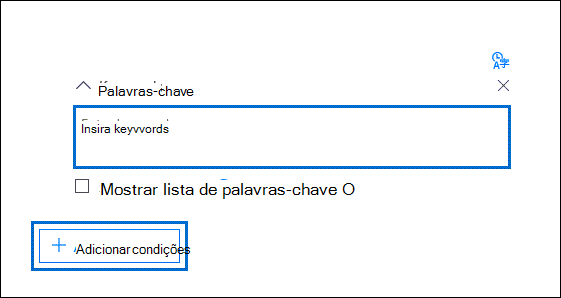

# Criar consultas de coleta de pesquisa na descoberta eletrônica avançada

Ao criar consultas de pesquisa para coletar dados em um caso de descoberta eletrônica avançada, você pode usar palavras-chave para localizar conteúdo e condições específicas para restringir o escopo da pesquisa para retornar itens que sejam mais relevantes para sua investigação legal.

## Pesquisas de palavra-chave

Digite uma consulta de palavra-chave na caixa **palavras-** chave na consulta de pesquisa. Você pode especificar palavras-chave, propriedades de mensagens de email, como datas enviadas e recebidas, ou propriedades do documento, como nomes de arquivo ou a data em que um documento foi alterado pela última vez. Faça consultas mais complexas que usam um operador Booleano, **E**, **OU**, **NÃO** e **PRÓXIMO**. Você também pode pesquisar informações confidenciais (como números de seguridade social) em documentos no SharePoint e no OneDrive (não em mensagens de email) ou pesquisar documentos que foram compartilhados externamente. Se você deixar a caixa **palavras-chave** vazia, todo o conteúdo localizado nos locais de conteúdo especificado estará nos resultados da pesquisa.

## Lista de palavras-chave

Como alternativa, você pode marcar a caixa de seleção **Mostrar lista de palavras-chave** e a frase de palavra-chave ou palavra-chave digite em cada linha. As palavras-chave em cada linha são conectadas por um operador lógico (que é representado como *c:s* na sintaxe da consulta de pesquisa) que é semelhante em funcionalidade ao operador **or** na consulta de pesquisa criada. Isso significa que os itens que contêm qualquer palavra-chave em qualquer linha estão nos resultados da pesquisa. Você pode adicionar até 180 linhas na lista de palavras-chave em consultas avançadas de pesquisa de descoberta eletrônica.

Por que usar a lista de palavras-chave? Você pode obter estatísticas que mostram quantos itens correspondem a cada palavra-chave na lista de palavras-chave. Isso pode ajudá-lo a identificar rapidamente as palavras-chave mais (e menos) em vigor. Você também pode usar uma frase de palavra-chave (entre parênteses) em uma linha na lista de palavras-chave. Para obter mais informações sobre estatísticas de pesquisa, confira [Estatísticas de pesquisa](search-statistics.md).

## Condições

Você pode adicionar condições de pesquisa para restringir o escopo de uma pesquisa e retornar um conjunto de resultados mais refinado. Cada condição adiciona uma cláusula à consulta de pesquisa que é criada e executada quando você inicia a pesquisa. Uma condição é conectada logicamente à consulta de palavra-chave especificada na caixa palavra-chave por um operador lógico (que é representado como *c:c* na sintaxe da consulta de pesquisa) que é semelhante em funcionalidade ao operador **and** . Isso significa que os itens precisam satisfazer a consulta de palavra-chave e uma ou mais condições a serem incluídas nos resultados da pesquisa. É assim que as condições ajudam a restringir os resultados. Para obter uma lista e uma descrição das condições que você pode usar em uma consulta de pesquisa, consulte a seção "condições de pesquisa" em [consultas de palavra-chave e condições de pesquisa](keyword-queries-and-search-conditions.md#search-conditions).
