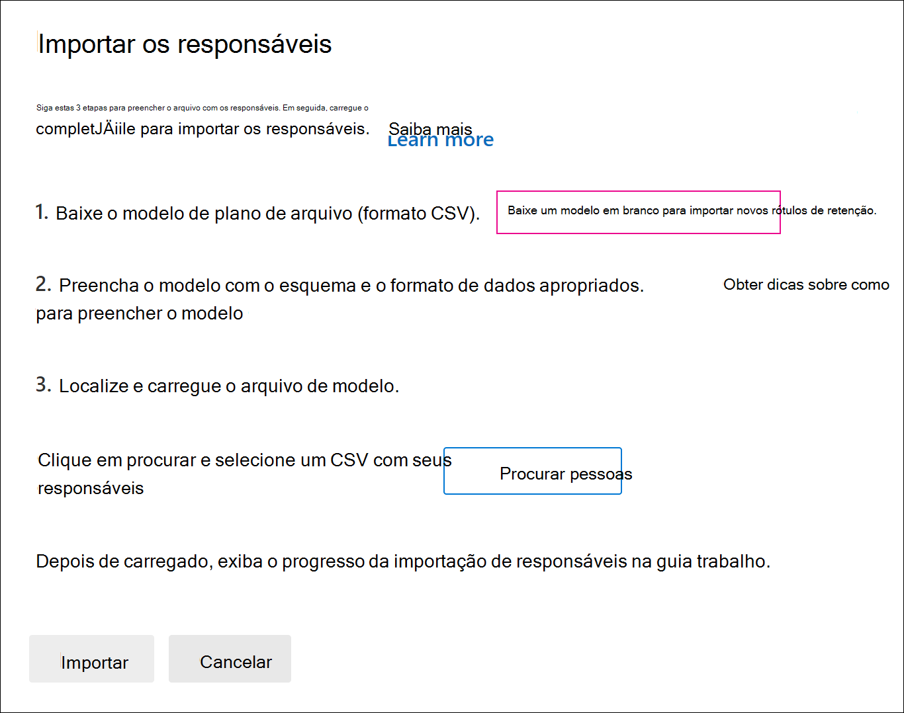

# Importar custodiantes para um caso de Descoberta Avançada

Para casos avançados de Descoberta eDiscovery que envolvem muitos custodiantes, você pode importar vários custodiantes de uma só vez usando um arquivo CSV que contém as informações necessárias para adicioná-los a uma ocorrência.

## Importar custodiantes

1. Abra o caso Descoberta Avançada e selecione a **guia Fontes de** dados.

2. Clique **em Adicionar fonte de dados** Importar  >  **custodiantes**.

3. Na página **Importar custodiantes,** clique em **Baixar** um modelo em branco para baixar um arquivo CSV de modelo de custodiante.

   

4. Adicione as informações de custodia ao arquivo CSV e salve-as no computador local. Consulte a [seção Arquivo CSV custodiado](#custodian-csv-file) para obter informações sobre as propriedades necessárias no arquivo CSV.

5. Depois de preparar o arquivo CSV com as informações  do custodiante, volte para a guia Fontes de dados e clique em **Adicionar** custodiantes de importação de fonte de dados  >  **novamente.**

6. Na página **Importar custodiantes,** clique em **Procurar** e carregue o arquivo CSV que contém as informações de custodiante.

   Depois que o arquivo CSV é carregado, um trabalho chamado **BulkAddCustodian** é criado e exibido na guia **Trabalhos.** O trabalho valida os custodiantes e suas fontes de dados associadas e os adiciona à **página Fontes** de dados do caso.

## Arquivo CSV custodiado

Depois de baixar o modelo de custodiante CSV, você pode adicionar custodiantes e sua fonte de dados em cada linha. Certifique-se de não alterar os nomes de coluna na linha do header. Use o tipo de carga de trabalho e as colunas de local da carga de trabalho para associar outras fontes de dados a um custodiante.

| Nome da coluna|Descrição|
|:------- |:------------------------------------------------------------|
|**Custodian contactEmail**     |O endereço de email UPN do custodiado. Por exemplo, sarad@contoso.onmicrosoft.com.           |
|**Exchange Habilitado** | Valor TRUE/FALSE para incluir ou não a caixa de correio do custodiante.      |
|**OneDrive Habilitado** | Valor TRUE/FALSE para incluir ou não a conta do OneDrive for Business do custodiante. |
|**É OnHold**        | Valor TRUE/FALSE para indicar se as fontes de dados custodiadas estão em espera. 1     |
|**Tipo workload1**         |Valor de cadeia de caracteres que indica o tipo de fonte de dados a ser associada ao custodiante. Os valores possíveis incluem:  - ExchangeMailbox  - SharePointSite - TeamsMailbox - TeamsSite  - YammerMailbox - YammerSite |
|**Local da carga de trabalho1**     | Dependendo do tipo de carga de trabalho, esse seria o local da fonte de dados. Por exemplo, o endereço de email de uma caixa de correio do Exchange ou a URL de um site do SharePoint. |
|||

> [!NOTE]
> 1 Você pode colocar no máximo 1.000 caixas de correio e 100 sites em espera usando o processo de importação de custodiante e o arquivo CSV. Você pode usar esse processo para adicionar mais de 1.000 custodiantes a um caso, mas os limites de espera ainda se aplicam. Para obter mais informações sobre limites de espera, consulte [Limits in Advanced eDiscovery](limits-ediscovery20.md#hold-limits).

Veja um exemplo de um arquivo CSV com informações de custodiação:  

|Custodian contactEmail      | Exchange Habilitado | OneDrive Habilitado | É OnHold | Tipo workload1 | Local da carga de trabalho1             |
| ----------------- | ---------------- | ---------------- | --------- | -------------- | ------------------------------ |
|robinc@onmicrosoft.contoso.com | TRUE             | TRUE             | TRUE      | SharePointSite | https://contoso.sharepoint.com |
|pillarp@onmicrosoft.contoso.com | TRUE             | TRUE             | TRUE      | |  |
||||||

## Custodiante e validação de fonte de dados

Depois de carregar o arquivo CSV do custodiante, a Descoberta Avançada e Faz as seguintes coisas:

1. Valida os custodiantes e suas fontes de dados.

2. Indexa todas as fontes de dados para cada custodiante e os coloca em espera (se a propriedade **Is OnHold** no arquivo CSV estiver definida como TRUE).

### Validação custodiada

Atualmente, só há suporte à importação de custodiantes incluídos no Azure Active Directory (Azure AD) da sua organização.

A ferramenta de importação do custodiador localiza e valida os custodiantes usando o valor UPN na coluna **Custodian contactEmail** no arquivo CSV. Os custodiantes validados são adicionados automaticamente ao caso e listados na guia **Fontes de** dados do caso. Se um custodiante não puder ser validado, ele será listado no log de erros do trabalho BulkAddCustodian listado na guia **Trabalhos** no caso. Os custodiantes nãovalidados não são adicionados ao caso ou listados na **guia Fontes de** dados.

### Validação de fonte de dados

Depois que os custodiantes são validados e adicionados à ocorrência, cada caixa de correio principal e conta do OneDrive associada a um custodiante é adicionada.

No entanto, se qualquer uma das outras fontes de dados (como sites do SharePoint, Microsoft Teams, Grupos do Microsoft 365 ou grupos do Yammer) associadas a um custodiante não puder  ser encontrada, nenhuma delas será atribuída ao custodiante e o valor Não validado será exibido na coluna **Status** ao lado do custodiante na guia Fontes de dados. 

Para adicionar fontes de dados validadas para um custodiante:

1. Na guia **Fontes de dados,** selecione um custodiante que contenha fontes de dados que não sejam validadas.

2. Na página de sobrevoo custodiante, role até a seção Locais de **Custodiação** para exibir fontes de dados validadas e nãovalidadas associadas ao custodiante.

3. Clique **em Editar** na parte superior da página de sobrevoo para remover fontes de dados inválidas ou adicionar novas.

4. Depois de remover fontes de dados nãovalidadas ou adicionar uma nova, o valor **Ativo** será exibido na coluna **Status** do custodiante na guia **Fontes de** dados. Para adicionar fontes que anteriormente aparentam ser inválidas, siga as etapas de correção abaixo para adicioná-las manualmente a um custodiante.

### Correção de fontes de dados inválidas

Para adicionar e associar manualmente uma fonte de dados que anteriormente era inválida:

1. Na guia **Fontes de dados,** selecione um custodiante para adicionar manualmente e associar uma fonte de dados que anteriormente era inválida.

2. Clique **em Editar** na parte superior da página de sobrevoo para associar caixas de correio, sites, grupos do Teams ou do Yammer ao custodiante. Faça isso clicando em **Editar** ao lado do tipo de local de dados apropriado.

3. Clique **em Próximo** para exibir a página **Configurações de** Espera e configure a configuração de espera para as fontes de dados adicionadas.

4. Clique **em Próximo** para exibir a página Revisar **custodiantes** e clique **em Enviar** para salvar suas alterações.
