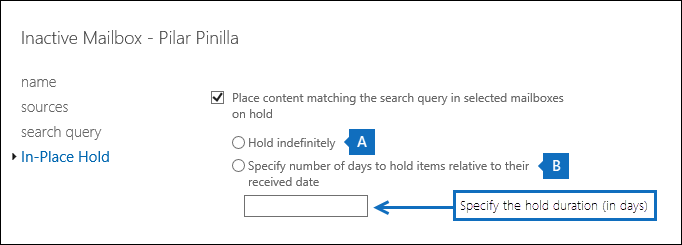

# <a name="change-the-hold-duration-for-an-inactive-mailbox"></a>Alterar a duração do bloqueio para uma caixa de correio inativa

Uma caixa de correio inativa é usada para reter o email de um ex-funcionário depois que ele sair da organização. Uma caixa de correio fica inativa quando uma Retenção de Litígio, uma Retenção de In-Place, uma política de retenção do Microsoft 365 ou uma retenção associada a um caso de Descoberta Eletrônico é colocada na caixa de correio e a conta de usuário correspondente é excluída. O conteúdo de uma caixa de correio inativa é mantido pela duração da espera que foi colocada na caixa de correio antes que ela se tornou inativa. A duração da espera define por quanto tempo os itens na pasta Itens Recuperáveis são mantidos. Quando a duração da espera expira para um item na pasta Itens Recuperáveis, o item é excluído permanentemente (excluído) da caixa de correio inativa. Depois que uma caixa de correio for inativa, você poderá alterar a duração da retenção ou da política de retenção do Microsoft 365 atribuída à caixa de correio inativa.
  
> [!IMPORTANT]
> À medida que continuamos investindo em maneiras diferentes de preservar o conteúdo da caixa de correio, anunciamos a ressarção do In-Place retém no Centro de administração do Exchange. Isso significa que você deve usar Retenções de Litígio e políticas de retenção do Microsoft 365 para criar uma caixa de correio inativa. A partir de 1º de abril de 2020, você não poderá criar novos In-Place retém no Exchange Online. Mas você ainda poderá alterar a duração da espera de uma In-Place colocada em uma caixa de correio inativa. No entanto, a partir de 1º de julho de 2020, você não poderá alterar a duração da espera. Você só poderá excluir uma caixa de correio inativa removendo o In-Place Remoção. Caixas de correio inativas existentes que estão In-Place remoção ainda serão preservadas até que a iseção seja removida. Para obter mais informações sobre a baixa In-Place, consulte a Baixa das ferramentas de [Descoberta eDiscovery herdado.](legacy-ediscovery-retirement.md)
  
## <a name="connect-to-powershell"></a>Conectar-se ao PowerShell

- Você precisa usar o PowerShell do Exchange Online para alterar a duração da espera para uma Responsabilidade de Litígio em uma caixa de correio inativa. Você não pode usar o Centro de Administração do Exchange (EAC). Mas você pode usar o PowerShell do Exchange Online ou o EAC para alterar a duração da espera para um In-Place Desem espera. Você pode usar o & centro de conformidade e segurança ou o PowerShell do Centro de Conformidade e Segurança para alterar a duração da retenção de uma política de retenção do Microsoft 365.
    
- Para se conectar ao Power & Shell do Exchange Online ou ao PowerShell do Centro de Conformidade e Segurança do Exchange Online, consulte um dos seguintes tópicos:
    
  - [Conectar-se ao PowerShell do Exchange Online ](https://go.microsoft.com/fwlink/p/?linkid=396554)
    
  - [Conectar-se ao PowerShell do Centro de Conformidade e Segurança](https://go.microsoft.com/fwlink/?linkid=799771)
    
- Retém associadas a ocorrências de Descobertas EDiscovery são retém infinitas, o que significa que não há uma duração de espera que possa ser alterada. Os itens são mantidos para sempre ou até que a espera seja removida e a caixa de correio inativa seja excluída.
    
- Para saber mais sobre caixas de correio inativas, confira Caixas de correio [inativas no Microsoft 365.](inactive-mailboxes-in-office-365.md)
    
## <a name="step-1-identify-the-holds-on-an-inactive-mailbox"></a>Etapa 1: Identificar os retém em uma caixa de correio inativa

Como diferentes tipos de retenções ou uma ou mais políticas de retenção do Microsoft 365 podem ser colocadas em uma caixa de correio inativa, a primeira etapa é identificar as retenções em uma caixa de correio inativa.
  
Execute o seguinte comando no PowerShell do Exchange Online para exibir as informações de espera para todas as caixas de correio inativas em sua organização.
  
```powershell
Get-Mailbox -InactiveMailboxOnly | FL DisplayName,Name,IsInactiveMailbox,LitigationHoldEnabled,LitigationHoldDuration,InPlaceHolds
```

O valor True **para** a **propriedade LitigationHoldEnabled** indica que a caixa de correio inativa está em Litígio. Se uma In-Place retenção, retenção de Descoberta Eletrônico ou política de retenção do Microsoft 365 for colocada em uma caixa de correio inativa, um GUID para a política de retenção ou retenção será exibido como o valor da propriedade **InPlaceHolds.** Por exemplo, o exemplo a seguir mostra os resultados de cinco caixas de correio inativas. 
  
```text
DisplayName           : Ann Beebe
Name                  : annb
IsInactiveMailbox     : True
LitigationHoldEnabled : True
LitigationHoldDuration: 365.00:00:00
InPlaceHolds          : {}
...
DisplayName           : Pilar Pinilla
Name                  : pilarp
IsInactiveMailbox     : True
LitigationHoldEnabled : False
LitigationHoldDuration: Unlimited
InPlaceHolds          : {c0ba3ce811b6432a8751430937152491}
...
DisplayName           : Mario Necaise
Name                  : marion
IsInactiveMailbox     : True
LitigationHoldEnabled : False
LitigationHoldDuration: Unlimited
InPlaceHolds          : {}
...
DisplayName           : Carol Olson
Name                  : carolo
IsInactiveMailbox     : True
LitigationHoldEnabled : False
LitigationHoldDuration: Unlimited
InPlaceHolds          : {mbxcdbbb86ce60342489bff371876e7f224}
...
DisplayName           : Abraham McMahon
Name                  : abrahamm
IsInactiveMailbox     : True
LitigationHoldEnabled : False
LitigationHoldDuration: Unlimited
InPlaceHolds          : {UniH7d895d48-7e23-4a8d-8346-533c3beac15d}
```

A tabela a seguir identifica os cinco tipos de espera diferentes que foram usados para tornar cada caixa de correio inativa.
  
|**Caixa de correio inativa**|**Tipo de espera**|**Como identificar a espera na caixa de correio inativa**|
|:-----|:-----|:-----|
|Ann Beebe  <br/> |Retenção de litígio  <br/> |A  *propriedade LitigationHoldEnabled*  é definida como  `True` .  <br/> |
|Pilar Pinilla  <br/> |Bloqueio In-loco  <br/> |A  *propriedade InPlaceHolds*  contém o GUID do In-Place que é colocado na caixa de correio inativa. Você pode dizer que é um In-Place, pois a ID não começa com um prefixo.  <br/> Você pode usar o comando no PowerShell do Exchange Online para obter informações sobre o In-Place De espera  `Get-MailboxSearch -InPlaceHoldIdentity <hold GUID> | FL` na caixa de correio inativa.  <br/> |
|Nat necaise  <br/> |Política de retenção do Microsoft 365 para toda a organização no Centro de Conformidade e & Segurança  <br/> |A  *propriedade InPlaceHolds*  está vazia. Isso indica que uma ou mais políticas de retenção do Microsoft 365 em toda a organização ou (em toda a organização) são aplicadas à caixa de correio inativa. Nesse caso, você pode executar o comando no PowerShell do Exchange Online para obter uma lista dos GUIDs para políticas de retenção do Microsoft 365 em toda  `Get-OrganizationConfig | Select-Object -ExpandProperty InPlaceHolds` a organização. O GUID para políticas de retenção em toda a organização que são aplicadas a caixas de correio do Exchange começa com o  `mbx` prefixo; por exemplo,  `mbxa3056bb15562480fadb46ce523ff7b02` .  <br/> <br/>Para identificar a política de retenção do Microsoft 365 aplicada à caixa de correio inativa &, execute o seguinte comando no PowerShell do Centro de Conformidade e Segurança.  <br/><br/> `Get-RetentionCompliancePolicy <retention policy GUID without prefix> | FL Name`<br/><br/>
|Wilson Olson  <br/> |Política de retenção do Microsoft 365 no Centro de Conformidade e Segurança & aplicada a caixas de correio específicas  <br/> |A  *propriedade InPlaceHolds*  contém o GUID da política de retenção do Microsoft 365 aplicada à caixa de correio inativa. Você pode dizer que esta é uma política de retenção aplicada a caixas de correio específicas porque o GUID começa com o  `mbx` prefixo. Se o GUID da política de retenção aplicada à caixa de correio inativa começou com o prefixo, isso indicaria que a política de retenção é aplicada às conversas do  `skp` Skype for Business.  <br/><br/> Para identificar a política de retenção do Microsoft 365 aplicada à caixa de correio inativa &, execute o seguinte comando no PowerShell do Centro de Conformidade e Segurança.<br/><br/> `Get-RetentionCompliancePolicy <retention policy GUID without prefix> | FL Name` <br/><br/>Remova o prefixo  `mbx` ou o  `skp` prefixo ao executar esse comando.  <br/> |
|Paul McMahon  <br/> |EDiscovery case hold in the Security & Compliance Center  <br/> |A  *propriedade InPlaceHolds*  contém o GUID do caso de Descoberta Eletrônico que é colocado na caixa de correio inativa. Você pode dizer que essa é uma isenção de caso de Descoberta eDiscovery porque o GUID começa com o  `UniH` prefixo.  <br/> Você pode usar o cmd & let no PowerShell do Centro de Conformidade e Segurança para obter informações sobre o caso de Descoberta Eletrônica ao que a isenção na caixa de correio inativa está  `Get-CaseHoldPolicy` associada. Por exemplo, você pode executar o comando para exibir o nome da espera de caso  `Get-CaseHoldPolicy <hold GUID without prefix> | FL Name` que está na caixa de correio inativa. Certifique-se de remover  `UniH` o prefixo ao executar esse comando.  <br/><br/> Para identificar o caso de Descoberta Eletrônico ao que a isenção na caixa de correio inativa está associada, execute os seguintes comandos.  <br/><br/> `$CaseHold = Get-CaseHoldPolicy <hold GUID without prefix>`<br/><br/> `Get-ComplianceCase $CaseHold.CaseId | FL Name`<br/><br/><br/> **Observação:** Não recomendamos o uso de retém de Descoberta Eletrônico para caixas de correio inativas. That's because eDiscovery cases are intended for specific, time-bound cases related to a legal issue. Em algum momento, um caso jurídico provavelmente terminará e as reteres associadas ao caso serão removidas e a ocorrência de Descoberta Ele será fechada (ou excluída). Na verdade, se uma isenção colocada em uma caixa de correio inativa estiver associada a um caso de Descoberta Eletrônico e a isenção for liberada ou o caso de Descoberta Eletrônico for fechado ou excluído, a caixa de correio inativa será excluída permanentemente. 

Para saber mais sobre as políticas de retenção do Microsoft 365, confira Saiba mais sobre políticas [de retenção e rótulos de retenção.](retention.md)
  
## <a name="step-2-change-the-hold-duration-for-an-inactive-mailbox"></a>Etapa 2: Alterar a duração da espera para uma caixa de correio inativa

Depois de identificar qual tipo de espera é colocada na caixa de correio inativa (e se há várias retém), a próxima etapa é alterar a duração da espera. 
  
### <a name="change-the-duration-for-a-litigation-hold"></a>Alterar a duração de uma Responsabilidade de Litígio

Veja como usar o PowerShell do Exchange Online para alterar a duração de espera para uma Responsabilidade de Litígio que é colocada em uma caixa de correio inativa. Você não pode usar o EAC. Execute o seguinte comando para alterar a duração da espera. Neste exemplo, a duração da espera é alterada para um período ilimitado.
  
```powershell
Set-Mailbox -InactiveMailbox -Identity <identity of inactive mailbox> -LitigationHoldDuration unlimited
```

O resultado é que os itens na caixa de correio inativa são retidos indefinidamente ou até que a espera seja removida ou a duração da espera seja alterada para um valor diferente.
  
> [!TIP]
> A melhor maneira de identificar uma caixa de correio inativa é usando o **nome** diferenciado ou o valor guid **do Exchange.** Usar um desses valores ajuda a evitar a especificação acidental da caixa de correio errada. 
  
### <a name="change-the-duration-for-an-in-place-hold"></a>Alterar a duração de um In-Place Desem

 Você pode usar o EAC ou o PowerShell do Exchange Online para alterar a duração da espera para um In-Place Desem espera. 
  
#### <a name="use-the-eac-to-change-the-hold-duration"></a>Usar o EAC para alterar a duração da espera

1. Se você sabe o nome do In-Place que deseja alterar, vá para a próxima etapa. Caso contrário, execute o seguinte comando para obter o nome do In-Place Que é colocado na caixa de correio inativa. Use a In-Place GUID de espera obtida na [Etapa 1.](#step-1-identify-the-holds-on-an-inactive-mailbox)

    ```powershell
    Get-MailboxSearch -InPlaceHoldIdentity <In-Place Hold GUID> | FL Name
    ```

2. No EAC, vá para **Gerenciamento de Conformidade** \> **eDiscovery Hold in-loco. &amp;**
    
3. Selecione o In-Place você deseja alterar e selecione **Editar**  edição.
    
4. Na página **de propriedades do In-Place eDiscovery &amp; Hold,** selecione **In-Place Hold**. 
    
5. Faça um dos seguintes com base na duração da espera atual:
    
    1. Selecione **Reter indefinidamente** para reter itens por um período ilimitado. 
    
    2. Selecione **Especificar o número de dias em que os itens devem ser resotados** em relação à data de seu vencimento para manter os itens por um período específico. Digite o número de dias que você deseja manter os itens. 
    
    
  
6. Selecione **Salvar**.
    
#### <a name="use-exchange-online-powershell-to-change-the-hold-duration"></a>Usar o PowerShell do Exchange Online para alterar a duração da espera

1. Se você sabe o nome do In-Place que deseja alterar, vá para a próxima etapa. Caso contrário, execute o seguinte comando para obter o nome do In-Place Que é colocado na caixa de correio inativa. Use a In-Place GUID de espera obtida na [Etapa 1.](#step-1-identify-the-holds-on-an-inactive-mailbox)

    ```powershell
    Get-MailboxSearch -InPlaceHoldIdentity <In-Place Hold GUID> | FL Name
    ```

2. Execute o seguinte comando para alterar a duração da espera. Neste exemplo, a duração da espera é alterada para 2.555 dias (aproximadamente sete anos). 
    
    ```powershell
    Set-MailboxSearch <identity of In-Place Hold> -ItemHoldPeriod 2555
    ```

     Para alterar a duração da espera para um período ilimitado, use  _-ItemHoldPeriod unlimited_.
  
## <a name="more-information"></a>Mais informações

- **Como a duração de espera é calculada para um item em uma caixa de correio inativa?** A duração é calculada a partir da data original em que um item de caixa de correio foi recebido ou criado. 
    
- **O que acontece quando a duração da espera expira?** Quando a duração da espera expira para um item de caixa de correio na pasta Itens Recuperáveis, o item é excluído permanentemente (excluído) da caixa de correio inativa. Se não houver uma duração especificada para a espera colocada na caixa de correio inativa, os itens na pasta Itens Recuperáveis nunca serão limpos (a menos que a duração da espera para a caixa de correio inativa seja alterada). 
    
- **Uma política de retenção do Exchange ainda é processada em caixas de correio inativas?** Se uma política de retenção do Exchange (o recurso de gerenciamento de registros de mensagens ou MRM, no Exchange Online) tiver sido aplicada a uma caixa de correio quando se tornou inativa, as políticas de exclusão (que são marcas de retenção configuradas com uma ação de retenção Excluir) continuarão **a** ser processadas na caixa de correio inativa. Isso significa que os itens marcados com uma política de exclusão serão movidos para a pasta Itens Recuperáveis quando o período de retenção expirar. Esses itens são, então, limpos da caixa de correio inativa quando a duração de espera de um item expira. 
    
    Por outro lado, quaisquer políticas de arquivamento (que são marcas de retenção configuradas com uma ação de retenção **MoveToArchive** ) que estão incluídas na política de retenção atribuída a uma caixa de correio inativa serão ignoradas. Isso significa que os itens em uma caixa de correio inativa marcada com uma política de arquivo morto permanecem na caixa de correio principal quando o período de retenção expira. Elas não serão movidas para a caixa de correio de arquivo morto ou para a pasta itens recuperáveis na caixa de correio de arquivo morto. Como um usuário não consegue entrar em uma caixa de correio inativa, não há motivo para consumir recursos de datacenter para processar políticas de arquivo morto. 
    
- **Para verificar a duração da nova espera, execute um dos seguintes comandos.** O primeiro comando é para a Responsabilidade de Litígio; o segundo é para In-Place Espera. 

    ```powershell
    Get-Mailbox -InactiveMailboxOnly -Identity <identity of inactive mailbox> | FL LitigationHoldDuration
    ```

    ```powershell
    Get-MailboxSearch <identity of In-Place Hold> | FL ItemHoldPeriod
    ```

- **Como as caixas de correio normais, o Assistente de Pasta Gerenciada (MFA) também processa caixas de correio inativas.** No Exchange Online, a MFA processa caixas de correio aproximadamente uma vez a cada sete dias. Depois de alterar a duração da espera para uma caixa de correio inativa, você pode usar o cmdlet **Start-ManagedFolderAssistant** para iniciar imediatamente o processamento da nova duração de espera para a caixa de correio inativa. Execute o seguinte comando. 

    ```powershell
    Start-ManagedFolderAssistant -InactiveMailbox <identity of inactive mailbox>
    ```
   
- **Se muitos retém são colocados em uma caixa de correio inativa, nem todos os GUIDs de espera serão exibidos.** Você pode executar o seguinte comando para exibir os GUIDs de todas as retém (exceto retém de litígio) que são colocadas em uma caixa de correio inativa. 
    
    ```powershell
    Get-Mailbox -InactiveMailboxOnly -Identity <identity of inactive mailbox> | Select-Object -ExpandProperty InPlaceHolds
    ```
