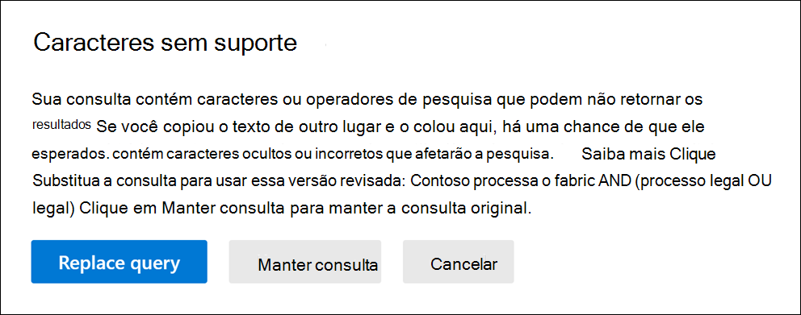

# Verificar se há erros na sua consulta
  
Aqui está uma lista dos caracteres sem suporte que verificamos nas consultas de pesquisa para Pesquisa de Conteúdo e Descoberta Principal da Descoberta. Caracteres sem suporte geralmente são ocultos e normalmente causam um erro de pesquisa ou retornam resultados não intencionados.
  
- **Aspas inteligentes** - Aspas simples e duplas inteligentes (também chamadas de aspas curly) não são suportadas. Somente aspas retas podem ser usadas em uma consulta de pesquisa. 

- **Caracteres não imprimíveis** e de controle - Caracteres não imprimíveis e de controle não representam um símbolo escrito, como um caractere alfanumérico. Exemplos de caracteres não imprimíveis e de controle incluem caracteres que formatam texto ou linhas separadas de texto. 

- **Marcas da** esquerda para a direita e da direita para a esquerda - Essas marcas são caracteres de controle usados para indicar a direção de texto para idiomas da esquerda para a direita (como inglês e espanhol) e idiomas da direita para a esquerda (como árabe e hebraico).

- **Operadores Boolean minúsculos** - Se você usar um operador Boolean, como **AND**, **OR** e **NOT** em uma consulta de pesquisa, ele deve ser maiúscula. Quando verificamos uma consulta para erros de digitação, a sintaxe de consulta geralmente indica que um operador Boolean está sendo usado, mesmo que operadores minúsculos possam ser usados; por exemplo,  `(WordA or WordB) and (WordC or WordD)` .

## O que acontece se uma consulta tiver um caractere sem suporte?

Se caracteres sem suporte são encontrados em sua consulta, uma mensagem de aviso é exibida informando que caracteres sem suporte foram encontrados e sugere uma alternativa. Em seguida, você tem a opção de manter a consulta original ou substituí-la pela consulta revisada sugerida.

Veja um exemplo da mensagem de aviso exibida depois  de clicar em Verificar se há erros de digitação na consulta de pesquisa na captura de tela anterior. Observe que a consulta original usou aspas inteligentes e operadores booleano minúsculos.
  

  
## Como evitar caracteres sem suporte em suas consultas de pesquisa

Caracteres sem suporte geralmente são adicionados a uma consulta quando você copia a consulta ou partes da consulta de outros aplicativos (como Microsoft Word ou Microsoft Excel) e os colar na caixa de palavra-chave na página de consulta de uma Pesquisa de Conteúdo. A melhor maneira de evitar caracteres sem suporte é apenas digitar a consulta na caixa de palavra-chave. Ou você pode copiar uma consulta do Word ou Excel e, em seguida, colar em um editor de texto simples, como o Microsoft Bloco de notas. Salve o arquivo de texto e selecione **ANSI** **na** lista drop-down de Codificação. Isso removerá qualquer formatação e caracteres sem suporte. Em seguida, você pode copiar e colar a consulta do arquivo de texto para a caixa de consulta de palavra-chave.
