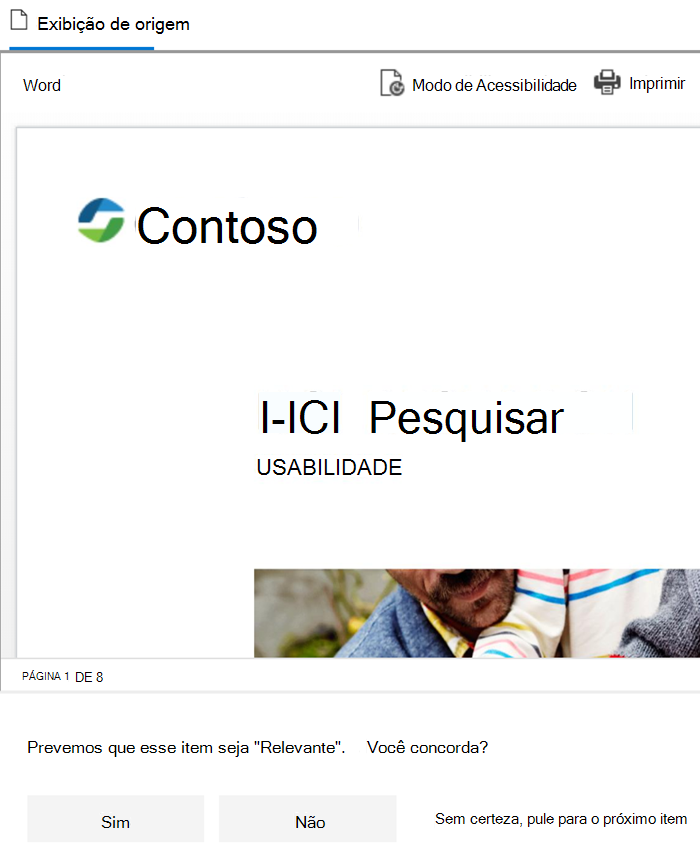

# <a name="get-started-with-trainable-classifiers-preview"></a>Introdução aos classificadores de treinamento (visualização)

Um classificador Microsoft 365 treinado é uma ferramenta que você pode treinar para reconhecer vários tipos de conteúdo dando amostras a eles. Depois de treinado, você pode usá-lo para identificar o item para a aplicação de rótulos de confidencialidade do Office, políticas de conformidade de comunicações e políticas de rótulo de retenção.

A criação de um classificador personalizável personalizado primeiro envolve fornecer amostras de ti de forma humana e coincidir positivamente a categoria. Depois de ter processado esses, você testará a capacidade dos classificadores para prever dando a ele uma mistura de amostras positivas e negativas. Este artigo mostra como criar e treinar um classificador personalizado e como melhorar o desempenho de classificadores treinados personalizados e classificadores pré-qualificados em seu tempo de vida por meio de um retreinamento.

Para saber mais sobre os diferentes tipos de classificadores, confira [saiba mais sobre classificadores estagiários (visualização)](classifier-learn-about.md).

## <a name="prerequisites"></a>Pré-requisitos

### <a name="licensing-requirements"></a>Requisitos de licença

Os classificadores são um recurso de conformidade do Microsoft 365 E5 ou e5. Você deve ter uma dessas assinaturas para usá-las.

### <a name="permissions"></a>Permissões

Para acessar classificadores na interface do usuário: 

- o administrador global precisa aceitar o locatário para criar classificadores personalizados.
- a função de administrador de conformidade ou o administrador de dados de conformidade é necessário para treinar um classificador.

Você precisará de contas com essas permissões para usar classificadores nestes cenários:

- Cenário de política de rótulo de retenção: gerenciamento de registros e funções de gerenciamento de retenção 
- Cenário de política de rótulo de confidencialidade: administrador de segurança, administrador de conformidade, administrador de dados de conformidade
- Cenário de política de conformidade de comunicação: administração de gerenciamento de risco do Insider, administrador de análise de supervisão 

> [!IMPORTANT]
> Por padrão, apenas o usuário que cria um classificador personalizado pode treinar e revisar previsões feitas por esse classificador. Se quiser que outras pessoas possam treinar e revisar previsões de classificador, confira [fornecer aos outros direitos de treinamento e revisão](#give-others-train-and-review-rights).

## <a name="prepare-for-a-custom-trainable-classifier"></a>Preparar-se para um classificador treinado personalizado 

É útil entender o que está envolvido na criação de um classificador treinado personalizado antes de você se aprofundar no. 

### <a name="timeline"></a>Linha do tempo

Esta linha do tempo reflete um exemplo de implantação de classificadores ferroviárias.


> [!TIP]
> O consentimento é obrigatório pela primeira vez para os classificadores treináveis. O Microsoft 365 leva 12 dias para concluir a avaliação da linha de base do conteúdo da sua organização. Entre em contato com seu administrador global para iniciar o processo de consentimento.

### <a name="overall-workflow"></a>Fluxo de trabalho geral

Para entender mais sobre o fluxo de trabalho geral de criação de classificadores destreinados personalizados, confira o [fluxo de processo para criar os classificadores estagiários do cliente](classifier-learn-about.md#process-flow-for-creating-custom-classifiers).

### <a name="seed-content"></a>Conteúdo semente

Quando você quiser um classificador treinado para identificar de forma independente e precisa um item como estando em uma categoria específica de conteúdo, primeiro é preciso apresentá-lo com vários exemplos do tipo de conteúdo que está na categoria. Esta alimentação de amostras para o classificador treinado é conhecida como *propagação*. O conteúdo semente é selecionado por uma pessoa e é julgada para representar a categoria do conteúdo.

> [!TIP]
> Você precisa ter pelo menos 50 amostras positivas e até 500. O classificador treinado será processado até os 500 exemplos criados mais recentes (por data de criação do arquivo/carimbo de hora). Quanto mais amostras você fornecer, mais precisará das previsões que o classificador fará.

### <a name="testing-content"></a>Testando conteúdo

Depois que o classificador treinado tiver processado exemplos positivos suficientes para criar um modelo de previsão, você precisará testar as previsões feitas para ver se o classificador pode distinguir corretamente os itens que correspondem à categoria e aos itens que não estão. Para fazer isso, selecione outro, espero maior, um conjunto de conteúdo separado para o homem que consiste em exemplos que devem se enquadrar na categoria e exemplos que não. Você deve testar com dados diferentes dos dados semente iniciais que você forneceu pela primeira vez. Depois de processá-los, você passará manualmente pelos resultados e verificará se cada previsão está correta, incorreta ou se não tem certeza. O classificador treinado usa esse feedback para melhorar seu modelo de previsão.

> [!TIP]
> Para obter melhores resultados, tenha pelo menos 200 itens em seu conjunto de amostra de teste com uma distribuição uniforme de correspondências positivas e negativas.

## <a name="how-to-create-a-trainable-classifier"></a>Como criar um classificador treinado

1. Coleta entre 50-500 itens de conteúdo semente. Eles devem ser apenas exemplos que representam fortemente o tipo de conteúdo que você deseja que o classificador treinado identifique positivamente como estando na categoria de classificação. Consulte, [extensões de nome de arquivo rastreado padrão e tipos de arquivo analisados no SharePoint Server](https://docs.microsoft.com/sharepoint/technical-reference/default-crawled-file-name-extensions-and-parsed-file-types) para os tipos de arquivo com suporte.

   > [!IMPORTANT]
   > Os itens de amostra de propagação e teste não devem ser criptografados e devem estar em inglês.

   > [!IMPORTANT]
   > Certifique-se de que os itens em seu conjunto de propagação são exemplos **fortes** da categoria. O classificador treinado inicialmente cria seu modelo com base no que você propaga com ele. O classificador supõe que todos os exemplos de propagação são positivos fortes e não têm como saber se uma amostra é uma correspondência fraca ou negativa à categoria.

2. Coloque o conteúdo semente em uma pasta do SharePoint Online que seja dedicada a manter *somente o conteúdo semente*. Anote o site, a biblioteca e a URL da pasta.

   > [!TIP]
   > Se você criar um novo site e pasta para seus dados semente, permita que pelo menos uma hora para esse local seja indexado antes de criar o classificador treinado que usará esses dados de propagação.

3. Entre no centro de conformidade da Microsoft 365 com administrador de conformidade ou acesso à função de administrador de segurança e abra **o centro de conformidade** da Microsoft 365 ou a classificação de dados **do centro de segurança da Microsoft 365**  >  **Data classification**.

4. Escolha a guia **classificadores estagiários** .

5. Escolha **criar classificador treinado**.

6. Preencha os valores apropriados para os `Name` `Description` campos e da categoria de itens que você deseja que esse classificador seja identificado.

7. Escolha o site, a biblioteca e a URL da pasta do SharePoint Online para o site de conteúdo semente da etapa 2. Escolha `Add` .

8. Revise as configurações e escolha `Create trainable classifier` .

9. Dentro de 24 horas, o classificador treinado processará os dados semente e criará um modelo de previsão. O status do classificador é `In progress` enquanto processa os dados semente. Quando o classificador terminar o processamento dos dados semente, o status mudará para `Need test items` .

10. Agora você pode exibir a página de detalhes escolhendo o classificador.

    > [!div class="mx-imgBorder"]
    > 

11. Colete pelo menos 200 itens de conteúdo de teste (10.000 máx.) para obter os melhores resultados. Eles devem ser uma mistura de itens que são positivos fortes, negativos fortes e outros que são um pouco menos óbvios em sua natureza. Consulte, [extensões de nome de arquivo rastreado padrão e tipos de arquivo analisados no SharePoint Server](https://docs.microsoft.com/sharepoint/technical-reference/default-crawled-file-name-extensions-and-parsed-file-types) para os tipos de arquivo com suporte.

    > [!IMPORTANT]
    > Os itens de exemplo não devem ser criptografados e devem estar em inglês.

12. Coloque o conteúdo de teste em uma pasta do SharePoint Online que seja dedicada a conter *somente o conteúdo de teste*. Anote o site, a biblioteca e a URL da pasta do SharePoint Online.

    > [!TIP]
    > Se você criar um novo site e uma pasta para seus dados de teste, permita que pelo menos uma hora para esse local seja indexado antes de criar o classificador treinado que usará esses dados semente.

13. Escolha `Add items to test` .

14. Escolha o site, a biblioteca e a URL da pasta do SharePoint Online para o site de conteúdo de teste na etapa 12. Escolha `Add` .

15. Finalize o assistente escolhendo `Done` . Seu classificador treinado levará até uma hora para processar os arquivos de teste.

16. Quando o classificador treinado termina de processar seus arquivos de teste, o status da página de detalhes será alterado para `Ready to review` . Se você precisar aumentar o tamanho da amostra de teste, escolha `Add items to test` e permitir que o classificador treinado processe os itens adicionais.

    > [!div class="mx-imgBorder"]
    > 

17. Escolha `Tested items to review` Tab para revisar itens.

18. A Microsoft 365 apresentará 30 itens por vez. Examine-os e, na `We predict this item is "Relevant". Do you agree?` caixa, escolha `Yes` ou `No` ou `Not sure, skip to next item` . A precisão do modelo é atualizada automaticamente após cada 30 itens.

    > [!div class="mx-imgBorder"]
    > 

19. Revise *pelo menos* 200 itens. Depois que a pontuação de precisão tiver estabilizado, a opção **publicar** ficará disponível e o status do classificador dirá `Ready to use` .

    > [!div class="mx-imgBorder"]
    > 

20. Publicar o classificador.

21. Depois de publicado, o classificador estará disponível como uma condição na [rotulação automática do Office com rótulos de sensibilidade](apply-sensitivity-label-automatically.md), [aplicar automaticamente a política de rótulo de retenção com base em uma condição](apply-retention-labels-automatically.md#configuring-conditions-for-auto-apply-retention-labels) e em [conformidade de comunicação](communication-compliance.md).

## <a name="give-others-train-and-review-rights"></a>Fornecer aos outros direitos de treinamento e revisão

Use este procedimento para dar a outras permissões para treinar, revisar e ajustar seu classificador treinado personalizado.  
 
1. Como criador do classificador, um administrador global de administração ou descoberta eletrônica conecta-se ao centro de conformidade usando o PowerShell usando os procedimentos em [conectar-se ao PowerShell do centro de conformidade & segurança](https://docs.microsoft.com/powershell/exchange/connect-to-scc-powershell?view=exchange-ps&preserve-view=true).

2. Execute este comando:

   ```powershell
   Add-ComplianceCaseMember -Case "<classifier name>" -Member "<user or role group>"
   ```
   
   Por exemplo:
   
   `Add-ComplianceCaseMember -Case "Financial Contract Classifier" -Member johnevans@contoso.com`

   Você pode executar esse comando várias vezes para adicionar vários usuários. Observe que você só pode adicionar grupos de função do Exchange Online Protection (EOP) e não grupos de função do Azure.
