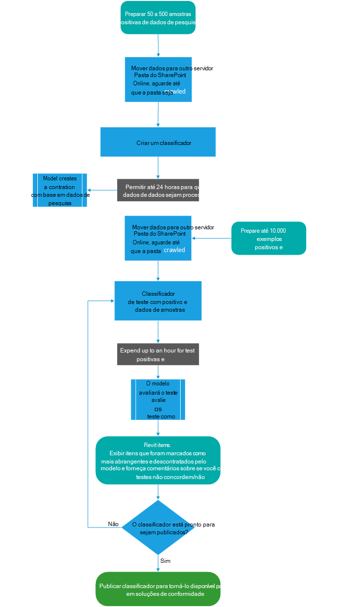

# Introdução aos classificadores de treinamento (visualização)

Classificar e rotular o conteúdo para que ele possa ser protegido e manipulado adequadamente é o local inicial da disciplina de proteção de informações. O Microsoft 365 tem três maneiras de classificar conteúdo.

## Manualmente

Esse método requer ações e julgamento humana. Um administrador pode usar os rótulos preexistentes e os tipos de informações confidenciais ou criar seus próprios e publicá-los. Os usuários e administradores aplicam-se ao conteúdo à medida que encontrá-lo. Você pode proteger o conteúdo e gerenciar sua disposição.

## Correspondência de padrões automatizados

Esta categoria de mecanismos de classificação inclui localizar conteúdo por:

- Palavras-chave ou valores de metadados (idioma de consulta de palavra-chave)
- usando padrões identificados anteriormente de informações confidenciais, como segurança social, cartão de crédito ou números de contas bancárias [(tipos de informações confidenciais)](what-the-sensitive-information-types-look-for.md)
- Reconhecendo um item porque ele é uma variação em um modelo [(impressão digital de documentos)](document-fingerprinting.md)
- usando a presença de cadeias de caracteres exatas [(correspondência exata de dados)](create-custom-sensitive-information-types-with-exact-data-match-based-classification.md).

Os rótulos de confidencialidade e retenção podem ser automaticamente aplicados para tornar o conteúdo disponível para uso em [políticas de retenção](retention-policies.md)e [prevenção contra perda de dados (DLP)](data-loss-prevention-policies.md) .

## Classificadores estagiários

Esse método de classificação é especialmente adequado ao conteúdo que não é facilmente identificado pelos métodos de correspondência de padrões manuais ou automatizados. Esse método de classificação é mais sobre o treinamento de um classificador para identificar um item com base no que o item é, não por elementos que estão no item (correspondência de padrão). Um classificador aprende como identificar um tipo de conteúdo observando centenas de exemplos do conteúdo que você está interessado em classificar. Comece por alimentar exemplos de ti que são definitivamente na categoria. Depois de processar esses, você o testará dando um mix de exemplos de correspondência e de não correspondência. Em seguida, o classificador faz previsões como se um determinado item está na categoria que você está criando. Em seguida, você confirma seus resultados, classificando os positivos, negativos, falsos positivos e falsos negativos para ajudar a aumentar a precisão de suas previsões. Quando você publica o classificador treinado, ele classifica itens em locais como o SharePoint Online, o Exchange e o OneDrive e classifica o conteúdo.

> [!IMPORTANT]
> Tanto classificadores internos quanto classificadores estagiários estão disponíveis como uma condição para [aplicar automaticamente a política de rótulo de retenção com base em uma condição](labels.md#applying-a-retention-label-automatically-based-on-conditions) e [conformidade de comunicação](communication-compliance.md). Os rótulos de sensibilidade só podem usar classificadores internos como uma condição, consulte [aplicar um rótulo de confidencialidade ao conteúdo automaticamente](apply-sensitivity-label-automatically.md).

> [!IMPORTANT]
> Os classificadores que podem ser treinados só funcionam com itens não criptografados e estão em inglês.

### Requisitos de licença

Os classificadores estagiários são um recurso de conformidade do Microsoft 365 E5 ou e5. Você deve ter uma dessas assinaturas para usá-las.

## Tipos de classificadores

Há classificadores internos e classificadores estagiários. Obter um classificador treinado para um estado de publicação requer um investimento de tempo para treiná-lo. Para ajudá-lo a começar a usar classificadores, a Microsoft 365 vem com alguns classificadores internos.

> [!NOTE]
> Antes de usar um classificador interno em seu fluxo de trabalho de classificação e rotulação, você deve testá-lo em uma amostra do conteúdo da sua organização que você deseja que se sinta à categoria para verificar se suas previsões de classificação atendem às suas expectativas.

### Noções básicas sobre classificadores internos

A Microsoft 365 vem com seis classificadores internos:

- **Linguagem ofensiva**: detecta itens de texto que contêm obscenidades, slurs, taunts e expressões disfarçadas (que são expressões que têm o mesmo significado de um termo mais ofensivo).
- **Currículos**: detecta itens que são contas de texto das qualificações pessoais, educacionais, profissionais, experiência de trabalho e outras informações de identificação pessoal de um candidato.
- **SourceCode**: detecta itens que contêm um conjunto de instruções e instruções escritas em linguagens de programação de computador amplamente usadas.
- **Assédio**: detecta uma categoria específica de itens de texto de linguagem ofensiva relacionadas à conduta ofensiva direcionada uma ou várias pessoas com base nas seguintes características: raça, étnica, Religion, origem nacional, sexo, orientação sexual, idade, deficiência.
- **Profanação**: detecta uma categoria específica de itens de texto de idioma ofensivo que contêm expressões que constrangim a maioria das pessoas.
- **Ameaça**: detecta uma categoria específica de itens de texto de linguagem ofensiva relacionadas a ameaças para confirmar a violência ou danos físicos ou danos a uma pessoa ou a uma propriedade.

Eles aparecem no modo de exibição de classificação de dados do **Centro** > de conformidade da Microsoft 365 **(visualização)** > **classificadores estagiários** com o status de `Ready to use`.

> [!IMPORTANT]
> Observe que a linguagem ofensiva, assédio, profanação e classificadores de ameaças só funcionam com o texto pesquisável não é completo nem completo.  Além disso, os padrões culturais e de idioma mudam continuamente e, em claro, a Microsoft reserva-se o direito de atualizar esses classificadores em seu critério. Embora os classificadores possam ajudar sua organização a monitorar o ofensivo e outros idiomas usados, os classificadores não resolvem as conseqüências de tal linguagem e não se destinam a fornecer o único meio de monitoramento ou resposta ao uso de esse idioma. Sua organização, e não a Microsoft ou suas subsidiárias, permanece responsável por todas as decisões relacionadas ao monitoramento, imposição, bloqueio, remoção e retenção de qualquer conteúdo identificado por um classificador treinado.

#### Fluxo do processo para usar classificadores internos

Classificadores internos não precisam ser treinados, mas você precisa confirmar que eles identificarão os tipos de conteúdo que você precisa para antes de usá-los em soluções de conformidade. O teste de um classificador treinado segue esse fluxo.

### Noções básicas sobre classificadores estagiários

Quando os classificadores internos não atendem às suas necessidades, você pode criar e treinar seus próprios classificadores. Há muito mais trabalho envolvido na criação de suas próprias, mas eles serão muito mais adequados às suas necessidades de organizações. Para obter mais detalhes sobre como usar um classificador pré-treinado, consulte [usando um classificador interno](classifier-using-a-ready-to-use-classifier.md)

> [!IMPORTANT]
> Somente o usuário que cria um classificador treinado pode treinar e revisar previsões feitas por esse classificador.

#### Fluxo do processo de criação de classificadores estagiários

Criar e publicar um classificador treinado para uso em soluções de conformidade, como políticas de retenção e supervisão de comunicação, segue este fluxo. Para obter mais detalhes sobre como criar um classificador treinado, consulte [criando um classificador treinado](classifier-creating-a-trainable-classifier.md).

## Confira também

- [rótulos de retenção](labels.md)
- [políticas de retenção](retention-policies.md)
- [prevenção de perda de dados (DLP)](data-loss-prevention-policies.md)
- [rótulos de confidencialidade](sensitivity-labels.md)
- [tipos de informações confidenciais](what-the-sensitive-information-types-look-for.md)
- [impressão digital do documento](document-fingerprinting.md)
- [correspondência de dados exata](create-custom-sensitive-information-types-with-exact-data-match-based-classification.md)
