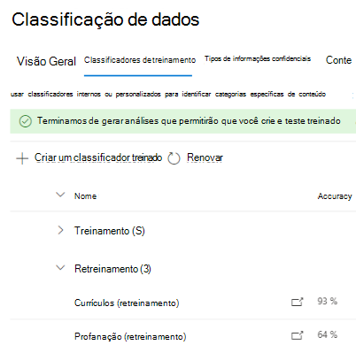
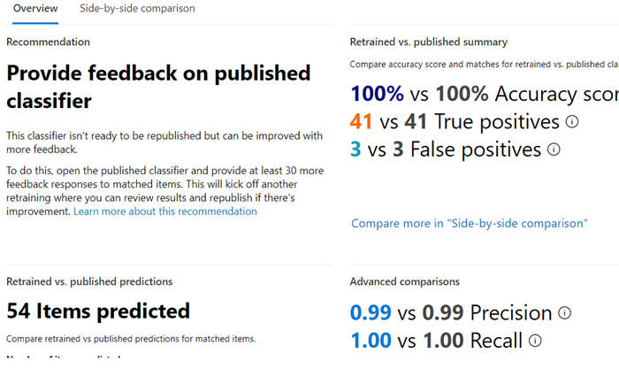

# Como treinar novamente um classificador em conformidade de comunicações

Um classificador de treinamento do Microsoft 365 é uma ferramenta que você pode treinar para reconhecer vários tipos de conteúdo, dando a ele exemplos para ver. Depois de treinado, você pode usá-lo para identificar o item para a aplicação de rótulos de sensibilidade do Office, políticas de conformidade de comunicações e políticas de rótulo de retenção.

Este artigo mostra como melhorar o desempenho de classificadores treinados personalizados e alguns classificadores pré-treinados fornecendo comentários adicionais.

Para saber mais sobre os diferentes tipos de classificadores, consulte [Learn about trainable classifiers](classifier-learn-about.md).

## Permissões

Para acessar classificadores no Centro de Conformidade do Microsoft 365:

- a função de administrador de conformidade ou Administrador de Dados de Conformidade é necessária para treinar um classificador

Você precisará de contas com essas permissões para usar classificadores nesses cenários:

- Cenário de política de conformidade de comunicação: Administrador de Gerenciamento de Riscos do Insider, Administrador de Revisão de Supervisão 

## Fluxo de trabalho geral

> [!IMPORTANT]
> Você fornece comentários na solução de conformidade que está usando o classificador como uma condição. **Se você não tiver uma política de conformidade de comunicações que use um classificador como condição, pare aqui.**

À medida que você usa seus classificadores, talvez você queira aumentar a precisão das classificações que eles estão fazendo. Você faz isso avaliando a qualidade das classificações feitas para itens identificados como sendo uma combinação ou não uma combinação. Depois de fazer 30 avaliações para um classificador, ele recebe os comentários e se retreina automaticamente.

Para entender mais sobre o fluxo de trabalho geral de retreinamento de um classificador, consulte Fluxo de processos para [retreinar um classificador](classifier-learn-about.md#retraining-classifiers).

> [!NOTE]
> Um classificador já deve ser publicado e em uso antes de poder ser retreinado.

## Como retreinar um classificador em políticas de conformidade de comunicação

1. Abra a política de conformidade de comunicação que usa um classificador como uma condição e escolha um dos itens identificados na lista **Pendente.**
2. Escolha as releições e **Melhorar a classificação.**
3. No painel **comentários detalhados,** se o item for um verdadeiro positivo, escolha, **Corresponder**.  Se o item for um falso positivo, ou seja, ele foi incluído incorretamente na categoria, escolha **Não uma combinação**.
4. Se houver outro classificador que seria mais apropriado para o item, você pode escolher-o na lista Sugerir outros classificadores **treináveis.** Isso disparará o outro classificador para avaliar o item.

> [!TIP]
> Você pode fornecer comentários sobre vários itens simultaneamente escolhendo-os todos e escolhendo Fornecer **comentários** detalhados na barra de comandos.

5. Escolha **Enviar comentários** para enviar sua avaliação das `match` classificações , e sugerir outros `not a match` classificadores com treinamento. Quando você forneceu 30 instâncias de comentários para um classificador, ele será retreinado automaticamente. A retreinamento pode levar de 1 a 4 horas. Os classificadores só podem ser retreinados duas vezes por dia.

> [!IMPORTANT]
> Essas informações vão para o classificador em seu locatário, **ela não volta para a Microsoft**.

6.  Abra a **página classificação de** dados no centro de conformidade do Microsoft **365.**
7. Abra **classificadores com treinamento.**
8. O classificador que foi usado em sua política de conformidade de Comunicações aparecerá sob o **título Re-training.**

9. Depois de concluir a retreinamento, escolha o classificador para abrir a visão geral de retreinamento.

10. Revise a ação recomendada e as comparações de previsão das versões retreinadas e publicadas no momento do classificador.
11. Se você estiver satisfeito com os resultados da retreinamento, escolha **Publicar de novo.**
12. Se você não estiver satisfeito com os resultados do retreinamento, poderá optar por fornecer comentários adicionais ao classificador na interface de conformidade de comunicações e iniciar outro ciclo de retreinamento ou não fazer nada nesse caso, caso em que a versão publicada no momento do classificador continuará a ser usada. 

## Detalhes sobre recomendações de redação

Aqui estão algumas informações sobre como formulamos a recomendação para publicar um classificador retreinado ou sugerir um novo treinamento. Isso requer uma compreensão um pouco mais profunda de como os classificadores treináveis funcionam.

Após um retreinamento, avaliamos o desempenho do classificador nos itens com comentários, bem como em todos os itens originalmente usados para treinar o classificador. 

- Para modelos integrados, os itens usados para treinar o classificador são os itens usados pela Microsoft para criar o modelo.
- Para modelos personalizados, os itens usados no treinamento original do classificador são dos sites que você adicionou para teste e revisão.

Comparamos os números de desempenho em ambos os conjuntos de itens para o classificador retreinado e publicado para fornecer uma recomendação sobre se houve melhoria para republicar. 

## Confira também

- [Saiba mais sobre classificadores treináveis](classifier-learn-about.md)
- [Extensões de nome de arquivo rastreado padrão e tipos de arquivos analisados no SharePoint Server Server](/sharepoint/technical-reference/default-crawled-file-name-extensions-and-parsed-file-types)