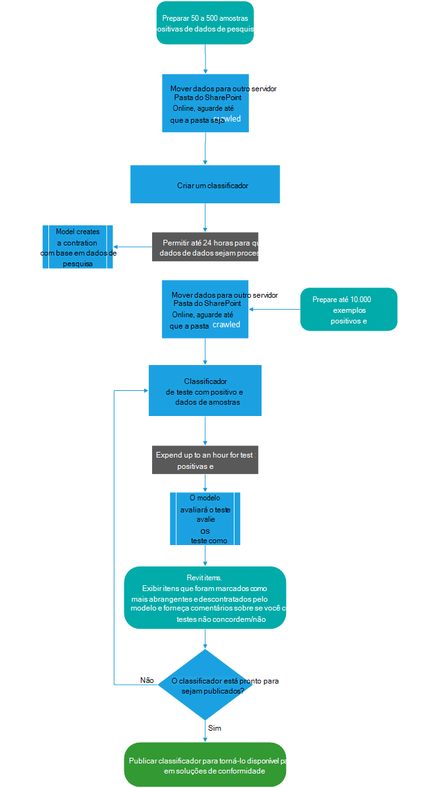

# Saiba mais sobre classificadores treináveisLearn about trainable classifiers

Classificar e rotular o conteúdo para que ele possa ser protegido e manipulado corretamente é o ponto de partida para a disciplina de proteção de informações.Classifying and labeling content so it can be protected and handled properly is the starting place for the information protection discipline. O Microsoft 365 tem três maneiras de classificar o conteúdo.Microsoft 365 has three ways to classify content.

## ManualmenteManually

Esse método requer críticas e ações humanas.This method requires human judgment and action. Um administrador pode usar os rótulos pré-existentes e tipos de informações confidenciais ou criar seus próprios e publicá-los.An admin may either use the pre-existing labels and sensitive information types or create their own and then publish them. Os usuários e administradores os aplicam ao conteúdo à medida que o encontram.Users and admins apply them to content as they encounter it. Em seguida, você pode proteger o conteúdo e gerenciar sua disposição.You can then protect the content and manage its disposition.

## Correspondência automatizada de padrõesAutomated pattern matching

Essa categoria de mecanismos de classificação inclui localizar conteúdo por:This category of classification mechanisms include finding content by:

- Palavras-chave ou valores de metadados (linguagem de consulta de palavra-chave).Keywords or metadata values (keyword query language).
- Usando padrões identificados anteriormente de informações confidenciais, como seguro social, cartão de crédito ou números de contas [bancárias (definições de](sensitive-information-type-entity-definitions.md)entidade de tipo de informação confidenciais).Using previously identified patterns of sensitive information like social security, credit card or bank account numbers [(Sensitive information type entity definitions)](sensitive-information-type-entity-definitions.md).
- Reconhecer um item porque é uma variação em um modelo [(impressão digital de documento).](document-fingerprinting.md)Recognizing an item because it's a variation on a template [(document finger printing)](document-fingerprinting.md).
- Usando a presença de cadeias de caracteres [exatas (exact data match)](create-custom-sensitive-information-types-with-exact-data-match-based-classification.md).Using the presence of exact strings [(exact data match)](create-custom-sensitive-information-types-with-exact-data-match-based-classification.md).

Os rótulos de retenção e sensibilidade podem ser aplicados automaticamente para disponibilizar o conteúdo para uso na prevenção de perda de dados [(DLP)](data-loss-prevention-policies.md) e políticas de aplicação automática para rótulos de [retenção.](apply-retention-labels-automatically.md)Sensitivity and retention labels can then be automatically applied to make the content available for use in [data loss prevention (DLP)](data-loss-prevention-policies.md) and [auto-apply polices for retention labels](apply-retention-labels-automatically.md).

## ClassificadoresClassifiers

Esse método de classificação é particularmente adequado ao conteúdo que não é facilmente identificado pelos métodos de correspondência de padrões manuais ou automatizados.This classification method is particularly well suited to content that isn't easily identified by either the manual or automated pattern matching methods. Esse método de classificação é mais sobre o treinamento de um classificador para identificar um item com base no que é o item, não por elementos que estão no item (correspondência de padrões).This method of classification is more about training a classifier to identify an item based on what the item is, not by elements that are in the item (pattern matching). Um classificador aprende a identificar um tipo de conteúdo analisando centenas de exemplos do conteúdo que você tem interesse em classificar.A classifier learns how to identify a type of content by looking at hundreds of examples of the content you're interested in classifying. Você começa alimentando exemplos que definitivamente estão na categoria.You start by feeding it examples that are definitely in the category. Depois de processá-los, você o testará, dando a ele uma mistura de exemplos correspondentes e não correspondentes.Once it processes those, you test it by giving it a mix of both matching and non-matching examples. Em seguida, o classificador faz previsões sobre se um determinado item se enquadra na categoria que você está criando.The classifier then makes predictions as to whether any given item falls into the category you're building. Em seguida, confirme seus resultados, ordenando os verdadeiros positivos, verdadeiros negativos, falsos positivos e falsos negativos para ajudar a aumentar a precisão de suas previsões.You then confirm its results, sorting out the true positives, true negatives, false positives, and false negatives to help increase the accuracy of its predictions. 

Quando você publica o classificador, ele classifica os itens em locais como SharePoint Online, Exchange e OneDrive e classifica o conteúdo.When you publish the classifier, it sorts through items in locations like SharePoint Online, Exchange, and OneDrive, and classifies the content. Depois de publicar o classificador, você pode continuar a treiná-lo usando um processo de feedback semelhante ao processo de treinamento inicial.After you publish the classifier, you can continue to train it using a feedback process that is similar to the initial training process.

### Onde você pode usar classificadores de treinamentoWhere you can use trainable classifiers
Os classificadores integrados e os classificadores de treinamento estão disponíveis como uma condição para rotular automaticamente o [Office](apply-sensitivity-label-automatically.md)com rótulos de [sensibilidade,](apply-retention-labels-automatically.md#configuring-conditions-for-auto-apply-retention-labels) aplicar automaticamente a política de rótulo de retenção com base em uma condição e na conformidade de [comunicação.](communication-compliance.md)Both built-in classifiers and trainable classifiers are available as a condition for [Office autolabeling with sensitivity labels](apply-sensitivity-label-automatically.md), [auto-apply retention label policy based on a condition](apply-retention-labels-automatically.md#configuring-conditions-for-auto-apply-retention-labels) and in [communication compliance](communication-compliance.md). 

Os rótulos de sensibilidade podem usar classificadores como condições, consulte Aplicar um [rótulo de sensibilidade ao conteúdo automaticamente.](apply-sensitivity-label-automatically.md)Sensitivity labels can use classifiers as conditions, see [Apply a sensitivity label to content automatically](apply-sensitivity-label-automatically.md).

> [!IMPORTANT]
> Classificadores só funcionam com itens que não são criptografados e estão em inglês.Classifiers only work with items that are not encrypted and are in English.

## Tipos de classificadoresTypes of classifiers

- **classificadores previamente** treinados - A Microsoft criou e treinamentou previamente vários classificadores que você pode começar a usar sem treinamento.**pre-trained classifiers** - Microsoft has created and pre-trained a number of classifiers that you can start using without training them. Esses classificadores aparecerão com o status de `Ready to use` .These classifiers will appear with the status of `Ready to use`.
- **classificadores personalizados** - Se você tiver necessidades de classificação que vão além do que os classificadores previamente treinados cobrem, você pode criar e treinar seus próprios classificadores.**custom classifiers** - If you have classification needs that extend beyond what the pre-trained classifiers cover, you can create and train your own classifiers.

### Classificadores previamente treinadosPre-trained classifiers

O Microsoft 365 vem com cinco classificadores previamente treinados:Microsoft 365 comes with five pre-trained classifiers:

> [!CAUTION]
> Estamos preterindo  o classificador de Linguagem Ofensiva previamente treinado porque ele está produzindo um grande número de falsos positivos.We are deprecating the **Offensive Language** pre-trained classifier because it has been producing a high number of false positives. Não use-o e, se você estiver usando-o no momento, deverá tirar seus processos de negócios dele.Don't use it and if you are currently using it, you should move your business processes off of it. Em vez **disso,** **recomendamos** o  uso dos classificadores Ameaças , Profanação e Profanação.We recommend using the **Threat**, **Profanity**, and **Harassment** pre-trained classifiers instead.

- **Currículos:** detecta itens que são contas textuais de qualificações pessoais, educacionais, profissionais, profissionais e outras informações de identificação pessoal de um candidato**Resumes**: detects items that are textual accounts of an applicant's personal, educational, professional qualifications, work experience, and other personally identifying information
- **Código-fonte**: detecta itens que contêm um conjunto de instruções e instruções escritas nas 25 principais linguagens de programação de computador usadas no GitHub**Source Code**: detects items that contain a set of instructions and statements written in the top 25 used computer programming languages on GitHub
    - ActionScriptActionScript
    - CC
    - C#C#
    - C++C++
    - TamajureClojure
    - CoffeeScriptCoffeeScript
    - IrGo
    - HascallHaskell
    - JavaJava
    - JavaScriptJavaScript
    - LuaLua
    - MATLABMATLAB
    - Objective-CObjective-C
    - PerlPerl
    - PHPPHP
    - PythonPython
    - RR
    - RubyRuby
    - ScalaScala
    - ShellShell
    - SwiftSwift
    - TexTex
    - Vim ScriptVim Script

> [!NOTE]
> O Código-fonte é treinado para detectar quando a maior parte do texto é o código-fonte.Source Code is trained to detect when the bulk of the text is source code. Ele não detecta o texto do código-fonte que é intercalado com texto sem texto simples.It does not detect source code text that is interspersed with plain text.

- **Abuso**: detecta uma categoria específica de itens de texto de linguagem ofensiva relacionados à conduta ofensiva, direcionando um ou vários indivíduos com base nas seguintes características: corrida, racial, país de origem, origem nacional, sexo, orientação sexual, idade, deficiência**Harassment**: detects a specific category of offensive language text items related to offensive conduct targeting one or multiple individuals based on the following traits: race, ethnicity, religion, national origin, gender, sexual orientation, age, disability
- **Profanidade**: detecta uma categoria específica de itens de texto de idioma ofensivo que contêm expressões que a maioria das pessoas**Profanity**: detects a specific category of offensive language text items that contain expressions that embarrass most people
- **Ameaça**: detecta uma categoria específica de itens de texto de idioma ofensivos relacionados a ameaças para comprometer a violência ou fazer danos físicos ou danos a uma pessoa ou propriedade**Threat**: detects a specific category of offensive language text items related to threats to commit violence or do physical harm or damage to a person or property

Eles aparecem no centro de **conformidade do Microsoft 365, na** exibição classificadores de classificação de dados  >    >  **tremíveis** com o status de `Ready to use` .These appear in the **Microsoft 365 compliance center** > **Data classification** > **Trainable classifiers** view with the status of `Ready to use`.

> [!IMPORTANT]
> Observe que os classificadores de linguagem ofensiva, ofensivo, profanação e ameaças só funcionam com texto pesquisável não são completos ou completos.Please note that the offensive language, harassment, profanity, and threat classifiers only work with searchable text are not exhaustive or complete.  Além disso, os padrões de idioma e cultura mudam continuamente e, à luz dessas pessoas, a Microsoft reserva-se o direito de atualizar esses classificadores a seu critério.Further, language and cultural standards continually change, and in light of these realities, Microsoft reserves the right to update these classifiers in its discretion. Embora os classificadores possam ajudar sua organização no monitoramento ofensivo e em outros idiomas usados, os classificadores não abordam as consequências desse idioma e não têm a intenção de fornecer o único meio de monitoramento ou resposta da sua organização ao uso desse idioma.While the classifiers may assist your organization in monitoring offensive and other language used, the classifiers do not address consequences of such language and are not intended to provide your organization's sole means of monitoring or responding to the use of such language. Sua organização, e não a Microsoft ou suas subsidiárias, permanece responsável por todas as decisões relacionadas ao monitoramento, imposição, bloqueio, remoção e retenção de qualquer conteúdo identificado por um classificador previamente treinado.Your organization, and not Microsoft or its subsidiaries, remains responsible for all decisions related to monitoring, enforcement, blocking, removal and retention of any content identified by a pre-trained classifier.

### Classificadores personalizadosCustom classifiers

Quando os classificadores previamente treinados não atenderem às suas necessidades, você poderá criar e treinar seus próprios classificadores.When the pre-trained classifiers don't meet your needs, you can create and train your own classifiers. Há muito mais trabalho envolvido na criação de suas próprias, mas elas serão muito mais adaptadas às suas necessidades de organizações.There's significantly more work involved with creating your own, but they'll be much better tailored to your organizations needs. 

Por exemplo, você pode criar classificadores de treinamento para:For example you could create trainable classifiers for:
 
- Documentos jurídicos - como privilégio de advogado cliente, conjuntos de fechamento, declaração de trabalhoLegal documents - such as attorney client privilege, closing sets, statement of work
- Documentos estratégicos de negócios, como comunicados de imprensa, fusão e aquisição, ofertas, planos de negócios ou marketing, propriedade intelectual, patentes, documentos de designStrategic business documents - like press releases, merger and acquisition, deals, business or marketing plans, intellectual property, patents, design docs
- Informações de preço - como faturas, cotações, pedidos de trabalho, documentos de documentos de negociaçãoPricing information - like invoices, price quotes, work orders, bidding documents 
- Informações financeiras – como investimentos organizacionais, resultados trimestrais ou anuaisFinancial information - such as organizational investments, quarterly or annual results    

#### Fluxo de processo para a criação de classificadores personalizadosProcess flow for creating custom classifiers

A criação e publicação de um classificador para uso em soluções de conformidade, como políticas de retenção e supervisão de comunicação, segue esse fluxo.Creating and publishing a classifier for use in compliance solutions, such as retention policies and communication supervision, follows this flow. For more detail on creating a custom trainable classifier see, [Creating a custom classifier](classifier-get-started-with.md).For more detail on creating a custom trainable classifier see, [Creating a custom classifier](classifier-get-started-with.md).

### Retraining classifiersRetraining classifiers

Você pode ajudar a melhorar a precisão de todos os classificadores personalizados e alguns classificadores pré-treinados, fornecendo comentários sobre a precisão da classificação que eles executam.You can help improve the accuracy of all custom classifiers and some pre-trained classifiers by providing them with feedback on the accuracy of the classification that they perform. Isso é chamado de restrição e siga este fluxo de trabalho.This is called retraining and follow this workflow.

## Confira tambémSee also

- [Rótulos de retençãoRetention labels](retention.md)
- [DLP (Prevenção contra perda de dados)Data loss prevention (DLP)](data-loss-prevention-policies.md)
- [Rótulos de confidencialidadeSensitivity labels](sensitivity-labels.md)
- [Definições da entidade do tipo de informações confidenciaisSensitive information type entity definitions](sensitive-information-type-entity-definitions.md)
- [Impressão digital de documentoDocument finger printing](document-fingerprinting.md)
- [Exact data matchExact data match](create-custom-sensitive-information-types-with-exact-data-match-based-classification.md)
