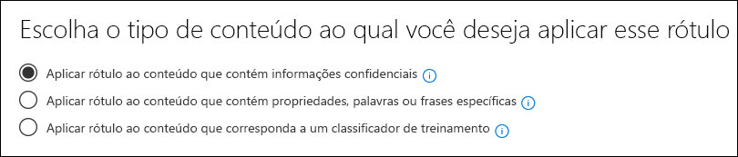

# Usando um classificador pronto para uso (visualização)Using a ready to use classifier (preview)

A Microsoft treinado e testou o número de classificadores usando conjuntos de dados de amostra muito grandes pode ajudar a identificar determinadas categorias de conteúdo.Microsoft has trained and tested number of classifiers using very large sample data sets can help to identify certain categories of content. Confira introdução [aos classificadores estagiários (visualização)](classifier-getting-started-with.md).See [Getting started with trainable classifiers (preview)](classifier-getting-started-with.md). Esses classificadores aparecem no `Ready to use` grupo por padrão.These classifiers show up in the `Ready to use` group by default.

- **Linguagem ofensiva**: detecta itens de texto que contêm obscenidades, slurs, taunts e expressões disfarçadas (que são expressões que têm o mesmo significado de um termo mais ofensivo).**Offensive Language**: detects text items which contain profanities, slurs, taunts, and disguised expressions (which are expressions that have the same meaning as a more offensive term).
- **Currículos**: detecta itens que são contas de texto das qualificações pessoais, educacionais, profissionais, experiência de trabalho e outras informações de identificação pessoal de um candidato**Resumes**: detects items which are textual accounts of an applicant's personal, educational, professional qualifications, work experience and other personally identifying information
- **SourceCode**: detecta itens que contêm um conjunto de instruções e instruções escritas em linguagens de programação de computador amplamente usadas.**SourceCode**: detects items which contain a set of instructions and statements written in widely used computer programming languages.
- **Assédio**: detecta uma categoria específica de itens de texto de linguagem ofensiva relacionadas à conduta ofensiva direcionada uma ou várias pessoas com base nas seguintes características: raça, étnica, Religion, origem nacional, sexo, orientação sexual, idade, deficiência.**Harassment**: detects a specific category of offensive language text items related to offensive conduct targeting one or multiple individuals based on the following traits: race, ethnicity, religion, national origin, gender, sexual orientation, age, disability.
- **Profanação**: detecta uma categoria específica de itens de texto de idioma ofensivo que contêm expressões que constrangim a maioria das pessoas**Profanity**: detects a specific category of offensive language text items which contain expressions that embarrass most people
- **Ameaça**: detecta uma categoria específica de itens de texto de linguagem ofensiva relacionadas a ameaças para confirmar a violência ou danos físicos ou danos a uma pessoa ou a uma propriedade**Threat**: detects a specific category of offensive language text items related to threats to commit violence or do physical harm or damage to a person or property

> [!NOTE]
> Antes de usar os classificadores pronto para usar no seu fluxo de trabalho de classificação e rotular, você deve testá-lo em um exemplo de conteúdo da sua organização que você se sente que é a categoria para verificar se suas previsões de classificação atendem às suas expectativas.Before using ready to use classifiers in your classification and labeling workflow, you should test it against a sample of your organization's content that you feel fits the category to verify that its classification predictions meet your expectations.

> [!IMPORTANT]
> Observe que a linguagem ofensiva, assédio, profanação e classificadores de ameaças só funcionam com o texto pesquisável não é completo nem completo.Please note that the offensive language, harassment, profanity, and threat classifiers only work with searchable text are not exhaustive or complete.  Além disso, os padrões culturais e de idioma mudam continuamente e, em claro, a Microsoft reserva-se o direito de atualizar esses classificadores em seu critério.Further, language and cultural standards continually change, and in light of these realities, Microsoft reserves the right to update these classifiers in its discretion. Embora os classificadores possam ajudar sua organização a monitorar o ofensivo e outros idiomas usados, os classificadores não resolvem as conseqüências de tal linguagem e não se destinam a fornecer o único meio de monitoramento ou resposta ao uso de esse idioma.While the classifiers may assist your organization in monitoring offensive and other language used, the classifiers do not address consequences of such language and are not intended to provide your organization’s sole means of monitoring or responding to the use of such language. Sua organização, e não a Microsoft ou suas subsidiárias, permanece responsável por todas as decisões relacionadas ao monitoramento, imposição, bloqueio, remoção e retenção de qualquer conteúdo identificado por um classificador treinado.Your organization, and not Microsoft or its subsidiaries, remains responsible for all decisions related to monitoring, enforcement, blocking, removal and retention of any content identified by a pre-trained classifier.

## Como preparar e usar um classificador pronto para usarHow to prepare for and use a ready to use classifier

1. Colete itens de conteúdo de teste descartáveis que você sente que pertencem à categoria do classificador pronto para usar (correspondências positivas) e aqueles que não devem ser incluídos (correspondências negativas) na categoria que você está testando.Collect disposable test content items that you feel belong in the category of the ready to use classifier (positive matches) and ones that should not be included (negative matches) in the category you are testing.

> [!IMPORTANT]
> Os itens de exemplo não devem ser criptografados e devem estar em inglês.The sample items must not be encrypted and they must be in English.

2. Crie uma pasta dedicada do SharePoint Online, aguarde pelo menos uma hora para a pasta ser adicionada ao índice de pesquisa.Create a dedicated SharePoint Online folder, wait at least an hour for the folder to be added to the search index. Anote a URL da pasta.Make note of the folder URL.

3. Entre no centro de conformidade da Microsoft 365 com administrador de conformidade ou acesso à função de administrador de segurança e abra **o centro de conformidade** da Microsoft 365 ou a guia**de políticas de gerenciamento de registros (visualização)** > \*\*\*\* do **Centro** > de segurança da Microsoft 365.Sign in to Microsoft 365 compliance center with compliance admin or security admin role access and open **Microsoft 365 compliance center** or **Microsoft 365 security center** > **Records management (preview)** > **Label policies** tab.

4. Escolha `Auto-apply a label`.Choose `Auto-apply a label`.

5. Escolha `Choose a label to auto-apply`.Choose `Choose a label to auto-apply`.

6. Escolha `Create new labels` e crie um rótulo para uso apenas com este teste.Choose `Create new labels` and create a label for use just with this test. Ao fazer isso, deixe `Retention` definido como desativado.When you do this, leave `Retention` set to off. Você não deseja ativar nenhuma retenção ou outras ações.You don't want to turn on any retention or other actions. Nesse caso, você usará o uso do rótulo de retenção simplesmente como um rótulo de texto, sem impor qualquer ação.In this case, you'll be using using the retention label simply as a text label, without enforcing any actions. Por exemplo, você pode criar um rótulo de retenção chamado "teste de classificador SourceCode" sem ações e, em seguida, aplicar automaticamente esse rótulo de retenção ao conteúdo com o classificador do código-fonte como uma condição.For example, you can create a retention label named "SourceCode classifier test" with no actions, and then auto-apply that retention label to content with that has Source code classifier as a condition. Para saber mais sobre a criação de rótulos de retenção, confira [visão geral dos rótulos de retenção](labels.md).To learn more about creating retention labels, see [Overview of retention labels](labels.md).
  
7. Escolha `Auto-apply a label` e, `Choose a label to auto-apply`em seguida.Choose `Auto-apply a label` and then `Choose a label to auto-apply`. Para saber mais sobre como usar a condição com base em aplicar automaticamente um rótulo, confira [aplicar automaticamente a política de rótulo de retenção com base em uma condição](labels.md#applying-a-retention-label-automatically-based-on-conditions).To learn more about using condition based auto-apply a label see, [auto-apply retention label policy based on a condition](labels.md#applying-a-retention-label-automatically-based-on-conditions).

8. Escolha seu rótulo de teste na lista e escolha `Next`.Choose your test label from the list and choose `Next`.

9. Escolha `Apply label to content that matches a trainable classifier`.Choose `Apply label to content that matches a trainable classifier`.

.

10. Escolha seu classificador na lista, neste caso`Source Code`Choose your classifier from the list, in this case `Source Code`

11. Nomeie a política, por exemplo, "código-fonte pronto para usar o teste do classificador".Name the policy, for example "Source code ready to use classifier test".

12. Escolha `Let me choose specific locations`.Choose `Let me choose specific locations`.

13. Desative todos os locais `SharePoint sites` , exceto `Choose sites`e escolha.Turn off all locations except `SharePoint sites` and choose `Choose sites`.

14. Insira a URL do site na etapa 2.Enter the URL for the site from step 2.

15. Finalize o assistente e escolha`Auto-apply`Finish the wizard and choose `Auto-apply`

16. Coloque os itens de teste na pasta dedicada do SharePoint Online.Place the test items into the dedicated SharePoint Online folder.

17. Permite que uma hora para o rótulo seja aplicada.Allow an hour for the label to be applied.

18. Verifique as propriedades dos documentos do rótulo para ver se o classificador incluiu e excluiu o conteúdo de teste conforme o esperado.Check the properties of the documents for the label to see if the classifier included and excluded the test content as you expected.

19. Revise os itens que foram rotulados.Review the items that were labeled .

20. Exclua o conteúdo e a política de etiqueta se você tiver concluído o teste.Delete the content, and the label policy if you are done with your testing.

Confira também:See also:

- [Introdução aos classificadores de treinamento (visualização)Getting started with trainable classifiers (preview)](classifier-getting-started-with.md)
- [Visão geral de rótulos de retençãoOverview of retention labels](labels.md)
- [Aplicar automaticamente a política de rótulo de retenção com base em uma condiçãoAuto-apply retention label policy based on a condition](labels.md#applying-a-retention-label-automatically-based-on-conditions)