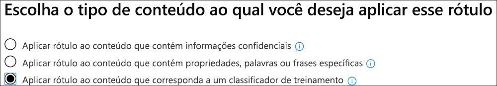

# Testando classificadores internos usando rótulos de retenção (visualização)

A Microsoft treinou e testou cinco classificadores que podem ajudar a identificar determinadas categorias de conteúdo. Esses classificadores aparecem no `Ready to use` grupo por padrão e foram treinados usando conjuntos de dados de amostra muito grandes.

> [!IMPORTANT]
> Antes de usar classificadores internos em seu fluxo de trabalho de classificação e rotulação, você deve testá-lo em uma amostra do conteúdo da sua organização que você sente que se sinta à categoria para verificar se suas previsões de classificação atendem às suas expectativas.

Para obter mais informações sobre classificadores destreinados, confira introdução [aos classificadores ferroviárias (visualização)](classifier-getting-started-with.md).

A Microsoft 365 vem com cinco classificadores internos recomendados:

> [!CAUTION]
> Vamos substituir o classificador interno **Idioma Ofensivo** porque ele tem uma grande quantidade de falsos positivos. Não usá-lo e, se estiver usando, você deverá mover seus processos de negócios para fora dele. Recomendamos o uso de classificadores internos **contra ameaças**, **profanação**e **assédio** .

- **Currículos**: detecta itens que são contas de texto das qualificações pessoais, educacionais, profissionais, experiência de trabalho e outras informações de identificação pessoal de um candidato
- **Código-fonte**: detecta itens que contêm um conjunto de instruções e instruções escritas nas principais linguagens de programação de computador usadas no github

  |nome do idioma|||||
  |---------|---------|---------|---------|---------|
  |Código|C        |Unidade #       |C++     |Clojure  |
  |CoffeeScript|CSS     |Ir       |Haskell |HTML     |
  |Java     |JavaScript|Lua      |MATLAB   |Objective-C|
  |Perl     |PHP      |Python   |R        |Ruby     |
  |Scale    |Shell    |Swift    |Tex      |Script vim|

> [!NOTE]
> O código-fonte é treinado para detectar quando a maior parte do texto é o código-fonte. Ele não detecta o texto do código-fonte que é intercalado com texto sem formatação.

- **Assédio**: detecta uma categoria específica de itens de texto de linguagem ofensiva relacionadas à conduta ofensiva direcionando uma ou várias pessoas com base nas seguintes características: corrida, étnica, Religion, origem nacional, sexo, orientação sexual, idade, deficiência
- **Profanação**: detecta uma categoria específica de itens de texto de idioma ofensivo que contêm expressões que constrangim a maioria das pessoas
- **Ameaça**: detecta uma categoria específica de itens de texto de linguagem ofensiva relacionadas a ameaças para confirmar a violência ou danos físicos ou danos a uma pessoa ou a uma propriedade

> [!IMPORTANT]
> Observe que a linguagem ofensiva, assédio, profanação e classificadores de ameaças só funcionam com o texto pesquisável não é completo nem completo. Além disso, os padrões culturais e de idioma mudam continuamente e, em claro, a Microsoft reserva-se o direito de atualizar esses classificadores em seu critério. Embora os classificadores possam ajudar sua organização a monitorar ofensivas e outros idiomas usados, os classificadores não resolvem as conseqüências de tal linguagem e não se destinam a fornecer o único meio de monitoramento ou resposta ao uso dessa linguagem. Sua organização, e não a Microsoft ou suas subsidiárias, permanece responsável por todas as decisões relacionadas ao monitoramento, imposição, bloqueio, remoção e retenção de qualquer conteúdo identificado por um classificador treinado.

## Como verificar se um classificador interno atende às suas necessidades

1. Coletar itens de conteúdo de teste descartáveis que você sente que pertencem à categoria do classificador interno (correspondências positivas) e aqueles que não devem ser incluídos (correspondências negativas) na categoria que você está testando.

   > [!IMPORTANT]
   > Os itens de exemplo não devem ser criptografados e devem estar em inglês.

2. Criar uma pasta dedicada do SharePoint Online; Aguarde pelo menos uma hora para a pasta a ser adicionada ao índice de pesquisa. Anote a URL da pasta.

3. Entre no centro de conformidade da Microsoft 365 com administrador de conformidade ou acesso à função de **Microsoft 365 compliance center**administrador de segurança e abra a  >  guia**de políticas de gerenciamento de registros**do centro de conformidade da Microsoft 365 (visualização)  >  **Label policies** .

4. Escolha `Auto-apply a label` .

5. Escolha `Choose a label to auto-apply` .

6. Escolha `Create new labels` e crie um rótulo para uso apenas com este teste. Ao fazer isso, deixe `Retention` definido para `off` . Você não deseja ativar nenhuma retenção ou outras ações. Nesse caso, você usará o rótulo de retenção simplesmente como um rótulo de texto, sem impor qualquer ação. Por exemplo, você pode criar um rótulo de retenção chamado "teste de classificador SourceCode" sem ações e, em seguida, aplicar automaticamente esse rótulo de retenção ao conteúdo que tenha classificador de código-fonte como uma condição. Para saber mais sobre a criação de rótulos de retenção, confira [visão geral dos rótulos de retenção](labels.md).
  
7. Escolha `Auto-apply a label` e, em seguida `Choose a label to auto-apply` . Para saber mais sobre como usar a condição com base em aplicar automaticamente um rótulo, confira [aplicar automaticamente a política de rótulo de retenção com base em uma condição](labels.md#applying-a-retention-label-automatically-based-on-conditions).

8. Escolha seu rótulo de teste na lista e escolha `Next` .

9. Escolha `Apply label to content that matches a trainable classifier` .

   

10. Escolha seu classificador na lista, neste caso`Source Code`

11. Nomeie a política, por exemplo, "teste de classificador interno de código-fonte".

12. Escolha `Let me choose specific locations` .

13. Desative todos os locais, exceto `SharePoint sites` e escolha `Choose sites` .

14. Insira a URL do site na etapa 2.

15. Finalize o assistente e escolha`Auto-apply`

16. Coloque os itens de teste na pasta dedicada do SharePoint Online.

17. Permite que uma hora para o rótulo seja aplicada.

18. Verifique as propriedades dos documentos do rótulo para ver se o classificador incluiu e excluiu o conteúdo de teste conforme o esperado.

19. Revise os itens que foram rotulados.

20. Exclua o conteúdo e a política de rótulo se você tiver feito o teste.

Confira também:

- [Introdução aos classificadores treináveis (visualização)](classifier-getting-started-with.md)
- [Visão geral de rótulos de retenção](labels.md)
- [Aplicar automaticamente a política de rótulo de retenção com base em uma condição](labels.md#applying-a-retention-label-automatically-based-on-conditions)
