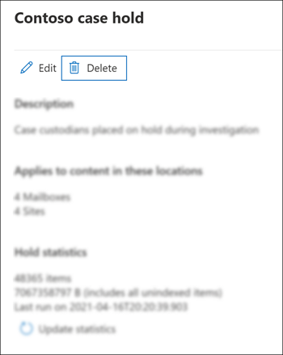

# Fechar, reabrir e excluir um caso de Descoberta PrincipalClose, reopen, and delete a Core eDiscovery case

Este artigo descreve como fechar, reabrir e excluir os principais casos de Descoberta Microsoft 365.This article describes how to close, reopen, and delete Core eDiscovery cases in Microsoft 365.

## Fechar um casoClose a case

Quando o caso legal ou a investigação com suporte de um caso core de Descoberta eDiscovery for concluído, você poderá fechar o caso.When the legal case or investigation supported by a Core eDiscovery case is completed, you can close the case. Veja o que acontece quando você fecha um caso:Here's what happens when you close a case:
  
- Se o caso contiver qualquer ressarção de Descoberta E, eles serão desligados.If the case contains any eDiscovery holds, they will be turned off. Depois que a espera é desligada, um período de carência de 30 dias (chamado de *atraso)* é aplicado a locais de conteúdo que estavam em espera.After the hold is turned off, a 30-day grace period (called a *delay hold*) is applied to content locations that were on hold. Isso ajuda a impedir que o conteúdo seja imediatamente excluído e oferece aos administradores a oportunidade de pesquisar e restaurar conteúdo antes que ele possa ser excluído permanentemente depois que o período de espera de atraso expirar.This helps prevent content from being immediately deleted and provides admins the opportunity to search for and restore content before it may be permanently deleted after the delay hold period expires. Para obter mais informações, consulte [Removendo locais de conteúdo de uma remoção de descoberta de eDiscovery](create-ediscovery-holds.md#removing-content-locations-from-an-ediscovery-hold).For more information, see [Removing content locations from an eDiscovery hold](create-ediscovery-holds.md#removing-content-locations-from-an-ediscovery-hold).

- Fechar um caso apenas desativa as retenções que estão associadas a esse caso.Closing a case only turns off the holds that are associated with that case. Se outras retenções são colocadas em um local de conteúdo (como uma Retenção de Litígio, uma política de retenção ou uma retenção de um caso de Descoberta eDiscovery Principal diferente), essas retenções ainda serão mantidas.If other holds are placed on a content location (such as a Litigation Hold, a retention policy, or a hold from a different Core eDiscovery case) those holds will still be maintained.

- O caso ainda está listado na página Descoberta Principal da Descoberta Microsoft 365 de conformidade.The case is still listed on the Core eDiscovery page in the Microsoft 365 compliance center. Os detalhes, retenções, pesquisas e membros de um caso fechado são retidos.The details, holds, searches, and members of a closed case are retained.

- Você pode editar uma ocorrência depois que ela for fechada.You can edit a case after it's closed. Por exemplo, você pode adicionar ou remover membros, criar pesquisas e exportar resultados de pesquisa.For example, you can add or remove members, create searches, and export search results. A principal diferença entre os casos ativos e fechados é que os ressarcedores de Descoberta e São desligados quando um caso é fechado.The primary difference between active and closed cases is that eDiscovery holds are turned off when a case is closed.

Para fechar um caso:To close a case:
  
1. No centro Microsoft 365 de conformidade, clique em **eDiscovery** Core para exibir a lista de principais casos de  >   Descoberta eDiscovery em sua organização.In the Microsoft 365 compliance center, click **eDiscovery** > **Core** to display the list of Core eDiscovery cases in your organization.

2. Clique no nome do caso que você deseja fechar.Click the name of the case that you want to close.

   

3. Na home page, em **Status**, clique **em Fechar caso**.On the home page, under **Status**, click **Close case**.

    Um aviso é exibido dizendo que os ressarcições associados à ocorrência serão desligados.A warning is displayed saying that the holds associated with the case will be turned off.

4. Clique **em Sim** para fechar o caso.Click **Yes** to close the case.

    O status na home page do caso é alterado de **Ativo** para **Fechamento**.The status on the case home page is changed from **Active** to **Closing**.

5. Na página **Descoberta Automática Principal,** clique em **Atualizar** para atualizar o status do caso fechado.On the **Core eDiscovery** page, click **Refresh** to update the status of the closed case. Pode levar até 60 minutos para o processo de fechamento concluir.It might take up to 60 minutes for the closing process to complete.

    Quando o processo é concluído, o status da ocorrência é alterado para **Fechado** na página **Descoberta Principal.**When the process is complete, the status of the case is changed to **Closed** on the **Core eDiscovery** page.

## Reabrir um caso fechadoReopen a closed case

Quando você reabrir um caso, qualquer Descoberta Automática que estava no local quando o caso foi fechado não será automaticamente restabelecido.When you reopen a case, any eDiscovery holds that were in place when the case was closed won't be automatically reinstated. Depois que o caso for reaberto, você terá que ir para a página **Retém** e ativar as ressarções anteriores.After the case is reopened, you'll have to go to the **Holds** page and turn on the previous holds. Para ativar uma retenção, selecione para exibir o submenu da página e depois alterne o **Status** para **Ativo**. To turn on a hold, select it to display the flyout page, and then set the **Status** toggle to **On**.
  
1. No centro Microsoft 365 de conformidade, clique em **eDiscovery** Core para exibir a lista de principais casos de  >   Descoberta eDiscovery em sua organização.In the Microsoft 365 compliance center, click **eDiscovery** > **Core** to display the list of Core eDiscovery cases in your organization.

2. Clique no nome do caso que você deseja reabrir.Click the name of the case that you want to reopen.

   

3. Na home page, em **Status**, clique em **Reabrir caso**.On the home page, under **Status**, click **Reopen case**.

    Um aviso é exibido dizendo que as resvações associadas à ocorrência quando ela foi fechada não serão ativados automaticamente.A warning is displayed saying that the holds that were associated with the case when it was closed won't be turned on automatically.

4. Clique **em Sim** para reabrir o caso.Click **Yes** to reopen the case.

    O status na página de sobrevoo da home page de caso é alterado **de Closed** para **Active**.The status on the case home page flyout page is changed from **Closed** to **Active**.

5. Na página **Descoberta Principal da Descoberta Automática,** clique em **Atualizar** para atualizar o status do caso reaberto.On the **Core eDiscovery** page, click **Refresh** to update the status of the reopened case. Pode levar até 60 minutos para que o processo de reabertura seja concluído.It might take up to 60 minutes for the reopening process to complete. 

    Quando o processo é concluído, o status da ocorrência é alterado para **Ativo** na página **Descoberta Principal.**When the process is complete, the status of the case is changed to **Active** on the **Core eDiscovery** page.

6. (Opcional) Para ativar quaisquer bloqueios associados ao caso  reaberto, vá para a guia Bloqueios, selecione uma responsabilidade e selecione a caixa de seleção em **Status** na página de subsuletor de espera.(Optional) To turn on any holds associated with the reopened case, go to **Holds** tab, select a hold, and then select the checkbox under **Status** on the hold flyout page.
  
## Excluir uma ocorrênciaDelete a case

Você também pode excluir casos ativos e fechados de Descoberta eDiscovery Principal.You can also delete active and closed Core eDiscovery cases. Quando você exclui um caso, todas as pesquisas e exportações no caso são excluídas, e o caso é removido da lista de casos na página Descoberta Principal de **Descoberta** e No centro de conformidade do Microsoft 365.When you delete a case, all searches and exports in the case are deleted, and the case is removed from the list of cases on the **Core eDiscovery** page in the Microsoft 365 compliance center. Não é possível reabrir um caso excluído.You can't reopen a deleted case.

Antes de poder excluir uma ocorrência (se ela está ativa ou fechada), primeiro exclua todas as resções de *Descoberta* De eDiscovery associadas ao caso.Before you can delete a case (whether it's active or closed), you must first delete *all* eDiscovery holds associated with the case. Isso inclui a exclusão de retém com um status de **Off**.That includes deleting holds with a status of **Off**. 

Para excluir uma ressarção de Descoberta e:To delete an eDiscovery hold:

1. Vá na **guia Retém** no caso em que você deseja excluir.Go the **Holds** tab in the case that you want to delete.

2. Selecione a espera que você deseja excluir.Select the hold that you want to delete.

3. Na página de sobrevoo, clique em **Excluir**.On the flyout page, click **Delete**.

      

Para excluir um caso:To delete a case:

1. No centro Microsoft 365 de conformidade, clique em **eDiscovery** Core para exibir a lista de principais casos de  >   Descoberta eDiscovery em sua organização.In the Microsoft 365 compliance center, click **eDiscovery** > **Core** to display the list of Core eDiscovery cases in your organization.

2. Clique no nome do caso que você deseja excluir.Click the name of the case that you want to delete.

3. Na home page do caso, em **Status**, clique **em Excluir caso**.On the case home page, under **Status**, click **Delete case**.

      

Se o caso que você estiver tentando excluir ainda contiver retém a Descoberta E, você receberá uma mensagem de erro.If the case you're trying to delete still contains eDiscovery holds, you'll receive an error message. Você terá que excluir todas as ressarcições associadas à ocorrência e tentar novamente excluir o caso.You'll have to delete all holds associated with the case and then try again to delete the case.
