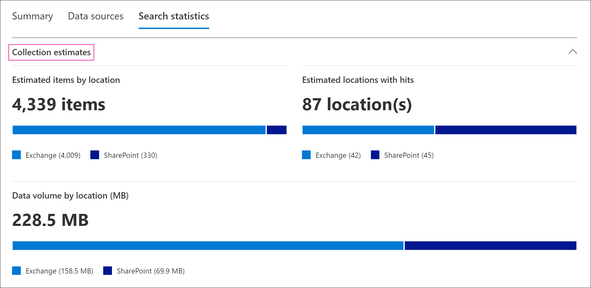

# Estatísticas e relatórios de coleção em Descoberta AvançadaCollection statistics and reports in Advanced eDiscovery

Depois de criar um conjunto de rascunhos, você pode exibir estatísticas nos itens recuperados, como os locais de conteúdo que contêm a maioria dos itens que corresponderam aos critérios de pesquisa e ao número de itens retornados pela consulta de pesquisa.After you create a draft collection, you can view statistics on the retrieved items, such as the content locations that contain the most items that matched the search criteria and the number of items returned by the search query. Você também pode visualizar um subconjunto dos resultados.You can also preview a subset of the results.

Quando você identificar o conjunto de documentos que deseja examinar mais, você pode adicionar os resultados da pesquisa a um conjunto de revisão para coletar e processar.When you've identified the set of documents you want to further examine, you can add the search results to a review set to collect and process.

## Estatísticas e relatórios para coleções de rascunhoStatistics and reports for draft collections

Esta seção descreve as estatísticas disponíveis para coleções de rascunho.This section describes the statistics that are available for draft collections. Essas estatísticas estão disponíveis na guia **Estatísticas de** pesquisa na página de sobrevoo de um conjunto de rascunhos.These statistics are available on the **Search statistics** tab on the flyout page of a draft collection.

### Estimativas de coleçãoCollection estimates

Esta seção exibe um resumo gráfico dos itens estimados retornados pela coleção.This section displays a graphical summary of the estimated items returned by the collection. Isso indica o número de itens que corresponderem aos critérios de pesquisa da coleção.This indicates the number of items that match the search criteria of the collection. Essas informações dão uma ideia do número estimado de itens retornados pela coleção.This information gives you an idea about the estimated number of items returned by the collection.

- **Itens estimados por locais**: O número total de itens estimados retornados pela coleção.**Estimated items by locations**: The total number of estimated items returned by the collection. O número específico de itens localizados em caixas de correio e localizados em sites também é exibido.The specific number of items located in mailboxes and located in sites is also displayed.

- **Locais estimados com hits**: O número total de locais de conteúdo que contêm itens retornados pela coleção.**Estimated locations with hits**: The total number of content locations that contain items returned by the collection. O número específico de caixas de correio e locais de site também é exibido.The specific number of mailbox and site locations is also displayed.

- **Volume de dados por local (em MB)**: o tamanho total de todos os itens estimados retornados pela coleção.**Data volume by location (in MB)**: The total size of all estimated items returned by the collection. O tamanho específico de itens de caixa de correio e itens de site também é exibido.The specific size of mailbox items and site items is also displayed.

### Relatório de condiçãoCondition report

Esta seção exibe estatísticas sobre a consulta de pesquisa de coleção e o número de itens estimados que corresponderam a diferentes partes da consulta de pesquisa.This section displays statistics about the collection search query and the number of estimated items that matched different parts of the search query. Você pode usar essas estatísticas para analisar o número de itens que corresponderem a cada componente da consulta de pesquisa.You can use these statistics to analyze the number of items that match each component of search query. Isso pode ajudá-lo a refinar os critérios de pesquisa para a coleção e, se necessário, restringir o escopo da coleção.This can help you refine the search criteria for the collection and if necessary narrow the scope of the collection.

- **Tipo de** local : o tipo de local de conteúdo ao qual as estatísticas de consulta são aplicáveis.**Location type**: The type of content location that the query statistics are applicable to. O valor do **Exchange** indica um local de caixa de correio; um valor do **SharePoint** indica um local do site.The value of **Exchange** indicates a mailbox location; a value of **SharePoint** indicates a site location.

- **Parte**: A parte da consulta de pesquisa à que as estatísticas são aplicáveis.**Part**: The part of the search query the statistics are applicable to. **O** primário indica toda a consulta de pesquisa.**Primary** indicates the entire search query. **A** palavra-chave indica que as estatísticas na linha são para uma palavra-chave específica.**Keyword** indicates the statistics in the row are for a specific keyword. Se você usar uma lista de palavras-chave quando para a consulta de pesquisa na coleção, as estatísticas de cada componente da consulta serão incluídas nesta tabela.If you use a keyword list when for the search query in the collection, statistics for each component of the query are included in this table.

- **Condição**: o componente real (palavra-chave ou condição) da consulta de pesquisa que foi executado para a coleção de rascunho que retornou as estatísticas exibidas na linha correspondente.**Condition**: The actual component (keyword or condition) of the search query that was run for the draft collection that returned the statistics displayed in the corresponding row.

- **Locais com hits**: o número dos locais  de conteúdo (especificados pela coluna Tipo de local) que contêm itens que corresponderem à consulta primária ou de palavra-chave listada na **coluna** Condição.**Locations with hits**: The number of the content locations (specified by the **Location type** column) that contain items that match the primary or keyword query listed in the **Condition** column.

- **Itens**: o número de itens (do local de conteúdo especificado) que combinam com a consulta listada na **coluna Condição.****Items**: The number of items (from the specified content location) that match the query listed in the **Condition** column. Conforme explicado anteriormente, se um item contiver várias instâncias de uma palavra-chave que está sendo pesquisada, ele só será contado uma vez nesta coluna.As previously explained, if an item contains multiple instances of a keyword that is being searched for, it's only counted once in this column.

- **Tamanho (MB)**: o tamanho total de todos os itens encontrados (no local de conteúdo especificado) que corresponderem à consulta de pesquisa na **coluna** Condição.**Size (MB)**: The total size of all items that were found (in the specified content location) that match the search query in the **Condition** column.

### Principais locaisTop locations

Esta seção exibe estatísticas sobre os locais de conteúdo específicos com a maioria dos itens retornados pela coleção.This section displays statistics about the specific content locations with the most items returned by the collection.

- O nome do nome do local (o endereço de email das caixas de correio e a URL para sites).The name of the location name (the email address of mailboxes and the URL for sites).

- Tipo de local (uma caixa de correio ou site).Location type (a mailbox or site).

- Número estimado de itens no local de conteúdo retornado pela coleção.Estimated number of items in the content location returned by the collection.

- O tamanho total dos itens estimados em cada local de conteúdo.The total size of estimated items in each content location.

## Estatísticas e relatórios para coleções comprometidasStatistics and reports for committed collections

Esta seção descreve as estatísticas que estão disponíveis depois que você confirma uma coleção em um conjunto de revisão, incluindo o número real de itens adicionados ao conjunto de revisão.This section describes the statistics that are available after you commit a collection to a review set, including the actual number of items added to the review set. Essas estatísticas (além de informações de conjunto de carga) fornecem informações históricas sobre o conteúdo adicionado a um caso.These statistics (in addition to load set information) provide historical information about content added to a case.

Depois que você confirma uma coleção em um conjunto de revisão, as guias a seguir são exibidas na página de sobrevoo da conexão comprometida.After you commit a collection to a review set, the following tabs are displayed on the flyout page of the committed connection. Cada uma dessas guias contém diferentes tipos de informações sobre a coleção.Each of these tabs contains different types of information about the collection.

### Conteúdo da coleçãoCollection contents

Esta seção da guia **Resumo** contém estatísticas e outras informações sobre os itens coletados das fontes de dados na coleção e adicionados ao conjunto de revisão.This section of the **Summary** tab contains statistics and other information about the items that were collected from the data sources in the collection and added to the review set.

- **Total de itens extraídos**.**Total extracted items**. O número total de itens adicionados ao conjunto de revisão.The total number of items added to the review set. Esse número indica a soma de itens pai e itens filho adicionados ao conjunto de revisão.This number indicates the sum of parent items and child items added to the review set.

  > [!TIP]
  > Passe o cursor sobre as barras de item pai ou filho para exibir o número total de itens pai ou filho.Hover the cursor over the parent or child item bars to display the total number of parent or child items.

- **Itens pai**.**Parent items**. O número de itens retornados pela coleção usada para coletar os itens que foram adicionados ao conjunto de revisão.The number of items returned by the collection that was used to collect the items that were added to the review set. Esse número corresponde a (e é igual a) o número estimado de itens exibidos na **seção Parâmetros de** coleção.This number corresponds  to (and is equal to) the estimated number of items that is displayed in the **Collection parameters** section. O número de itens pai que ele coleta informações que foram usadas para coletar os itens que foram adicionados ao conjunto de revisão.The number of parent items he collection information that was used to collect the items that were added to the review set.
 
   Um item pai pode conter vários itens filho.A parent item might contain multiple child items. Por exemplo, uma mensagem de email é um item pai se ela contiver um arquivo anexado ou tiver um anexo na nuvem.For example, an email message is a parent item if it contains an attached file or has a cloud attachment. Nesse caso, o arquivo anexado ou o destino do anexo de nuvem são considerados itens filho.In this case, the attached file or the target of the cloud attachment are considered child items. Quando você confirma uma coleção, os itens pai e todos os itens filho correspondentes são adicionados ao conjunto de revisão como itens ou arquivos individuais.When you commit a collection, parent items and any corresponding child items are added to the review set as individual items or files.

- **Itens filho**.**Child items**. O número de itens filho adicionados ao conjunto de revisão.The number of child items added to the review set. Os itens filho são anexos ou outras partes de um item pai.Child items are attachments or other parts of a parent item. Os itens filho incluem arquivos anexados, anexos de nuvem, imagens e assinaturas de email.Child items include attached files, cloud attachments, images, and email signatures. Quando você confirma uma coleção em um conjunto de revisão, os itens filho são extraídos, indexados e adicionados ao conjunto de revisão como arquivos individuais.When you commit a collection to a review set, child items are extracted, indexed, and added to the review set as individual files.

- **Itens exclusivos**.**Unique items**. O número de itens exclusivos adicionados ao conjunto de revisão.The number of unique items added to the review set. Itens exclusivos são exclusivos do conjunto de revisão.Unique items are unique to the review set. Todos os itens são exclusivos quando a primeira coleção é adicionada a um novo conjunto de revisão porque não havia itens anteriores no conjunto de revisão.All items are unique when the first collection is added to a new review set because there were no previous items in the review set.

- **Itens duplicados identificados**.**Identified duplicate items**. O número de itens da coleção que não foram adicionados ao conjunto de revisão porque o mesmo item já existe no conjunto de revisão.The number of items from the collection that were not added to the review set because the same item already exists in the review set. As estatísticas sobre itens duplicados podem ajudar a explicar as diferenças entre o número de itens estimados de uma coleção de rascunho e o número real de itens adicionados ao conjunto de revisão.Statistics about duplicate items can help explain the differences between the number of estimated items from a draft collection and the actual number of items added to the review set.

### IndexaçãoIndexing

A **seção Indexação** na guia **Resumo de** um conjunto de revisão comprometida contém informações de indexação sobre os itens adicionados ao conjunto de revisão.The **Indexing** section on the **Summary** tab of a committed review set contains indexing information about the items added to the review set.

**Novos itens indexados**.**New indexed items**. O número de itens que foram indexados recentemente antes de eles foram adicionados ao conjunto de revisão.The number of items that were newly indexed before they were added to the review set. Um exemplo de um item recém-indexado são itens filho que são extraídos de um item pai e indexados antes de ser adicionado ao conjunto de revisão.An example of a newly indexed item are child items that are extracted from a parent item then indexed before they're added to the review set. Além disso, os itens que não estão localizados em fontes de  dados de custodia e locais de conteúdo não custodiados listados na guia Fontes de dados no caso são indexados antes de ser adicionados à revisão.Also, items that aren't located in custodial data sources and non-custodial content locations listed on the **Data sources** tab in the case are indexed before they're added to the review. Por exemplo, itens recém-indexados incluiriam itens coletados de locais adicionais.For example, newly indexed items would include items collected from additional locations.

**Itens indexados atualizados**.**Updated indexed items**. O número de itens parcialmente indexados que foram indexados com êxito e adicionados ao conjunto de revisão.The number of partially indexed items that were successfully indexed and added to the review set. Isso indexa parcialmente itens de locais de  conteúdo custodiante e não custodial A guia Fontes de dados que foram indexadas com êxito quando a coleção foi comprometida com o conjunto de revisão.This would partially indexed items from custodial and non-custodial content locations **Data sources** tab that were successfully indexed when the collection was committed to the review set.

**Erros de indexação**.**Indexing errors**. O número de itens parcialmente indexados que não puderam ser indexados antes de serem adicionados ao conjunto de revisão.The number of partially indexed items that couldn't be indexed before they were added to the review set. Esses itens podem exigir correção de erros.These items might require error remediation.

### Parâmetros de coleçãoCollection parameters

Esta seção exibe as informações de coleção que foram usadas para coletar os itens que foram adicionados ao conjunto de revisão.This section displays the collection information that was used to collect the items that were added to the review set. Esta guia exibe informações semelhantes às informações na **guia Estatísticas de** Pesquisa. Esta seção fornece uma foto rápida da consulta de pesquisa usada pela coleção, dos locais de conteúdo pesquisados e dos resultados estimados da coleção.This tab displays information that is similar to the information on the **Search statistics** tab. This section provides a quick snap shot of the search query used by the collection, the content locations that were searched, and the estimated collection results. Conforme explicado anteriormente, o número de itens estimados nesta seção seria igual ao número de itens pai mostrados na seção **Conteúdo da** coleção.As previously explained, the number of estimated items in this section would be equal to the number of parent items shown in the **Collection contents** section.

### Guia Estatísticas de pesquisaSearch statistics tab

As estatísticas exibidas na guia **Estatísticas de** Pesquisa são as mesmas estatísticas da última vez em que uma coleção de rascunho foi executado.The statistics displayed on the **Search statistics** tab are the same statistics from the last time that a draft collection was run. Isso inclui estimativas de coleção, relatório de condição e locais principais.This includes collection estimates, condition report, and top locations. Essas informações são preservadas do conjunto de rascunhos para referência histórica e podem ser comparadas à coleção real que foi comprometida com o conjunto de revisão.This information is preserved from the draft collection for historical reference, and can be compared to the actual collection that was committed to the review set.

## Diferenças entre as estimativas da coleção de rascunho e a coleção real comprometidaDifferences between draft collection estimates and the actual committed collection

Quando você executar um conjunto de rascunhos, uma estimativa do número de itens (e  seu tamanho total) que atendem aos **critérios** de coleção é exibida na guia Resumo e na seção **Estimativas** de coleção da guia Estatísticas de pesquisa. Depois que você confirma um conjunto de rascunhos em um conjunto de revisão, o número real de itens (e seu tamanho total) adicionados ao conjunto de revisão são geralmente diferentes das estimativas.When you run a draft collection, an estimate of the number of items (and their total size) that meet the collection criteria is displayed on the **Summary** tab and in **Collection estimates** section of the **Search statistics** tab. After you commit a draft collection to a review set, the actual number of items (and their total size) added the review set are often different from the estimates. Na maioria dos casos, mais itens são adicionados ao conjunto de revisão do que foram estimados na coleção de rascunho.In most cases, more items are added to the review set than were estimated from the draft collection. A lista a seguir descreve os motivos mais comuns para essas diferenças e dicas para identificá-las:The following list describes the most common reasons for these differences and tips for identifying them:

- **Itens filho**.**Child items**. Itens filho extraídos de seus itens pai e adicionados como arquivos individuais.Child items that are extracted from their parent items and added as individual files. O número de itens filho pode aumentar significativamente o número de itens que são realmente adicionados ao conjunto de revisão.The number of child items may significantly increase the number of items that are actually added to the review set. Em geral, o número de  itens pai identificados  na seção Conteúdo da coleção na guia Resumo de uma coleção comprometida deve ser igual ao número de itens estimados da coleção de rascunho.In general, the number of parent items identified in the **Collection contents** section on the **Summary** tab of a committed collection should be equal to the number of estimated items from the draft collection.

- **Itens duplicados**.**Duplicate items**. Os itens da coleção de rascunho que já foram adicionados ao conjunto de revisão em uma coleção anterior não serão adicionados.Items from the draft collection that have already been added to the review set in a previous collection won't be added. Conforme explicado anteriormente, o número de itens duplicados na coleção é exibido na seção **Conteúdo da** coleção na guia **Resumo.**As previously explained, the number of duplicate items in the collection is displayed in the **Collection contents** section on the **Summary** tab.

- **Opções de configuração de coleção**.**Collection configuration options**. Quando você confirma um conjunto de rascunhos em um conjunto de revisão, você precisa incluir threads de conversa, anexos de nuvem e versões de documento.When you commit a draft collection to a review set, you have to option to include conversation threads, cloud attachments, and document versions. Qualquer um desses itens adicionados ao conjunto de revisão não está incluído nas estimativas do conjunto de rascunhos.Any of these items that are added to the review set aren't included in the estimates of the draft collection. Eles são identificados e coletados somente quando você confirma a coleção.They are identified and collected only when you commit the collection. Selecionar essas opções provavelmente aumentará o número de itens adicionados ao conjunto de revisão.Selecting these options will most likely increase the number of items added to the review set. 

    Por exemplo, várias versões de documentos do SharePoint não estão incluídas na estimativa do conjunto de rascunhos.For example, multiple versions of SharePoint documents aren't included in the estimate for the draft collection. Mas se você selecionar a opção para incluir todas as versões do documento ao exportar os resultados da pesquisa, o que aumentará o número real (e o tamanho total) dos itens adicionados ao conjunto de revisão.But if you select the option to include all document versions when you export the search results, which will increase the actual number (and total size) of items added to the review set. 

    Para obter mais informações sobre essas opções, consulte [Commit a draft collection to a review set](commit-draft-collection.md#commit-a-draft-collection-to-a-review-set-in-advanced-ediscovery).For more information about these options, see [Commit a draft collection to a review set](commit-draft-collection.md#commit-a-draft-collection-to-a-review-set-in-advanced-ediscovery). 

Aqui estão outros motivos pelos quais os resultados estimados de uma coleção de rascunhos podem ser diferentes dos resultados reais comprometidos.Here are other reasons why the estimated results from a draft collection can be different that the actual committed results.

- **A maneira como os resultados são estimados para coleções de rascunho.****The way results are estimated for draft collections**. Uma estimativa dos resultados da pesquisa retornada por uma coleção de rascunhos é exatamente essa, uma estimativa (e não uma contagem real) dos itens que atendem aos critérios de consulta da coleção.An estimate of the search results returned by a draft collection is just that, an estimate (and not an actual count) of the items that meet the collection query criteria. Para compilar a estimativa de itens de email, uma lista das IDs de mensagem que atendem aos critérios de pesquisa é solicitada do banco de dados do Exchange.To compile the estimate of email items, a list of the message IDs that meet the search criteria is requested from the Exchange database. Mas quando você confirma a coleção em um conjunto de revisão, a coleção é reprisada e as mensagens reais são recuperadas do banco de dados do Exchange.But when you commit the collection to a review set, the collection is rerun and the actual messages are retrieved from the Exchange database. Portanto, as diferenças podem resultar devido à forma como o número estimado de itens e o número real de itens são determinados.So differences might result because of how the estimated number of items and the actual number of items are determined.

- **Alterações que ocorrem entre o tempo durante a estimativa e a confirmação de coleções de rascunho.****Changes that happen between the time when estimating and committing draft collections**. Quando você confirma um conjunto de rascunhos em um conjunto de revisão, a pesquisa é reprisada para coletar os itens mais recentes no índice de pesquisa que atendem aos critérios de pesquisa.When you commit a draft collection to a review set, the search is rerun to collect that most recent items in the search index that meet the search criteria. É possível que itens adicionais foram criados, enviados ou excluídos que atendem aos critérios de pesquisa no momento em que o conjunto de rascunhos foi executado pela última vez e quando a coleção de rascunhos é comprometida com um conjunto de revisão.It's possible that additional items were created, sent, or deleted that meet the search criteria in the time between when the draft collection was last run and when the draft collection is committed to a review set. Também é possível que os itens que estavam no índice de pesquisa quando os resultados da coleção de rascunhos foram estimados não estão mais lá porque eles foram limpos de uma fonte de dados antes de comprometer a coleção.It's also possible that items that were in the search index when the draft collection results were estimated are no longer there because they were purged from a data source before committing the collection. Uma maneira de atenuar esse problema é especificar um intervalo de datas para uma coleção.One way to mitigate this issue is to specify a date range for a collection. Outra maneira é colocar uma espera em locais de conteúdo para que os itens sejam preservados e não possam ser limpos.Another way is to place a hold on content locations so that items are preserved and can't be purged.

- **Itens nãoindexados.****Unindexed items**. Se o conjunto de rascunhos incluiu a pesquisa em todas as caixas de correio do Exchange ou todos os sites do SharePoint, somente itens não índicedos de locais de conteúdo que contenham itens que corresponderem aos critérios de coleção serão adicionados ao conjunto de revisão.If the draft collection included searching all Exchange mailboxes or all SharePoint sites, then only unindexed items from content locations that contain items that match the collection criteria will be added to the review set. Em outras palavras, se nenhum resultado for encontrado em uma caixa de correio ou site, nenhum item não índicedo nessa caixa de correio ou site não será adicionado ao conjunto de revisão.In other words, if no results are found in a mailbox or site, then any unindexed items in that mailbox or site won't be added to the review set. No entanto, itens desindexados de todos os locais de conteúdo (mesmo aqueles que não contêm itens que corresponderem à consulta de coleção) serão incluídos nos resultados estimados da coleção.However, unindexed items from all content locations (even those that don't contain items that match the collection query) will be included in the estimated collection results.

    Como alternativa, se o conjunto de rascunhos incluiu locais de conteúdo específicos (o que significa que caixas de correio ou sites específicos, onde especificados na página Locais adicionais no assistente de conjunto de rascunhos), os itens não especificados (que não são excluídos pelos critérios de coleção) dos locais de conteúdo especificados na pesquisa serão exportados. Alternatively, if the draft collection included specific content locations (which means that specific mailboxes or sites where specified on the **Additional locations** page in the draft collection wizard), then unindexed items (that aren't excluded by the collection criteria) from the content locations specified in the search will be exported. Nesse caso, o número estimado de itens não índicedos e o número de itens não índicedos adicionados ao conjunto de revisão devem ser os mesmos.In this case, the estimated number of unindexed items and the number of unindexed items that are added to the review set should be the same.
