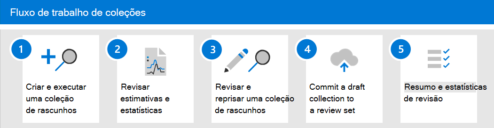

# Saiba mais sobre coleções Advanced eDiscovery

> [!NOTE]
> Estamos implantando uma nova experiência de coleções no Advanced eDiscovery, que está descrito neste artigo. Essa adoção levará algumas semanas antes de estar disponível para todas as organizações. Se a experiência de novas coleções não estiver disponível em sua organização, você ainda poderá coletar conteúdo de caso com a ferramenta Advanced eDiscovery [de pesquisa](create-search-to-collect-data.md).

Quando as organizações enfrentam a coleta de comunicações e conteúdos que podem ser relevantes para uma investigação ou litígio potencial, elas enfrentam um desafio significativo sob as melhores circunstâncias. No local de trabalho moderno de hoje, o volume, a variedade e a velocidade do conteúdo estão habilitando a inovação e o trabalho remoto, além de expandir os requisitos e o processo de gerenciamento de coleções para investigações de Descobertas e Descobertas.

O fluxo de trabalho da coleção apresenta desafios técnicos significativos em torno da extração de conteúdo de locais e fontes nativos. Também é um ponto crítico na avaliação e estratégia para cenários comuns de litígio ou investigações. À medida que as organizações começam a avaliar uma investigação, as primeiras perguntas são sobre quem estava envolvido? Após identificar quem estava envolvido, esses custodiantes podem ser colocados em espera rapidamente para preservar conteúdo relevante. A próxima pergunta é o que aconteceu? Para responder a essa segunda pergunta fundamental de qualquer investigação, os gerentes devem recorrer aos dados. Para avaliar rapidamente o conteúdo mais relevante para a questão do que ocorreu, os gerentes começam a refinar o destino da pergunta para garantir que os resultados da coleção sejam abrangentes sem serem muito amplos.

As coleções em Advanced eDiscovery ajudam os gerentes de Descobertas Digitais a escopo rápido de uma pesquisa de conteúdo em emails, documentos e outros conteúdos em Microsoft 365. As coleções fornecem aos gerentes uma estimativa do conteúdo que pode ser relevante para o caso. Isso permite aos gerentes tomar decisões rápidas e informadas sobre o tamanho e o escopo do conteúdo relevante para um caso. Os gerentes de Descoberta Eletrônico podem criar uma coleção para pesquisar fontes de dados de custodia (como caixas de correio e sites SharePoint) e usando critérios de pesquisa específicos (como palavras-chave e intervalos de data) para definir rapidamente o escopo de sua coleção.

Após a definição da coleção, os gerentes de Descobertas Desprotetivas podem salvar a coleção como rascunho e obter estimativas, incluindo estimativas para volume de dados, os locais de conteúdo que contêm resultados e o número de visitas para a condição de consulta de pesquisa. Essas percepções podem ajudar a informar se a coleção deve ser revisada para restringir ou expandir o escopo da coleção antes de passar para a revisão e analisar estágios no fluxo de trabalho de Descoberta Eletrônico.

Quando o gerente estiver satisfeito com o escopo da coleção e a quantidade estimada de conteúdo  que provavelmente responderá, o gerente poderá adicionar ou comprometer o conteúdo a um conjunto de revisão. Ao comprometer uma coleção a um conjunto de revisão, esse gerente também tem as opções de incluir conversas de chat, anexos de nuvem e versões de documento. O conteúdo na coleção também passa por outro nível de processamento durante a ingestão no conjunto de revisão. e a coleção será atualizada com o resumo final da coleção. Depois que o conteúdo for adicionado ao conjunto de revisão, os gerentes de Descoberta Desdiscovery poderão continuar consultando, agrupando e refinando o conteúdo para ajudar na minimização e revisão. Além disso, a coleção é atualizada com informações e estatísticas sobre o conteúdo comprometido com o conjunto de revisão. Isso fornece uma referência histórica sobre o conteúdo na coleção.

Com a versão de coleções em  um Advanced eDiscovery, a guia Pesquisas foi renomeada para **Coleções** em um caso Advanced eDiscovery no centro de conformidade Microsoft 365 de segurança. As etapas para definir o escopo e o tamanho da coleção seguem o mesmo processo que a pesquisa para definir locais e condições. Salvar como rascunho e obter estimativas de visualização permite a validação rápida do escopo direcionado de coleções antes de comprometer uma pesquisa e uma coleção completa no conjunto de revisão. Isso permite um gerenciamento de trabalho aprimorado e iterações direcionadas para começar a minimizar o conteúdo durante o processo de pesquisa e coleta.

## Fluxo de trabalho de coleções

Para começar a usar coleções Advanced eDiscovery, aqui está um fluxo de trabalho básico e descrições de cada etapa do processo.

1. **Criar e executar uma coleção de rascunho.** A primeira etapa é criar uma coleção de rascunho e definir as fontes de dados custodiais e não custodiais a ser pesquisadas. Você também pode pesquisar outras fontes de dados que não foram adicionadas ao caso. Depois de adicionar as fontes de dados, configure a consulta de pesquisa para pesquisar nas fontes de dados o conteúdo relevante para o caso. Você pode criar palavras-chave, propriedades e condições para criar consultas de pesquisa que retornem conteúdo que provavelmente seja mais relevante para o caso. Para obter mais informações, consulte [Create a draft collection](create-draft-collection.md).

2. **Revisar estimativas e estatísticas.** Depois de criar um conjunto de rascunhos e execute-o, a próxima etapa é exibir estatísticas de coleção para ajudá-lo a verificar se o conteúdo relevante está sendo encontrado e os locais de conteúdo com mais visitas. Você também pode visualizar um exemplo dos resultados da pesquisa para ajudá-lo a determinar se o conteúdo está dentro do escopo da investigação. Para obter mais informações, consulte [Estatísticas e relatórios de coleções de rascunho.](collection-statistics-reports.md#statistics-and-reports-for-draft-collections)

3. **Revise e reprise uma coleção de rascunho.** Com base nas estimativas e estatísticas retornadas pela coleção, você pode editar a coleção de rascunho alterando as fontes de dados pesquisadas e a consulta de pesquisa para expandir ou restringir a coleção. Você pode atualizar e reprisar o conjunto de rascunhos até ter certeza de que a coleção contém o conteúdo mais relevante para seu caso.

4. **Commit a draft collection to a review set**. Quando você estiver satisfeito de que a coleção retorna o tipo de conteúdo relevante para o caso, você pode comprometer a coleção ao conjunto de revisão. Quando você confirma uma coleção, você tem a opção de adicionar threads de conversa, anexos de nuvem e versões de documento ao conjunto de revisão, tudo isso pode ser relevante para o caso. As seguintes coisas ocorrem quando você confirma uma coleção:

   - Itens filho (como anexos de email, assinaturas de email e imagens) são extraídos de um item pai (como uma mensagem de email, mensagem de chat ou documento), indexados (em um processo chamado indexação profunda *)* e adicionados ao conjunto de revisão como arquivos separados.

   - A indexação profunda é executada em itens coletados de fontes de dados adicionais. Esses tipos de fontes de dados são locais de conteúdo diferentes das fontes de dados custodiais e não custodiais adicionadas anteriormente ao caso.

   Para obter mais informações, [consulte Commit a draft collection to a review set](commit-draft-collection.md).

5. **Revise o resumo e as estatísticas da coleção.** Depois que você confirma uma coleção em um conjunto de revisão, as informações sobre a coleção são mantidas, como estatísticas sobre itens extraídos, indexação profunda, a consulta de pesquisa usada para a coleção e os locais de conteúdo de onde os itens foram coletados. Além disso, coleções comprometidas não podem ser editadas ou reprisadas. Você só pode copiá-los ou excluí-los. Preservar coleções fornece um registro histórico dos itens coletados que foram adicionados a um conjunto de revisão. Para obter mais informações, consulte [Estatísticas e relatórios para coleções comprometidas.](collection-statistics-reports.md#statistics-and-reports-for-committed-collections)
