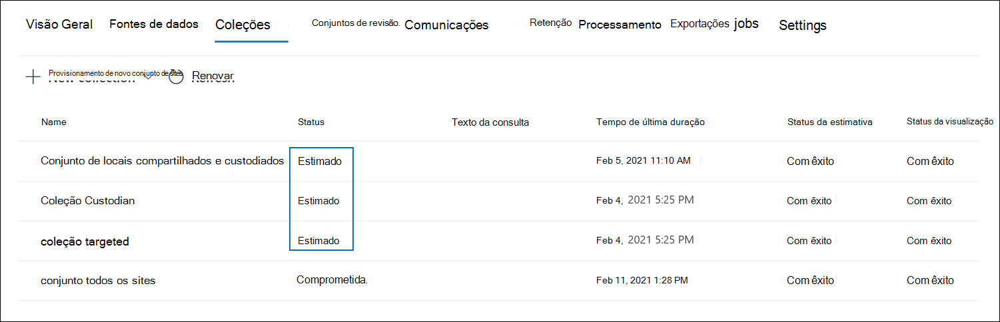

# Commit a draft collection to a review set in Advanced eDiscoveryCommit a draft collection to a review set in Advanced eDiscovery

Quando você estiver satisfeito com os itens coletados em uma coleção de rascunho e estiver pronto para analisar, marcar e revisá-los, você pode adicionar uma coleção a um conjunto de revisão no caso.When you're satisfied with the items you've collected in a draft collection and are ready to analyze, tag, and review them, you can add a collection to a review set in the case. Quando você confirma um conjunto de rascunhos em um conjunto de revisão, os itens coletados são copiados de seu local de conteúdo original no Microsoft 365 para um conjunto de revisão.When you commit a draft collection to a review set, collected items are copied from their original content location in Microsoft 365 to a review set. Um conjunto de revisão é um local de Armazenamento do Azure fornecido pela Microsoft na nuvem da Microsoft.A review set is a secure, Microsoft-provided Azure Storage location in the Microsoft cloud.

## Commit a draft collection to a review setCommit a draft collection to a review set

1. No Centro de conformidade do Microsoft 365, abra o caso  Descoberta Avançada e selecione a guia Coleções para exibir uma lista das coleções no caso.In the Microsoft 365 compliance center, open the Advanced eDiscovery case, and then select the **Collections** tab to display a list of the collections in the case.

   

   > [!TIP]
   > Um valor de `Estimated` na coluna **Status** identifica as coleções de rascunho que podem ser adicionadas a um conjunto de revisão.A value of `Estimated` in the **Status** column identifies the draft collections that can be added to a review set. Um status indica `Committed` que uma coleção já foi adicionada a um conjunto de revisão.A status of `Committed` indicates that a collection has already been added to a review set.

2. Na página **Coleções,** selecione o conjunto de rascunhos que você deseja comprometer com um conjunto de revisão.On the **Collections** page, select the draft collection that you want to commit to a review set.

3. Na parte inferior da página de sobrevoo, selecione **Actions**  >  **Edit collection**.On the bottom of the flyout page, select **Actions** > **Edit collection**.

4. No assistente de edição do conjunto, clique **em Próximo** até que a página Salvar **rascunho ou** coletar seja exibida.In the edit collection wizard, click **Next** until the **Save draft or collect** page is displayed.

5. Defina as seguintes configurações:Configure the following settings:

   1. Selecione **Coletar itens e adicione ao conjunto de revisão**.Select **Collect items and add to review set**.

   2. Decida se deve adicionar a coleção a um novo conjunto de revisão (que é criado depois de enviar a coleção) ou a um conjunto de revisão existente.Decide whether to add the collection to a new review set (which is created after you submit the collection) or to an existing review set. Conclua esta seção com base em sua decisão.Complete this section based on your decision.

   3. Configure as configurações de coleção adicionais:Configure the additional collection settings:

       - Mensagens do Teams e **do Yammer**: selecione essa opção para adicionar threads de conversa à coleção que incluem os itens de chat retornados pela consulta de pesquisa na coleção.**Teams and Yammer messages**: Select this option to add conversation threads to the collection that include the chat items returned by the search query in the collection. Isso significa que a conversa de chat que contém itens que corresponderem aos critérios de pesquisa é reconstruída.This means that the chat conversation that contains items that match the search criteria is reconstructed. Isso permite que você revise itens de chat no contexto da conversa de ida e volta.This lets you review chat items in the context of the back and forth conversation. Para obter mais informações, consulte [Threading de conversa em Descoberta Avançada da Descoberta Pública.](conversation-review-sets.md)For more information, see [Conversation threading in Advanced eDiscovery](conversation-review-sets.md).

       - **Anexos de nuvem**: selecione essa opção para incluir anexos modernos ou arquivos vinculados quando os resultados da coleção são adicionados ao conjunto de revisão.**Cloud attachments**: Select this option to include modern attachments or linked files when the collection results are added to the review set. Isso significa que o arquivo de destino de um anexo moderno ou arquivo vinculado é adicionado ao conjunto de revisão.This means that the target file of a modern attachment or linked file is added to the review set.

       - **Versões do SharePoint**: selecione essa opção para habilitar a coleção de todas as versões de um documento do SharePoint de acordo com os limites de versão e os parâmetros de pesquisa da coleção.**SharePoint versions**: Select this option to enable the collection of all version of a SharePoint document per the version limits and search parameters of the collection. Selecionar essa opção aumentará significativamente o tamanho dos itens adicionados ao conjunto de revisão.Selecting this option will significantly increase the size of items that are added to the review set.

   4. Configure as configurações para definir a escala da coleção a ser acrescentada ao conjunto de revisão:Configure the settings to define the scale of the collection to add to the review set:

      - **Adicionar todos os resultados da coleção**: Selecione essa opção para adicionar todos os itens que corresponderem aos critérios de pesquisa da coleção ao conjunto de revisão.**Add all collection results**: Select this option to add all the items that match the search criteria of the collection to the review set.

      - **Adicione um exemplo dos resultados da** coleção : Selecione essa opção para adicionar um exemplo dos resultados da coleção ao conjunto de revisão em vez de adicionar todos os resultados.**Add a sample of the collection results**: Select this option to add a sample of the collection results to the review set instead of adding all results. Se você selecionar essa opção, clique em **Editar parâmetros de exemplo** e escolha uma das seguintes opções:If you select this option, click **Edit sample parameters** and choose one of the following options:

         - **Exemplo com base na confiança**: os itens da coleção são adicionados ao conjunto de revisão serão determinados pelos parâmetros estatísticos que você definir.**Sample based on confidence**: Items from the collection are added to the review set will be determined by the statistical parameters that you set. Se você normalmente usar um nível de confiança e um intervalo durante a amostragem de resultados, especifique-os nas caixas de seleção.If you typically use a confidence level and interval when sampling results, specify them in the drop-down boxes. Caso contrário, use as configurações padrão.Otherwise, use the default settings.

         - **Exemplo aleatório:** os itens da coleção são adicionados ao conjunto de revisão com base em uma seleção aleatória da porcentagem especificada do número total de itens retornados pela pesquisa.**Randomly sample**: Items from the collection are added to the review set based on a random selection of the specified percentage of the total number of items returned by the search.

6. Na página **Revisar sua coleção,** você pode revisar as configurações de coleção configuradas na página anterior.On the **Review your collection** page, you can review the collection settings that you configured on the previous page. Clique **em Editar** se quiser alterá-los.Click **Edit** if you want to change them.

7. Clique **em Enviar** para criar o conjunto de rascunhos.Click **Submit** to create the draft collection. Uma página é exibida confirmando que a coleção foi criada.A page is displayed confirming that the collection was created.

## O que acontece depois que você confirma um conjunto de rascunhosWhat happens after you commit a draft collection

Quando você confirma um conjunto de rascunhos em um conjunto de revisão, as seguintes coisas ocorrem:When you commit a draft collection to a review set, the following things happen:

- A consulta de pesquisa de coleção é executado novamente.The collection search query is run again. Isso significa que os resultados reais da pesquisa copiados para o conjunto de revisão podem ser diferentes dos resultados estimados que foram retornados quando a pesquisa da coleção foi executado pela última vez.This means the actual search results copied to the review set may be different than the estimated results that were returned when the collection search was last run.

- Todos os itens nos resultados da pesquisa são copiados da fonte de dados original no serviço ao vivo e copiados para um local de Armazenamento seguro do Azure na nuvem da Microsoft.All items in the search results are copied from the original data source in the live service, and copied to a secure Azure Storage location in the Microsoft cloud.

- Todos os itens (incluindo o conteúdo e os metadados) que não estão localizados em fontes de dados custodiadas ou não custodiadas são reindexados (em um processo chamado indexação profunda *)* para que todos os dados no conjunto de revisão sejam totalmente pesquisáveis durante a revisão dos dados de caso.All items (including the content and metadata) that aren't located in custodian or non-custodian data sources are reindexed (in a process called *deep indexing*) so that all data in the review set is fully searchable during the review of the case data. A reindexação do conteúdo em uma coleção resulta em pesquisas completas e rápidas quando você pesquisa ou filtra o conteúdo no conjunto de revisão durante a investigação de caso.Reindexing the content in a collection results in thorough and fast searches when you search or filter the content in the review set during the case investigation.

- Documentos criptografados do SharePoint e do OneDrive e arquivos criptografados anexados mensagens de email retornadas nos resultados da pesquisa são descriptografadas quando você confirma a coleção em um conjunto de revisão.Encrypted SharePoint and OneDrive documents and encrypted files attached email messages that's returned in the search results are decrypted when you commit the collection to a review set. Você pode revisar e consultar os arquivos descriptografados no conjunto de revisão.You can review and query the decrypted files in the review set. Para obter mais informações, consulte [Decryption in Microsoft 365 eDiscovery tools](ediscovery-decryption.md).For more information, see [Decryption in Microsoft 365 eDiscovery tools](ediscovery-decryption.md).

- A funcionalidade de reconhecimento óptico de caracteres (OCR) extrai texto de imagens e inclui o texto da imagem com o conteúdo adicionado a um conjunto de revisão.Optical character recognition (OCR) functionality extracts text from images, and includes the image text with the content that's added to a review set. Para obter mais informações, consulte a seção [Reconhecimento óptico de](#optical-character-recognition) caracteres neste artigo.For more information, see the [Optical character recognition](#optical-character-recognition) section in this article.

- Depois que a confirmação for concluída com êxito, o valor da coluna de status da guia **Coleções** será alterado para `Committed` .After the commit is successfully completed, the value of the status column of on the **Collections** tab is changed to `Committed`.

## Reconhecimento óptico de caracteresOptical character recognition

Quando você confirma uma coleção em um conjunto de revisão, a funcionalidade de reconhecimento óptico de caracteres (OCR) na Descoberta Avançada extrai automaticamente o texto de imagens e inclui o texto da imagem com o conteúdo adicionado a um conjunto de revisão.When you commit a collection to a review set, optical character recognition (OCR) functionality in Advanced eDiscovery automatically extracts text from images, and includes the image text with the content that's added to a review set. Você pode exibir o texto extraído no visualizador de texto do arquivo de imagem selecionado no conjunto de revisão.You can view the extracted text in the Text viewer of the selected image file in the review set. Isso permite que você conduza mais análises e análises sobre o texto em imagens.This lets you conduct further review and analysis on text in images. O OCR é suportado para arquivos soltos, anexos de email e imagens incorporadas.OCR is supported for loose files, email attachments, and embedded images. Para ver uma lista de formatos de arquivo de imagem com suporte para OCR, consulte Tipos de arquivo com suporte [em Descoberta Avançada em Descoberta Eletrônico Avançada](supported-filetypes-ediscovery20.md#image).For a list of image file formats that are supported for OCR, see [Supported file types in Advanced eDiscovery](supported-filetypes-ediscovery20.md#image).

Você precisa habilitar a funcionalidade OCR para cada caso criado na Descoberta Avançada.You have to enable OCR functionality for each case that you create in Advanced eDiscovery. Para obter mais informações, consulte [Configure search and analytics settings](configure-search-and-analytics-settings-in-advanced-ediscovery.md#optical-character-recognition-ocr).For more information, see [Configure search and analytics settings](configure-search-and-analytics-settings-in-advanced-ediscovery.md#optical-character-recognition-ocr).
