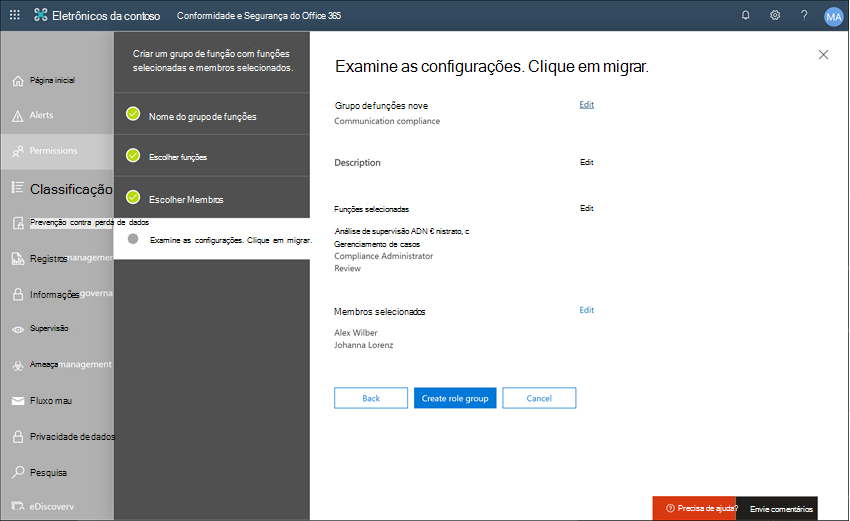

# Estudo de caso-Contoso configura rapidamente uma política de linguagem ofensiva para comunicações do Microsoft Teams, Exchange e YammerCase study - Contoso quickly configures an offensive language policy for Microsoft Teams, Exchange, and Yammer communications

A conformidade de comunicação no Microsoft 365 ajuda a minimizar os riscos de comunicação ajudando você a detectar, capturar e realizar ações de correção para mensagens inadequadas em sua organização.Communication compliance in Microsoft 365 helps minimize communication risks by helping you detect, capture, and take remediation actions for inappropriate messages in your organization. As políticas predefinidas e personalizadas permitem que você examine as comunicações internas e externas para correspondências de política, de modo que eles possam ser examinados por revisores designados.Pre-defined and custom policies allow you to scan internal and external communications for policy matches so they can be examined by designated reviewers. Os revisores podem investigar emails varridos, Microsoft Teams, Yammer ou comunicações de terceiros em sua organização e tomar as ações de correção apropriadas para garantir que eles estejam em conformidade com os padrões de mensagem da sua organização.Reviewers can investigate scanned email, Microsoft Teams, Yammer, or third-party communications in your organization and take appropriate remediation actions to make sure they're compliant with your organization's message standards.

A Contoso Corporation é uma organização fictícia que precisa configurar rapidamente uma política para monitorar a linguagem ofensiva.The Contoso Corporation is a fictional organization that needs to quickly configure a policy to monitor for offensive language. Eles usaram o Microsoft 365 primariamente para email, Microsoft Teams e suporte do Yammer para seus funcionários, mas têm novos requisitos para impor a política da empresa contra assédio no local de trabalho.They have been using Microsoft 365 primarily for email, Microsoft Teams, and Yammer support for their employees but have new requirements to enforce company policy around workplace harassment. Os administradores de ti e especialistas de ti da Contoso têm uma compreensão básica dos conceitos básicos do trabalho com a Microsoft 365 e procuram orientações de ponta a ponta sobre como começar rapidamente a conformidade de comunicação.Contoso IT administrators and compliance specialists have a basic understanding of the fundamentals of working with Microsoft 365 and are looking for end-to-end guidance for how to quickly get started with communication compliance.

Este estudo de caso abordará as noções básicas para configurar rapidamente uma política de conformidade de comunicação para monitorar a comunicação de linguagens ofensivas.This case study will cover the basics for quickly configuring a communication compliance policy to monitor communications for offensive language. Este guia inclui:This guidance includes:

- Etapa 1-planejando a conformidade de comunicaçãoStep 1 - Planning for communication compliance
- Etapa 2: acessando a conformidade de comunicação no Microsoft 365Step 2 - Accessing communication compliance in Microsoft 365
- Etapa 3: configurar os pré-requisitos e criar uma política de conformidade de comunicaçãoStep 3 - Configuring prerequisites and creating a communication compliance policy
- Etapa 4-investigação e correção de alertasStep 4 - Investigation and remediation of alerts

## Etapa 1: planejamento da conformidade de comunicaçãoStep 1: Planning for communication compliance

Os administradores de ti e especialistas de ti da Contoso participaram online do webinars sobre soluções de conformidade no Microsoft 365 e decidiram que as políticas de conformidade de comunicação o ajudarão a atender aos requisitos de política corporativa atualizadas para reduzir o assédio do trabalho.Contoso IT administrators and compliance specialists attended online webinars about compliance solutions in Microsoft 365 and decided that communication compliance policies will help them meet the updated corporate policy requirements for reducing workplace harassment. Trabalhando juntos, desenvolveram um plano para criar e habilitar uma política de conformidade de comunicação que irá monitorar a linguagem ofensiva para chats enviados no Microsoft Teams, mensagens privadas e conversas da Comunidade no Yammer e em mensagens de email enviadas no Exchange Online.Working together, they've developed a plan to create and enable a communication compliance policy that will monitor for offensive language for chats sent in Microsoft Teams, private messages and community conversations in Yammer, and in email messages sent in Exchange Online. O plano inclui a identificação:Their plan includes identifying:

- Os administradores de ti que precisam acessar os recursos de conformidade de comunicação.The IT administrators that need access to communication compliance features.
- Os especialistas de conformidade que precisam criar e gerenciar políticas de comunicação.The compliance specialists that need to create and manage communication policies.
- Os especialistas de conformidade e outros colegas de outros departamentos (recursos humanos, jurídico, etc.) que precisam investigar e corrigir os alertas de conformidade de comunicação.The compliance specialists and other colleague in other departments (Human Resources, Legal, etc.) that need to investigate and remediate communication compliance alerts.
- Os usuários que serão dentro do escopo da política de linguagem ofensiva de conformidade de comunicação.The users that will be in-scope for the communication compliance offensive language policy.

### LicençasLicensing

A primeira etapa é confirmar que o licenciamento do Microsoft 365 da Contoso inclui suporte para a solução de conformidade de comunicação.The first step is to confirm that Contoso's Microsoft 365 licensing includes support for the communication compliance solution. Para acessar e usar a conformidade de comunicação, os administradores de ti da Contoso precisam verificar se a contoso tem uma das seguintes opções:To access and use communication compliance, Contoso IT administrators need to verify that Contoso has one of the following:

- Assinatura do Microsoft 365 E5 (versão paga ou de avaliação)Microsoft 365 E5 subscription (paid or trial version)
- Assinatura do Microsoft 365 E3 + o complemento de conformidade do Microsoft 365 e5Microsoft 365 E3 subscription + the Microsoft 365 E5 Compliance add-on
- Assinatura do Microsoft 365 E3 + o complemento de gerenciamento de risco do Microsoft 365 E5 InsiderMicrosoft 365 E3 subscription + the Microsoft 365 E5 Insider Risk Management add-on
- Assinatura do Microsoft 365 a5 (versão paga ou de avaliação)Microsoft 365 A5 subscription (paid or trial version)
- Assinatura do 365 a3 + o complemento de conformidade do Microsoft 365 a5Microsoft 365 A3 subscription + the Microsoft 365 A5 Compliance add-on
- Assinatura do 365 a3 + o complemento de gerenciamento de risco Microsoft 365 a5 InsiderMicrosoft 365 A3 subscription + the Microsoft 365 A5 Insider Risk Management add-on
- Assinatura do Microsoft 365 G5 (versão paga ou de avaliação)Microsoft 365 G5 subscription (paid or trial version)
- Assinatura do Microsoft 365 G5 + o suplemento de conformidade do Microsoft 365 G5Microsoft 365 G5 subscription + the Microsoft 365 G5 Compliance add-on
- Assinatura do Microsoft 365 G5 + o complemento de gerenciamento de risco do Microsoft 365 G5 InsiderMicrosoft 365 G5 subscription + the Microsoft 365 G5 Insider Risk Management add-on
- Assinatura do Office 365 Enterprise E5 (versão paga ou de avaliação)Office 365 Enterprise E5 subscription (paid or trial version)
- Assinatura do Office 365 Enterprise E3 + o complemento avançado de conformidade do Office 365 (não está mais disponível para novas assinaturas, consulte observação)Office 365 Enterprise E3 subscription + the Office 365 Advanced Compliance add-on (no longer available for new subscriptions, see note)

Eles também devem confirmar se os usuários incluídos nas políticas de conformidade de comunicação devem receber uma das licenças acima.They must also confirm that users included in communication compliance policies must be assigned one of the licenses above.

>[!IMPORTANT]
>O Office 365 Advanced Compliance não é mais vendido como uma assinatura autônoma.Office 365 Advanced Compliance is no longer sold as a standalone subscription. Quando as assinaturas atuais expiram, os clientes devem fazer a transição para uma das assinaturas acima, que contêm o mesmo ou outros recursos de conformidade.When current subscriptions expire, customers should transition to one of the subscriptions above, which contain the same or additional compliance features.

Os administradores de ti da Contoso usam as seguintes etapas para verificar o suporte de licenciamento para contoso:Contoso IT administrators take the following steps to verify the licensing support for Contoso:

1. Os administradores de ti entram no **centro de administração do Microsoft 365** [( https://admin.microsoft.com) ](https://admin.microsoft.com) e acesse as licenças de cobrança do **centro de administração do Microsoft 365**  >  **Billing**  >  **Licenses**.IT administrators sign in to the **Microsoft 365 admin center** [(https://admin.microsoft.com)](https://admin.microsoft.com) and navigate to **Microsoft 365 admin center** > **Billing** > **Licenses**.

2. Aqui eles confirmam que têm uma das [Opções de licença](https://docs.microsoft.com/microsoft-365/compliance/communication-compliance-configure?view=o365-worldwide#before-you-begin) que incluem o suporte para conformidade de comunicação.Here they confirm that they have one of the [license options](https://docs.microsoft.com/microsoft-365/compliance/communication-compliance-configure?view=o365-worldwide#before-you-begin) that includes support for communication compliance.

### Permissões para conformidade de comunicaçãoPermissions for communication compliance

Por padrão, os administradores globais não têm acesso aos recursos de conformidade de comunicação.By default, Global Administrators do not have access to communication compliance features. [As permissões devem ser configuradas](https://docs.microsoft.com/microsoft-365/compliance/communication-compliance-configure?view=o365-worldwide#step-1-required-enable-permissions-for-communication-compliance) para que os administradores de ti e especialistas de conformidade da Contoso tenham acesso à conformidade de comunicação.[Permissions must be configured](https://docs.microsoft.com/microsoft-365/compliance/communication-compliance-configure?view=o365-worldwide#step-1-required-enable-permissions-for-communication-compliance) so that Contoso IT administrators and compliance specialists have access to communication compliance.

1. Os administradores de ti da Contoso entram na página permissões do **centro de conformidade e segurança do Office 365** [( https://protection.office.com/permissions) ](https://protection.office.com/permissions) usando credenciais para uma conta de administrador global e selecionam o link para exibir e gerenciar funções no Microsoft 365.Contoso IT administrators sign into the **Office 365 Security and Compliance center** permissions page [(https://protection.office.com/permissions)](https://protection.office.com/permissions) using credentials for a global administrator account and select the link to view and manage roles in Microsoft 365.
2. Após selecionar **Create**, eles dão ao novo grupo de funções um nome amigável de "*conformidade de comunicação*" e selecione **Avançar**.After selecting **Create**, they give the new role group a friendly name of "*Communication compliance*" and select **Next**.
3. Selecione **escolher funções** e, em seguida, selecione **Adicionar**.They select **Choose roles** and then select **Add**. Eles adicionam as funções necessárias marcando a caixa de seleção para o *administrador de análise de supervisão*, o gerenciamento de *casos*, o *administrador de conformidade*e a *revisão*, selecionando **Adicionar**, **concluído** e **Avançar**.They add the required roles by selecting the checkbox for *Supervisory Review Administrator*, *Case Management*, *Compliance Administrator*, and *Review*, then they select **Add**, **Done,** and **Next**.

4. Em seguida, os administradores de ti selecionam **escolher Membros** e, em seguida, selecionar **Adicionar**.Next, the IT administrators select **Choose members** then select **Add**. A caixa de seleção Marcar para todos os usuários e grupos que desejam criar políticas e gerenciar mensagens com correspondências de política.The select the checkbox for all the users and groups that they want to create policies and manage messages with policy matches. Eles adicionam os administradores de ti, especialistas de conformidade e outros colegas em recursos humanos e departamentos jurídicos identificados no planejamento inicial e, em seguida, selecione **Adicionar**, **concluir**e **Avançar**.They add the IT administrators, compliance specialists, and other colleagues in Human Resources and Legal departments that they identified in the initial planning, then select **Add**, **Done**, and **Next**.
5. Para finalizar as permissões, os administradores de ti selecionam **Criar grupo de função** para terminar.To finalize the permissions, the IT administrators select **Create role group** to finish. Levará cerca de 30 minutos para que as funções sejam eficazes no Microsoft 365 Service da contoso.It will take about 30 minutes for the roles to be effective in Contoso's Microsoft 365 service.

## Etapa 2: acessar a conformidade de comunicação no Microsoft 365Step 2: Accessing communication compliance in Microsoft 365

Após configurar as permissões para conformidade de comunicação, os administradores de ti da Contoso e especialistas de conformidade definidos no novo grupo de função podem acessar a solução de conformidade de comunicação no Microsoft 365.After configuring the permissions for communication compliance, Contoso IT administrators and compliance specialists defined in the new role group can access the communication compliance solution in Microsoft 365. Os administradores de ti e especialistas de conformidade da Contoso têm várias maneiras de acessar a conformidade de comunicação e começar a criar uma nova política:Contoso IT administrators and compliance specialists have several ways to access communication compliance and get started creating a new policy:

- Início direto da solução de conformidade de comunicaçãoStarting directly from the communication compliance solution
- A partir do centro de conformidade da Microsoft 365Starting from the Microsoft 365 compliance center
- A partir do catálogo de soluções do Microsoft 365Starting from the Microsoft 365 solution catalog
- A partir do centro de administração do Microsoft 365Starting from the Microsoft 365 admin center

### Início direto da solução de conformidade de comunicaçãoStarting directly from the communication compliance solution

A maneira mais rápida de acessar a solução é entrar diretamente na solução de **conformidade de comunicação** ( <https://compliance.microsoft.com/supervisoryreview> ).The quickest way to access the solution is to sign in directly to the **Communication compliance** (<https://compliance.microsoft.com/supervisoryreview>) solution. Usando este link, os administradores de ti da Contoso e especialistas de conformidade serão direcionados para o painel de visão geral da conformidade de comunicação, onde você pode examinar rapidamente o status de alertas e criar novas políticas a partir dos modelos predefinidos.Using this link, Contoso IT administrators and compliance specialists will be directed to the communication compliance Overview dashboard where you can quickly review the status of alerts and create new policies from the pre-defined templates.

### A partir do centro de conformidade da Microsoft 365Starting from the Microsoft 365 compliance center

Outra maneira fácil para os administradores de ti e especialistas de ti da Contoso acessar a solução de conformidade de comunicação é entrar diretamente no **centro de conformidade da Microsoft 365** [ https://compliance.microsoft.com) (](https://compliance.microsoft.com).Another easy way for Contoso IT administrators and compliance specialists to access the communication compliance solution is to sign in directly to the **Microsoft 365 compliance center** [(https://compliance.microsoft.com)](https://compliance.microsoft.com). Após entrar, os usuários simplesmente precisam selecionar o controle **Mostrar todos** para exibir todas as soluções de conformidade e, em seguida, selecionar a solução de **conformidade de comunicação** para começar.After signing in, users simply need to select the **Show all** control to display all the compliance solutions and then select the **Communication compliance** solution to get started.

### A partir do catálogo de soluções do Microsoft 365Starting from the Microsoft 365 solution catalog

Os administradores de ti e especialistas de conformidade da Contoso também podem optar por acessar a solução de conformidade de comunicação selecionando o catálogo de soluções do Microsoft 365.Contoso IT administrators and compliance specialists could also choose to access the communication compliance solution by selecting the Microsoft 365 solution catalog. Ao selecionar **Catálogo** na seção **soluções** da navegação à esquerda enquanto estiver no **centro de conformidade do Microsoft 365**, eles podem abrir o catálogo de soluções listando todas as soluções de conformidade da Microsoft 365.By selecting **Catalog** in **Solutions** section of the left navigation while in the **Microsoft 365 compliance center**, they can open the solution catalog listing all Microsoft 365 compliance solutions. Rolar para baixo até a seção **Gerenciamento de riscos do insider** , os administradores de ti da Contoso podem selecionar a conformidade de comunicação para começar.Scrolling down to the **Insider risk management** section, Contoso IT administrators can select Communication compliance to get started. Os administradores de ti da Contoso também decidem usar o controle show no Navigation para fixar a solução de conformidade de comunicação ao painel de navegação à esquerda para obter acesso rápido quando entrarem no futuro.Contoso IT administrators also decide to use the Show in navigation control to pin the communication compliance solution to the left-navigation pane for quicker access when they sign in going forward.

### A partir do centro de administração do Microsoft 365Starting from the Microsoft 365 admin center

Para acessar a conformidade de comunicação ao iniciar pelo centro de administração do Microsoft 365, os administradores de ti e especialistas de conformidade da Contoso entram no centro de administração do Microsoft 365 [( https://admin.microsoft.com) ](https://admin.microsoft.com) e navegue até a conformidade do **centro de administração do Microsoft 365**  >  **Compliance**.To access communication compliance when starting from the Microsoft 365 admin center, Contoso IT administrators and compliance specialists sign in to the Microsoft 365 admin center [(https://admin.microsoft.com)](https://admin.microsoft.com) and navigate to **Microsoft 365 admin center** > **Compliance**.

Isso abre o **centro de conformidade e segurança do Office 365**e deve selecionar o link para o **centro de conformidade da Microsoft 365** fornecido na faixa na parte superior da página.This opens the **Office 365 Security and Compliance center**, and they must select the link to the **Microsoft 365 compliance center** provided in the banner at the top of the page.

No centro de **conformidade da Microsoft 365**, os administradores de ti da Contoso selecionam **Mostrar tudo** para exibir a lista completa de soluções de conformidade.Once in the **Microsoft 365 compliance center**, Contoso IT administrators select **Show all** to display the full list of compliance solutions.

Depois de selecionar **Mostrar tudo**, os administradores de ti da Contoso podem acessar a solução de conformidade de comunicação.After selecting **Show all**, the Contoso IT administrators can access the communication compliance solution.

## Etapa 3: configurar os pré-requisitos e criar uma política de conformidade de comunicaçãoStep 3: Configuring prerequisites and creating a communication compliance policy

Para começar a usar uma política de conformidade de comunicação, há vários pré-requisitos que os administradores de ti da Contoso precisam configurar antes de configurar a nova política para monitorar a linguagem ofensiva.To get started with a communication compliance policy, there are several prerequisites that Contoso IT administrators need to configure before setting up the new policy to monitor for offensive language. Após estes pré-requisitos terem sido concluídos, os administradores de ti e especialistas de ti da Contoso podem configurar a nova política e os especialistas de conformidade podem começar a investigar e corrigir qualquer alerta gerado.After these prerequisites have been completed, Contoso IT administrators and compliance specialists can configure the new policy and compliance specialists can start investigation and remediating any generated alerts.

### Habilitando a auditoria no Microsoft 365Enabling auditing in Microsoft 365

A conformidade com comunicações requer logs de auditoria para mostrar alertas e rastrear ações de correção realizadas por revisores.Communication compliance requires audit logs to show alerts and track remediation actions taken by reviewers. Os logs de auditoria são um resumo de todas as atividades associadas a uma política organizacional definida ou sempre que houver uma alteração em uma política de conformidade de comunicação.The audit logs are a summary of all activities associated with a defined organizational policy or anytime there is a change to a communication compliance policy.

Os administradores de ti da Contoso analisam e concluem as [instruções passo a passo](https://docs.microsoft.com/microsoft-365/compliance/turn-audit-log-search-on-or-off) para ativar a auditoria.Contoso IT administrators review and complete the [step-by-step instructions](https://docs.microsoft.com/microsoft-365/compliance/turn-audit-log-search-on-or-off) to turn on auditing. Depois de ativar a auditoria, uma mensagem é exibida dizendo que o log de auditoria está sendo preparado e que eles podem executar uma pesquisa em algumas horas após a conclusão da preparação.After they turn on auditing, a message is displayed that says the audit log is being prepared and that they can run a search in a couple of hours after the preparation is complete. Os administradores de ti da Contoso têm que executar esta ação apenas uma vez.The Contoso IT administrators only have to do this action once.

### Configurando o locatário do Yammer para o modo nativoConfiguring Yammer tenant for Native Mode

A conformidade com comunicações exige que o locatário do Yammer de uma organização esteja no modo nativo para monitorar a linguagem ofensiva em mensagens privadas e conversas da Comunidade pública.Communication compliance requires that the Yammer tenant for an organization is in Native Mode to monitor for offensive language in private messages and public community conversations.

Os administradores de ti da Contoso garantem a análise das informações no [tópico Visão geral do modo nativo do Yammer no Microsoft 365](https://docs.microsoft.com/yammer/configure-your-yammer-network/overview-native-mode) e seguem as etapas para executar a ferramenta de migração no tópico [configurar sua rede do Yammer para o modo nativo para o Microsoft 365](https://docs.microsoft.com/yammer/configure-your-yammer-network/native-mode) .Contoso IT administrators make sure they review the information in the [Overview of Yammer Native Mode in Microsoft 365 topic](https://docs.microsoft.com/yammer/configure-your-yammer-network/overview-native-mode) and follow the steps for running the migration tool in the [Configure your Yammer network for Native Mode for Microsoft 365](https://docs.microsoft.com/yammer/configure-your-yammer-network/native-mode) topic.

### Configurando um grupo para usuários dentro do escopoSetting up a group for in-scope users

Os especialistas de conformidade da Contoso desejam adicionar todos os funcionários à política de comunicação que monitorará a linguagem ofensiva.Contoso compliance specialists want to add all employee to the communication policy that will monitor for offensive language. Eles podem decidir adicionar cada conta de usuário de funcionário à política separadamente, mas elas decidiram ser muito mais fáceis e poupa muito tempo para usar um grupo de distribuição de **todos os funcionários** para os usuários desta política.They could decide to add each employee user account to the policy separately, but they've decided it is much easier and saves a lot of time to use an **All Employees** distribution group for the users for this policy.

Eles precisam criar um novo grupo para incluir todos os funcionários da Contoso, de modo que eles siga as seguintes etapas:They need to create a new group to include all Contoso employees, so they take the following steps:

1. Os administradores de ti da Contoso entram no **centro de administração do Microsoft 365** [( https://admin.microsoft.com) ](https://admin.microsoft.com) e navegue até grupos de grupos **do centro de administração do Microsoft 365**  >  **Groups**  >  **Groups**.Contoso IT administrators IT sign in to the **Microsoft 365 admin center** [(https://admin.microsoft.com)](https://admin.microsoft.com) and navigate to **Microsoft 365 admin center** > **Groups** > **Groups**.
2. Selecione **Adicionar um grupo** e conclua o assistente para criar um novo grupo ou grupo de *distribuição* *do Microsoft 365* .They select **Add a group** and complete the wizard to create a new *Microsoft 365 group* or *Distribution group*.

3. Depois que o novo grupo é criado, ele precisa adicionar todos os usuários da Contoso ao novo grupo.After the new group is created, they need to add all Contoso users to the new group. Eles abrem o **centro de administração do Exchange** [( https://outlook.office365.com/ecp) ](https://outlook.office365.com/ecp) e navegam para **Exchange admin center**  >  **os**  >  **grupos**destinatários do centro de administração do Exchange.They open the **Exchange admin center** [(https://outlook.office365.com/ecp)](https://outlook.office365.com/ecp) and navigate to **Exchange admin center** > **recipients** > **groups**. Os administradores de ti da Contoso selecionam a área de associação e o grupo novo *todos os funcionários* que criaram e selecionam o controle **Editar** para adicionar todos os funcionários da Contoso ao novo grupo no assistente.The Contoso IT administrators select the Membership area and the new *All Employees* group they created and select the **Edit** control to add all Contoso employees to the new group in the wizard.

### Criando a política para monitorar a linguagem ofensivaCreating the policy to monitor for offensive language

Com todos os pré-requisitos concluídos, os administradores de ti e os especialistas de conformidade da Contoso estão prontos para configurar a política de conformidade de comunicação para monitorar a linguagem ofensiva.With all the prerequisites completed, the IT administrators and the compliance specialists for Contoso are ready to configure the communication compliance policy to monitor for offensive language. Usando o novo modelo de política de linguagem ofensiva, a configuração dessa política é simples e rápida.Using the new offensive language policy template, configuring this policy is simple and quick.

1. Os administradores de ti e especialistas de conformidade da Contoso entram no **centro de conformidade da Microsoft 365** e selecionam **conformidade de comunicação** no painel de navegação à esquerda.The Contoso IT administrators and compliance specialists sign into the **Microsoft 365 compliance center** and select **Communication compliance** from the left navigation pane. Essa ação abre o painel **visão geral** que tem links rápidos para modelos de política de conformidade de comunicação.This action opens the **Overview** dashboard that has quick links for communication compliance policy templates. Escolha o **Monitor para o modelo de linguagem ofensiva** selecionando **introdução** para o modelo.They choose the **Monitor for offensive language** template by selecting **Get started** for the template.

2. No assistente de modelo de política, os administradores de ti e especialistas de conformidade da Contoso trabalham em conjunto para concluir os três campos obrigatórios: **nome da política**, **usuários ou grupos para supervisionar**e **revisores**.On the policy template wizard, the Contoso IT administrators and compliance specialists work together to complete the three required fields: **Policy name**, **Users or groups to supervise**, and **Reviewers**.
3. Como o assistente de política já sugeriu um nome para a política, os administradores de ti e especialistas de conformidade decidem manter o nome sugerido e se concentrar nos campos restantes.Since the policy wizard has already suggested a name for the policy, the IT administrators and compliance specialists decide to keep the suggested name and focus on the remaining fields. Eles selecionam o grupo *todos os funcionários* dos **usuários ou grupos a serem supervisionados** e selecionam os especialistas de conformidade que devem investigar e corrigir os alertas de política para o campo **revisores** .They select the *All employees* group for the **Users or groups to supervise** field and select the compliance specialists that should investigate and remediate policy alerts for the **Reviewers** field. A última etapa para configurar a política e iniciar a coleta de informações de alerta é selecionar **criar política**.The last step to configure the policy and start gathering alert information is to select **Create policy**.

## Etapa 4: investigar e corrigir alertasStep 4: Investigate and remediate alerts

Agora que a política de conformidade de comunicação para monitorar a linguagem ofensiva está configurada, a próxima etapa para os especialistas de conformidade da Contoso será investigar e corrigir todos os alertas gerados pela política.Now that the communication compliance policy to monitor for offensive language is configured, the next step for the Contoso compliance specialists will be to investigate and remediate any alerts generated by the policy. Levará até 24 horas para que a política processe completamente as comunicações em todos os canais de origem de comunicação e para que os alertas sejam exibidos no **painel de alerta**.It will take up to 24 hours for the policy to fully process communications in all the communication source channels and for alerts to show up in the **Alert dashboard**.

Após a geração dos alertas, os especialistas de conformidade da Contoso seguirão as [instruções do fluxo de trabalho](https://docs.microsoft.com/microsoft-365/compliance/communication-compliance-investigate-remediate) para investigar e corrigir problemas de idioma ofensivo.After alerts are generated, Contoso compliance specialists will follow the [workflow instructions](https://docs.microsoft.com/microsoft-365/compliance/communication-compliance-investigate-remediate) to investigate and remediate offensive language issues.