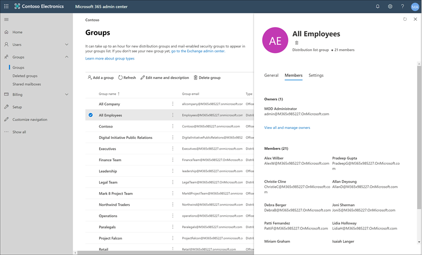

# Estudo de caso-Contoso configura rapidamente uma política de idioma ofensiva para o Microsoft Teams e comunicações do Exchange

A conformidade de comunicação no Microsoft 365 ajuda a minimizar os riscos de comunicação ajudando você a detectar, capturar e realizar ações de correção para mensagens inadequadas em sua organização. As políticas predefinidas e personalizadas permitem que você examine as comunicações internas e externas para correspondências de política, de modo que eles possam ser examinados por revisores designados. Os revisores podem investigar emails varridos, Microsoft Teams ou comunicações de terceiros em sua organização e tomar ações de correção apropriadas para garantir que eles estejam em conformidade com os padrões de mensagem da sua organização.

A Contoso Corporation é uma organização fictícia que precisa configurar rapidamente uma política para monitorar a linguagem ofensiva. Eles usaram o Microsoft 365 primariamente para o suporte a emails e Microsoft Teams para seus funcionários, mas têm novos requisitos para impor a política da empresa contra assédio no local de trabalho. Os administradores de ti e especialistas de ti da Contoso têm uma compreensão básica dos conceitos básicos do trabalho com a Microsoft 365 e procuram orientações de ponta a ponta sobre como começar rapidamente a conformidade de comunicação.

Este estudo de caso abordará as noções básicas para configurar rapidamente uma política de conformidade de comunicação para monitorar a comunicação de linguagens ofensivas. Este guia inclui:

- Etapa 1-planejando a conformidade de comunicação
- Etapa 2: acessando a conformidade de comunicação no Microsoft 365
- Etapa 3: configurar os pré-requisitos e criar uma política de conformidade de comunicação
- Etapa 4-investigação e correção de alertas

## Etapa 1-planejando a conformidade de comunicação

Os administradores de ti e especialistas de ti da Contoso participaram online do webinars sobre soluções de conformidade no Microsoft 365 e decidiram que as políticas de conformidade de comunicação o ajudarão a atender aos requisitos de política corporativa atualizadas para reduzir o assédio do trabalho. Trabalhando juntos, eles desenvolveram um plano para criar e habilitar uma política de conformidade de comunicação que irá monitorar a linguagem ofensiva para chats enviados no Microsoft Teams em mensagens de email enviadas no Exchange Online. O plano inclui a identificação:

- Os administradores de ti que precisam acessar os recursos de conformidade de comunicação.
- Os especialistas de conformidade que precisam criar e gerenciar políticas de comunicação.
- Os especialistas de conformidade e outros colegas de outros departamentos (recursos humanos, jurídico, etc.) que precisam investigar e corrigir os alertas de conformidade de comunicação.
- Os usuários que serão dentro do escopo da política de linguagem ofensiva de conformidade de comunicação.

### Licenças

A primeira etapa é confirmar que o licenciamento do Microsoft 365 da Contoso inclui suporte para a solução de conformidade de comunicação. Para acessar e usar a conformidade de comunicação, os administradores de ti da Contoso precisam verificar se a contoso tem uma das seguintes opções:

- Assinatura do Microsoft 365 E5 (versão paga ou de avaliação)
- Assinatura do Microsoft 365 E3 + o complemento de conformidade do Microsoft 365 e5
- Assinatura do Microsoft 365 E3 + o complemento de gerenciamento de risco do Microsoft 365 E5 Insider
- Assinatura do Microsoft 365 a5 (versão paga ou de avaliação)
- Assinatura do 365 a3 + o complemento de conformidade do Microsoft 365 a5
- Assinatura do 365 a3 + o complemento de gerenciamento de risco Microsoft 365 a5 Insider
- Assinatura do Microsoft 365 G5 (versão paga ou de avaliação)
- Assinatura do Microsoft 365 G5 + o suplemento de conformidade do Microsoft 365 G5
- Assinatura do Microsoft 365 G5 + o complemento de gerenciamento de risco do Microsoft 365 G5 Insider
- Assinatura do Office 365 Enterprise E5 (versão paga ou de avaliação)
- Assinatura do Office 365 Enterprise E3 + o complemento avançado de conformidade do Office 365 (não está mais disponível para novas assinaturas, consulte observação)

Eles também devem confirmar se os usuários incluídos nas políticas de conformidade de comunicação devem receber uma das licenças acima.

>[!IMPORTANT]
>O Office 365 Advanced Compliance não é mais vendido como uma assinatura autônoma. Quando as assinaturas atuais expiram, os clientes devem fazer a transição para uma das assinaturas acima, que contêm o mesmo ou outros recursos de conformidade.

Os administradores de ti da Contoso usam as seguintes etapas para verificar o suporte de licenciamento para contoso:

1. Os administradores de ti entram no **centro de administração do Microsoft 365** [(https://admin.microsoft.com) ](https://admin.microsoft.com) e acesse as**licenças**de > **cobrança** > do **centro de administração do Microsoft 365**.

2. Aqui eles confirmam que têm uma das [Opções de licença](https://docs.microsoft.com/microsoft-365/compliance/communication-compliance-configure?view=o365-worldwide#before-you-begin) que incluem o suporte para conformidade de comunicação.

### Permissões para conformidade de comunicação

Por padrão, os administradores globais não têm acesso aos recursos de conformidade de comunicação. [As permissões devem ser configuradas](https://docs.microsoft.com/microsoft-365/compliance/communication-compliance-configure?view=o365-worldwide#step-1-required-enable-permissions-for-communication-compliance) para que os administradores de ti e especialistas de conformidade da Contoso tenham acesso à conformidade de comunicação.

1. Os administradores de ti da Contoso entram na página permissões do **centro de conformidade e segurança do Office 365** [(https://protection.office.com/permissions) ](https://protection.office.com/permissions) usando credenciais para uma conta de administrador global e selecionam o link para exibir e gerenciar funções no Microsoft 365.
2. Após selecionar **Create**, eles dão ao novo grupo de funções um nome amigável de "*conformidade de comunicação*" e selecione **Avançar**.
3. Selecione **escolher funções** e, em seguida, selecione **Adicionar**. Eles adicionam as funções necessárias marcando a caixa de seleção para o *administrador de análise de supervisão*, o gerenciamento de *casos*, o *administrador de conformidade*e a *revisão*, selecionando **Adicionar**, **concluído** e **Avançar**.

4. Em seguida, os administradores de ti selecionam **escolher Membros** e, em seguida, selecionar **Adicionar**. A caixa de seleção Marcar para todos os usuários e grupos que desejam criar políticas e gerenciar mensagens com correspondências de política. Eles adicionam os administradores de ti, especialistas de conformidade e outros colegas em recursos humanos e departamentos jurídicos identificados no planejamento inicial e, em seguida, selecione **Adicionar**, **concluir**e **Avançar**.
5. Para finalizar as permissões, os administradores de ti selecionam **Criar grupo de função** para terminar. Levará cerca de 30 minutos para que as funções sejam eficazes no Microsoft 365 Service da contoso.

## Etapa 2: acessando a conformidade de comunicação no Microsoft 365

Após configurar as permissões para conformidade de comunicação, os administradores de ti da Contoso e especialistas de conformidade definidos no novo grupo de função podem acessar a solução de conformidade de comunicação no Microsoft 365. Os administradores de ti e especialistas de conformidade da Contoso têm várias maneiras de acessar a conformidade de comunicação e começar a criar uma nova política:

- Início direto da solução de conformidade de comunicação
- A partir do centro de conformidade da Microsoft 365
- A partir do catálogo de soluções do Microsoft 365
- A partir do centro de administração do Microsoft 365

### Início direto da solução de conformidade de comunicação

A maneira mais rápida de acessar a solução é entrar diretamente na solução de **conformidade de comunicação** (<https://compliance.microsoft.com/supervisoryreview>). Usando este link, os administradores de ti da Contoso e especialistas de conformidade serão direcionados para o painel de visão geral da conformidade de comunicação, onde você pode examinar rapidamente o status de alertas e criar novas políticas a partir dos modelos predefinidos.

### A partir do centro de conformidade da Microsoft 365

Outra maneira fácil para os administradores de ti e especialistas de ti da Contoso acessar a solução de conformidade de comunicação é entrar diretamente no **centro de conformidade da Microsoft 365** [https://compliance.microsoft.com)(](https://compliance.microsoft.com). Após entrar, os usuários simplesmente precisam selecionar o controle **Mostrar todos** para exibir todas as soluções de conformidade e, em seguida, selecionar a solução de **conformidade de comunicação** para começar.

### A partir do catálogo de soluções do Microsoft 365

Os administradores de ti e especialistas de conformidade da Contoso também podem optar por acessar a solução de conformidade de comunicação selecionando o catálogo de soluções do Microsoft 365. Ao selecionar **Catálogo** na seção **soluções** da navegação à esquerda enquanto estiver no **centro de conformidade do Microsoft 365**, eles podem abrir o catálogo de soluções listando todas as soluções de conformidade da Microsoft 365. Rolar para baixo até a seção **Gerenciamento de riscos do insider** , os administradores de ti da Contoso podem selecionar a conformidade de comunicação para começar. Os administradores de ti da Contoso também decidem usar o controle show no Navigation para fixar a solução de conformidade de comunicação ao painel de navegação à esquerda para obter acesso rápido quando entrarem no futuro.

### A partir do centro de administração do Microsoft 365

Para acessar a conformidade de comunicação ao iniciar pelo centro de administração do Microsoft 365, os administradores de ti e especialistas de conformidade da Contoso entram no centro de administração do Microsoft 365 [https://admin.microsoft.com) (](https://admin.microsoft.com) e navegue até a > **conformidade**do **centro de administração do Microsoft 365**.

Isso abre o **centro de conformidade e segurança do Office 365**e deve selecionar o link para o **centro de conformidade da Microsoft 365** fornecido na faixa na parte superior da página.

No centro de **conformidade da Microsoft 365**, os administradores de ti da Contoso selecionam **Mostrar tudo** para exibir a lista completa de soluções de conformidade.

Depois de selecionar **Mostrar tudo**, os administradores de ti da Contoso podem acessar a solução de conformidade de comunicação.

## Etapa 3: configurar os pré-requisitos e criar uma política de conformidade de comunicação

Para começar a usar uma política de conformidade de comunicação, há vários pré-requisitos que os administradores de ti da Contoso precisam configurar antes de configurar a nova política para monitorar a linguagem ofensiva. Após estes pré-requisitos terem sido concluídos, os administradores de ti e especialistas de ti da Contoso podem configurar a nova política e os especialistas de conformidade podem começar a investigar e corrigir qualquer alerta gerado.

### Habilitando a auditoria no Microsoft 365

A conformidade com comunicações requer logs de auditoria para mostrar alertas e rastrear ações de correção realizadas por revisores. Os logs de auditoria são um resumo de todas as atividades associadas a uma política organizacional definida ou sempre que houver uma alteração em uma política de conformidade de comunicação.

Os administradores de ti da Contoso analisam e concluem as [instruções passo a passo](https://docs.microsoft.com/microsoft-365/compliance/turn-audit-log-search-on-or-off) para ativar a auditoria. Depois de ativar a auditoria, uma mensagem é exibida dizendo que o log de auditoria está sendo preparado e que eles podem executar uma pesquisa em algumas horas após a conclusão da preparação. Os administradores de ti da Contoso têm que executar esta ação apenas uma vez.

### Configurando um grupo para usuários dentro do escopo

Os especialistas de conformidade da Contoso desejam adicionar todos os funcionários à política de comunicação que monitorará a linguagem ofensiva. Eles podem decidir adicionar cada conta de usuário de funcionário à política separadamente, mas elas decidiram ser muito mais fáceis e poupa muito tempo para usar um grupo de distribuição de **todos os funcionários** para os usuários desta política.

Eles precisam criar um novo grupo para incluir todos os funcionários da Contoso, de modo que eles siga as seguintes etapas:

1. Os administradores de ti da Contoso entram no **centro de administração do Microsoft 365** [https://admin.microsoft.com) (](https://admin.microsoft.com) e navegue até**grupos**de**grupos** >  >  **do centro de administração do Microsoft 365**.
2. Selecione **Adicionar um grupo** e conclua o assistente para criar um novo grupo ou grupo de *distribuição* *do Microsoft 365* .

3. Depois que o novo grupo é criado, ele precisa adicionar todos os usuários da Contoso ao novo grupo. Eles abrem **o centro de administração do Exchange** (e navegam para**os** > **grupos**destinatários do **Centro** > de administração [dohttps://outlook.office365.com/ecp) ](https://outlook.office365.com/ecp) Exchange. Os administradores de ti da Contoso selecionam a área de associação e o grupo novo *todos os funcionários* que criaram e selecionam o controle **Editar** para adicionar todos os funcionários da Contoso ao novo grupo no assistente.

### Criando a política para monitorar a linguagem ofensiva

Com todos os pré-requisitos concluídos, os administradores de ti e os especialistas de conformidade da Contoso estão prontos para configurar a política de conformidade de comunicação para monitorar a linguagem ofensiva. Usando o novo modelo de política de linguagem ofensiva, a configuração dessa política é simples e rápida.

1. Os administradores de ti e especialistas de conformidade da Contoso entram no **centro de conformidade da Microsoft 365** e selecionam **conformidade de comunicação** no painel de navegação à esquerda. Essa ação abre o painel **visão geral** que tem links rápidos para modelos de política de conformidade de comunicação. Escolha o **Monitor para o modelo de linguagem ofensiva** selecionando **introdução** para o modelo.

2. No assistente de modelo de política, os administradores de ti e especialistas de conformidade da Contoso trabalham em conjunto para concluir os três campos obrigatórios: **nome da política**, **usuários ou grupos para supervisionar**e **revisores**.
3. Como o assistente de política já sugeriu um nome para a política, os administradores de ti e especialistas de conformidade decidem manter o nome sugerido e se concentrar nos campos restantes. Eles selecionam o grupo *todos os funcionários* dos **usuários ou grupos a serem supervisionados** e selecionam os especialistas de conformidade que devem investigar e corrigir os alertas de política para o campo **revisores** . A última etapa para configurar a política e iniciar a coleta de informações de alerta é selecionar **criar política**.

## Etapa 4 – investigar e corrigir alertas

Agora que a política de conformidade de comunicação para monitorar a linguagem ofensiva está configurada, a próxima etapa para os especialistas de conformidade da Contoso será investigar e corrigir todos os alertas gerados pela política. Levará até 24 horas para que a política processe completamente as comunicações em todos os canais de origem de comunicação e para que os alertas sejam exibidos no **painel de alerta**.

Após a geração dos alertas, os especialistas de conformidade da Contoso seguirão as [instruções do fluxo de trabalho](https://docs.microsoft.com/microsoft-365/compliance/communication-compliance-investigate-remediate) para investigar e corrigir problemas de idioma ofensivo.