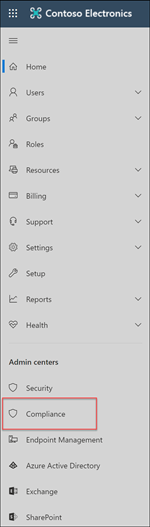

# Estudo de caso – a Contoso configura rapidamente uma política de linguagem ofensiva para comunicações do Microsoft Teams, Exchange e YammerCase study - Contoso quickly configures an offensive language policy for Microsoft Teams, Exchange, and Yammer communications

A conformidade de comunicação no Microsoft 365 ajuda a minimizar os riscos de comunicação, ajudando você a detectar, capturar e agir em mensagens inadequadas em sua organização.Communication compliance in Microsoft 365 helps minimize communication risks by helping you detect, capture, and act on inappropriate messages in your organization. Políticas pré-definidas e personalizadas permitem que você examine as comunicações internas e externas para que elas possam ser examinadas por revisores designados.Pre-defined and custom policies allow you to scan internal and external communications for policy matches so they can be examined by designated reviewers. Os revisadores podem investigar emails verificados, o Microsoft Teams, o Yammer ou comunicações de terceiros em sua organização e tomar as ações de correção apropriadas para garantir que eles estão em conformidade com os padrões de mensagens da sua organização.Reviewers can investigate scanned email, Microsoft Teams, Yammer, or third-party communications in your organization and take appropriate remediation actions to make sure they're compliant with your organization's message standards.

A Contoso Corporation é uma organização fictícia que precisa configurar rapidamente uma política para monitorar o idioma ofensivo.The Contoso Corporation is a fictional organization that needs to quickly configure a policy to monitor for offensive language. Eles têm usado o Microsoft 365 principalmente para o suporte a email, Microsoft Teams e Yammer para seus usuários, mas têm novos requisitos para impor a política da empresa em relação ao local de trabalho.They have been using Microsoft 365 primarily for email, Microsoft Teams, and Yammer support for their users but have new requirements to enforce company policy around workplace harassment. Os administradores de TI e especialistas em conformidade da Contoso têm uma compreensão básica dos conceitos básicos de como trabalhar com o Microsoft 365 e estão procurando orientações de ponta a ponta sobre como começar rapidamente com a conformidade de comunicação.Contoso IT administrators and compliance specialists have a basic understanding of the fundamentals of working with Microsoft 365 and are looking for end-to-end guidance for how to quickly get started with communication compliance.

Este estudo de caso abrange as noções básicas para configurar rapidamente uma política de conformidade de comunicação para monitorar as comunicações para linguagem ofensiva.This case study will cover the basics for quickly configuring a communication compliance policy to monitor communications for offensive language. Essas diretrizes incluem:This guidance includes:

- Etapa 1 - Planejamento de conformidade de comunicaçãoStep 1 - Planning for communication compliance
- Etapa 2: acessar a conformidade de comunicação no Microsoft 365Step 2 - Accessing communication compliance in Microsoft 365
- Etapa 3: configurar pré-requisitos e criar uma política de conformidade de comunicaçãoStep 3 - Configuring prerequisites and creating a communication compliance policy
- Etapa 4 - Investigação e correção de alertasStep 4 - Investigation and remediation of alerts

## Etapa 1: Planejamento de conformidade de comunicaçãoStep 1: Planning for communication compliance

Os administradores de TI e especialistas em conformidade da Contoso participaram de webinars online sobre soluções de conformidade no Microsoft 365 e decidiram que as políticas de conformidade de comunicação os ajudarão a atender aos requisitos de política corporativa atualizados para reduzir o abuso no local de trabalho.Contoso IT administrators and compliance specialists attended online webinars about compliance solutions in Microsoft 365 and decided that communication compliance policies will help them meet the updated corporate policy requirements for reducing workplace harassment. Trabalhando juntos, eles desenvolveram um plano para criar e habilitar uma política de conformidade de comunicação que monitorará um idioma ofensivo para chats enviados no Microsoft Teams, mensagens privadas e conversas da comunidade no Yammer e em mensagens de email enviadas no Exchange Online.Working together, they've developed a plan to create and enable a communication compliance policy that will monitor for offensive language for chats sent in Microsoft Teams, private messages and community conversations in Yammer, and in email messages sent in Exchange Online. O plano inclui a identificação:Their plan includes identifying:

- Os administradores de IT que precisam de acesso aos recursos de conformidade de comunicação.The IT administrators that need access to communication compliance features.
- Os especialistas em conformidade que precisam criar e gerenciar políticas de comunicação.The compliance specialists that need to create and manage communication policies.
- Os especialistas em conformidade e outros colegas de outros departamentos (Recursos Humanos, Jurídico etc.) que precisam investigar e remediar alertas de conformidade de comunicação.The compliance specialists and other colleague in other departments (Human Resources, Legal, etc.) that need to investigate and remediate communication compliance alerts.
- Os usuários que estarão no escopo da política de linguagem ofensiva de conformidade de comunicação.The users that will be in-scope for the communication compliance offensive language policy.

### LicenciamentoLicensing

A primeira etapa é confirmar se o licenciamento do Microsoft 365 da Contoso inclui suporte para a solução de conformidade de comunicação.The first step is to confirm that Contoso's Microsoft 365 licensing includes support for the communication compliance solution. Para acessar e usar a conformidade de comunicação, os administradores de IT da Contoso precisam verificar se a Contoso tem um dos seguintes:To access and use communication compliance, Contoso IT administrators need to verify that Contoso has one of the following:

- Assinatura do Microsoft 365 E5 (versão paga ou de avaliação)Microsoft 365 E5 subscription (paid or trial version)
- Assinatura do Microsoft 365 E3 + o complemento de Conformidade do Microsoft 365 E5Microsoft 365 E3 subscription + the Microsoft 365 E5 Compliance add-on
- Assinatura do Microsoft 365 E3 + o complemento Microsoft 365 E5 Insider Risk ManagementMicrosoft 365 E3 subscription + the Microsoft 365 E5 Insider Risk Management add-on
- Assinatura do Microsoft 365 A5 (versão paga ou de avaliação)Microsoft 365 A5 subscription (paid or trial version)
- Assinatura do Microsoft 365 A3 + complemento de Conformidade do Microsoft 365 A5Microsoft 365 A3 subscription + the Microsoft 365 A5 Compliance add-on
- Assinatura do Microsoft 365 A3 + o complemento Microsoft 365 A5 Insider Risk ManagementMicrosoft 365 A3 subscription + the Microsoft 365 A5 Insider Risk Management add-on
- Assinatura do Microsoft 365 G5 (versão paga ou de avaliação)Microsoft 365 G5 subscription (paid or trial version)
- Assinatura do Microsoft 365 G5 + o complemento de Conformidade do Microsoft 365 G5Microsoft 365 G5 subscription + the Microsoft 365 G5 Compliance add-on
- Assinatura do Microsoft 365 G5 + o complemento Microsoft 365 G5 Insider Risk ManagementMicrosoft 365 G5 subscription + the Microsoft 365 G5 Insider Risk Management add-on
- Assinatura do Office 365 Enterprise E5 (versão paga ou de avaliação)Office 365 Enterprise E5 subscription (paid or trial version)
- Assinatura do Office 365 Enterprise E3 + complemento de Conformidade Avançada do Office 365 (não está mais disponível para novas assinaturas, confira a observação)Office 365 Enterprise E3 subscription + the Office 365 Advanced Compliance add-on (no longer available for new subscriptions, see note)

Eles também devem confirmar se os usuários incluídos nas políticas de conformidade de comunicação devem ter uma das licenças atribuídas acima.They must also confirm that users included in communication compliance policies must be assigned one of the licenses above.

>[!IMPORTANT]
>A Conformidade Avançada do Office 365 não é mais vendida como uma assinatura autônoma.Office 365 Advanced Compliance is no longer sold as a standalone subscription. Quando as assinaturas atuais expirarem, os clientes devem fazer a transição para uma das assinaturas acima, que contêm os mesmos recursos de conformidade ou adicionais.When current subscriptions expire, customers should transition to one of the subscriptions above, which contain the same or additional compliance features.

Os administradores de IT da Contoso seguem as seguintes etapas para verificar o suporte a licenciamento para a Contoso:Contoso IT administrators take the following steps to verify the licensing support for Contoso:

1. Os administradores de IT entrarão no Centro de administração do **Microsoft 365** [( https://admin.microsoft.com)](https://admin.microsoft.com) e naveguem até Licenças de Cobrança do Centro de administração do Microsoft **365.**  >    >  IT administrators sign in to the **Microsoft 365 admin center** [(https://admin.microsoft.com)](https://admin.microsoft.com) and navigate to **Microsoft 365 admin center** > **Billing** > **Licenses**.

2. Aqui, eles confirmam que têm uma das opções [de licença](communication-compliance-configure.md#subscriptions-and-licensing) que inclui suporte para conformidade de comunicação.Here they confirm that they have one of the [license options](communication-compliance-configure.md#subscriptions-and-licensing) that includes support for communication compliance.

### Permissões para conformidade de comunicaçãoPermissions for communication compliance

Há cinco grupos de função usados para configurar permissões para gerenciar recursos de conformidade de comunicação.There are five role groups used to configure permissions to manage communication compliance features. Para **disponibilizar** a conformidade de comunicação como uma opção de menu no centro de conformidade do Microsoft 365 e continuar com essas etapas de configuração, os administradores da Contoso são atribuídos com a função de Administrador de Conformidade *de* Comunicação.To make **Communication compliance** available as a menu option in Microsoft 365 compliance center and to continue with these configuration steps, Contoso administrators are assigned the *Communication Compliance Admin* role.

A Contoso decide usar o grupo *de* função conformidade de comunicação para atribuir todos os administradores de conformidade de comunicação, analistas, investigadores e visualizadores ao grupo.Contoso decides to use the *Communication Compliance* role group assign all the communication compliance administrators, analysts, investigators, and viewers  to the group. Isso torna mais fácil para a Contoso começar rapidamente e melhor se adequar aos seus requisitos de gerenciamento de conformidade.This makes it easier for Contoso to get started quickly and best fits their compliance management requirements.

|**Função****Role**|**Permissões de função****Role permissions**|
|:-----|:-----|
| **Conformidade de comunicação****Communication Compliance** | Use esse grupo de função para gerenciar a conformidade de comunicação para sua organização em um único grupo.Use this role group to manage communication compliance for your organization in a single group. Ao adicionar todas as contas de usuário para administradores designados, analistas, investigadores e visualizadores, você pode configurar permissões de conformidade de comunicação em um único grupo.By adding all user accounts for designated administrators, analysts, investigators, and viewers, you can configure communication compliance permissions in a single group. Esse grupo de função contém todas as funções de permissão de conformidade de comunicação.This role group contains all the communication compliance permission roles. Essa configuração é a maneira mais fácil de começar rapidamente com a conformidade de comunicação e é uma boa opção para organizações que não precisam de permissões separadas definidas para grupos separados de usuários.This configuration is the easiest way to quickly get started with communication compliance and is a good fit for organizations that do not need separate permissions defined for separate groups of users. |
| **Administrador de Conformidade de Comunicação****Communication Compliance Admin** | Use esse grupo de função para configurar inicialmente a conformidade de comunicação e posteriormente segregar os administradores de conformidade de comunicação em um grupo definido.Use this role group to initially configure communication compliance and later to segregate communication compliance administrators into a defined group. Os usuários atribuídos a esse grupo de funções podem criar, ler, atualizar e excluir políticas de conformidade de comunicação, configurações globais e atribuições de grupo de função.Users assigned to this role group can create, read, update, and delete communication compliance policies, global settings, and role group assignments. Os usuários atribuídos a esse grupo de funções não podem exibir alertas de mensagem.Users assigned to this role group cannot view message alerts. |
| **Analista de Conformidade de Comunicação****Communication Compliance Analyst** | Use esse grupo para atribuir permissões aos usuários que atuarão como analistas de conformidade de comunicação.Use this group to assign permissions to users that will act as communication compliance analysts. Os usuários atribuídos a esse grupo de funções podem exibir políticas às quais são atribuídos como Revisadores, exibir metadados de mensagem (não conteúdo de mensagem), escalonar para revistores adicionais ou enviar notificações aos usuários.Users assigned to this role group can view policies where they are assigned as Reviewers, view message metadata (not message content), escalate to additional reviewers, or send notifications to users. Os analistas não podem resolver alertas pendentes.Analysts cannot resolve pending alerts. |
| **Investigador de conformidade de comunicação****Communication Compliance Investigator** | Use esse grupo para atribuir permissões aos usuários que atuarão como investigadores de conformidade de comunicação.Use this group to assign permissions to users that will act as communication compliance investigators. Os usuários atribuídos a esse grupo de funções podem exibir metadados e conteúdo de mensagens, escalonar para revistores adicionais, escalonar para um caso de Descoberta Avançada, enviar notificações aos usuários e resolver o alerta.Users assigned to this role group can view message metadata and content, escalate to additional reviewers, escalate to an Advanced eDiscovery case, send notifications to users, and resolve the alert. |
| **Visualizador de Conformidade de Comunicação****Communication Compliance Viewer** | Use esse grupo para atribuir permissões a usuários que gerenciarão relatórios de comunicação.Use this group to assign permissions to users that will manage communication reports. Os usuários atribuídos a esse grupo de função podem acessar todos os widgets de relatórios na home page de conformidade de comunicação e podem exibir todos os relatórios de conformidade de comunicação.Users assigned to this role group can access all reporting widgets on the communication compliance home page and can view all communication compliance reports. |

1. Os administradores de IT da Contoso podem entrar na página de permissões do Centro de Conformidade e Segurança do **Office 36 & 5** [(usando https://protection.office.com/permissions)](https://protection.office.com/permissions) credenciais para uma conta de administrador global e selecionar o link para exibir e gerenciar funções no Microsoft 365.Contoso IT administrators sign into the **Office 365 Security & Compliance center** permissions page [(https://protection.office.com/permissions)](https://protection.office.com/permissions) using credentials for a global administrator account and select the link to view and manage roles in Microsoft 365.
2. No Centro **de Conformidade &** segurança,  eles vão para Permissões e selecionam o link para exibir e gerenciar funções no Office 365.In the **Security & Compliance Center**, they go to **Permissions** and select the link to view and manage roles in Office 365.
3. Os administradores selecionam o *grupo de função Conformidade* de Comunicação e, em seguida, **selecionam Editar grupo de funções.**The administrators select the *Communication Compliance* role group, then select **Edit role group**.
4. Os administradores **selecionam Escolher membros** no painel de navegação esquerdo e, em seguida, selecione **Editar.**The administrators select **Choose members** from the left navigation pane, then select **Edit**.
5. Eles **selecionam Adicionar** e marcar a caixa de seleção para todos os usuários da Contoso que gerenciarão a conformidade de comunicação, investigarão e analisarão os alertas.They select **Add** and then select the checkbox for all Contoso users that will manage communication compliance, investigate, and review alerts.
6. Os administradores **selecionam Adicionar** e, em seguida, **Pronto.**The administrators select **Add**, then select **Done**.
7. Eles **selecionam Salvar** para adicionar usuários contoso ao grupo de funções.They select **Save** to add Contoso users to the role group. Eles **selecionam Fechar** para concluir as etapas.They select **Close** to complete the steps.

## Etapa 2: Acessar a conformidade de comunicação no Microsoft 365Step 2: Accessing communication compliance in Microsoft 365

Depois de configurar as permissões para conformidade de comunicação, os administradores de TI e especialistas em conformidade da Contoso atribuídos ao grupo de função conformidade de comunicação podem acessar a solução de conformidade de comunicação no Microsoft 365.After configuring the permissions for communication compliance, Contoso IT administrators and compliance specialists assigned to the Communication Compliance role group can access the communication compliance solution in Microsoft 365. Os administradores de TI e especialistas em conformidade da Contoso têm várias maneiras de acessar a conformidade de comunicação e começar a criar uma nova política:Contoso IT administrators and compliance specialists have several ways to access communication compliance and get started creating a new policy:

- Iniciando diretamente da solução de conformidade de comunicaçãoStarting directly from the communication compliance solution
- A partir do centro de conformidade do Microsoft 365Starting from the Microsoft 365 compliance center
- A partir do catálogo de soluções do Microsoft 365Starting from the Microsoft 365 solution catalog
- A partir do centro de administração do Microsoft 365Starting from the Microsoft 365 admin center

### Iniciando diretamente da solução de conformidade de comunicaçãoStarting directly from the communication compliance solution

A maneira mais rápida de acessar a solução é entrar diretamente na solução **de** conformidade <https://compliance.microsoft.com/supervisoryreview> () de comunicação.The quickest way to access the solution is to sign in directly to the **Communication compliance** (<https://compliance.microsoft.com/supervisoryreview>) solution. Usando este link, os administradores de TI e especialistas em conformidade da Contoso serão direcionados para o painel visão geral de conformidade de comunicações, onde você pode analisar rapidamente o status de alertas e criar novas políticas a partir dos modelos predefinidas.Using this link, Contoso IT administrators and compliance specialists will be directed to the communication compliance Overview dashboard where you can quickly review the status of alerts and create new policies from the pre-defined templates.

### A partir do centro de conformidade do Microsoft 365Starting from the Microsoft 365 compliance center

Outra maneira fácil para os administradores de TI e especialistas em conformidade da Contoso acessarem a solução de conformidade de comunicação é entrar diretamente no centro de conformidade do **Microsoft 365** [( https://compliance.microsoft.com)](https://compliance.microsoft.com).Another easy way for Contoso IT administrators and compliance specialists to access the communication compliance solution is to sign in directly to the **Microsoft 365 compliance center** [(https://compliance.microsoft.com)](https://compliance.microsoft.com). Depois de entrar, os usuários  simplesmente precisam selecionar Mostrar todo o  controle para exibir todas as soluções de conformidade e, em seguida, selecionar a solução de conformidade de comunicação para começar.After signing in, users simply need to select the **Show all** control to display all the compliance solutions and then select the **Communication compliance** solution to get started.

### A partir do catálogo de soluções do Microsoft 365Starting from the Microsoft 365 solution catalog

Os administradores de TI e especialistas em conformidade da Contoso também podem optar por acessar a solução de conformidade de comunicação selecionando o catálogo de soluções do Microsoft 365.Contoso IT administrators and compliance specialists could also choose to access the communication compliance solution by selecting the Microsoft 365 solution catalog. Selecionando **a** seção Catálogo em Soluções da navegação à esquerda no centro de conformidade do **Microsoft 365,** eles podem abrir o catálogo de soluções listando todas as soluções de conformidade do Microsoft 365. By selecting **Catalog** in **Solutions** section of the left navigation while in the **Microsoft 365 compliance center**, they can open the solution catalog listing all Microsoft 365 compliance solutions. Scrolling down to the **Insider risk management** section, Contoso IT administrators can select Communication compliance to get started.Scrolling down to the **Insider risk management** section, Contoso IT administrators can select Communication compliance to get started. Os administradores de IT da Contoso também decidem usar o controle mostrar na navegação para fixar a solução de conformidade de comunicação no painel de navegação à esquerda para acesso mais rápido quando eles entrarem no futuro.Contoso IT administrators also decide to use the Show in navigation control to pin the communication compliance solution to the left-navigation pane for quicker access when they sign in going forward.

### A partir do centro de administração do Microsoft 365Starting from the Microsoft 365 admin center

Para acessar a conformidade de comunicação ao iniciar pelo centro de administração do Microsoft 365, os administradores de TI e especialistas em conformidade da Contoso acessam o centro de administração do Microsoft 365 [( https://admin.microsoft.com)](https://admin.microsoft.com) e naveguem até o Centro de Administração do **Microsoft 365.**  >  To access communication compliance when starting from the Microsoft 365 admin center, Contoso IT administrators and compliance specialists sign in to the Microsoft 365 admin center [(https://admin.microsoft.com)](https://admin.microsoft.com) and navigate to **Microsoft 365 admin center** > **Compliance**.

Essa ação abre o Centro de Conformidade e Segurança do **Office 365,** e eles devem selecionar o link para o centro de conformidade do **Microsoft 365** fornecido na faixa na parte superior da página.This action opens the **Office 365 Security and Compliance center**, and they must select the link to the **Microsoft 365 compliance center** provided in the banner at the top of the page.

Uma vez no centro **de conformidade do Microsoft 365,** os administradores de TI da Contoso selecionam Mostrar tudo para exibir a lista completa de soluções de conformidade. Once in the **Microsoft 365 compliance center**, Contoso IT administrators select **Show all** to display the full list of compliance solutions.

Depois de **selecionar Mostrar tudo,** os administradores de IT da Contoso podem acessar a solução de conformidade de comunicação.After selecting **Show all**, the Contoso IT administrators can access the communication compliance solution.

## Etapa 3: Configurar pré-requisitos e criar uma política de conformidade de comunicaçãoStep 3: Configuring prerequisites and creating a communication compliance policy

Para começar a trabalhar com uma política de conformidade de comunicação, há vários pré-requisitos que os administradores de IT da Contoso precisam configurar antes de configurar a nova política para monitorar o idioma ofensivo.To get started with a communication compliance policy, there are several prerequisites that Contoso IT administrators need to configure before setting up the new policy to monitor for offensive language. Após a conclusão desses pré-requisitos, os administradores de TI e especialistas em conformidade da Contoso podem configurar a nova política e os especialistas em conformidade podem iniciar a investigação e a correção de todos os alertas gerados.After these prerequisites have been completed, Contoso IT administrators and compliance specialists can configure the new policy and compliance specialists can start investigation and remediating any generated alerts.

### Habilitando a auditoria no Microsoft 365Enabling auditing in Microsoft 365

A conformidade de comunicação requer logs de auditoria para mostrar alertas e rastrear ações de correção tomadas pelos revisadores.Communication compliance requires audit logs to show alerts and track remediation actions taken by reviewers. Os logs de auditoria são um resumo de todas as atividades associadas a uma política organizacional definida ou sempre que há uma alteração em uma política de conformidade de comunicação.The audit logs are a summary of all activities associated with a defined organizational policy or anytime there is a change to a communication compliance policy.

Os administradores de IT da Contoso revisam e concluem as instruções passo a [passo](turn-audit-log-search-on-or-off.md) para ativar a auditoria.Contoso IT administrators review and complete the [step-by-step instructions](turn-audit-log-search-on-or-off.md) to turn on auditing. Depois que eles ativarem a auditoria, será exibida uma mensagem informando que o log de auditoria está sendo preparado e que eles podem executar uma pesquisa em algumas horas após a conclusão da preparação.After they turn on auditing, a message is displayed that says the audit log is being prepared and that they can run a search in a couple of hours after the preparation is complete. Os administradores de IT da Contoso só terão que fazer essa ação uma vez.The Contoso IT administrators only have to do this action once.

### Configurando o locatário do Yammer para o Modo NativoConfiguring Yammer tenant for Native Mode

A conformidade de comunicação exige que o locatário do Yammer de uma organização está no modo Nativo para monitorar o idioma ofensivo em mensagens privadas e conversas públicas da comunidade.Communication compliance requires that the Yammer tenant for an organization is in Native Mode to monitor for offensive language in private messages and public community conversations.

Os administradores de TI da Contoso garantem que revisem as informações no artigo Visão geral do Modo Nativo do Yammer no [Microsoft 365](/yammer/configure-your-yammer-network/overview-native-mode) e siga as etapas para executar a ferramenta de migração no artigo Configurar sua rede do Yammer para o Modo Nativo do [Microsoft 365.](/yammer/configure-your-yammer-network/native-mode)Contoso IT administrators make sure they review the information in the [Overview of Yammer Native Mode in Microsoft 365 article](/yammer/configure-your-yammer-network/overview-native-mode) and follow the steps for running the migration tool in the [Configure your Yammer network for Native Mode for Microsoft 365](/yammer/configure-your-yammer-network/native-mode) article.

### Configurando um grupo para usuários no escopoSetting up a group for in-scope users

Os especialistas em conformidade da Contoso querem adicionar todos os usuários à política de comunicação que monitorará o idioma ofensivo.Contoso compliance specialists want to add all users to the communication policy that will monitor for offensive language. Eles podem optar por adicionar cada conta de usuário à política separadamente, mas decidiram  que é muito mais fácil e economiza tempo para usar um grupo de distribuição Todos os Usuários para os usuários dessa política.They could decide to add each user account to the policy separately, but they've decided it is much easier and saves time to use an **All Users** distribution group for the users for this policy.

Eles precisam criar um novo grupo para incluir todos os usuários da Contoso, portanto, eles devem seguir as seguintes etapas:They need to create a new group to include all Contoso users, so they take the following steps:

1. Os administradores de IT da Contoso se ins login no centro de administração do **Microsoft 365** [( https://admin.microsoft.com)](https://admin.microsoft.com) e navegue até Grupos do Centro de administração do Microsoft **365.**  >    >  Contoso IT administrators IT sign in to the **Microsoft 365 admin center** [(https://admin.microsoft.com)](https://admin.microsoft.com) and navigate to **Microsoft 365 admin center** > **Groups** > **Groups**.
2. Eles **selecionam Adicionar um grupo** e concluem o assistente para criar um novo grupo ou grupo de *distribuição* do *Microsoft 365.*They select **Add a group** and complete the wizard to create a new *Microsoft 365 group* or *Distribution group*.

    

3. Depois que o novo grupo for criado, eles precisarão adicionar todos os usuários da Contoso ao novo grupo.After the new group is created, they need to add all Contoso users to the new group. Eles abrem o **Centro de administração do Exchange** ( [e https://outlook.office365.com/ecp)](https://outlook.office365.com/ecp) navegam para grupos de destinatários do Centro de administração do   >    >  Exchange.They open the **Exchange admin center** [(https://outlook.office365.com/ecp)](https://outlook.office365.com/ecp) and navigate to **Exchange admin center** > **recipients** > **groups**. Os administradores de IT da Contoso  selecionam a área  Associação e o novo grupo Todos os Funcionários que criaram e selecionam o controle Editar para adicionar todos os usuários da Contoso ao novo grupo no assistente.The Contoso IT administrators select the Membership area and the new *All Employees* group they created and select the **Edit** control to add all Contoso users to the new group in the wizard.

    

### Criando a política a ser monitorada para linguagem ofensivaCreating the policy to monitor for offensive language

Com todos os pré-requisitos concluídos, os administradores de TI e os especialistas em conformidade da Contoso estão prontos para configurar a política de conformidade de comunicação para monitorar o idioma ofensivo.With all the prerequisites completed, the IT administrators and the compliance specialists for Contoso are ready to configure the communication compliance policy to monitor for offensive language. Usando o novo modelo de política de idioma ofensivo, a configuração dessa política é simples e rápida.Using the new offensive language policy template, configuring this policy is simple and quick.

1. Os administradores de TI e especialistas em conformidade da Contoso  se ins login no centro de conformidade do **Microsoft 365** e selecionam a conformidade de comunicação no painel de navegação esquerdo.The Contoso IT administrators and compliance specialists sign into the **Microsoft 365 compliance center** and select **Communication compliance** from the left navigation pane. Essa ação abre o painel **Visão geral** com links rápidos para modelos de política de conformidade de comunicação.This action opens the **Overview** dashboard that has quick links for communication compliance policy templates. Eles escolhem o **modelo De monitoramento de idioma** ofensivo **selecionando Começar** para o modelo.They choose the **Monitor for offensive language** template by selecting **Get started** for the template.

    

2. No assistente de modelo de política, os administradores de TI e especialistas em conformidade da Contoso trabalham juntos para concluir os três campos obrigatórios: nome da **política,** usuários ou grupos para supervisionar e **Revisadores.**On the policy template wizard, the Contoso IT administrators and compliance specialists work together to complete the three required fields: **Policy name**, **Users or groups to supervise**, and **Reviewers**.
3. Como o assistente de política já sugere um nome para a política, os administradores de TI e especialistas em conformidade decidem manter o nome sugerido e se concentrar nos campos restantes.Since the policy wizard has already suggested a name for the policy, the IT administrators and compliance specialists decide to keep the suggested name and focus on the remaining fields. Eles selecionam o grupo  Todos os usuários dos Usuários ou grupos para supervisionar o campo e selecionar os especialistas em conformidade que devem investigar e remediar alertas de política para o campo Revisadores.  They select the *All users* group for the **Users or groups to supervise** field and select the compliance specialists that should investigate and remediate policy alerts for the **Reviewers** field. A última etapa para configurar a política e começar a coletar informações de alerta é selecionar Criar **política.**The last step to configure the policy and start gathering alert information is to select **Create policy**.

    

## Etapa 4: investigar e remediar alertasStep 4: Investigate and remediate alerts

Agora que a política de conformidade de comunicação a ser monitorada para linguagem ofensiva está configurada, a próxima etapa para os especialistas em conformidade da Contoso será investigar e remediar quaisquer alertas gerados pela política.Now that the communication compliance policy to monitor for offensive language is configured, the next step for the Contoso compliance specialists will be to investigate and remediate any alerts generated by the policy. Levará até 24 horas para que a política processe totalmente as comunicações em todos os canais de origem de comunicação e para que os alertas aparecem no **painel alerta.**It will take up to 24 hours for the policy to fully process communications in all the communication source channels and for alerts to show up in the **Alert dashboard**.

Depois que os alertas são gerados, os especialistas em conformidade da Contoso seguirão as instruções do fluxo de trabalho para investigar e resolver problemas de linguagem ofensiva. After alerts are generated, Contoso compliance specialists will follow the [workflow instructions](communication-compliance-investigate-remediate.md) to investigate and remediate offensive language issues.