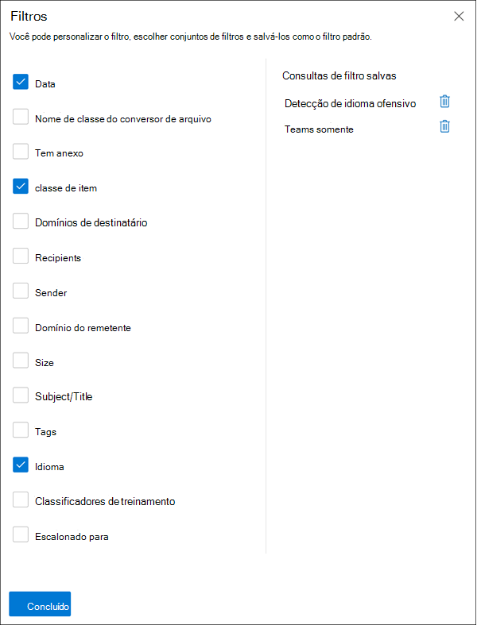
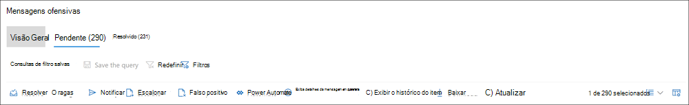

# Investigar e corrigir alertas de conformidade em comunicações

Depois de configurar suas políticas de conformidade de comunicação, você começará a receber alertas no centro de conformidade Microsoft 365 de mensagens que corresponderem às suas condições de política. Siga as instruções de fluxo de trabalho aqui para investigar e resolver problemas de alerta.

## Investigar alertas

A primeira etapa para investigar problemas detectados por suas políticas é analisar os alertas de conformidade de comunicação no centro de conformidade Microsoft 365 de comunicação. Há várias áreas na área de solução de conformidade de comunicação para ajudá-lo a investigar rapidamente os alertas, dependendo de como você prefere exibir o agrupamento de alertas:

- **Página de política** de conformidade de comunicação : quando você entrar usando credenciais para uma conta de administrador em sua Microsoft 365, selecione Conformidade de comunicação para exibir a página Política de conformidade [https://compliance.microsoft.com](https://compliance.microsoft.com) **de** comunicação.  Esta página exibe políticas de conformidade de comunicação configuradas para sua organização Microsoft 365 e links para modelos de política recomendados. Cada política listada inclui a contagem de alertas que precisam de revisão, o número de itens escalonados e resolvidos, o status da política e a data e a hora da última verificação de política. Selecionar uma política exibe todos os alertas pendentes para as combinações com a política, selecione um alerta específico para iniciar a página de detalhes da política e para iniciar ações de correção.
- **Alertas**: Navegue até **Alertas** de conformidade de comunicação para exibir os últimos 30 dias de  >   alertas agrupados por diretivas. Esse exibição permite ver rapidamente quais políticas de conformidade de comunicação estão gerando a maioria dos alertas por gravidade. Para iniciar ações de correção, selecione a política associada ao alerta para iniciar a **página Detalhes da** Política. Na  página Detalhes da Política, você pode revisar um resumo das atividades na  página Visão Geral, revisar e agir em  mensagens de alerta na página Pendente ou revisar o histórico de alertas fechados na página Resolvido. 
- **Relatórios**: Navegue até **Relatórios de conformidade de**  >  **comunicação** para exibir widgets de relatório de conformidade de comunicação. Cada widget fornece uma visão geral das atividades e status de conformidade de comunicação, incluindo o acesso a informações mais profundas sobre as combinações de política e as ações de correção.

### Usando filtros

A próxima etapa é classificar as mensagens para que seja mais fácil investigar os alertas. Na página **Detalhes da** Política, a conformidade de comunicação dá suporte à filtragem de vários níveis para vários campos de mensagem para ajudá-lo a investigar e analisar rapidamente as mensagens com as combinações de política. A filtragem está disponível para itens pendentes e resolvidos para cada política configurada. Você pode configurar consultas de filtro para uma política ou configurar e salvar consultas de filtro personalizadas e padrão para uso em cada política específica. Depois de configurar os campos de um filtro, você verá os campos de filtro exibidos na parte superior da fila da mensagem de alerta que podem ser configurados para valores específicos de filtro.

Para obter uma lista completa de filtros e detalhes de campo, consulte [Filters](communication-compliance-feature-reference.md#filters) no artigo de referência de recursos.

#### Para configurar um filtro

1. Entre [https://compliance.microsoft.com](https://compliance.microsoft.com) usando credenciais para uma conta de administrador em sua Microsoft 365 organização.

2. No centro Microsoft 365 de conformidade, vá para **Conformidade de comunicação.**

3. Selecione a **guia Políticas** e selecione uma política para investigação, clique duas vezes para abrir a **página Política.**

4. Na página **Política,** selecione a guia **Pendente** ou **Resolvido** para exibir os itens para filtragem.

5. Selecione o **controle Filtros** para abrir a **página De detalhes filtros.**

6. Selecione uma ou mais caixas de seleção para habilitar filtros para esses alertas. Você pode escolher entre vários filtros, incluindo *Data*, *Remetente,* *Assunto/Título,* *Classificadores,* *Idioma* e muito mais.

7. Se você quiser salvar o filtro selecionado como o filtro padrão, selecione **Salvar como padrão**. Se você quiser usar esse filtro como um filtro salvo, selecione **Feito**.

8. Se você quiser salvar os filtros selecionados como uma consulta de filtro, selecione **Salvar** o controle de consulta depois de configurar pelo menos um valor de filtro. Insira um nome para a consulta de filtro e selecione **Salvar**. Esse filtro está disponível para uso apenas para essa política e está listado na seção **Consultas** de filtro salvo da página **de detalhes Filtros.**

    

### Usando análise duplicada próxima e exata

As políticas de Conformidade de comunicações digitalizarão e agrupam automaticamente as duplicatas de mensagens exatas e próximas sem nenhuma etapa de configuração adicional. Esse modo de exibição permite que você aja rapidamente em mensagens semelhantes um por um ou como um grupo, reduzindo a carga de investigação de mensagens para revistores. À medida que **Duplicatas pertas** são detectadas, os controles ou **Duplicatas Exatas** são exibidos na barra de ferramentas de ação de mediação. Essa exibição não estará disponível se duplicatas próximas ou exatas não foram encontradas.

#### Para correção de duplicatas

1. Entre [https://compliance.microsoft.com](https://compliance.microsoft.com) usando credenciais para uma conta de administrador em sua Microsoft 365 organização.

2. No centro Microsoft 365 de conformidade, vá para **Conformidade de comunicação.**

3. Selecione a **guia Políticas** e selecione uma política para investigação, clique duas vezes para abrir a **página Política.**

4. Na página **Política,** selecione a guia **Pendente** ou **Resolvido** para exibir mensagens duplicadas.

5. Selecione os **controles Duplicatas Próximas** ou **Duplicatas Exatas** para abrir a página de detalhes duplicados.

6. Selecione uma ou mais mensagens para correção de controles de ação dessas mensagens.

7. Selecione **Resolver,** **Notificar,** **Escalonar** ou **Baixar** para aplicar a ação às mensagens duplicadas selecionadas como o filtro padrão.

8. Selecione **Fechar** após concluir as ações de correção nas mensagens.

    

## Correção de alertas

Não importa onde você começa a analisar alertas ou a filtragem configurada, a próxima etapa é tomar medidas para remediar o alerta. Inicie a correção de alerta usando o fluxo de trabalho a seguir nas páginas **Política** **ou Alertas.**

### Etapa 1: Examinar as noções básicas da mensagem

 Às vezes, é óbvio da origem ou assunto que uma mensagem pode ser imediatamente remediada. Pode ser que a mensagem seja espulosa ou incorretamente corresponder a uma política e ela deve ser resolvida como um falso positivo. Selecione a **de alerta** falso positivo para resolver imediatamente o alerta e remover a fila pendente do alerta. Nas informações de origem ou remetente, talvez você já saiba como a mensagem deve ser roteada ou tratada nestas circunstâncias. Considere usar a marca **como controles** ou **Escalonar** para atribuir uma marca às mensagens aplicáveis ou enviar mensagens a um revistor designado.

### Etapa 2: Examinar os detalhes da mensagem

Depois de revisar as noções básicas da mensagem, é hora de abrir uma mensagem para examinar os detalhes e determinar outras ações de correção. Selecione uma mensagem para exibir as informações completas do corpo e do texto da mensagem. Várias exibições diferentes estão disponíveis para ajudá-lo a decidir a ação adequada:

- **Exibição de origem**: esse é o exibição de mensagem padrão normalmente visto na maioria das plataformas de mensagens baseadas na Web. As informações do header são formatadas no estilo normal e o corpo da mensagem dá suporte a arquivos gráficos imbedded e texto empacotado por palavras. Se [o OCR (reconhecimento](communication-compliance-feature-reference.md#optical-character-recognition-ocr) de caractere óptico) estiver habilitado para a política, as imagens que contêm texto impresso ou manuscrito que corresponderem à política condicional serão exibidas como um item filho para a mensagem associada neste modo de exibição.
- **Exibição** de texto : O exibição de texto exibe uma exibição somente de texto numerada em linha da mensagem e inclui o realçamento de palavra-chave em mensagens e anexos para termos de tipo de informação confidenciais ou palavras-chave corresponderem na política de conformidade de comunicação associada. O realçamento de palavra-chave pode ajudá-lo a examinar rapidamente mensagens longas e anexos para a área de interesse. Em alguns casos, o texto realçado pode estar apenas em anexos para mensagens que coincidem com as condições da política. Não há suporte para realçamento de palavra-chave para termos identificados por classificadores integrados atribuídos a uma política. Os arquivos incorporados não são exibidos, e a numeração de linha desse visor é útil para fazer referência a detalhes pertinentes entre vários revisores.
- **Exibição de anotações**: esse exibição permite que os revistores adicionem anotações diretamente na mensagem que são salvas no exibição da mensagem. Se [o OCR](communication-compliance-feature-reference.md#optical-character-recognition-ocr) estiver habilitado para a política, as imagens que contêm texto impresso ou manuscrito que corresponderem à política condicional serão exibidas como um item filho para a mensagem associada neste modo de exibição e podem ser anotadas.
- **Histórico de**: o exibição do histórico do usuário exibe todos os outros alertas gerados por qualquer política de conformidade de comunicação para o usuário que envia a mensagem.
- **Notificação detectada por** padrão : muitas ações de assedio e intimidação ao longo do tempo e envolvem instâncias recorrentes do mesmo comportamento por um usuário. A *notificação de* Padrão detectada é exibida nos detalhes do alerta e chama a atenção para o alerta. A detecção de padrões é por política e avalia o comportamento nos últimos 30 dias quando pelo menos duas mensagens são enviadas para o mesmo destinatário por um remetente. Os investigadores e revisadores podem usar essa notificação para identificar o comportamento repetido para avaliar o alerta conforme apropriado.
- **Show Translate view**: This view automatically converts alert message text to the language configured in the *Displayed* language setting in the Microsoft 365 subscription for each reviewer. O modo de exibição Traduzir ajuda a ampliar o suporte investigativo para organizações com usuários multilíngues e elimina a necessidade de serviços de tradução adicionais fora do processo de revisão de conformidade de comunicação. Usando os serviços do Microsoft Translate, o visualização Traduzir pode ser ligado e desligado conforme necessário e oferece suporte a uma ampla variedade de idiomas. Para ver uma lista completa de idiomas com suporte, consulte [Microsoft Tradutor Languages](https://www.microsoft.com/translator/business/languages/). Os idiomas listados na *lista Tradutor idioma* são suportados no visualização Traduzir.

    

### Etapa 3: Decidir sobre uma ação de correção

Agora que você reviu os detalhes da mensagem para o alerta, pode escolher várias ações de correção:

- **Resolve**: Selecionar o **controle Resolver** remove imediatamente a mensagem da fila de **alertas pendentes** e nenhuma ação mais pode ser tomada na mensagem. Ao selecionar **Resolver**, você essencialmente fechou o alerta sem classificação posterior e ele não pode ser reaberto para outras ações. Todas as mensagens resolvidas são exibidas na **guia Resolvido.**
- **Falso Positivo**: você sempre pode resolver uma mensagem como um falso positivo em qualquer ponto durante o fluxo de trabalho de revisão de mensagens. Falso positivo significa que o alerta não foi a ação ou que o alerta foi gerado incorretamente pelo processo de alerta. A mensagem não pode ser reaberta e todas as mensagens falsos positivos são exibidas na guia **Resolvido.**
- **Power Automate (visualização)**: use um fluxo Power Automate para automatizar tarefas de processo para uma mensagem de alerta. Por padrão, *a* conformidade de comunicação inclui o Gerenciador de Notificação quando um usuário tem um modelo de fluxo de alerta de conformidade de comunicação que os revisadores podem usar para automatizar o processo de notificação para usuários com alertas de mensagem. Para obter mais informações sobre como criar e gerenciar Power Automate fluxos em conformidade com a comunicação, consulte o artigo de referência do recurso [de conformidade de](communication-compliance-feature-reference.md#power-automate-flows) comunicação.
- **Marca como**: marque a mensagem como compatível, não compatível *ou* *questionável* quanto se relaciona às políticas e padrões da sua organização. Adicionar marcas e comentários de marcação ajuda você a filtrar alertas de política de micro-filtro para escalonamentos ou como parte de outros processos de revisão interna. Depois que a marcação for concluída, você também pode optar por resolver a mensagem para movê-la da fila de revisão pendente.
- **Notificar**: você pode usar o controle **Notificar** para atribuir um modelo de aviso personalizado ao alerta e enviar um aviso de aviso ao usuário. Escolha o modelo de aviso  apropriado configurado na área Configurações de conformidade de comunicação e selecione **Enviar** para enviar um lembrete por email para o usuário que enviou a mensagem e resolver o problema.
- **Escalate**: Usando o **controle Escalate,** você pode escolher quem mais em sua organização deve revisar a mensagem. Escolha em uma lista de revisadores configurados na política de conformidade de comunicação para enviar uma notificação de email solicitando revisão adicional do alerta de mensagem. O revisor selecionado pode usar um link na notificação de e-mail para ir diretamente aos itens escalonados para revisão.
- **Escala para investigação**: usando o **Escalonamento** para  controle de investigação, você pode criar um novo caso Advanced eDiscovery caso para mensagens simples ou múltiplas. Você fornecerá um nome e anotações para o novo caso, e o usuário que enviou a mensagem que corresponde à política é atribuído automaticamente como o custodiante do caso. Você não precisa de permissões adicionais para gerenciar o caso. A criação de um caso não resolve ou cria uma nova marca para a mensagem. Você pode selecionar um total de 100 mensagens ao criar Advanced eDiscovery caso durante o processo de correção. Há suporte para mensagens em todos os canais de comunicação monitorados pela conformidade de comunicação. Por exemplo, você pode selecionar 50 chats Microsoft Teams, 25 mensagens de email Exchange Online e 25 mensagens Yammer quando abrir uma nova Advanced eDiscovery caso para um usuário.
- **Remover mensagem no Teams**: Usando a mensagem **Remover** no controle Teams, você pode bloquear mensagens inadequadas e conteúdo identificado em alertas de canais Microsoft Teams e 1:1 e chats de grupo. As mensagens removidas e o conteúdo são substituídos por uma dica de política que explica que ela está bloqueada e a política que se aplica à sua remoção do ponto de vista. Os destinatários têm um link na dica de política para saber mais sobre a política aplicável e o processo de revisão. O remetente recebe uma dica de política para a mensagem e conteúdo bloqueados, mas pode revisar os detalhes da mensagem bloqueada e o conteúdo para contexto sobre a remoção.

    

### Etapa 4: Determinar se os detalhes da mensagem devem ser arquivados fora da conformidade de comunicação

Os detalhes da mensagem podem ser exportados ou baixados se você precisar arquivar as mensagens em uma solução de armazenamento separada. Selecionar a **Download** controle adiciona automaticamente as mensagens selecionadas a um . Arquivo ZIP que pode ser salvo em armazenamento fora do Microsoft 365.
