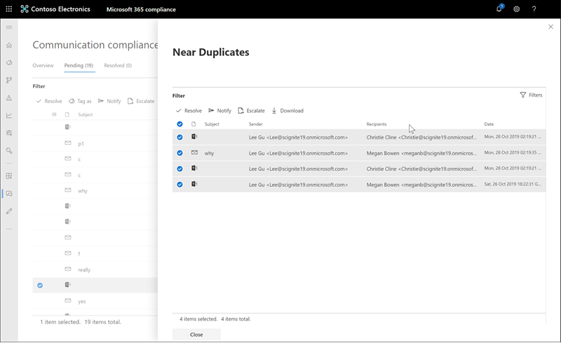

# Investigar e corrigir alertas de conformidade de comunicação

Depois de configurar suas políticas de conformidade de comunicação, você começará a receber alertas no centro de conformidade da Microsoft 365 para problemas de mensagens que correspondam às suas condições de política. Siga as instruções do fluxo de trabalho aqui para investigar e corrigir problemas de alerta.

## Investigar alertas

A primeira etapa para investigar problemas detectados por suas políticas é examinar os alertas gerados no centro de conformidade da Microsoft 365. Há várias áreas no centro de conformidade para ajudá-lo a investigar rapidamente os alertas, dependendo de como você prefere exibir o agrupamento de alertas:

- **Home Page de conformidade de comunicação**: quando você entra [https://compliance.microsoft.com](https://compliance.microsoft.com) no usando credenciais para uma conta de administrador na sua organização do Microsoft 365, selecione**visão geral** de **conformidade** > de comunicação para exibir a Home Page de conformidade de comunicação. Aqui você verá:
    - Alertas que precisam de revisão listadas da severidade alta para baixa. Selecione um alerta para iniciar a página detalhes do alerta e para iniciar ações de correção.
    - Correspondências de política recentes listadas pelo nome da política.
    - Itens resolvidos listados pelo nome da política.
    - Escalonamentos listados pelo nome da política.
    - Os usuários com a maioria das correspondências de política são listados do máximo para o menor número de correspondências.
- **Guia alertas**: Navegue até **Communication compliance** > **alertas** de conformidade de comunicação para exibir alertas agrupados pela política de conformidade de comunicação correspondente. Este modo de exibição permite ver rapidamente quais políticas de conformidade de comunicação estão gerando a maioria dos alertas ordenados por severidade.  Para iniciar ações de correção, expanda uma política para selecionar um alerta específico e para iniciar a página detalhes do alerta.
- **Guia políticas**: Navegue até **Communication compliance** > **políticas** de conformidade de comunicação para exibir as políticas de conformidade de comunicação configuradas para sua organização do Microsoft 365. Cada política listada inclui a contagem de alertas que precisam de revisão. Selecionar uma política exibe todos os alertas pendentes para correspondências com a política, selecione um alerta específico para iniciar a página de detalhes da política e para iniciar ações de correção.

### Usando filtros

A próxima etapa é classificar as mensagens de modo que seja mais fácil investigar os alertas. A conformidade de comunicação oferece suporte à filtragem de vários níveis para vários campos de mensagem para ajudá-lo a investigar e examinar rapidamente as mensagens com correspondências de política. A filtragem está disponível para itens pendentes e resolvidos para cada política configurada. Você pode configurar consultas de filtro para uma política ou configurar e salvar consultas de filtro padrão e personalizadas para uso em cada política específica. Após configurar campos para um filtro, você verá os campos de filtro exibidos na parte superior da fila de mensagens de alerta que você pode configurar para valores de filtro específicos.

Para obter uma lista completa dos filtros e detalhes do campo, consulte [Filters](communication-compliance-feature-reference.md#filters) no tópico Feature Reference.

#### Para configurar um filtro

1. Entre [https://compliance.microsoft.com](https://compliance.microsoft.com) usando as credenciais de uma conta de administrador na sua organização do Microsoft 365.

2. No centro de conformidade da Microsoft 365, vá para **conformidade de comunicação**.

3. Selecione a guia **políticas** e, em seguida, selecione uma política de investigação, clique duas vezes para abrir a página **política** .

4. Na página **política** , selecione a guia **pendente** ou **resolvida** para exibir os itens para filtragem.

5. Selecione o controle **filtros** para abrir a página **filtros** de detalhes.

6. Selecione uma ou mais caixas de seleção para Habilitar filtros para esses alertas. Você pode escolher entre vários filtros, incluindo *Data*, *remetente*, *assunto/título*, *classificadores*e muito mais.

7. Se quiser salvar o filtro selecionado como o filtro padrão, selecione **salvar como padrão**. Se você quiser usar este filtro como um filtro salvo, selecione **concluído**.

8. Se quiser salvar os filtros selecionados como uma consulta de filtro, selecione **salvar o controle de consulta** após ter configurado pelo menos um valor de filtro. Insira um nome para a consulta de filtro e selecione **salvar**. Este filtro está disponível para ser usado apenas para essa política e está listado na seção **consultas de filtro salvas** da página de detalhes de **filtros** .

    

### Usando a análise de duplicatas próxima e exata

As políticas de conformidade de comunicação verificam e agrupam automaticamente duplicatas de mensagens próximas e exatas sem nenhuma etapa de configuração adicional. Este modo de exibição permite corrigir rapidamente mensagens semelhantes, um por um ou um grupo, reduzindo a carga de investigação de mensagens para revisores. Como duplicatas são detectadas, os controles **próximos duplicatas** e/ou **Exact duplicatas** são exibidos na barra de ferramentas ação de correção.

#### Para corrigir duplicatas

1. Entre [https://compliance.microsoft.com](https://compliance.microsoft.com) usando as credenciais de uma conta de administrador na sua organização do Microsoft 365.

2. No centro de conformidade da Microsoft 365, vá para **conformidade de comunicação**.

3. Selecione a guia **políticas** e, em seguida, selecione uma política de investigação, clique duas vezes para abrir a página **política** .

4. Na página **política** , selecione a guia **pendente** ou **resolvida** para exibir mensagens duplicadas.

5. Selecione os controles **próximos duplicados** ou de **duplicatas exatas** para abrir a página de detalhes de duplicatas.

6. Selecione uma ou mais mensagens para controles de ação de correção para essas mensagens.

7. Selecione **resolver**, **notificar**, **escalonar**ou **baixar** para aplicar a ação às mensagens duplicadas selecionadas. escolhido como o filtro padrão.

8. Selecione **fechar** após concluir as ações de correção nas mensagens.

    

## Corrigir alertas

Não importa onde você comece a revisar os alertas ou a filtragem que você configurou, a próxima etapa é executar uma ação para corrigir o alerta. Inicie a correção de alerta usando o fluxo de trabalho a seguir nas páginas de **políticas** ou **alertas** :

1. **Examinar a mensagem noções básicas**: às vezes, é óbvio da origem ou do assunto que uma mensagem pode ser corrigida imediatamente. Pode ser que a mensagem seja falsa ou incorretamente correspondente a uma política e deve ser resolvida como um falso positivo. Selecione o controle **falso positivo** para resolver imediatamente o alerta e remover da fila de alerta pendente. Nas informações de origem ou do remetente, talvez você já saiba como a mensagem deve ser encaminhada ou tratada nessas circunstâncias. Considere usar a **marca como** ou **escalonar** controles para atribuir uma marca a mensagens aplicáveis ou para enviar mensagens a um revisor designado.

    

2. **Examine os detalhes da mensagem**: após revisar as noções básicas da mensagem, é hora de abrir uma mensagem para examinar os detalhes e determinar ações de correção adicionais. Selecione uma mensagem para exibir as informações completas de cabeçalho e corpo da mensagem. Vários modos de exibição diferentes estão disponíveis para ajudá-lo a decidir o curso de ação adequado:

    - **Modo**de exibição de origem: este modo de exibição é o modo de exibição de mensagem padrão normalmente visto na maioria das plataformas de mensagens baseadas na Web. As informações de cabeçalho são formatadas no estilo normal e o corpo da mensagem suporta arquivos gráficos incorporados e texto com quebra automática de palavra.
    - **Modo**de exibição de texto: a visualização de texto exibe um modo de exibição somente texto numerado de linha da mensagem e inclui a palavra-chave realce para termos correspondentes na política de conformidade de comunicação associada. A palavra-chave realce pode ajudá-lo a verificar rapidamente as mensagens longas para a área de interesse. Os arquivos inseridos não são exibidos e a numeração de linhas desse modo de exibição é útil para fazer referência a detalhes pertinentes entre vários revisores.
    - **Modo de anotações**: este modo de exibição permite que os revisores adicionem anotações diretamente na mensagem que são salvas no modo de exibição da mensagem.
    - **Histórico do usuário**: o modo de exibição de histórico do usuário exibe todos os outros alertas gerados por qualquer política de conformidade de comunicação para o usuário que está enviando a mensagem.

    

3. Escolha **uma ação de correção**: agora que você analisou os detalhes da mensagem para o alerta, é possível escolher várias ações de correção:

    - **Resolver**: selecionar o controle **resolver** imediatamente remove a mensagem da fila de **alertas pendentes** e nenhuma ação adicional pode ser executada na mensagem. Ao selecionar **resolver**, você já fechou o alerta sem mais classificação e não pode ser reaberto para futuras ações. Todas as mensagens resolvidas são exibidas na guia **resolvido** .
    - **Falso positivo**: você sempre pode resolver uma mensagem como falso positivo em qualquer ponto durante o fluxo de trabalho de revisão de mensagens. A mensagem não pode ser reaberta e todas as mensagens falsas positivas são exibidas na guia **resolvido** .
    - **Marcar como**: marcar a mensagem como *compatível*, *não compatível*ou como *questionável* , pois ela se relaciona com as políticas e os padrões da sua organização. A adição de marcas e comentários de marcação pode ajudá-lo a enfiltrar alertas de política para escalonamento ou como parte de outros processos de revisão internos. Após a conclusão da marcação, você também pode optar por resolver a mensagem para movê-la para fora da fila de revisão pendente.
    - **Notificar**: você pode usar o controle **Notify** para atribuir um modelo de aviso personalizado ao alerta e enviar um aviso de aviso ao usuário. Escolha o modelo de aviso apropriado e selecione **Enviar para enviar** por email um lembrete para o funcionário que enviou a mensagem e para resolver o problema.
    - **Escalonar**: usando o controle **escalonar** , você pode escolher quem mais em sua organização deve revisar a mensagem. Escolha em uma lista de revisores configurados na política de conformidade de comunicação para enviar uma notificação por email solicitando uma revisão adicional do alerta de mensagem. O revisor selecionado pode usar um link na notificação por email para ir diretamente para os itens escalonados a eles para revisão.
    - **Criar uma ocorrência**: usando o controle **criar um caso** , você pode criar um novo [caso de descoberta eletrônica avançada](overview-ediscovery-20.md) para mensagens simples ou múltiplas. Você fornecerá um nome e anotações para o novo caso e o usuário que enviou a mensagem que corresponde à política será automaticamente atribuído como o responsável da ocorrência. Você não precisa de nenhuma permissão adicional para gerenciar o caso. Criar uma ocorrência não resolve ou cria uma nova marca para a mensagem.

4. **Determinar se os detalhes da mensagem devem ser arquivados fora da conformidade de comunicação**: os detalhes da mensagem podem ser exportados ou baixados se você precisar arquivar as mensagens em uma solução de armazenamento separada. Selecionar o controle de **Download** automaticamente adiciona mensagens selecionadas a um. ZIP arquivo que pode ser salvo no armazenamento fora do Microsoft 365.
