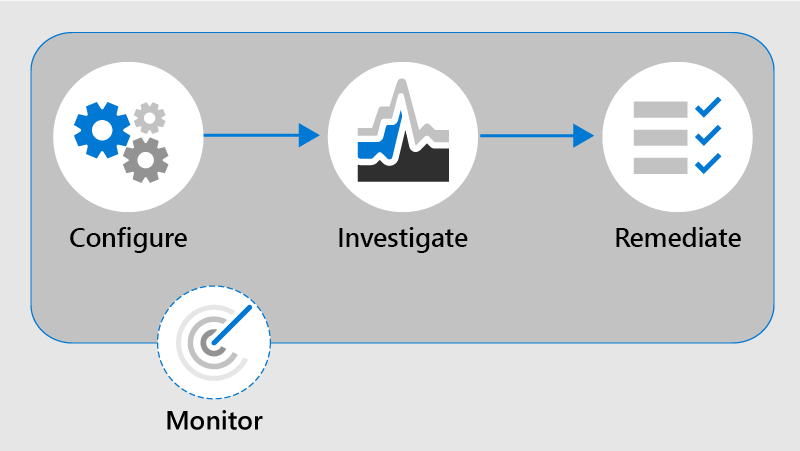

# Saiba mais sobre a conformidade de comunicação no Microsoft 365

A conformidade de comunicação é uma solução de risco interna no Microsoft 365 que ajuda a minimizar os riscos de comunicação, ajudando você a detectar, capturar e agir em mensagens inadequadas em sua organização. Políticas pré-definidas e personalizadas permitem que você examine as comunicações internas e externas para que elas possam ser examinadas por revisores designados. Os revisadores podem investigar emails verificados, Microsoft Teams, Yammer ou comunicações de terceiros em sua organização e tomar as ações apropriadas para garantir que eles estão em conformidade com os padrões de mensagens da sua organização.

As políticas de conformidade de comunicação no Microsoft 365 ajudam você a superar muitos desafios modernos associados à conformidade e comunicações internas e externas, incluindo:

- Verificação de tipos crescentes de canais de comunicação
- O volume crescente de dados de mensagens
- Imposição regulatória e risco de multas

Além disso, pode haver uma separação de funções entre seus administradores de IT e sua equipe de gerenciamento de conformidade. A conformidade de comunicação dá suporte à separação entre a configuração de políticas e a investigação e a revisão de mensagens. Por exemplo, o grupo de IT da sua organização pode ser responsável por configurar permissões de função de conformidade de comunicação, grupos e políticas e investigadores e revisadores podem ser responsáveis por ações de triagem, revisão e mitigação de mensagens.

Para as apresentações mais recentes do Ignite para conformidade de comunicação, consulte os seguintes vídeos:

- [Promover uma cultura de segurança e inclusão com conformidade de comunicação](https://www.youtube.com/watch?v=oLVzxcaef3w)
- [Saiba como reduzir os riscos de comunicação em sua organização](https://www.youtube.com/watch?v=vzARb1YaxGo)
- [Atender aos requisitos de conformidade regulamentar com a conformidade de comunicação](https://www.youtube.com/watch?v=gagOhtCBfgU)
- [Melhor com o Microsoft Teams - Saiba mais sobre os recursos nativos mais recentes integrados do Teams na conformidade de comunicação](https://www.youtube.com/watch?v=m4jukD5Fh-o)

Para uma visão geral rápida da conformidade de [comunicação,](https://www.youtube.com/user/OfficeGarageSeries)consulte o vídeo Detectar assédio no local de trabalho e responder com Conformidade de Comunicação no [Microsoft 365](https://youtu.be/z33ji7a7Zho) no canal Microsoft Mechanics .

## Cenários de conformidade de comunicação

As políticas de conformidade de comunicação podem ajudar na revisão de mensagens em sua organização em várias áreas de conformidade importantes:

- **Políticas corporativas**

    Os usuários devem estar em conformidade com o uso aceitável, padrões de ética e outras políticas corporativas em todas as suas comunicações relacionadas aos negócios. As políticas de conformidade de comunicação podem detectar as combinações de política e ajudá-lo a tomar ações corretivas para ajudar a reduzir esses tipos de incidentes. Por exemplo, você pode examinar as comunicações do usuário em sua organização em busca de possíveis preocupações de recursos humanos, como o assédio ou o uso de linguagem inadequada ou ofensiva.

- **Gerenciamento de risco**

    As organizações são responsáveis por todas as comunicações distribuídas em toda sua infraestrutura e sistemas de rede corporativos. O uso de políticas de conformidade de comunicação para ajudar a identificar e gerenciar possíveis riscos e exposição legal pode ajudar a minimizar riscos antes de danificar operações corporativas. Por exemplo, você pode verificar mensagens em sua organização em busca de comunicações não autorizadas e conflitos de interesse sobre projetos confidenciais, como aquisições futuras, fusões, divulgações de lucros, reorganizações ou alterações na equipe de liderança.

- **Conformidade regulamentar**

    A maioria das organizações deve estar em conformidade com algum tipo de padrões de conformidade regulamentar como parte de seus procedimentos operacionais normais. Esses regulamentos geralmente exigem que as organizações implementem algum tipo de processo de supervisão ou supervisão para mensagens apropriadas para seu setor. A Regra 3110 da Autoridade Regulatória do Setor Financeiro (FINRA) é um bom exemplo de um requisito para que as organizações tenham procedimentos de supervisão para verificar as comunicações do usuário e os tipos de empresas nas quais se envolvem. Outro exemplo pode ser a necessidade de revisar as comunicações de operadores em sua organização para proteger contra possíveis atividades de lavagem de dinheiro, insider trading, conluio ou propina. As políticas de conformidade de comunicação podem ajudar sua organização a atender a esses requisitos fornecendo um processo para verificar e relatar comunicações corporativas. Para obter mais informações sobre o suporte para organizações financeiras, consulte Principais considerações de conformidade e segurança [para os mercados bancários](../solutions/financial-services-secure-collaboration.md)e de capital dos EUA.

## Principais áreas de recurso

A conformidade de comunicação no Microsoft 365 oferece vários recursos importantes para ajudar a resolver as preocupações de conformidade em suas plataformas de mensagens:

- Modelos personalizáveis inteligentes
- Fluxos de trabalho de correção flexíveis
- Percepções ativas

### Modelos personalizáveis inteligentes

Modelos personalizáveis inteligentes em conformidade com a comunicação permitem que você aplique aprendizado de máquina para detectar de forma inteligente violações de comunicação em sua organização.

- **Modelos pré-configurados** personalizáveis: Os novos modelos de política ajudam a resolver os riscos de comunicação mais comuns. A criação inicial de política e a atualização de acompanhamento agora são mais rápidas com linguagem anti-assédio e ofensiva pré-definida, informações confidenciais, conflito de interesses e modelos de conformidade regulamentar.
- Novo **suporte** ao aprendizado de máquina : Classificadores de ameaças, assédio, profanação e imagem interna ajudam a reduzir falsos positivos em mensagens digitalizados, economizando tempo dos [revisadores](classifier-get-started-with.md) durante o processo de investigação e correção.
- **Construtor de condições** aprimorado : a configuração das condições de política agora é simplificada em uma única experiência integrada no assistente de política, reduzindo a confusão em como as condições são aplicadas às políticas.

### Fluxos de trabalho de correção flexíveis

Fluxos de trabalho de correção integrados permitem que você identifique e tome medidas rápidas em mensagens com diretivas em sua organização. Os novos recursos a seguir aumentam a eficiência para atividades de investigação e correção:

- Fluxo de trabalho de **correção** flexível : o novo fluxo de trabalho de correção ajuda você a tomar medidas rapidamente em jogos de política, incluindo novas opções para escalonar mensagens para outros revistores e para enviar notificações de email aos usuários com as combinações de política.
- **Threading de** conversa : as mensagens agora são agrupadas visualmente por mensagem original e todas as mensagens de resposta associadas, dando a você um contexto melhor durante as ações de investigação e correção.
- **Realce de palavra-chave**: As condições de política correspondentes aos termos são realçadas na exibição de texto da mensagem para ajudar os revisadores a localizar e remediar rapidamente os alertas de política.
- **Detecção duplicada** exata e próxima : Além de verificação de políticas de conformidade de comunicação correspondentes a termos exatos, grupos de detecção quase duplicados, em conjunto, têm termos e mensagens semelhantes textuticamente para ajudar a acelerar o processo de revisão.
- **Reconhecimento óptico de caracteres (OCR) (visualização)**: Examinar, detectar e investigar texto impresso e manuscrito em imagens incorporadas ou anexadas a emails ou mensagens de chat do Microsoft Teams.
- **Novos filtros**: investigue e remedia os alertas de política mais rapidamente com filtros de mensagens para vários campos, incluindo remetente, destinatário, data, domínios e muito mais.
- **Exibições de mensagem** aprimoradas : As ações de investigação e correção agora são mais rápidas com novas exibições de origem, texto e anotação de mensagens. Os anexos de mensagens agora podem ser visualizados para fornecer contexto completo ao realizar ações de correção.
- **Exibição de** histórico do usuário : Exibição histórica de todas as atividades de correção de mensagens do usuário, como notificações passadas e escalonamentos para jogos de política, agora fornece aos revisadores mais contexto durante o processo de fluxo de trabalho de correção. Instâncias de primeira ou repetição de jogos de política para usuários agora são arquivadas e facilmente visualizadas.
- **Notificação detectada por** padrão : muitas ações de assedio e intimidação ocorrem ao longo do tempo e envolvem instâncias recorrentes do mesmo comportamento por um usuário. O novo padrão detectado notificação exibida em detalhes de alerta ajuda a chamar a atenção para esses alertas e esse tipo de comportamento.
- **Mostrar a exibição Traduzir:** investigue rapidamente os detalhes da mensagem em oito idiomas usando o suporte de tradução no fluxo de trabalho de correção. As mensagens em outros idiomas são convertidas automaticamente no idioma de exibição do revistor.

### Percepções ativas

Novos painéis interativos para alertas, jogos de política, ações e tendências ajudam você a exibir rapidamente o status de alertas pendentes e resolvidos em sua organização.

- **Alertas inteligentes proativos:** alertas para as diretivas que exigem atenção imediata incluem novos painéis para itens pendentes, organizados por gravidade e novas notificações automáticas de email enviadas para revistores designados.
- **Painéis interativos**: Os novos painéis exibem as combinações de política, as ações pendentes e resolvidas e as tendências dos usuários e da política.
- **Suporte à auditoria**: um log completo de atividades de política e revisão é facilmente exportado do centro de conformidade do Microsoft 365 para ajudar a dar suporte a solicitações de revisão de auditoria.

## Integração com serviços do Microsoft 365

As políticas de conformidade de comunicação analisam e capturam mensagens em vários canais de comunicação para ajudá-lo a revisar e resolver rapidamente os problemas de conformidade:

- **Microsoft Teams**: Comunicações de chat para canais públicos e privados do [Microsoft Teams](/MicrosoftTeams/Teams-overview) e chats individuais são suportadas na conformidade de comunicação como uma fonte de canal independente ou com outros serviços do Microsoft 365. Você precisará adicionar manualmente usuários individuais, grupos de distribuição ou canais específicos do Microsoft Teams quando selecionar usuários e grupos para supervisionar uma política de conformidade de comunicação.
- **Exchange Online**: todas as caixas de correio hospedadas no [Exchange Online](/Exchange/exchange-online) em sua organização do Microsoft 365 estão qualificadas para verificação. Emails e anexos que coincidem com as condições de política de conformidade de comunicação estão disponíveis instantaneamente para monitoramento e relatórios de conformidade. O Exchange Online agora é um canal de origem opcional e não é mais necessário em políticas de conformidade de comunicação.
- **Yammer**: Mensagens privadas e conversas da comunidade pública no [Yammer](/yammer/yammer-landing-page) são suportadas em políticas de conformidade de comunicação. O Yammer é um canal opcional e deve estar no modo [nativo](/yammer/configure-your-yammer-network/overview-native-mode) para dar suporte à verificação de mensagens e anexos.
- **Skype for Business Online**: As políticas de conformidade de comunicação suportam a verificação de comunicações de chat e anexos associados [no Skype for Business Online.](/SkypeForBusiness/skype-for-business-online)
- **Fontes de terceiros**: Você  pode verificar mensagens de fontes de terceiros para dados importados para caixas de correio em sua organização do Microsoft 365. A conformidade de comunicação dá suporte a conexões com várias plataformas populares, incluindo Instant Bloomberg e outras.

Para saber mais sobre o suporte ao canal de mensagens em políticas de conformidade de comunicação, consulte [tipos de comunicação com suporte.](communication-compliance-feature-reference.md#supported-communication-types)

## Fluxo de trabalho

A conformidade com a comunicação ajuda você a lidar com pontos de dor comuns associados à conformidade com políticas internas e requisitos de conformidade regulamentar. Com modelos de política focados e um fluxo de trabalho flexível, você pode usar ideias ativas para resolver rapidamente problemas de conformidade detectados.

Identificar e resolver problemas de conformidade com a conformidade de comunicação no Microsoft 365 usa o seguinte fluxo de trabalho:

### Configurar

Nesta etapa de fluxo de trabalho, você identifica seus requisitos de conformidade e configura as políticas de conformidade de comunicação aplicáveis. Os modelos de política são uma ótima maneira de não apenas configurar rapidamente uma nova política de conformidade, mas também modificar e atualizar rapidamente as políticas à medida que seus requisitos mudam. Por exemplo, você pode querer testar rapidamente uma política para linguagem ofensiva e anti-assédio em comunicações para um pequeno grupo de usuários antes de configurar uma política para todos os usuários em sua organização.

>[!Important]
>Por padrão, os Administradores Globais não têm acesso aos recursos de conformidade de comunicação. Para habilitar permissões para recursos de conformidade de comunicação, consulte [Make communication compliance available in your organization](communication-compliance-configure.md#step-1-required-enable-permissions-for-communication-compliance).

Você pode escolher entre os seguintes modelos de política no centro de conformidade do Microsoft 365:

- **Idioma ofensivo ou ameaçador**: use este modelo para criar rapidamente uma política que usa classificadores integrados para detectar automaticamente conteúdo que pode ser considerado abusivo ou ofensivo.
- **Informações** confidenciais : use este modelo para criar rapidamente uma política para verificar comunicações contendo tipos ou palavras-chave confidenciais definidos para ajudar a garantir que dados importantes não são compartilhados com pessoas que não devem ter acesso.
- **Conformidade regulamentar**: use este modelo para criar rapidamente uma política para verificar as comunicações em busca de referências aos termos financeiros padrão associados aos padrões regulatórios.
- **Conflito de interesses**: use este modelo para criar rapidamente uma política para monitorar as comunicações entre dois grupos ou dois usuários para ajudar a evitar conflitos de interesse.
- **Política personalizada**: use este modelo para configurar canais de comunicação específicos, condições de detecção individuais e a quantidade de conteúdo para monitorar e revisar em sua organização.

### Investigar

Nesta etapa, você olha mais profundamente para os problemas detectados como correspondentes às suas políticas de conformidade de comunicação. Esta etapa inclui as seguintes ações disponíveis no centro de conformidade do Microsoft 365:

- **Alertas**: quando uma mensagem corresponde a uma condição de política, um alerta é gerado automaticamente. Para cada alerta, você pode ver o status, a gravidade, o tempo detectado e se um caso de Descoberta Avançada é atribuído e seu status. Novos alertas são exibidos na home page de conformidade de comunicação e na página Alertas e são **listados** em ordem de gravidade.
- **Gerenciamento de problemas**: para cada alerta, você pode realizar ações de investigação para ajudar a correção do problema detectado na mensagem.
- **Revisão de** documento : durante a investigação de um problema, você pode usar vários pontos de exibição da mensagem para ajudar a avaliar corretamente o problema detectado. Os exibições incluem um resumo de conversa, somente texto, anotações e exibições de detalhes da conversa de comunicação.
- **Revisão do histórico de** atividades do usuário : Exibir o histórico de atividades de mensagens do usuário e ações de correção, como notificações passadas e escalonamentos, para jogos de política.
- **Filtros**: Use filtros como remetente, destinatário, data e assunto para restringir rapidamente os alertas de mensagem que você deseja revisar.

### Remediar

A próxima etapa é resolver problemas de conformidade de comunicação que você investiga usando as seguintes opções:

- **Resolver**: depois de revisar um problema, você pode corrigir resolvendo o alerta. A resolução de um alerta remove-o da fila de alertas pendente e a ação é preservada como uma entrada na fila Resolvido para a política correspondente. Os alertas são resolvidos automaticamente depois de marcar o alerta como falso positivo, enviar um aviso a um usuário sobre o alerta ou abrir um novo caso para o alerta.
- **Marcar uma** mensagem : Como parte da resolução de um problema, você pode marcar a mensagem detectada como compatível, não compatível ou tão questionável quanto se refere às políticas e padrões da sua organização. A marcação pode ajudá-lo a filtrar os alertas de política de micro-filtro para escalonamentos ou como parte de outros processos de revisão interna.
- **Notificar o usuário**: Frequentemente, os usuários violam acidentalmente ou inadvertidamente uma política de conformidade de comunicação. Você pode usar o recurso de notificação para fornecer um aviso de aviso ao usuário e resolver o problema.
- **Escalone para outro revistor**: Às vezes, o revistor inicial de um problema precisa da entrada de outros revisadores para ajudar a resolver o incidente. Você pode facilmente escalar problemas de mensagens para revisadores em outras áreas da sua organização como parte do processo de resolução.
- **Marcar como falso positivo**: Mensagens detectadas incorretamente como corresponde às políticas de conformidade ocasionalmente passarão pelo processo de revisão. Você pode marcar esses tipos de alertas como falsos positivos e resolver automaticamente o problema.
- **Remover mensagem no Teams (visualização)**: mensagens inadequadas podem ser removidas da exibição nos canais do Microsoft Teams ou mensagens de chat pessoal e de grupo. As mensagens inadequadas removidas são substituídas por uma notificação de que a mensagem foi removida por uma violação de política.
- **Escalonamento para investigação**: Nas situações mais sérias, talvez seja necessário compartilhar informações de conformidade de comunicação com outros revisadores em sua organização. A conformidade de comunicação é fortemente integrada a outros recursos de conformidade do Microsoft 365 para ajudá-lo com a resolução de risco de ponta a ponta. A escalada de um caso de investigação permite transferir dados e gerenciamento do caso para a Descoberta Eletrônica Avançada no Microsoft 365. A Descoberta Externa Avançada fornece um fluxo de trabalho de ponta a ponta para preservar, coletar, revisar, analisar e exportar conteúdo que responde às investigações internas e externas da sua organização. Ele permite que as equipes legais gerenciem todo o fluxo de trabalho de notificação de espera legal. Para saber mais sobre os casos de Descoberta Avançada de Descoberta e, consulte [Overview of Advanced eDiscovery in Microsoft 365](overview-ediscovery-20.md).

### Monitorar

Acompanhar e gerenciar problemas de conformidade identificados por políticas de conformidade de comunicação abrange todo o processo de fluxo de trabalho. À medida que os alertas são gerados e as ações de investigação e correção são implementadas, as políticas existentes podem precisar de revisão e atualizações, e novas políticas podem precisar ser criadas.

- **Monitor e relatório**: use widgets de painel de conformidade de comunicação, logs de exportação e eventos registrados nos logs de auditoria unificados para avaliar e melhorar continuamente sua postura de conformidade.

## Pronto para começar?

- Para informações de planejamento, consulte [Plan for communication compliance](communication-compliance-plan.md).
- Confira o estudo de caso da [Contoso](communication-compliance-case-study.md) e veja como eles configuraram rapidamente uma política de conformidade de comunicação para monitorar o idioma ofensivo nas comunicações do Microsoft Teams, Exchange Online e Yammer.
- Para configurar a conformidade de comunicação para sua organização do Microsoft 365, consulte [Configure communication compliance for Microsoft 365](communication-compliance-configure.md).
