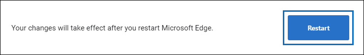
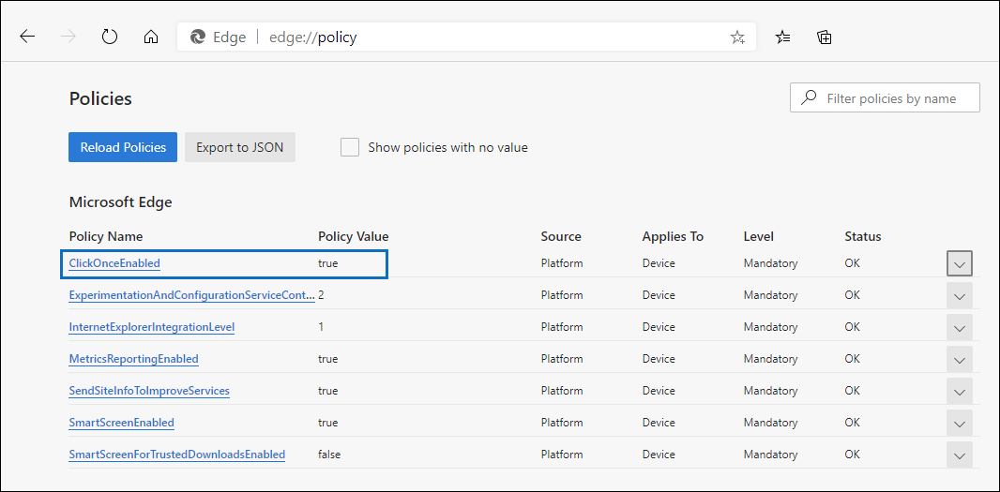

# Usar a ferramenta de exportação de descoberta eletrônica do Office 365 no Microsoft EdgeUse the Office 365 eDiscovery Export Tool in Microsoft Edge

Como resultado de alterações recentes no Microsoft Edge, o suporte do ClickOnce não está mais habilitado por padrão.As a result of recent changes to Microsoft Edge, ClickOnce support is no longer enabled by default. Para continuar a usar a ferramenta de exportação de descoberta eletrônica do Microsoft Office 365 para baixar os resultados de pesquisa de descoberta eletrônica ou pesquisa de conteúdo, você precisa usar [o Microsoft Internet Explorer](https://support.microsoft.com/help/17621/internet-explorer-downloads) ou habilitar o suporte do ClickOnce no Microsoft Edge.To continue using the Microsoft Office 365 eDiscovery Export Tool to download Content Search or eDiscovery search results, you either need to use [Microsoft Internet Explorer](https://support.microsoft.com/help/17621/internet-explorer-downloads) or enable ClickOnce support in Microsoft Edge.

## Como habilitar o suporte do ClickOnce no Microsoft EdgeHow to enable ClickOnce support in Microsoft Edge

1. No Microsoft Edge, navegue até **edge://flags/#edge-Once**.In Microsoft Edge, navigate to **edge://flags/#edge-click-once**.

2. Se o valor existente for definido como **padrão** ou **desabilitado** na lista suspensa, altere-o para **habilitado**.If the existing value is set to **Default** or **Disabled** in the dropdown list, change it to **Enabled**.
    
   

3. Role para baixo até a parte inferior da janela do navegador e clique em **reiniciar** para reiniciar a borda.Scroll down to the bottom of the browser window and click **Restart** to restart Edge.

   

**Observação:** As organizações podem usar a política de grupo para desabilitar o suporte do ClickOnce.**Note:** Organizations can use Group Policy to disable ClickOnce support. Para verificar se há uma política organizacional para o suporte do ClickOnce, navegue até **Edge://Policy**.To check if there is an organizational policy for ClickOnce support, navigate to **edge://policy**. A captura de tela a seguir mostra que o ClickOnce está habilitado em toda a organização.The following screenshot shows that ClickOnce is enabled across the entire organization. Se esse valor de política for definido como **false**, você precisará entrar em contato com um administrador na sua organização.If this policy value is set to **false**, you will need to contact an admin in your organization.

## Instalar e executar a ferramenta de exportação de descoberta eletrônica do Office 365Install and run the Office 365 eDiscovery Export Tool

1. Clique em **baixar resultados** na página de menu suspenso de uma exportação na pesquisa de conteúdo ou em um caso de descoberta eletrônica.Click **Download results** on the flyout page of an export in Content Search or an eDiscovery case.

   

2. Você será solicitado a confirmar a inicialização da ferramenta, clique em **abrir**.You will be prompted with a confirmation to launch the tool, Click **Open**.

   

   Se a ferramenta de exportação de descoberta eletrônica do Microsoft Office 365 não estiver instalada, você receberá um aviso de segurançaIf the Microsoft Office 365 eDiscovery Export Tool isn't installed, you will be prompted with a Security Warning, 

   

3. Clique em **Instalar**.Click **Install**. Após a instalação, a ferramenta de exportação será iniciada automaticamente.After it's installed, the export tool will launch automatically.

Para obter mais informações, consulte os seguintes tópicos:For more information, see the following topics:

- [Exportar resultados de Pesquisa de ConteúdoExport Content Search results](export-search-results.md)

- [Como habilitar os sinalizadores de experimento no Microsoft EdgeHow to enable experiment flags in Microsoft Edge](https://microsoftedgesupport.microsoft.com/hc/articles/360034075294-How-to-enable-experiment-flags-in-Microsoft-Edge-Insider-channels)
