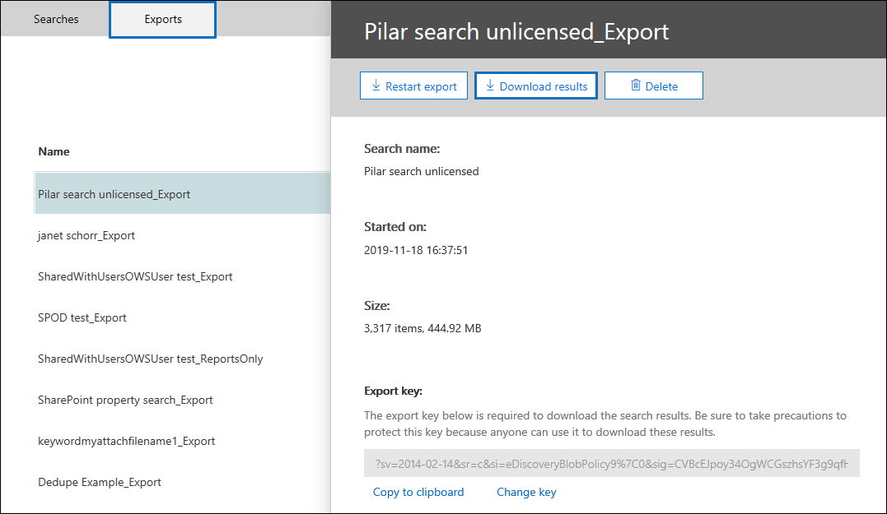

# Use a Ferramenta de Exportação de Descoberta Microsoft EdgeUse the eDiscovery Export Tool in Microsoft Edge

Como resultado de alterações recentes na versão mais recente do Microsoft Edge, ClickOnce suporte não está mais habilitado por padrão.As a result of recent changes to the newest version of Microsoft Edge, ClickOnce support is no longer enabled by default. Para continuar usando a Ferramenta de Exportação de Descoberta Digital para baixar os resultados da Pesquisa de Conteúdo ou da Pesquisa de Descoberta ClickOnce, você precisa usar o [Microsoft Internet Explorer](https://support.microsoft.com/help/17621/internet-explorer-downloads) ou habilitar o suporte ClickOnce na versão mais recente do Microsoft Edge.To continue using the eDiscovery Export Tool to download Content Search or eDiscovery search results, you either need to use [Microsoft Internet Explorer](https://support.microsoft.com/help/17621/internet-explorer-downloads) or enable ClickOnce support in the newest version of Microsoft Edge.

## Habilitar ClickOnce suporte em Microsoft EdgeEnable ClickOnce support in Microsoft Edge

1. Em Microsoft Edge, vá para **edge://flags/#edge-click-once**.In Microsoft Edge, go to **edge://flags/#edge-click-once**.

2. Se o valor existente estiver definido como **Padrão** ou **Desabilitado** na lista de menus suspenso, altere-o para **Habilitado**.If the existing value is set to **Default** or **Disabled** in the dropdown list, change it to **Enabled**.

   

3. Role para baixo até a parte inferior da janela do navegador e clique em **Reiniciar** para reiniciar Borda.Scroll down to the bottom of the browser window and click **Restart** to restart Edge.

   

**Observação:** As organizações podem usar a Política de Grupo para desabilitar ClickOnce suporte.**Note:** Organizations can use Group Policy to disable ClickOnce support. Para verificar se há uma política organizacional para suporte ClickOnce, vá para **edge://policy**.To check if there is an organizational policy for ClickOnce support, go to **edge://policy**. A captura de tela a seguir mostra que ClickOnce está habilitado em toda a organização.The following screenshot shows that ClickOnce is enabled across the entire organization. Se esse valor de política for definido como **false,** você precisará entrar em contato com um administrador em sua organização.If this policy value is set to **false**, you will need to contact an admin in your organization.

## Instalar e executar a Ferramenta de Exportação de Descoberta DigitalInstall and run the eDiscovery Export Tool

1. Clique **em Baixar resultados** na página de sobrevoo de uma exportação na Pesquisa de Conteúdo ou em um caso de Descoberta eDiscovery.Click **Download results** on the flyout page of an export in Content Search or an eDiscovery case.

   

2. Você será solicitado com uma confirmação para iniciar a ferramenta, Clique em **Abrir**.You will be prompted with a confirmation to launch the tool, Click **Open**.

   

   Se a Ferramenta de Exportação de Descoberta Digital não estiver instalada, você será solicitado com um Aviso de Segurança,If the eDiscovery Export Tool isn't installed, you will be prompted with a Security Warning, 

   

3. Clique em **Instalar**.Click **Install**. Depois de instalada, a ferramenta de exportação será lançada automaticamente.After it's installed, the export tool will launch automatically.

Para mais informações, confira os seguintes tópicos:For more information, see the following topics:

- [Exportar resultados de Pesquisa de ConteúdoExport Content Search results](export-search-results.md)

- [Como habilitar sinalizadores de experimento em Microsoft EdgeHow to enable experiment flags in Microsoft Edge](https://microsoftedgesupport.microsoft.com/hc/articles/360034075294-How-to-enable-experiment-flags-in-Microsoft-Edge-Insider-channels)
