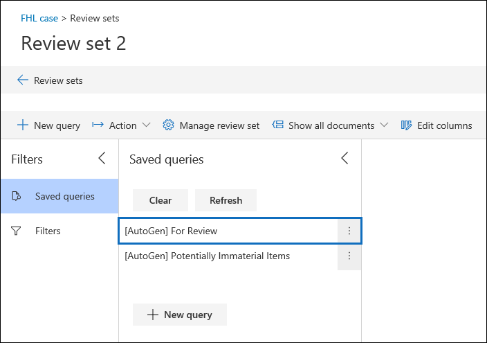

# Definir configurações de pesquisa e análiseConfigure search and analytics settings

Você pode definir as configurações de cada caso de descoberta eletrônica avançada para controlar a funcionalidade a seguir.You can configure settings for each Advanced eDiscovery case to control the following functionality.

- Duplicados próximos e threads de emailNear duplicates and email threading

- TemasThemes

- Consulta de definição de análise gerada automaticamenteAutogenerated review set query

- Ignorar textoIgnore text

- Reconhecimento óptico de caracteresOptical character recognition

Para definir as configurações de pesquisa e análise de um caso:To configure search and analytics settings for a case:

1. Na página **descoberta eletrônica avançada** , selecione o caso.On the **Advanced eDiscovery** page, select the case.

2. Na guia **configurações** , em **pesquisa & análise**, clique em **selecionar**.On the **Settings** tab, under **Search & analytics**, click **Select**.

   A página de configurações de caso é exibida.The case settings page is displayed. Essas configurações são aplicadas a todos os conjuntos de revisão em um caso.These settings are applied to all review sets in a case.

   

## Duplicados próximos e threads de emailNear duplicates and email threading

Nesta seção, você pode definir parâmetros para detecção de duplicidades, detecção de duplicidade próxima e thread de email.In this section, you can set parameters for duplicate detection, near duplicate detection, and email threading. Para obter mais informações, consulte [Near Duplicate Detection](near-duplicates.md) and [e-mail Threading](email-threading.md).For more information, see [Near duplicate detection](near-duplicates.md) and [Email threading](email-threading.md).

- **Threads próximos de duplicatas/email:** Quando ativado, a detecção de duplicidades, a detecção de duplicidade próxima e o encadeamento de emails são incluídos como parte do fluxo de trabalho quando você executa a análise nos dados de um conjunto de revisão.**Near duplicates/email threading:** When turned on, duplicate detection, near duplicate detection, and email threading are included as part of the workflow when you run analytics on the data in a review set.

- **Limite de semelhança de documento e de email:** Se o nível de similaridade de dois documentos estiver acima do limite, ambos os documentos serão colocados no mesmo conjunto próximo duplicado.**Document and email similarity threshold:** If the similarity level for two documents is above the threshold, both documents are put in the same near duplicate set.

- **Número mínimo/máximo de palavras:** Essas configurações especificam que uma análise próxima de duplicatas e de encadeamento de emails é executada apenas em documentos que tenham pelo menos o número mínimo de palavras e, no máximo, o número máximo de palavras.**Minimum/maximum number of words:** These settings specify that near duplicates and email threading analysis are performed only on documents that have at least the minimum number of words and at most the maximum number of words.

## TemasThemes

Nesta seção, você pode definir parâmetros para temas.In this section, you can set parameters for themes. Para obter mais informações, consulte [Themes](themes-in-advanced-ediscovery.md).For more information, see [Themes](themes-in-advanced-ediscovery.md).

- **Temas:** Quando ativado, o clustering de temas é executado como parte do fluxo de trabalho quando você executa a análise nos dados em um conjunto de revisão.**Themes:** When turned on, themes clustering is performed as part of the workflow when you run analytics on the data in a review set.

- **Número máximo de temas:** Especifica o número máximo de temas que podem ser gerados quando você executa a análise nos dados de um conjunto de revisão.**Maximum number of themes:** Specifies the maximum number of themes that can be generated when you run analytics on the data in a review set.

- **Incluir números em temas:** Quando ativado, os números (que identificam um tema) são incluídos durante a geração de temas.**Include numbers in themes:** When turned on, numbers (that identify a theme) are included when generating themes. 

- **Ajuste o número máximo de temas dinamicamente:** Em determinadas situações, pode não haver documentos suficientes em um conjunto de revisão para produzir o número desejado de temas.**Adjust maximum number of themes dynamically:** In certain situations, there may not be enough documents in a review set to produce the desired number of themes. Quando essa configuração estiver habilitada, a descoberta eletrônica avançada ajustará o número máximo de temas dinamicamente, em vez de tentar impor o número máximo de temas.When this setting is enabled, Advanced eDiscovery adjusts the maximum number of themes dynamically rather than attempting to enforce the maximum number of themes.

## Analisar consulta de definiçãoReview set query

Se você marcar a caixa **de seleção criar automaticamente para revisar a pesquisa salva após a análise, a descoberta automática de descoberta automática de** autogeração de consulta Set **para revisão.**If you select the **Automatically create a For Review saved search after analytics** checkbox, Advanced eDiscovery autogenerates review set query named **For Review.** 

Essa consulta basicamente filtra os itens duplicados do conjunto de revisão.This query basically filters out duplicate items from the review set. Isso permite que você revise os itens exclusivos no conjunto de revisão.This lets you review the unique items in the review set. Essa consulta é criada somente quando você executa o Analytics para um conjunto de revisão no caso.This query is created only when you run analytics for a review set in the case. Para obter mais informações, sobre revisões definidas de consultas, consulte [consultar os dados em um conjunto de revisão](review-set-search.md).For more information, about review set queries, see [Query the data in a review set](review-set-search.md).

## Ignorar textoIgnore text

Há situações em que certos textos reduzirão a qualidade da análise, como avisos de isenção de responsabilidade longos que são adicionados a mensagens de email, independentemente do conteúdo do email.There are situations where certain text will diminish the quality of analytics, such as lengthy disclaimers that get added to email messages regardless of the content of the email. Se você souber do texto que deve ser ignorado, é possível excluí-lo da análise especificando a cadeia de caracteres de texto e a funcionalidade de análise (Near-duplicates, encadeamento de emails, temas e relevância) que o texto deve ser excluído.If you know of text that should be ignored, you can exclude it from analytics by specifying the text string and the analytics functionality (Near-duplicates, Email threading, Themes, and Relevance) that the text should be excluded for. O uso de expressões regulares (RegEx) como texto ignorado também é suportado.Using regular expressions (RegEx) as ignored text is also supported. 

## Reconhecimento óptico de caracteres (OCR)Optical character recognition (OCR)

Quando essa configuração estiver ativada, o OCR será executado em arquivos de imagem adicionados aos conjuntos de revisão para que o texto da imagem possa ser revisado, pesquisado, marcado e analisado.When this setting is turned on, OCR will be run on image files that are added to review sets so that image text can be reviewed, searched, tagged, and analyzed. Você pode exibir o texto extraído no Visualizador de texto do arquivo de imagem selecionado no conjunto de revisão.You can view the extracted text in the Text viewer of the selected image file in the review set. Para saber mais, confira:For more information, see:

- [Adicionar os resultados da pesquisa a um conjunto de revisãoAdd search results to a review set](add-data-to-review-set.md#optical-character-recognition)

- [Tipos de arquivo de imagem compatíveisSupported image file types](supported-filetypes-ediscovery20.md#image)
